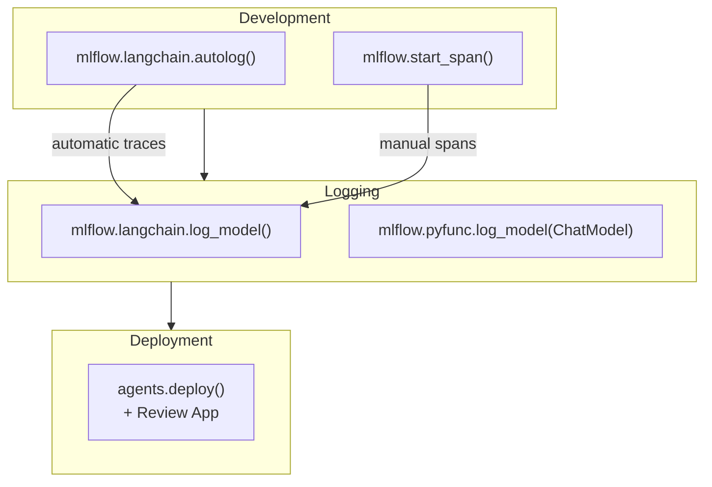

# MLflow for GenAI

MLflow extends its tracking and deployment capabilities to GenAI with three main additions:
**Tracing** for debugging LLM call chains, **`pyfunc.ChatModel`** as a standard interface for
custom agents, and **`agents.deploy()`** for deploying to Model Serving with an integrated
Review App.

## Overview Diagram



## MLflow Tracing

**MLflow Tracing** captures the inputs, outputs, and latency of every LLM call and retrieval
step as a hierarchical tree of **spans**. Traces are displayed in the MLflow Trace UI tab.

### Automatic Tracing with autolog

```python
import mlflow

# Enable automatic tracing for all LangChain calls

mlflow.langchain.autolog()

# Now any chain.invoke() call is automatically traced

response = rag_chain.invoke({"question": "What is Delta Lake?"})

# Traces appear in the active MLflow experiment's Trace tab

```

`autolog()` captures:

- Prompt template rendered with variable values
- LLM endpoint called and parameters used
- LLM response text and token counts
- Retriever inputs and number of documents returned
- Total wall-clock latency per step

### Manual Tracing with Spans

For custom code not covered by autolog, use context managers to create spans manually:

```python
import mlflow
from databricks.vector_search.client import VectorSearchClient

vs_client = VectorSearchClient()
index = vs_client.get_index(
    endpoint_name="my_vs_endpoint",
    index_name="catalog.schema.docs_index",
)


def retrieve_and_answer(question: str) -> str:
    with mlflow.start_span("rag-pipeline") as root_span:
        root_span.set_inputs({"question": question})

        # Child span for retrieval
        with mlflow.start_span("retrieval") as retrieval_span:
            results = index.similarity_search(
                query_text=question,
                columns=["content"],
                num_results=5,
            )
            rows = results.get("result", {}).get("data_array", [])
            retrieval_span.set_inputs({"query": question})
            retrieval_span.set_outputs({"num_results": len(rows)})

        context = "\n".join(row[0] for row in rows)

        # Child span for generation
        with mlflow.start_span("generation") as gen_span:
            import mlflow.deployments
            client = mlflow.deployments.get_deploy_client("databricks")
            response = client.predict(
                endpoint="databricks-meta-llama-3-1-70b-instruct",
                inputs={
                    "messages": [
                        {"role": "system", "content": f"Context:\n{context}"},
                        {"role": "user",   "content": question},
                    ],
                    "temperature": 0,
                },
            )
            answer = response["choices"][0]["message"]["content"]
            gen_span.set_inputs({"context_length": len(context)})
            gen_span.set_outputs({"answer": answer})

        root_span.set_outputs({"answer": answer})
        return answer
```

**Span hierarchy example**:

```text
rag-pipeline  (200ms)
├── retrieval  (45ms)
└── generation (155ms)
```

### Key Span Methods

| Method | Purpose |
| ------ | ------- |
| `span.set_inputs(dict)` | Record what the span received |
| `span.set_outputs(dict)` | Record what the span produced |
| `span.set_attribute(key, value)` | Record arbitrary metadata |
| `span.set_status("ERROR")` | Mark span as failed |

## `mlflow.pyfunc.ChatModel` Interface

`ChatModel` is the recommended base class for custom GenAI agents. It enforces the OpenAI-
compatible chat completions interface, making the agent deployable to any Model Serving endpoint.

```python
import mlflow
from mlflow.pyfunc import ChatModel
from mlflow.types.llm import ChatCompletionRequest, ChatCompletionResponse, ChatMessage


class MyRAGChain(ChatModel):

    def load_context(self, context):
        """Called once at serving startup. Load heavy dependencies here."""
        import mlflow.deployments
        from databricks.vector_search.client import VectorSearchClient

        self.llm_client = mlflow.deployments.get_deploy_client("databricks")
        vs = VectorSearchClient()
        self.index = vs.get_index(
            endpoint_name="my_vs_endpoint",
            index_name="catalog.schema.docs_index",
        )

    def predict(
        self,
        context,
        messages: ChatCompletionRequest,
        params=None,
    ) -> ChatCompletionResponse:
        """Called for each inference request."""
        # Extract last user message
        user_message = messages[-1]["content"]

        # Retrieve
        results = self.index.similarity_search(
            query_text=user_message,
            columns=["content"],
            num_results=5,
        )
        rows = results.get("result", {}).get("data_array", [])
        context_text = "\n".join(row[0] for row in rows)

        # Generate
        response = self.llm_client.predict(
            endpoint="databricks-meta-llama-3-1-70b-instruct",
            inputs={
                "messages": [
                    {
                        "role": "system",
                        "content": (
                            "Answer using ONLY the context below.\n\n"
                            f"Context:\n{context_text}"
                        ),
                    },
                    {"role": "user", "content": user_message},
                ],
                "temperature": 0,
            },
        )
        answer = response["choices"][0]["message"]["content"]

        return {
            "choices": [
                {"message": {"role": "assistant", "content": answer}}
            ]
        }
```

### Logging a ChatModel

```python
with mlflow.start_run():
    model_info = mlflow.pyfunc.log_model(
        artifact_path="rag_agent",
        python_model=MyRAGChain(),
        input_example={
            "messages": [{"role": "user", "content": "What is Delta Lake?"}]
        },
        pip_requirements=[
            "databricks-vectorsearch",
            "mlflow",
        ],
    )
    print(model_info.model_uri)
```

**`load_context` vs `predict`**:

- `load_context` — runs once when the serving container starts; use for expensive initialisation
  (loading models, connecting to vector index)
- `predict` — called per request; keep fast; avoid initialising clients here

## `mlflow.langchain.log_model()` with Resources

When logging a LangChain chain, declare all external Databricks resources so that
`agents.deploy()` can automatically provision the correct IAM permissions.

```python
import mlflow
from mlflow.models.resources import (
    DatabricksVectorSearchIndex,
    DatabricksServingEndpoint,
)

with mlflow.start_run():
    model_info = mlflow.langchain.log_model(
        lc_model=rag_chain,
        artifact_path="chain",
        input_example={"question": "What is RAG?"},
        resources=[
            DatabricksVectorSearchIndex(
                index_name="catalog.schema.my_index"
            ),
            DatabricksServingEndpoint(
                endpoint_name="databricks-meta-llama-3-1-70b-instruct"
            ),
        ],
        pip_requirements=[
            "langchain==0.2.0",
            "langchain-community==0.2.0",
            "databricks-vectorsearch",
        ],
    )
```

### Resource Types

| Resource Class | Use When |
| -------------- | -------- |
| `DatabricksVectorSearchIndex` | Chain queries a Vector Search index |
| `DatabricksServingEndpoint` | Chain calls a Model Serving endpoint |
| `DatabricksSQLWarehouse` | Chain runs SQL queries |
| `DatabricksUnityCatalogFunction` | Chain calls a UC function as a tool |

## `agents.deploy()` for Review App

`agents.deploy()` deploys a registered Unity Catalog model to Model Serving and creates a
**Review App** — a web interface for collecting human feedback.

```python
from databricks import agents

deployment = agents.deploy(
    model_name="catalog.schema.my_rag_agent",
    model_version=1,
    environment_vars={
        "DATABRICKS_HOST": "https://<workspace>.azuredatabricks.net",
        "DATABRICKS_TOKEN": "{{secrets/my-scope/databricks-token}}",
    },
)

print(deployment.query_endpoint)   # REST endpoint for production queries
print(deployment.review_app_url)   # URL for human reviewers
```

### Review App Workflow

```text
1. agents.deploy() → creates serving endpoint + review app
2. Share review_app_url with domain experts / QA team
3. Reviewers submit queries, rate answers (thumbs up/down, comments)
4. Feedback stored in Delta table: catalog.schema.my_rag_agent_payload
5. Load feedback for analysis or fine-tuning:
```

```python
import spark

feedback_df = spark.table("catalog.schema.my_rag_agent_payload")
feedback_df.select("request", "response", "feedback").show()
```

**Exam tip**: `agents.deploy()` is distinct from `mlflow.models.deploy()`. The `agents` module
is specific to the Mosaic AI Agent Framework and includes the Review App integration.

## MLflow Experiment Tracking for LLMs

Best practices for tracking GenAI experiments:

```python
with mlflow.start_run(run_name="rag-v3-llama-70b"):
    # Log configuration
    mlflow.log_param("llm_endpoint", "databricks-meta-llama-3-1-70b-instruct")
    mlflow.log_param("temperature", 0.0)
    mlflow.log_param("num_retrieved_chunks", 5)
    mlflow.log_param("chunk_size", 512)
    mlflow.log_param("embedding_model", "databricks-gte-large-en")

    # Log eval metrics after mlflow.evaluate()
    mlflow.log_metric("faithfulness_mean", 0.92)
    mlflow.log_metric("answer_relevance_mean", 0.87)
    mlflow.log_metric("avg_latency_ms", 340)

    # Log prompt template as artifact
    with open("/tmp/system_prompt.txt", "w") as f:
        f.write(SYSTEM_PROMPT)
    mlflow.log_artifact("/tmp/system_prompt.txt", artifact_path="prompts")

    # Log the chain
    mlflow.langchain.log_model(lc_model=rag_chain, artifact_path="chain")
```

## Practice Questions

> [!success]- Question 1
> **Q:** A developer wants to inspect the latency breakdown of each step in a LangChain RAG
> chain (retrieval time vs LLM generation time) without writing any custom instrumentation.
> Which MLflow feature achieves this with minimal code?
>
> A) `mlflow.log_metric("latency", time.time() - start)`
> B) `mlflow.langchain.autolog()`
> C) `mlflow.pyfunc.ChatModel` with manual `set_outputs()` calls
> D) `mlflow.evaluate()` with `model_type="question-answering"`
>
> **Correct Answer: B**
>
> `mlflow.langchain.autolog()` automatically instruments LangChain components to emit spans
> with latency and input/output data. No custom code is needed. `log_metric` requires manual
> timing code. `ChatModel` with `set_outputs()` is a manual tracing approach. `mlflow.evaluate()`
> measures output quality, not per-step latency.

> [!success]- Question 2
> **Q:** In `mlflow.pyfunc.ChatModel`, which method is called once at container startup and
> is the recommended location for initialising the Vector Search client?
>
> A) `__init__`
> B) `predict`
> C) `load_context`
> D) `setup`
>
> **Correct Answer: C**
>
> `load_context` is called once when the serving container starts, before any `predict` calls.
> It receives a `PythonModelContext` with access to logged artifacts. Initialising heavy clients
> here avoids re-creating them on every request. `__init__` runs at model instantiation time
> (before serialisation), so it cannot access serving-time secrets. `predict` runs per request.
> `setup` is not a `ChatModel` method.

> [!success]- Question 3
> **Q:** Which `agents.deploy()` output provides the URL for domain experts to submit queries
> and rate agent responses?
>
> A) `deployment.query_endpoint`
> B) `deployment.review_app_url`
> C) `deployment.model_uri`
> D) `deployment.serving_endpoint_name`
>
> **Correct Answer: B**
>
> `deployment.review_app_url` is the URL of the human feedback interface created by
> `agents.deploy()`. `deployment.query_endpoint` is the REST endpoint for programmatic
> production queries. `model_uri` is the MLflow artifact path of the logged model.
> `serving_endpoint_name` identifies the underlying Model Serving endpoint.

## Use Cases

- **End-to-End MLOps Pipeline**: Tying model training, evaluation, and registry together to establish a reproducible lifecycle.
- **Optimized MLflow for GenAI Workflows**: Using the advanced capabilities of MLflow for GenAI to automate processes and reduce manual operational overhead.

## Common Issues & Errors

### 1. Artifact Access Denied

**Scenario:** Models fail to load from MLflow registry during serving.
**Fix:** Check Unity Catalog permissions or traditional workspace access controls on the underlying storage.

### 2. Integration Bottlenecks

**Scenario:** Connecting MLflow for GenAI to other downstream components results in unexpected failures.
**Fix:** Ensure that permissions and network access rules are correctly provisioned for MLflow for GenAI prior to deployment.

---

**[← Previous: Mosaic AI & Foundation Models](./01-mosaic-ai-and-foundation-models.md) | [↑ Back to Databricks GenAI Tools](./README.md)**
