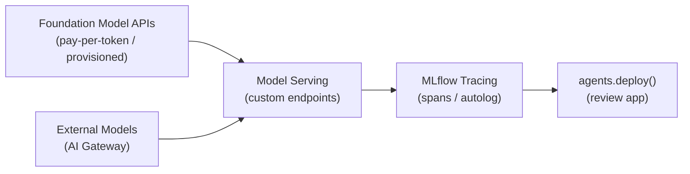

# Databricks GenAI Tools (15% of Exam)

## Topics Overview

## Section Contents

| File | Topic | Priority |
| ---- | ----- | -------- |
| [01-mosaic-ai-and-foundation-models.md](./01-mosaic-ai-and-foundation-models.md) | Foundation Model APIs, pay-per-token vs provisioned, AI Gateway, external models | High |
| [02-mlflow-for-genai.md](./02-mlflow-for-genai.md) | MLflow tracing, `ChatModel` interface, `log_model()` with resources, `agents.deploy()` | High |

## Key Concepts

**Foundation Model APIs** — Databricks-hosted LLMs and embedding models accessible via REST or
`mlflow.deployments`. No cluster required; billed per token or via reserved capacity.

**Pay-per-token** — On-demand pricing for Foundation Model API; starts immediately, capacity
varies with demand; suited for development and testing.

**Provisioned throughput** — Reserved compute allocation for Foundation Model API; predictable
latency SLAs; suited for production workloads with consistent traffic.

**External Models (AI Gateway)** — Proxy endpoints that route requests to third-party LLMs
(OpenAI, Anthropic, Cohere) through Databricks infrastructure, providing unified auth, rate
limiting, and audit logging.

**MLflow Tracing** — Automatic or manual capture of LLM call inputs, outputs, and latency as
hierarchical spans; displayed in the MLflow Trace UI for debugging.

## Related Resources

- [LLM Chains & Agents](../03-llm-application-development/02-chains-agents.md)
- [Evaluating LLM Apps](../03-llm-application-development/03-evaluation-llm-apps.md)
- [Vector Search & Embeddings](../02-vector-search-embeddings/README.md)

## Next Steps

After completing this topic, review the resources section:

- [Practice Questions](../resources/practice-questions/README.md)
- [Exam Tips](../resources/exam-tips.md)

[← Back to Certification](../README.md)
