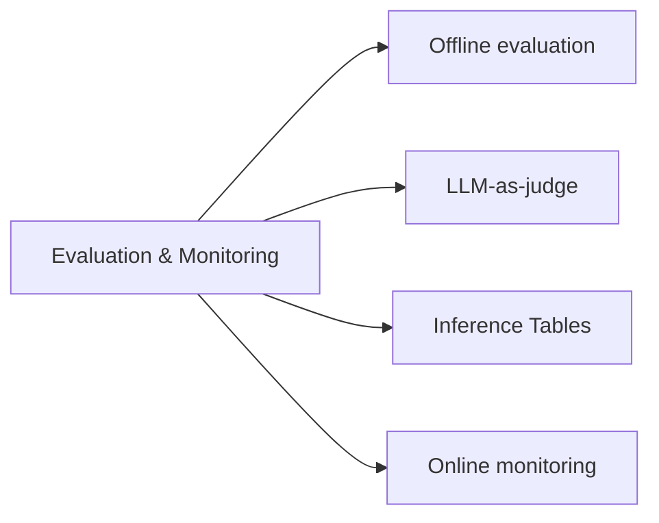

# Evaluation and Monitoring (12 % of Exam)

How to measure whether a GenAI app is working — offline evaluation with MLflow Evaluation Datasets and LLM-as-judge, online monitoring of latency / cost / drift, and inference tables for ongoing analysis.

## Topics Overview

## Section Contents

| File | Topic | Priority |
| :--- | :--- | :--- |
| [01-evaluation-llm-apps.md](./01-evaluation-llm-apps.md) | MLflow evaluation, metrics (answer_correctness, relevance, groundedness), LLM-as-judge | High |

## Key Concepts

| Concept | Why it matters |
| :--- | :--- |
| **MLflow LLM evaluation** | `mlflow.evaluate(...)` runs a model against an eval dataset and computes metrics |
| **LLM-as-judge** | A larger / more capable model scores answers (relevance, faithfulness) — cheaper than humans at scale |
| **Faithfulness / groundedness** | Does the answer follow from the retrieved context? Critical for RAG |
| **Inference Tables** | Auto-captured Delta tables of every request/response on a Model Serving endpoint — used for monitoring and retrospective eval |
| **Drift monitoring** | Detect when input distribution shifts (new domains, new topics) so you can retrain or expand the index |
| **Latency / cost monitoring** | Track P50/P95 latency and per-request cost; Model Serving exposes both via system tables |

## Related Resources

- [MLflow Basics (shared)](../../../shared/fundamentals/mlflow-basics.md)
- [MLflow evaluation documentation](https://mlflow.org/docs/latest/llms/llm-evaluate/index.html)
- [Inference Tables documentation](https://docs.databricks.com/en/machine-learning/model-serving/inference-tables.html)

---

**[← Previous: Data Preparation](../04-data-preparation/README.md) | [↑ Back to GenAI Engineer Associate](../README.md) | [Next: Governance →](../06-governance/README.md)**
