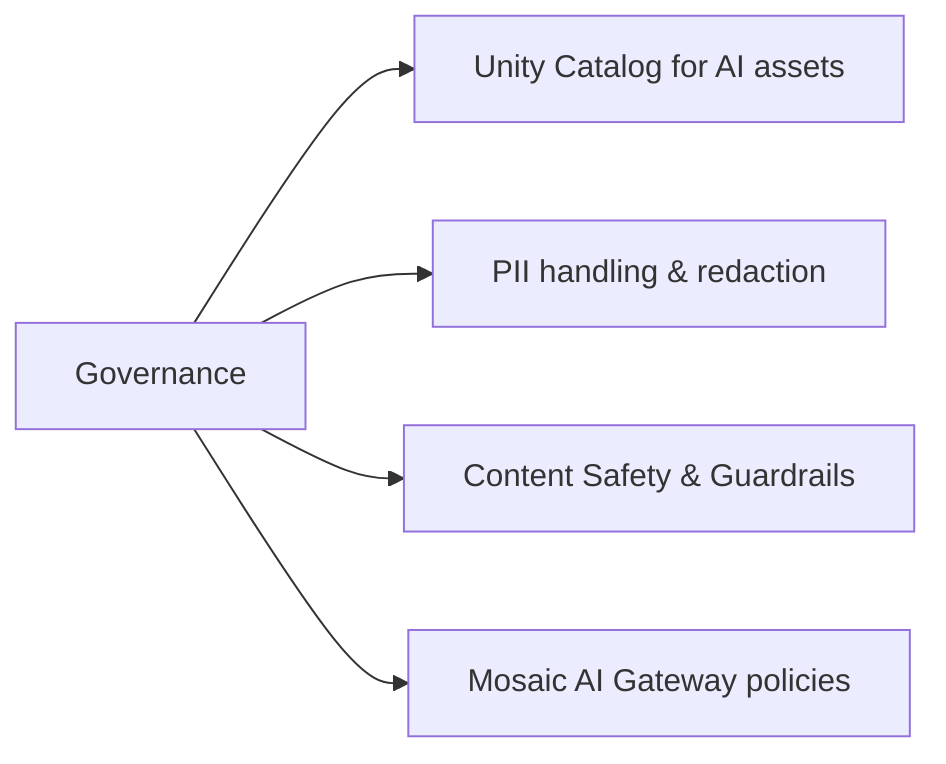

# Governance (8 % of Exam)

> [!important]
> **New in the March 2026 blueprint.** Governance is now a first-class 8 % domain covering how Unity Catalog governs AI assets, how PII is handled in GenAI pipelines, and how content safety / Mosaic AI Gateway guardrails protect production deployments.

## Topics Overview

## Section Contents

| File | Topic | Priority |
| :--- | :--- | :--- |
| [01-governance-overview.md](./01-governance-overview.md) | UC for embeddings/models/prompts, PII redaction, content safety, Mosaic AI Gateway guardrails | High |

## Key Concepts

| Concept | Why it matters |
| :--- | :--- |
| **UC for AI assets** | Embeddings, vector indexes, registered models, prompt templates, agent definitions — all are UC-securable objects with the same `GRANT/REVOKE` model |
| **PII redaction** | Source documents may contain PII; strip / hash / mask before embedding to prevent leakage at retrieval time |
| **Content safety** | Input + output classifiers detect unsafe prompts and unsafe generations |
| **Mosaic AI Gateway guardrails** | Per-endpoint policies for rate limit, content filtering, prompt injection detection |
| **Inference Table audit** | Every request/response logged to a UC Delta table — auditable and queryable |
| **Lineage for AI assets** | UC tracks lineage from source documents → chunks → embeddings → model outputs |

## Related Resources

- [Unity Catalog Basics (shared)](../../../shared/fundamentals/unity-catalog-basics.md)
- [Unity Catalog cheat sheet (shared)](../../../shared/cheat-sheets/unity-catalog-quick-ref.md)
- [Mosaic AI Gateway documentation](https://docs.databricks.com/en/ai-gateway/index.html)
- [Inference Tables documentation](https://docs.databricks.com/en/machine-learning/model-serving/inference-tables.html)

---

**[← Previous: Evaluation and Monitoring](../05-evaluation-and-monitoring/README.md) | [↑ Back to GenAI Engineer Associate](../README.md)**
