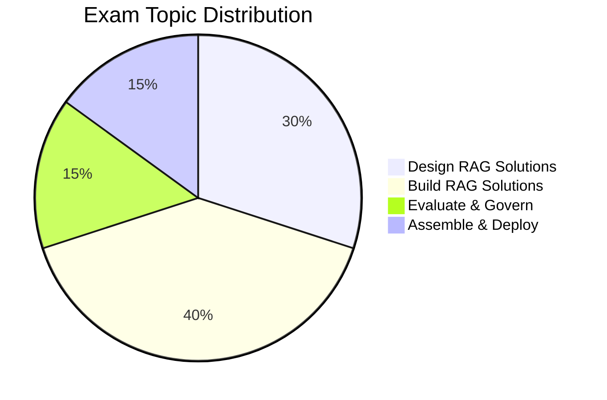

# Databricks Generative AI Engineer Associate

## Exam Overview

| Detail             | Information                                           |
| ------------------ | ----------------------------------------------------- |
| **Certification**  | Databricks Certified Generative AI Engineer Associate |
| **Questions**      | ~45 multiple-choice                                   |
| **Duration**       | 90 minutes                                            |
| **Passing Score**  | 70%                                                   |
| **Languages**      | Python                                                |
| **Experience**     | 6+ months with GenAI on Databricks                    |
| **Recertification**| Every 2 years                                         |
| **Cost**           | $200 USD                                              |

## Exam Domain Weights

## Study Topics

### Core Topics (By Exam Weight)

| Section                                                        | Weight | Topics                                       |
| -------------------------------------------------------------- | ------ | -------------------------------------------- |
| [01-RAG Architecture](01-rag-architecture/README.md)           | 30%    | Retrieval-augmented generation design        |
| [02-Vector Search & Embeddings](02-vector-search-embeddings/README.md) | 25%    | Embeddings, similarity search, vector stores |
| [03-LLM Application Development](03-llm-application-development/README.md) | 30%    | Chains, agents, prompt engineering           |
| [04-Databricks GenAI Tools](04-databricks-genai-tools/README.md) | 15%    | Mosaic AI, Vector Search, MLflow             |

### Practice & Resources

| Resource                                                | Description                              |
| ------------------------------------------------------- | ---------------------------------------- |
| [Practice Questions](resources/practice-questions/README.md)    | Topic-specific practice questions        |
| [Mock Exam 1](resources/mock-exam/README.md)                    | Full-length practice exam                |
| [Mock Exam 2](resources/mock-exam-2/README.md)                  | Alternative practice exam                |
| [Exam Tips](resources/exam-tips.md)                    | Exam strategies and tips                 |
| [Official Links](resources/official-links.md)          | Documentation and resources              |

## Interview Preparation

After completing this certification, explore:

- [Interview Prep Resource](../../shared/interview-prep/README.md) - Gen AI system design, RAG architecture, and LLM applications

## Key Technologies

- **Mosaic AI** - Foundation Model APIs
- **Vector Search** - Databricks Vector Search
- **MLflow** - LLM tracking and deployment
- **LangChain** / **LlamaIndex** - LLM application frameworks

## Prerequisites

Review these shared fundamentals:

- [Databricks Workspace](../../shared/fundamentals/databricks-workspace.md)
- [Unity Catalog Basics](../../shared/fundamentals/unity-catalog-basics.md)

## Study Progress Tracker

- [ ] Understand LLM fundamentals
- [ ] Learn RAG architecture patterns
- [ ] Practice Vector Search setup
- [ ] Build LLM chains and agents
- [ ] Deploy and evaluate GenAI apps

## Official Resources

- [Databricks Certification Page](https://www.databricks.com/learn/certification/genai-engineer-associate)
- [Mosaic AI Documentation](https://docs.databricks.com/generative-ai/)
