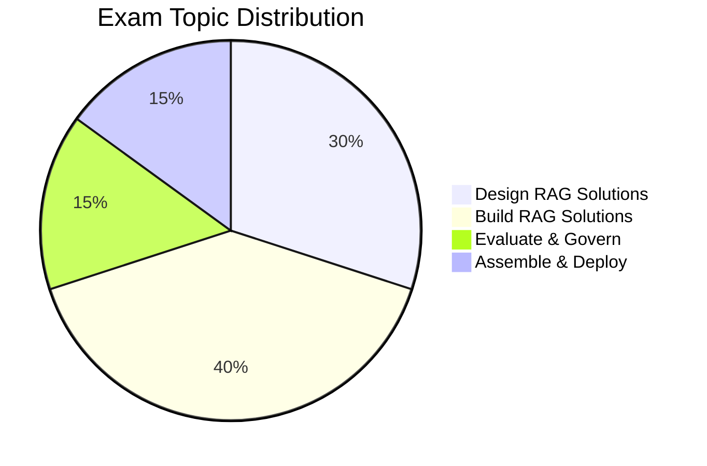

---
tags:
  - databricks
  - certification
  - genai
aliases:
  - GenAI Engineer
---

# Databricks Generative AI Engineer Associate

## Exam Overview

| Detail            | Information                                           |
| ----------------- | ----------------------------------------------------- |
| **Certification** | Databricks Certified Generative AI Engineer Associate |
| **Questions**     | ~45 multiple-choice                                   |
| **Duration**      | 90 minutes                                            |
| **Passing Score** | 70%                                                   |
| **Languages**     | Python                                                |
| **Experience**    | 6+ months with GenAI on Databricks                    |
| **Recertification**| Every 2 years                                         |
| **Cost**          | $200 USD                                              |

## Exam Domain Weights

## Study Topics

| Section            | Weight | Topics                                      |
| ------------------ | ------ | ------------------------------------------- |
| 01-LLM Fundamentals| -      | Foundation models, tokenization, embeddings |
| 02-RAG Patterns    | 30%    | Retrieval-augmented generation design       |
| 03-Vector Search   | 40%    | Vector databases, similarity search         |
| Build & Deploy     | 30%    | Chains, agents, model serving               |

## Key Technologies

- **Mosaic AI** - Foundation Model APIs
- **Vector Search** - Databricks Vector Search
- **MLflow** - LLM tracking and deployment
- **LangChain** - LLM application framework

## Prerequisites

Review these shared fundamentals:

- [Databricks Workspace](../../shared/fundamentals/databricks-workspace.md)
- [Unity Catalog Basics](../../shared/fundamentals/unity-catalog-basics.md)

## Study Progress Tracker

- [ ] Understand LLM fundamentals
- [ ] Learn RAG architecture patterns
- [ ] Practice Vector Search setup
- [ ] Build LLM chains and agents
- [ ] Deploy and evaluate GenAI apps

## Official Resources

- [Databricks Certification Page](https://www.databricks.com/learn/certification/genai-engineer-associate)
- [Mosaic AI Documentation](https://docs.databricks.com/generative-ai/)
