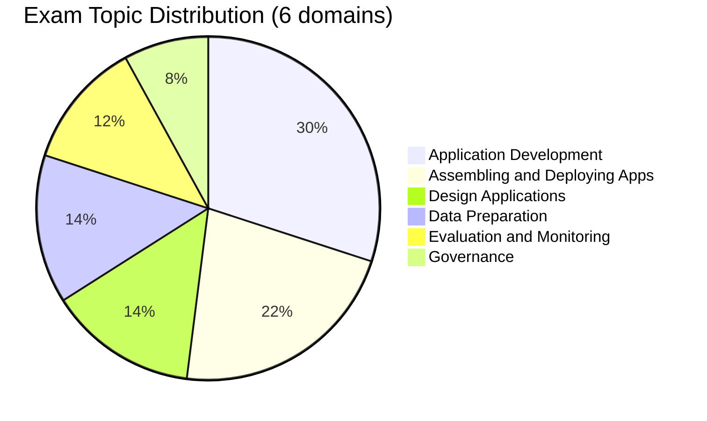

# Databricks Generative AI Engineer Associate

> [!important]
> **What changed in the March 2026 exam guide**
>
> - Refactored into **6 explicitly weighted domains** (was 4)
> - **Application Development** is the largest block at 30 %
> - **Assembling and Deploying Apps** is now a first-class 22 % domain
> - **Governance** is broken out as its own 8 % domain — Unity Catalog for AI assets, PII handling, content safety
> - **Evaluation and Monitoring** elevated to 12 %
> - Pass / fail — **Databricks no longer publishes a numeric passing score**
>
> The official source of truth: [Databricks Certified Generative AI Engineer Associate](https://www.databricks.com/learn/certification/genai-engineer-associate). Topic folders in this guide cover the same scope but with different labels; reorganisation to the 6-domain structure is on the [guide roadmap](../../README.md#roadmap-for-the-guide-itself).

## Exam Overview

| Detail              | Information                                           |
| ------------------- | ----------------------------------------------------- |
| **Certification**   | Databricks Certified Generative AI Engineer Associate |
| **Exam guide**      | March 2026                                            |
| **Scored questions**| 45 multiple-choice                                    |
| **Duration**        | 90 minutes                                            |
| **Result**          | Pass / fail (no published threshold)                  |
| **Languages**       | English, Japanese, Portuguese (BR), Korean            |
| **Code in stems**   | Python                                                |
| **Experience**      | 6+ months hands-on building GenAI solutions on Databricks (recommended) |
| **Recertification** | Every 2 years                                         |
| **Cost**            | $200 USD                                              |
| **Delivery**        | Online proctored or test center                       |

## Exam Domain Weights (official — March 2026)

| Domain | Weight |
| :--- | :---: |
| Application Development | 30 % |
| Assembling and Deploying Apps | 22 % |
| Design Applications | 14 % |
| Data Preparation | 14 % |
| Evaluation and Monitoring | 12 % |
| Governance | 8 % |

## Study Topics

### Topic folders in this guide

| Section                                                                | Covers (official domains) |
| ---------------------------------------------------------------------- | ------------------------- |
| [01-RAG Architecture](01-rag-architecture/README.md)                   | Design Applications · Data Preparation |
| [02-Vector Search & Embeddings](02-vector-search-embeddings/README.md) | Data Preparation · Application Development (retrieval) |
| [03-LLM Application Development](03-llm-application-development/README.md) | Application Development · Evaluation and Monitoring |
| [04-Databricks GenAI Tools](04-databricks-genai-tools/README.md)       | Assembling and Deploying · Governance |

> [!note]
> The **Governance** domain (8 %) is partially covered today inside `04-databricks-genai-tools/`. Expanded Unity Catalog governance and content safety material is planned; in the meantime, see the [Mosaic AI governance documentation](https://docs.databricks.com/en/generative-ai/index.html) and the [`shared/cheat-sheets/unity-catalog-quick-ref.md`](../../shared/cheat-sheets/unity-catalog-quick-ref.md).

### Practice & Resources

| Resource                                                        | Description                              |
| --------------------------------------------------------------- | ---------------------------------------- |
| [Practice Questions](resources/practice-questions/README.md)    | Topic-specific practice questions        |
| [Mock Exam 1](resources/mock-exam/README.md)                    | Full-length practice exam                |
| [Mock Exam 2](resources/mock-exam-2/README.md)                  | Alternative practice exam                |
| [Exam Tips](resources/exam-tips.md)                             | Exam strategies and tips                 |
| [Official Links](resources/official-links.md)                   | Documentation and resources              |

## Interview Preparation

After completing this certification, explore:

- [Interview Prep Resource](../../shared/interview-prep/README.md) - Gen AI system design, RAG architecture, and LLM applications

## Key Technologies

- **Mosaic AI** — Foundation Model APIs and Model Serving
- **Mosaic AI Vector Search** — Databricks-native vector store
- **MLflow** — LLM tracking, evaluation, and deployment
- **Unity Catalog** — governance for embeddings, models, and prompt assets
- **LangChain / LlamaIndex** — LLM application frameworks

## Prerequisites

Review these shared fundamentals:

- [Databricks Workspace](../../shared/fundamentals/databricks-workspace.md)
- [Unity Catalog Basics](../../shared/fundamentals/unity-catalog-basics.md)
- [RAG / Vector Search Basics](../../shared/fundamentals/rag-vector-search-basics.md)
- [MLflow Basics](../../shared/fundamentals/mlflow-basics.md)

## Study Progress Tracker

- [ ] Understand LLM fundamentals and prompt engineering
- [ ] Learn RAG architecture patterns and design trade-offs
- [ ] Practice Vector Search index design and chunking
- [ ] Build LLM chains and agents with Mosaic AI
- [ ] Deploy GenAI apps via Model Serving
- [ ] Set up evaluation, monitoring, and content-safety guardrails
- [ ] Govern AI assets with Unity Catalog (PII handling, lineage)

## Official Resources

- [Databricks Certification Page](https://www.databricks.com/learn/certification/genai-engineer-associate)
- [Mosaic AI Documentation](https://docs.databricks.com/generative-ai/)
- [Vector Search Documentation](https://docs.databricks.com/en/generative-ai/vector-search.html)
- [Model Serving Documentation](https://docs.databricks.com/en/machine-learning/model-serving/index.html)
