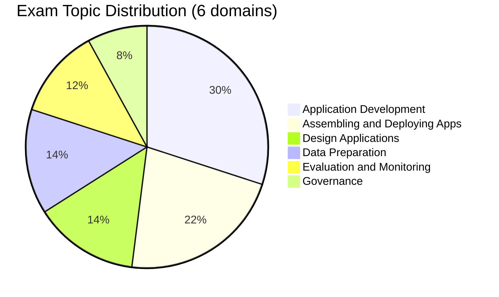

# Databricks Generative AI Engineer Associate

> [!important]
> **What changed in the March 2026 exam guide**
>
> - Refactored into **6 explicitly weighted domains** (was 4)
> - **Application Development** is the largest block at 30 %
> - **Assembling and Deploying Apps** is now a first-class 22 % domain
> - **Governance** is broken out as its own 8 % domain — Unity Catalog for AI assets, PII handling, content safety, AI Gateway
> - **Evaluation and Monitoring** elevated to 12 %
> - Pass / fail — **the March 2026 exam guide does not publish a numeric passing score**
>
> The official source of truth: [Databricks Certified Generative AI Engineer Associate](https://www.databricks.com/learn/certification/genai-engineer-associate). The folder structure in this guide now matches the official 6-domain blueprint 1 : 1.

## Exam Overview

| Detail              | Information                                           |
| ------------------- | ----------------------------------------------------- |
| **Certification**   | Databricks Certified Generative AI Engineer Associate |
| **Exam guide**      | March 2026                                            |
| **Scored questions**| 45 multiple-choice                                    |
| **Duration**        | 90 minutes                                            |
| **Result**          | Pass / fail (no numeric threshold in the March 2026 exam guide) |
| **Languages**       | English, Japanese, Portuguese (BR), Korean            |
| **Code in stems**   | Python                                                |
| **Experience**      | 6+ months hands-on building GenAI solutions on Databricks (recommended) |
| **Recertification** | Every 2 years                                         |
| **Cost**            | $200 USD                                              |
| **Delivery**        | Online proctored or test center                       |

## Exam Domain Weights (official — March 2026)

| Domain | Weight |
| :--- | :---: |
| Application Development | 30 % |
| Assembling and Deploying Apps | 22 % |
| Design Applications | 14 % |
| Data Preparation | 14 % |
| Evaluation and Monitoring | 12 % |
| Governance | 8 % |

## Study Topics

The folder structure below matches the March 2026 official 6-domain blueprint. Read in order; each folder's `README.md` has the section contents and key concepts.

| Section                                                                                | Weight | Focus |
| -------------------------------------------------------------------------------------- | :----: | :--- |
| [01 — Application Development](./01-application-development/README.md)                 | 30 %   | Prompt engineering, chains/agents, retrieval augmentation, vector search runtime |
| [02 — Assembling and Deploying Apps](./02-assembling-and-deploying-apps/README.md)     | 22 %   | Mosaic AI FMAPI, MLflow for GenAI, Model Serving |
| [03 — Design Applications](./03-design-applications/README.md)                         | 14 %   | RAG design patterns, naive vs advanced RAG |
| [04 — Data Preparation](./04-data-preparation/README.md)                               | 14 %   | Chunking, embeddings, Vector Search index creation |
| [05 — Evaluation and Monitoring](./05-evaluation-and-monitoring/README.md)             | 12 %   | MLflow eval, LLM-as-judge, Inference Tables |
| [06 — Governance](./06-governance/README.md)                                           |  8 %   | UC for AI assets, PII handling, content safety, AI Gateway |

### Practice & Resources

| Resource                                                        | Description                              |
| --------------------------------------------------------------- | ---------------------------------------- |
| [Practice Questions](./resources/practice-questions/README.md)  | Topic-specific practice questions        |
| [Mock Exam 1](./resources/mock-exam/README.md)                  | Full-length practice exam                |
| [Mock Exam 2](./resources/mock-exam-2/README.md)                | Alternative practice exam                |
| [Exam Tips](./resources/exam-tips.md)                           | Exam strategies and tips                 |
| [Official Links](./resources/official-links.md)                 | Documentation and resources              |

## Interview Preparation

After completing this certification, explore:

- [Interview Prep Resource](../../shared/interview-prep/README.md) - Gen AI system design, RAG architecture, and LLM applications

## Key Technologies

- **Mosaic AI** — Foundation Model APIs and Model Serving
- **Mosaic AI Vector Search** — Databricks-native vector store
- **Mosaic AI Gateway** — guardrails, rate limit, multi-provider routing
- **MLflow** — LLM tracking, evaluation, deployment
- **Unity Catalog** — governance for embeddings, models, prompt assets, agents
- **LangChain / LlamaIndex** — LLM application frameworks

## Prerequisites

Review these shared fundamentals:

- [Databricks Workspace](../../shared/fundamentals/databricks-workspace.md)
- [Unity Catalog Basics](../../shared/fundamentals/unity-catalog-basics.md)
- [RAG / Vector Search Basics](../../shared/fundamentals/rag-vector-search-basics.md)
- [MLflow Basics](../../shared/fundamentals/mlflow-basics.md)

## Study Progress Tracker

- [ ] Understand LLM fundamentals and prompt engineering
- [ ] Learn RAG architecture patterns and design trade-offs
- [ ] Practice Vector Search index creation, chunking, embedding choice
- [ ] Build LLM chains and agents with Mosaic AI FMAPI
- [ ] Deploy GenAI apps via Model Serving (provisioned vs pay-per-token)
- [ ] Set up MLflow evaluation, LLM-as-judge, inference tables
- [ ] Govern AI assets with Unity Catalog (PII handling, content safety, AI Gateway)

## Official Resources

- [Databricks Certification Page](https://www.databricks.com/learn/certification/genai-engineer-associate)
- [Mosaic AI Documentation](https://docs.databricks.com/generative-ai/)
- [Vector Search Documentation](https://docs.databricks.com/en/generative-ai/vector-search.html)
- [Model Serving Documentation](https://docs.databricks.com/en/machine-learning/model-serving/index.html)
- [AI Gateway Documentation](https://docs.databricks.com/en/ai-gateway/index.html)
