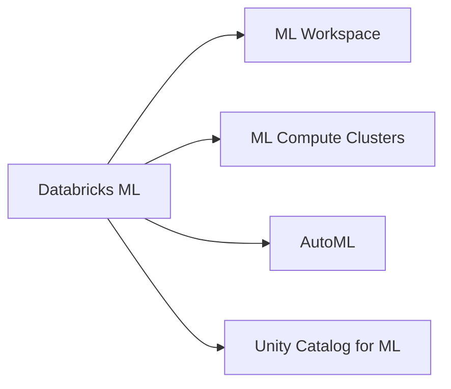

# Databricks Machine Learning (38 % of Exam)

The largest domain in the March 1, 2025 blueprint. Covers the Databricks ML workspace surface — ML compute clusters, AutoML, Unity Catalog for ML assets, and the platform features that distinguish Databricks ML from a generic Spark + Python setup.

## Topics Overview

## Section Contents

| File | Topic | Priority |
| :--- | :--- | :--- |
| [01-databricks-ml-workspace.md](./01-databricks-ml-workspace.md) | ML workspace surface, notebooks, ML runtime images | High |
| [02-compute-clusters-ml.md](./02-compute-clusters-ml.md) | ML compute clusters, single-user mode, GPU configs | High |
| [03-databricks-automl.md](./03-databricks-automl.md) | AutoML for classification / regression / forecasting | High |

## Key Concepts

| Concept | Why it matters |
| :--- | :--- |
| **Databricks Runtime for ML** | Pre-built runtime with TensorFlow, PyTorch, scikit-learn, MLflow installed |
| **AutoML** | Generates baseline notebooks for classification, regression, and forecasting tasks |
| **Single-user vs shared access mode** | ML workloads (UDFs, PyTorch, custom libraries) typically need single-user clusters |
| **Unity Catalog for ML** | Registered models, feature tables, and inference tables live under `catalog.schema.<name>` |
| **GPU clusters** | Single-user mode required; choose the right instance type per workload |

## Related Resources

- [MLflow Basics (shared)](../../../shared/fundamentals/mlflow-basics.md)
- [Feature Engineering Basics (shared)](../../../shared/fundamentals/feature-engineering-basics.md)
- [Databricks ML documentation](https://docs.databricks.com/machine-learning/)
- [Hands-on Lab 04 — MLflow tracking and Model Registry in UC](../../../labs/04-mlflow-tracking.md)

---

**[↑ Back to ML Associate](../README.md) | [Next: Model Development →](../02-model-development/README.md)** *(first domain — no previous)*
