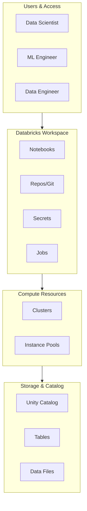
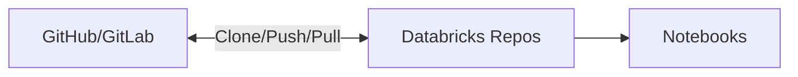

# Databricks ML Workspace & Notebooks

## Overview

The Databricks workspace is a collaborative environment where data scientists and ML engineers develop, test, and collaborate on machine learning models. It provides unified access to notebooks, compute, and data.

## Workspace Architecture



## Workspace Components

### **Notebooks**

Interactive development environment supporting multiple languages:

```python
# Python notebook with Databricks magic commands

%md
# Machine Learning Experiment

This is a Markdown cell for documentation

%python
import spark.mllib as mllib
import pandas as pd

# Load data from Unity Catalog

df = spark.read.table("catalog.schema.dataset")
display(df)

%sql
-- SQL cells for data exploration
SELECT * FROM catalog.schema.dataset LIMIT 10

%scala
// Scala cells for Spark operations
val df = spark.read.table("catalog.schema.dataset")
df.show()
```

**Key Features:**

- **Multiple Languages**: Python, SQL, Scala, R
- **Magic Commands**: `%md`, `%python`, `%sql`, `%scala`, `%sh`
- **Widgets**: Interactive parameters for notebooks
- **Rich Output**: Display tables, plots, graphs

### **Widgets for Parameterization**

```python
# Create text widget

dbutils.widgets.text("model_name", "baseline_model")
model_name = dbutils.widgets.get("model_name")

# Create dropdown

dbutils.widgets.dropdown("environment", "dev", ["dev", "staging", "prod"])
environment = dbutils.widgets.get("environment")

# Create multi-select

dbutils.widgets.multiselect("features", "feat1", ["feat1", "feat2", "feat3"])
selected_features = dbutils.widgets.get("features").split(",")

# Remove all widgets

dbutils.widgets.removeAll()
```

### **File System Access**

```python
# Databricks File System (DBFS) operations

import os

# Mount object storage

dbutils.fs.mount(
    source = "wasbs://container@storage.blob.core.windows.net",
    mount_point = "/mnt/data",
    extra_configs = {
        "fs.azure.account.key.storage.blob.core.windows.net": "access-key"
    }
)

# List files

dbutils.fs.ls("/mnt/data")

# Create directory

dbutils.fs.mkdirs("/mnt/data/models")

# Remove files

dbutils.fs.rm("/mnt/data/old_data", recurse=True)
```

## Collaboration Features

### **Repos for Version Control**



**Git Operations:**

```python
# Clone repository

databricks repos create-repo \
    --url "https://github.com/user/ml-project.git" \
    --provider github \
    --path "/Repos/ml-project"

# Sync changes

databricks repos update \
    --repo-id <repo-id> \
    --branch "main"
```

### **Shared Notebooks & Folders**

```python
# Access shared data

import pandas as pd
df = pd.read_csv("/Workspace/Shared/datasets/training_data.csv")

# Write results to shared location

results_df.to_csv("/Workspace/Shared/results/model_metrics.csv", index=False)
```

## Notebook Best Practices for ML

### **Initialization Cell**

```python
# Cell 1: Setup and imports

%python
import warnings
warnings.filterwarnings("ignore")

import pandas as pd
import numpy as np
from pyspark.sql import functions as F
from pyspark.ml import Pipeline
from sklearn.preprocessing import StandardScaler
import mlflow

# Set seed for reproducibility

np.random.seed(42)
spark.sparkContext.setCheckpointDir("/tmp/checkpoints")

# Configure display

pd.set_option("display.max_columns", None)
```

### **Data Loading Pattern**

```python
# Load from Unity Catalog

df = spark.read.table("ml_catalog.training.customer_data")

# Convert to Pandas for small datasets

pdf = df.toPandas()

# Print schema and sample

df.printSchema()
display(df.limit(5))
```

### **Visualization**

```python
# Using Databricks display() function

import matplotlib.pyplot as plt

fig, ax = plt.subplots(figsize=(10, 6))
ax.scatter(X["feature1"], X["feature2"], alpha=0.6)
ax.set_xlabel("Feature 1")
ax.set_ylabel("Feature 2")
plt.title("Feature Distribution")
display(fig)

# Direct display of DataFrames

display_df = spark.read.table("my_table")
display(display_df)
```

## Access Control & Security

### **Workspace Access Levels**

| Role | Permissions | Use Case |
|------|---|---|
| **Viewer** | Read-only access | Stakeholders reviewing results |
| **Editor** | Create/modify notebooks | Data scientists, engineers |
| **Admin** | Full workspace management | Workspace administrators |

### **Managing Permissions**

```python
# Check current permissions

databricks workspace export-fmt \
    --fmt dbc \
    --path /Users/user@company.com/my_notebook

# Share notebook with specific permission

databricks workspace update \
    --path /Users/user@company.com/model_development \
    --show-hidden-files
```

## Comparison: Databricks Notebooks vs Jupyter

| Aspect | Databricks Notebooks | Jupyter |
|--------|---|---|
| **Collaboration** | Real-time, built-in | Limited (requires third-party) |
| **Compute** | Integrated clusters | Manual kernel management |
| **Version Control** | Native Git integration | External git only |
| **UI/UX** | Cloud-native interface | Browser-based |
| **Secrets Management** | Built-in secrets store | Manual/external |
| **Multi-language** | Python, SQL, Scala, R | Kernels only |
| **Debugging** | Full debugger support | Basic debugging |

## Real-World Scenario

**Building a Customer Churn Model:**

```python
%md
# Customer Churn Prediction Model

Team: Data Science
Date: 2025-02-20

%python
# Load data

df = spark.read.table("production.customer_analytics.customer_data")

# Explore & prepare

df.groupBy("churn").count().show()

# Build model

from pyspark.ml import Pipeline
from pyspark.ml.feature import VectorAssembler
from pyspark.ml.classification import LogisticRegression

pipeline = Pipeline(stages=[
    VectorAssembler(inputCols=["age", "balance", "tenure"], outputCol="features"),
    LogisticRegression(labelCol="churn")
])

# Share with team

display(df.limit(10))

# Save to shared location

df.write.mode("overwrite").saveAsTable("ml_staging.churn_model_data")
```

## Use Cases

- **Databricks ML Workspace & Notebooks Implementation**: Incorporating Databricks ML Workspace & Notebooks principles to build scalable and maintainable solutions in Databricks environments.
- **Shared Notebook Environment for Team Collaboration**: Multiple data scientists working in the same workspace, using shared folders and repos to collaboratively develop and review ML experiments.

## Common Issues & Errors

### Configuration Oversights

**Scenario:** The default settings for Databricks ML Workspace & Notebooks do not scale well with sudden spikes in data volume.
**Fix:** Explicitly define and tune the configuration parameters for Databricks ML Workspace & Notebooks to handle production-scale workloads.

### Notebook Cannot Access MLflow Experiment

**Scenario:** `mlflow.start_run()` fails because the experiment doesn't exist or the user lacks permissions.
**Fix:** Create the experiment first with `mlflow.create_experiment()` or verify workspace permissions on the experiment folder.

## Exam Tips

- ✅ Understand workspace hierarchy: workspace → folders → notebooks
- ✅ Know magic commands and their uses (`%python`, `%sql`, `%md`, `%sh`)
- ✅ Recognize the difference between Databricks File System (DBFS) and workspace folders
- ✅ Understand access controls and sharing notebooks
- ✅ Remember widgets for parameterizing notebooks
- ✅ Understand the purpose of repos for version control

## Key Takeaways

- Databricks notebooks provide interactive, multi-language development environment
- Collaboration is built-in with real-time editing and comment support
- Git integration via Repos enables version control
- Fine-grained access control supports team workflows
- DBFS and workspace provide flexible file management
- Widgets enable notebook parameterization for reusability

## Related Topics

- [Compute Clusters for ML](02-compute-clusters-ml.md)
- [Databricks AutoML](03-databricks-automl.md)
- [MLflow Tracking](../02-ml-workflows/01-mlflow-tracking.md)

## Official Documentation

- [Databricks Workspace](https://docs.databricks.com/workspace/index.html)
- [Notebooks Guide](https://docs.databricks.com/notebooks/index.html)

---

**[↑ Back to Databricks ML](./README.md) | [Next: Compute Clusters for ML](./02-compute-clusters-ml.md) →**
