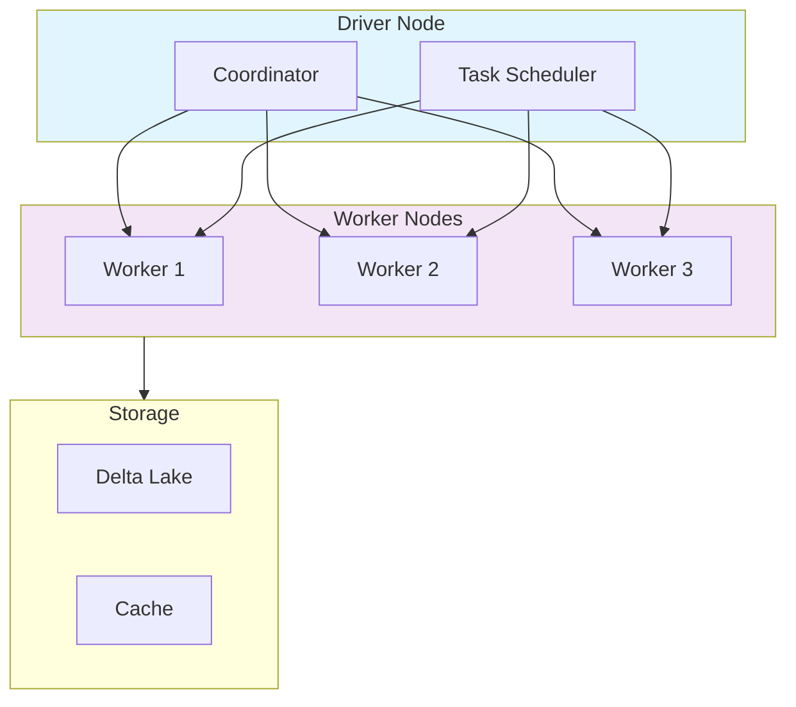
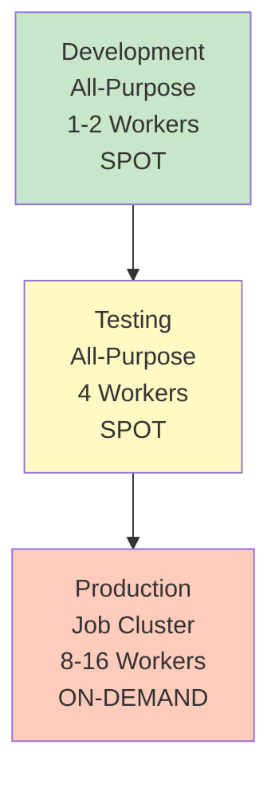

# Compute Clusters for ML

## Overview

Clusters are the compute backbone for machine learning workloads. Databricks provides flexible, auto-scaling clusters optimized for different ML workflows.

## Cluster Architecture



## Cluster Types

### **All-Purpose Clusters**

Used for interactive development and shared workloads.

```python
# Create all-purpose cluster via API

cluster_config = {
    "cluster_name": "ml-dev-cluster",
    "spark_version": "14.3.x-scala2.12",
    "node_type_id": "i3.xlarge",
    "driver_node_type_id": "i3.xlarge",
    "num_workers": 4,
    "aws_attributes": {
        "availability": "SPOT",
        "zone_id": "us-west-2a"
    },
    "autoscale": {
        "min_workers": 2,
        "max_workers": 8
    }
}

# Features
# - Supports multiple users
# - Long-running sessions
# - Supports all Spark workloads
# - Good for development

```

**Use Cases:**

- Interactive development
- Data exploration
- Ad-hoc analysis
- Shared team work

### **Job Clusters**

Dedicated clusters for scheduled jobs, automatically terminated after job completion.

```python
# Job cluster configuration

job_config = {
    "name": "model_training_job",
    "new_cluster": {
        "spark_version": "14.3.x-scala2.12",
        "node_type_id": "i3.xlarge",
        "num_workers": 8,
        "aws_attributes": {
            "availability": "SPOT"
        }
    },
    "spark_python_task": {
        "python_file": "dbfs:/ml/train_model.py",
        "parameters": ["--epochs=100", "--batch_size=32"]
    },
    "timeout_seconds": 3600,
    "max_concurrent_runs": 1
}

# Benefits
# - Cost-effective (auto-terminate)
# - Isolated environments
# - Consistent infrastructure
# - Better for production jobs

```

**Use Cases:**

- Model training pipelines
- Batch processing
- Scheduled experiments
- Production inference

### **SQL Warehouses**

Specialized compute for SQL queries without creating clusters.

```sql
-- SQL Warehouse configuration
-- Type: Pro or Serverless
-- Auto-scaling: 2-4 endpoints
-- Query timeout: 60 minutes
-- Use for: BI, analytics, dashboards

SELECT * FROM ml_catalog.models.predictions
WHERE prediction_date = CURRENT_DATE()
ORDER BY confidence DESC
LIMIT 100;
```

**Characteristics:**

- Optimized for SQL workloads
- No cluster management
- Automatic scaling
- Cost per DBU used

## Cluster Configuration for ML

### **Optimal Settings for Machine Learning**

```python
ml_cluster_config = {
    # Compute sizing
    "num_workers": 4,  # or use autoscale
    "node_type_id": "i3.xlarge",  # Memory-optimized for ML
    "driver_node_type_id": "i3.xlarge",  # Same as workers

    # Runtime
    "spark_version": "14.3.x-scala2.12",  # ML Runtime
    "runtime_engine": "photon",  # GPU-accelerated

    # Autoscaling
    "autoscale": {
        "min_workers": 2,
        "max_workers": 16
    },

    # Spot instances for cost savings
    "aws_attributes": {
        "availability": "SPOT",
        "zone_id": "us-west-2a"
    },

    # Performance tuning
    "spark_conf": {
        "spark.databricks.adaptive.execution.enabled": "true",
        "spark.sql.adaptive.skewJoin.enabled": "true",
        "spark.databricks.delta.optimizeWrite.enabled": "true"
    }
}
```

## Instance Types for ML

| Instance Type | Memory | Use Case | Cost |
|---|---|---|---|
| **i3.xlarge** | 30.5 GB | General ML | Medium |
| **i3.2xlarge** | 61 GB | Large models | Medium-High |
| **i3en.3xlarge** | 96 GB | GPU-heavy ML | High |
| **g4dn.xlarge** | 16 GB + 1 GPU | Deep Learning | Very High |
| **p3.2xlarge** | 61 GB + V100 | Large-scale DL | Very High |

**Selection Guide:**

- Small experiments: `i3.xlarge`
- Large datasets: `i3.2xlarge` or `i3en.3xlarge`
- GPU-based ML: `g4dn` or `p3` series
- Budget-conscious: Use SPOT instances (up to 90% savings)

## Cluster Lifecycle Management

### **Initialization Scripts**

```python
# Install custom libraries on cluster startup

init_script = """
#!/bin/bash
/databricks/python/bin/pip install --upgrade xgboost lightgbm
/databricks/python/bin/pip install optuna hyperopt
"""

# Configuration

init_config = {
    "init_scripts": [{
        "dbfs": {
            "destination": "dbfs:/init-scripts/ml-setup.sh"
        }
    }]
}
```

### **Auto-Termination**

```python
cluster_config = {
    "idle_timeout_minutes": 30,  # Auto-stop after 30 mins idle
    "enable_elastic_disk": True,  # Dynamically resize storage
    "cluster_log_conf": {
        "dbfs": {
            "destination": "dbfs:/logs/ml-cluster/"
        }
    }
}
```

## Scaling Strategy for ML

### **Manual vs Auto-Scaling**

```python
# MANUAL SCALING

manual_config = {
    "num_workers": 8,  # Fixed
    "autoscale": None
}

# AUTOSCALING

auto_config = {
    "autoscale": {
        "min_workers": 2,
        "max_workers": 16
    },
    "aws_attributes": {
        "availability": "SPOT"
    }
}

# When to use MANUAL:
# - Predictable workloads
# - Cost control needed
# - Long-running processes

# When to use AUTOSCALING:
# - Variable workload sizes
# - Handle traffic spikes
# - Optimize cost with SPOT instances

```

## Performance Tuning Parameters

```python
spark_configs = {
    # Adaptive Query Execution
    "spark.databricks.adaptive.execution.enabled": "true",
    "spark.sql.adaptive.skewJoin.enabled": "true",
    "spark.sql.adaptive.coalescePartitions.enabled": "true",

    # Memory Management
    "spark.memory.fraction": 0.6,  # 60% for execution
    "spark.memory.storageFraction": 0.5,  # 50% for cache

    # Shuffle Optimization
    "spark.shuffle.partitions": 200,  # Based on data size
    "spark.sql.shuffle.partitions": 200,

    # Delta Optimization
    "spark.databricks.delta.optimizeWrite.enabled": "true",
    "spark.databricks.delta.autoCompact.enabled": "true",

    # ML-specific
    "spark.databricks.ml.autolog.enabled": "true",  # Enable MLflow autologging
}
```

## Cost Optimization Strategies

### **Tier-Down Approach**



### **Cost Calculation**

```python

# Cost = DBU/hour × hours used × node count
# Example:
# - Cluster: 4 workers @ i3.xlarge (8 DBU/hour each)
# - Usage: 2 hours
# - Total: 8 × 2 × 4 = 64 DBUs
# - Cost: 64 × $0.40 = $25.60

def calculate_cluster_cost(num_workers, hours, price_per_dbu):
    dbu_per_worker = 8  # i3.xlarge
    total_dbu = num_workers * dbu_per_worker * hours
    return total_dbu * price_per_dbu
```

## Real-World Example: ML Training Cluster

```python
%python
from databricks_.sdk import WorkspaceClient

# Initialize client

w = WorkspaceClient()

# Create optimized ML training cluster

cluster_create_request = {
    "cluster_name": "ml_training_prod",
    "spark_version": "14.3.x-ml-scala2.12",
    "num_workers": 8,
    "node_type_id": "i3.2xlarge",
    "driver_node_type_id": "i3.2xlarge",
    "spark_conf": {
        "spark.databricks.adaptive.execution.enabled": "true",
        "spark.databricks.ml.autolog.enabled": "true",
        "spark.databricks.delta.optimizeWrite.enabled": "true"
    },
    "aws_attributes": {
        "availability": "SPOT_WITH_FALLBACK",
        "zone_id": "us-west-2a"
    },
    "idle_timeout_minutes": 30,
    "enable_elastic_disk": True,
    "cluster_log_conf": {
        "dbfs": {
            "destination": "dbfs:/cluster-logs/ml-training/"
        }
    },
    "init_scripts": [{
        "dbfs": {
            "destination": "dbfs:/init-scripts/ml-requirements.sh"
        }
    }]
}

# Create cluster

cluster = w.clusters.create(**cluster_create_request)
print(f"Created cluster: {cluster.cluster_id}")
```

## Comparison: Cluster Types for ML

| Aspect | All-Purpose | Job Cluster | SQL Warehouse |
|--------|---|---|---|
| **Cost** | Medium | Low | High |
| **Startup Time** | 5-10 min | ~5 min | Immediate |
| **Users** | Multiple | Single/Batch | Multiple |
| **Auto-termination** | Manual | Automatic | N/A |
| **Python Support** | ✓ | ✓ | Limited |
| **SQL Support** | ✓ | ✓ | ✓ |
| **Best For** | Development | Production | Analytics |

## Use Cases

- **Compute Clusters for ML Implementation**: Incorporating Compute Clusters for ML principles to build scalable and maintainable solutions in Databricks environments.
- **Cost-Optimized Training with Spot Instances**: Using autoscaling clusters with SPOT instances to run large-scale hyperparameter sweeps while minimizing cloud compute costs.

## Common Issues & Errors

### Configuration Oversights

**Scenario:** The default settings for Compute Clusters for ML do not scale well with sudden spikes in data volume.
**Fix:** Explicitly define and tune the configuration parameters for Compute Clusters for ML to handle production-scale workloads.

### GPU Cluster Out of Memory

**Scenario:** Training job crashes with `CUDA out of memory` on a GPU cluster.
**Fix:** Reduce batch size, use gradient accumulation, or select a node type with more GPU memory (e.g., A10G to A100).

## Exam Tips

- ✅ Know cluster vs job cluster trade-offs
- ✅ Understand auto-scaling configuration
- ✅ Recognize instance types and their use cases
- ✅ Know how to optimize costs with SPOT instances
- ✅ Understand initialization scripts for dependencies
- ✅ Remember idle timeout for cost control

## Key Takeaways

- All-purpose clusters for development, job clusters for production
- Autoscaling enables cost-effective handling of variable workloads
- Instance type selection depends on workload (CPU, memory, GPU)
- SPOT instances can reduce costs by up to 90%
- Initialization scripts automate dependency management
- Proper configurations optimize both performance and cost

## Related Topics

- [Databricks ML Workspace](01-databricks-ml-workspace.md)
- [Databricks AutoML](03-databricks-automl.md)
- [ML Experimentation Workflow](../02-ml-workflows/03-ml-experimentation-workflow.md)

## Official Documentation

- [Compute Configuration](https://docs.databricks.com/compute/configure.html)
- [Cluster Best Practices](https://docs.databricks.com/compute/clusters-manage.html)

---

**[← Previous: Databricks ML Workspace & Notebooks](./01-databricks-ml-workspace.md) | [↑ Back to Databricks ML](./README.md) | [Next: Databricks AutoML](./03-databricks-automl.md) →**
