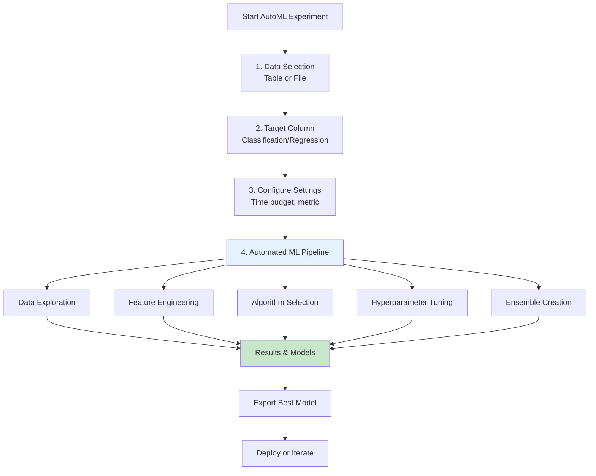

# Databricks AutoML

## Overview

Databricks AutoML automates the end-to-end machine learning pipeline, from data preparation to model selection and hyperparameter tuning. It enables rapid experimentation and baseline model creation.

## AutoML Workflow



## Core Features

### **Data Exploration & Preprocessing**

```python

# AutoML automatically performs:
# - Data type detection
# - Missing value handling
# - Outlier detection
# - Categorical encoding
# - Feature scaling/normalization

# Sample workflow

from databricks.sdk.service import ml

automl_config = {
    "data_source": "table_or_file",
    "target_col": "price",
    "problem_type": "regression",
    "timeout": 60,  # minutes
    "metric": "rmse",  # root mean squared error
}

# AutoML Preview (shows what will happen)
# - Splits data: 80% train, 10% validation, 10% test
# - Detects data types
# - Identifies issues (skew, missing, outliers)

```

### **Feature Engineering Pipeline**

```python

# AutoML generates multiple feature sets
# Common transformations:

# Categorical features
# - One-hot encoding
# - Target encoding
# - Frequency encoding

# Numerical features
# - Polynomial features
# - Interactions
# - Logarithmic scaling

# Time-based features
# - Day of week
# - Month
# - Seasonality indicators

# Example: Feature engineering in generated notebook

from pyspark.ml.feature import OneHotEncoder, VectorAssembler

pipeline_stages = [
    OneHotEncoder(inputCols=["category"], outputCols=["category_encoded"]),
    VectorAssembler(inputCols=["category_encoded", "numeric_feature"],
                   outputCol="features")
]
```

### **Algorithm Selection**

AutoML tries multiple algorithms and selects the best:

```python

# Classification Algorithms
# - Logistic Regression
# - Random Forest Classifier
# - Gradient Boosted Trees
# - Linear SVM

# Regression Algorithms
# - Linear Regression
# - Random Forest Regressor
# - Gradient Boosted Trees
# - ElasticNet

# Example model comparison

models_tested = {
    "Logistic Regression": {"accuracy": 0.82, "auc": 0.88},
    "Random Forest": {"accuracy": 0.85, "auc": 0.91},
    "Gradient Boosting": {"accuracy": 0.87, "auc": 0.93},  # Best
    "Linear SVM": {"accuracy": 0.84, "auc": 0.90}
}
```

### **Hyperparameter Tuning**

```python

# AutoML uses Hyperopt for tuning
# Common hyperparameters optimized:

# Random Forest

rf_params = {
    "num_trees": [10, 50, 100, 200],
    "max_depth": [5, 10, 15, 20],
    "min_samples_leaf": [1, 2, 4, 8]
}

# Gradient Boosting

gb_params = {
    "n_estimators": [50, 100, 200, 300],
    "learning_rate": [0.001, 0.01, 0.1],
    "max_depth": [3, 5, 7, 9],
    "subsample": [0.7, 0.8, 0.9, 1.0]
}

# Optimization method: Bayesian Optimization
# Search space: thousands of combinations
# Best parameters: based on metric (AUC, RMSE, etc.)

```

## Using AutoML via UI

### **Step-by-Step Process**

1. **Create Experiment**

    ```text
    Databricks Home → Create → AutoML Experiment
    ```

2. **Select Data**
   - Choose table from catalog
   - Or upload CSV file
   - Preview first 100 rows

3. **Configure Settings**

    ```text
    Target column: select prediction target
    Problem type: Classification or Regression
    Metric: AUC (classification), RMSE (regression)
    Time budget: 30-120 minutes
    ```

4. **Run AutoML**
   - Automatically trains multiple models
   - Shows progress in real-time
   - Generates notebooks for each run

5. **Review Results**
   - Best model metrics
   - Feature importance
   - Learning curves
   - Comparison with baseline

## Programmatic AutoML

### **Using AutoML API**

```python
from databricks import automl

# Create AutoML experiment

summary = automl.classify(
    dataset=df,
    target_col="churn",
    timeout_minutes=30,
    experiment_dir="/Workspace/Users/user@company.com/experiments",
)

print(f"Best trial: {summary.best_trial.hyperparameters}")
print(f"Best model: {summary.best_model}")

# Access results

best_model_uri = summary.best_model.source
metric_value = summary.best_trial.metrics['log_loss']
```

### **Classification Example**

```python
import mlflow
from databricks import automl

# Load data

df = spark.read.table("ml_catalog.data.customer_churn")

# Run AutoML for classification

churn_summary = automl.classify(
    dataset=df,
    target_col="churned",
    timeout_minutes=45,
    experiment_dir="/Repos/user/ml-projects/churn"
)

# Get best model info

print(f"Best model accuracy: {churn_summary.best_trial.metrics['accuracy']}")
print(f"Best model parameters: {churn_summary.best_trial.hyperparameters}")

# Model URI for deployment

model_uri = churn_summary.best_model.source
mlflow.register_model(model_uri, "customer_churn_model")
```

### **Regression Example**

```python
from databricks import automl

# Load housing data

df = spark.read.table("ml_catalog.data.housing")

# Run AutoML for regression

price_summary = automl.regress(
    dataset=df,
    target_col="price",
    timeout_minutes=60,
    experiment_dir="/Repos/user/ml-projects/housing"
)

# Evaluate results

print(f"Best model RMSE: {price_summary.best_trial.metrics['rmse']}")
print(f"R² score: {price_summary.best_trial.metrics['r2_score']}")
```

## AutoML Output & Artifacts

### **Generated Notebooks**

```text
/Workspace/Users/user@company.com/experiments/churn_analysis/
├── 00-AutoML/
│   ├── data_analysis.ipynb       # EDA notebook
│   ├── train.ipynb               # Training notebook
│   └── validation_drift.ipynb    # Drift monitoring
├── model1_lr.ipynb               # Logistic Regression trial
├── model2_rf.ipynb               # Random Forest trial
└── model3_gb.ipynb               # Gradient Boosting trial
```

### **Model Registry Integration**

```python

# AutoML automatically logs to MLflow
# Best model available in Model Registry

# Access registered model

from mlflow.tracking import MlflowClient

client = MlflowClient()
models = client.search_registered_models(
    filter_string="name='churn_prediction'"
)

# Load for predictions

import mlflow
model = mlflow.sklearn.load_model(
    "models:/churn_prediction/Production"
)
predictions = model.predict(new_data)
```

## Best Practices for AutoML

### **Data Preparation**

✓ **Do:**

- Clean data before AutoML
- Remove duplicates
- Handle missing values explicitly
- Ensure balanced classes (for classification)

✗ **Don't:**

- Use data with data leakage
- Include row IDs or timestamps
- Mix training and test data

### **Configuration**

```python
# Good time budget for different scenarios

scenarios = {
    "Quick baseline": 15,        # minutes
    "Standard experimentation": 30,
    "Thorough tuning": 60,
    "Competition": 120
}

# Choose appropriate metric

metrics = {
    "Binary Classification": ["auc", "accuracy", "f1"],
    "Multiclass": ["auc", "accuracy"],
    "Regression": ["rmse", "r2", "mae"]
}
```

### **Post-AutoML Steps**

```python

# After AutoML:
# Review best model notebook
# Understand feature importance
# Validate on hold-out test set
# Check for data drift
# Deploy if performance acceptable
# Monitor in production

# Example validation

best_model = mlflow.sklearn.load_model(
    "runs:/<run_id>/model"
)

y_pred = best_model.predict(X_test)
from sklearn.metrics import classification_report
print(classification_report(y_test, y_pred))
```

## Comparison: AutoML vs Manual ML

| Aspect | AutoML | Manual |
|--------|--------|--------|
| **Time to Baseline** | Hours | Days/Weeks |
| **Feature Engineering** | Automated | Manual |
| **Hyperparameter Tuning** | Automated | Manual |
| **Model Selection** | Automated | Manual |
| **Customization** | Limited | Full control |
| **Best For** | Quick iteration | Complex domains |
| **Learning** | Less exposure | Deep learning |

## Real-World Scenario

**Churn Prediction Workflow:**

```python
%python
from databricks import automl
import mlflow

# Load customer data

df = spark.read.table("production.customer_360.data")

# Configure AutoML

churn_experiment = automl.classify(
    dataset=df,
    target_col="churned_flag",
    timeout_minutes=45,
    experiment_dir="/Workspace/Shared/ml-projects/churn"
)

# Review results

best_metrics = churn_experiment.best_trial.metrics
print(f"Best AUC: {best_metrics['auc']}")
print(f"Best Accuracy: {best_metrics['accuracy']}")

# Register model

mlflow.register_model(
    churn_experiment.best_model.source,
    "customer_churn_predictor"
)

# Deploy to production

model_uri = f"models:/customer_churn_predictor/Production"
```

## Use Cases

- **Databricks AutoML Implementation**: Incorporating Databricks AutoML principles to build scalable and maintainable solutions in Databricks environments.
- **Rapid Baseline Model Generation**: Running AutoML on a new dataset to quickly establish a performance baseline before investing time in custom feature engineering and model tuning.

## Common Issues & Errors

### Configuration Oversights

**Scenario:** The default settings for Databricks AutoML do not scale well with sudden spikes in data volume.
**Fix:** Explicitly define and tune the configuration parameters for Databricks AutoML to handle production-scale workloads.

### AutoML Run Produces Poor Results

**Scenario:** AutoML's best model has low accuracy compared to manual tuning.
**Fix:** Check data quality -- AutoML performance depends on clean features. Also increase the timeout to allow more trials, or provide a larger training dataset.

## Exam Tips

- ✅ Understand AutoML value: quick baselines for rapid iteration
- ✅ Know what AutoML automates: feature engineering, algorithm selection, tuning
- ✅ Recognize generated notebook structure
- ✅ Understand time budget and metric selection
- ✅ Know integration with MLflow and Model Registry
- ✅ Remember AutoML is for baseline, not final production models

## Key Takeaways

- AutoML accelerates model development from hours to minutes
- Automatically handles EDA, feature engineering, algorithm selection, and tuning
- Generates reproducible notebooks for each experiment
- Integrates with MLflow for tracking and model management
- Best used for rapid prototyping and baseline creation
- Manual ML skills still critical for complex domains

## Related Topics

- [MLflow Tracking](../02-ml-workflows/01-mlflow-tracking.md)
- [Spark ML Pipelines](../03-feature-engineering/01-spark-ml-pipelines.md)
- [Model Registry](../04-mlflow-deployment/01-model-registry.md)

## Official Documentation

- [Databricks AutoML](https://docs.databricks.com/machine-learning/automl/index.html)
- [AutoML Best Practices](https://docs.databricks.com/machine-learning/automl/best-practices.html)

---

**[← Previous: Compute Clusters for ML](./02-compute-clusters-ml.md) | [↑ Back to Databricks ML](./README.md)**
