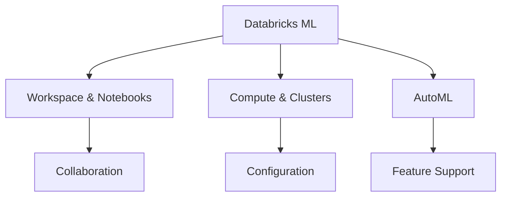

# Databricks ML (29% of Exam)

Understanding Databricks platform capabilities for machine learning including workspace setup, compute resources, and AutoML.

## Topics Overview

## Section Contents

| File | Topic | Priority |
| :--- | :--- | :--- |
| [01-databricks-ml-workspace.md](01-databricks-ml-workspace.md) | Workspace setup, notebooks, collaboration | High |
| [02-compute-clusters-ml.md](02-compute-clusters-ml.md) | Cluster types, configuration, best practices | High |
| [03-databricks-automl.md](03-databricks-automl.md) | AutoML capabilities, workflows, use cases | High |

## Key Concepts

- **Databricks Workspace**: Multi-user environment for collaboration
- **Notebooks**: Interactive development with multiple languages
- **Compute**: Spark clusters for distributed ML workloads
- **AutoML**: Automated machine learning for rapid experimentation

## Related Resources

- [MLflow Basics](../../../shared/fundamentals/mlflow-basics.md)
- [Feature Engineering Basics](../../../shared/fundamentals/feature-engineering-basics.md)
- [Databricks Platform Architecture](../../../shared/fundamentals/platform-architecture.md)

## Next Steps

Progress to [02-ML Workflows](../02-ml-workflows/README.md) to learn about experimentation tracking.

---

**[← Back to Certification](../README.md)**
