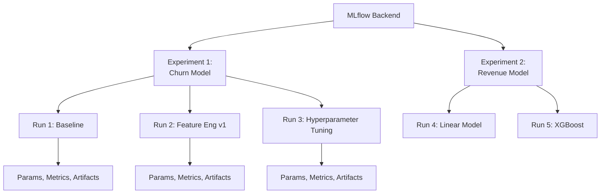
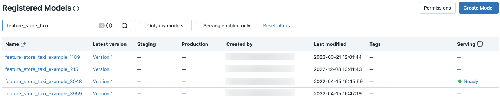
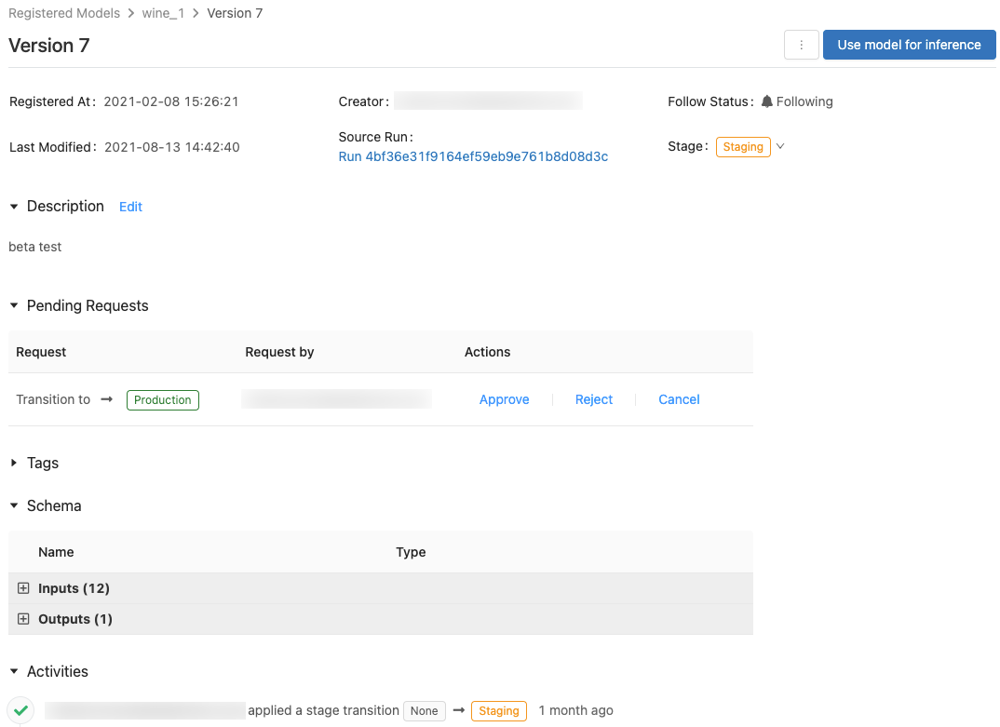

# Experiments & Runs

## Overview

Experiments and runs are the organizational structure for machine learning tracking. Experiments group related runs, and runs represent individual model training executions.

## Concept Hierarchy



## Experiment Management



*MLflow Experiments UI listing runs with logged metrics and parameters.*

### **Creating Experiments**

```python
import mlflow

# Create experiment with automatic naming

exp = mlflow.set_experiment("churn_prediction_v1")

# Create with full path (in notebooks, creates under user)

mlflow.set_experiment("/Users/user@company.com/projects/churn_prediction")

# Get experiment info

active_exp = mlflow.get_experiment_by_name("churn_prediction_v1")
print(f"Experiment ID: {active_exp.experiment_id}")
print(f"Artifact location: {active_exp.artifact_location}")
print(f"Created: {active_exp.creation_time}")

# Working with multiple experiments

from mlflow.tracking import MlflowClient
client = MlflowClient()

# List all experiments

experiments = client.search_experiments()
for exp in experiments:
    print(f"{exp.name}: {len(client.search_runs(exp.experiment_id))} runs")
```

### **Experiment Organization Strategies**

**Strategy 1: By Model Type**

```text
/Projects/
├── /Projects/RandomForest/
├── /Projects/GradientBoosting/
├── /Projects/NeuralNetworks/
```

**Strategy 2: By Business Domain**

```text
/Business/
├── /Business/CustomerAnalytics/
├── /Business/Pricing/
├── /Business/Marketing/
```

**Strategy 3: By Lifecycle**

```text
/Models/
├── /Models/Development/
├── /Models/Staging/
├── /Models/Production/
```

**Best Practice: Hierarchical**

```python
# Organize by project/model/version

base_path = "/Users/user@company.com/projects"
project = "churn_prediction"
iteration = "v2"

exp_name = f"{base_path}/{project}/{iteration}"
mlflow.set_experiment(exp_name)
```

## Run Management



*MLflow Run detail view showing logged parameters, metrics, and artifacts.*

### **Creating & Managing Runs**

```python
import mlflow
from mlflow.tracking import MlflowClient

# Start run with context manager (recommended)

with mlflow.start_run(run_name="rf_baseline_v1") as run:
    run_id = run.info.run_id
    print(f"Started run: {run_id}")

    # Log parameters and metrics
    mlflow.log_param("n_estimators", 100)
    mlflow.log_metric("accuracy", 0.92)

    # Run info automatically available
    print(f"Run name: {run.info.run_name}")
    print(f"Status: {run.info.status}")

# Run automatically ends

# Manual run management

mlflow.start_run(run_name="xgboost_v1")
try:
    mlflow.log_param("eta", 0.3)
    mlflow.log_metric("auc", 0.95)
finally:
    mlflow.end_run()
```

### **Run Status Tracking**

```python
from mlflow.tracking import MlflowClient

client = MlflowClient()

# Run status lifecycle

status_values = ["RUNNING", "SCHEDULED", "FINISHED", "FAILED"]

run_id = mlflow.active_run().info.run_id

# Get run status

run = client.get_run(run_id)
print(f"Status: {run.info.status}")
print(f"Start time: {run.info.start_time}")
print(f"End time: {run.info.end_time}")

# Duration calculation

duration_ms = run.info.end_time - run.info.start_time
duration_sec = duration_ms / 1000
print(f"Duration: {duration_sec:.2f} seconds")

# Set status manually

if error_occurred:
    client.set_terminated(run_id, status="FAILED")
else:
    client.set_terminated(run_id, status="FINISHED")
```

### **Nested Runs**

```python
# Parent run

with mlflow.start_run(run_name="hyperparameter_sweep") as parent_run:
    mlflow.set_tag("type", "sweep")

    # Child runs for each parameter set
    for n_est in [50, 100, 200]:
        with mlflow.start_run(run_name=f"n_est_{n_est}", nested=True):
            mlflow.log_param("n_estimators", n_est)
            mlflow.log_metric("accuracy", 0.90 + n_est/1000)
            mlflow.set_tag("parent_run", parent_run.info.run_id)

# View parent-child relationship in UI
# Parent run shows all nested child runs

```

## Comparing Runs

### **Programmatic Comparison**

```python
from mlflow.tracking import MlflowClient
import pandas as pd

client = MlflowClient()

# Get multiple runs

exp_id = mlflow.get_experiment_by_name("churn_model").experiment_id
runs = client.search_runs(exp_id)

# Extract data for comparison

comparison_data = []
for run in runs:
    comparison_data.append({
        "run_name": run.info.run_name,
        "accuracy": run.data.metrics.get("accuracy"),
        "precision": run.data.metrics.get("precision"),
        "recall": run.data.metrics.get("recall"),
        "n_estimators": run.data.params.get("n_estimators"),
        "max_depth": run.data.params.get("max_depth"),
    })

# Create comparison dataframe

comparison_df = pd.DataFrame(comparison_data)
print(comparison_df.to_string())

# Find best run

best_run = comparison_df.loc[comparison_df["accuracy"].idxmax()]
print(f"Best run: {best_run['run_name']} with accuracy {best_run['accuracy']}")
```

### **UI Comparison**

```text
MLflow UI workflow:
1. Select Experiment (e.g., "churn_model")
2. Select multiple runs to compare
3. Visualize:
   - Metrics comparison (line charts)
   - Parameter values (table)
   - Artifact differences
   - Time series metrics
```

### **Advanced Filtering & Search**

```python
from mlflow.tracking import MlflowClient

client = MlflowClient()
exp_id = mlflow.get_experiment_by_name("churn_model").experiment_id

# Filter by metrics

high_accuracy_runs = client.search_runs(
    experiment_ids=exp_id,
    filter_string="metrics.accuracy > 0.90 AND metrics.auc > 0.92"
)

# Filter by parameters

rf_runs = client.search_runs(
    experiment_ids=exp_id,
    filter_string="params.model_type = 'random_forest'"
)

# Filter by tags

production_runs = client.search_runs(
    experiment_ids=exp_id,
    filter_string="tags.status = 'production'"
)

# Order by metrics

best_runs = client.search_runs(
    experiment_ids=exp_id,
    order_by=["metrics.f1_score DESC"],
    max_results=5
)

for run in best_runs:
    print(f"{run.info.run_name}: F1={run.data.metrics['f1_score']:.3f}")
```

## Real-World Experiment Structure

### **Customer Churn Model - Full Lifecycle**

```python
%python
import mlflow
from mlflow.tracking import MlflowClient

client = MlflowClient()

# EXPLORATION PHASE

mlflow.set_experiment("/Projects/ChurnModel/Exploration")
with mlflow.start_run(run_name="baseline_lr"):
    mlflow.log_param("model", "logistic_regression")
    mlflow.log_metric("accuracy", 0.75)
    mlflow.log_metric("auc", 0.82)
    mlflow.set_tag("phase", "exploration")

# HYPERPARAMETER TUNING PHASE

mlflow.set_experiment("/Projects/ChurnModel/Tuning")
for max_depth in [5, 10, 15]:
    for n_est in [50, 100]:
        with mlflow.start_run(run_name=f"rf_d{max_depth}_e{n_est}"):
            mlflow.log_param("max_depth", max_depth)
            mlflow.log_param("n_estimators", n_est)
            metrics = train_and_evaluate(max_depth, n_est)
            mlflow.log_metrics(metrics)
            mlflow.set_tag("phase", "tuning")

# VALIDATION PHASE

mlflow.set_experiment("/Projects/ChurnModel/Validation")
best_params = {"max_depth": 10, "n_estimators": 100}
with mlflow.start_run(run_name="final_validation"):
    mlflow.log_params(best_params)
    validation_metrics = cross_validate_model(best_params)
    mlflow.log_metrics(validation_metrics)
    mlflow.sklearn.log_model(model, "model")
    mlflow.set_tag("phase", "validation")
    mlflow.set_tag("status", "ready_for_production")

# COMPARE PHASES

exp_names = [
    "/Projects/ChurnModel/Exploration",
    "/Projects/ChurnModel/Tuning",
    "/Projects/ChurnModel/Validation"
]

for exp_name in exp_names:
    exp = mlflow.get_experiment_by_name(exp_name)
    runs = client.search_runs(exp.experiment_id)
    best_in_phase = max(runs, key=lambda r: r.data.metrics.get("auc", 0))
    print(f"{exp_name}: Best AUC = {best_in_phase.data.metrics['auc']}")
```

## Best Practices

### **Naming Conventions**

```python
# ✓ Good: Descriptive, easy to identify

run_names = [
    "baseline_no_features",
    "with_derived_features",
    "after_feature_selection",
    "with_hyperparameter_tuning",
    "ensemble_with_calibration"
]

# ✗ Poor: Generic, unclear

bad_names = [
    "test1",
    "v2",
    "new_model",
    "final"
]

# Best practice: Include key differentiator

mlflow.start_run(run_name=f"rf_depth{max_depth}_n_est{n_estimators}")
```

### **Tagging Strategy**

```python
# Standardized tags for filtering

standard_tags = {
    "project": "customer_churn",
    "team": "data_science",
    "phase": "exploration",  # or tuning, validation, production
    "model_type": "classification",
    "baseline": "no",  # first run = yes
    "production_ready": "no"  # yes only for deployment candidates
}

mlflow.set_tags(standard_tags)
```

### **Experiment Cleanup**

```python
# Archive old experiments

from mlflow.tracking import MlflowClient

client = MlflowClient()
old_exp = client.get_experiment("1")
client.delete_experiment(old_exp.experiment_id)

# Or rename for archiving
# experiments should have clear retention policy

```

## Comparison: Run Organization Patterns

| Pattern | Use Case | Pros | Cons |
|---------|----------|------|------|
| **Single Large Experiment** | Early exploration | Simple | Hard to navigate |
| **Experiment per Model Type** | Multiple algorithms | Organized | Many experiments |
| **Experiment per Phase** | Development lifecycle | Clear progression | Complex hierarchy |
| **Experiment per Data Version** | Data pipeline changes | Reproducibility focus | Hard to compare models |
| **Hybrid (Recommended)** | Everything | Flexible & organized | Requires discipline |

## Use Cases

- **Experiments & Runs Implementation**: Incorporating Experiments & Runs principles to build scalable and maintainable solutions in Databricks environments.
- **Hyperparameter Sweep Organization**: Using nested runs to structure a parent sweep run with child runs for each parameter combination, making it easy to navigate and compare results.

## Common Issues & Errors

### Configuration Oversights

**Scenario:** The default settings for Experiments & Runs do not scale well with sudden spikes in data volume.
**Fix:** Explicitly define and tune the configuration parameters for Experiments & Runs to handle production-scale workloads.

### Cannot Compare Runs Across Experiments

**Scenario:** Two runs are in different experiments and cannot be compared side-by-side.
**Fix:** MLflow's compare feature only works within a single experiment. Log related runs to the same experiment, or use `mlflow.search_runs()` with multiple experiment IDs.

## Exam Tips

- ✅ Understand hierarchy: Backend → Experiments → Runs
- ✅ Know difference between status values (RUNNING, FINISHED, FAILED)
- ✅ Recognize nested runs for hyperparameter sweeps
- ✅ Understand search/filter operations for finding runs
- ✅ Know tagging strategy for organization
- ✅ Understand run metadata (start_time, end_time, duration)

## Key Takeaways

- Experiments group related runs for organization
- Runs represent individual training executions with full metadata
- Status tracking enables monitoring of long-running experiments
- Nested runs support hierarchical organization (parent-child)
- Search and filtering enable finding best runs across experiments
- Proper naming and tagging strategy essential for team collaboration

## Related Topics

- [MLflow Tracking](01-mlflow-tracking.md)
- [ML Experimentation Workflow](03-ml-experimentation-workflow.md)
- [Model Registry](../04-mlflow-deployment/01-model-registry.md)

## Official Documentation

- [Experiments](https://mlflow.org/docs/latest/experiments.html)
- [Search API](https://mlflow.org/docs/latest/search-syntax.html)

---

**[← Previous: MLflow Tracking](./01-mlflow-tracking.md) | [↑ Back to ML Workflows](./README.md) | [Next: ML Experimentation Workflow](./03-ml-experimentation-workflow.md) →**
