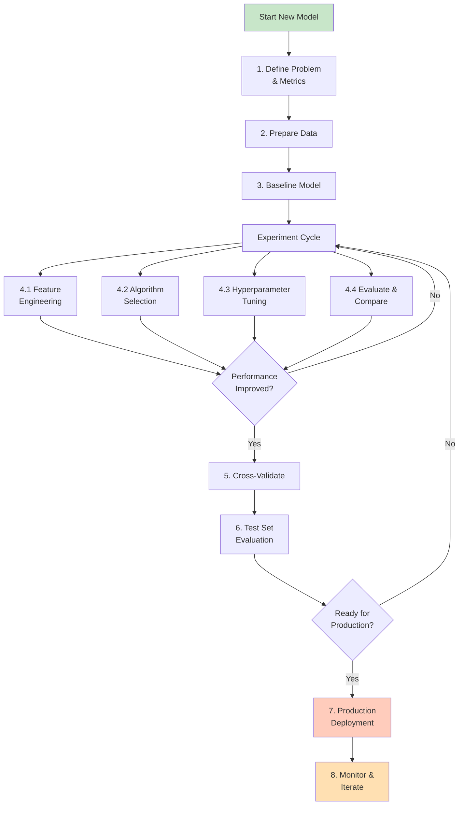

# ML Experimentation Workflow

## Overview

An effective machine learning workflow systematically explores the problem space through structured experimentation, enabling data-driven decisions for model improvement.

## Complete ML Workflow



## Phase 1: Problem Definition

### **Key Decisions**

```python

# Problem specification checklist

problem_spec = {
    "business_objective": "Reduce customer churn",
    "ml_task": "Binary Classification",
    "target_variable": "churned_in_30_days",

    "primary_metric": "AUC",
    "secondary_metrics": ["F1-score", "Precision", "Recall"],

    "baseline_requirement": "Better than 0.70 AUC",
    "production_requirement": "At least 0.85 AUC",

    "false_positive_cost": "Low - send discount to potentially churning customers",
    "false_negative_cost": "High - lose customers unexpectedly",

    "imbalance_ratio": 0.15  # 15% churned, 85% retained
}

# Determine whether precision or recall is critical
# Churned: False negatives (missing churn) are expensive
# → Prioritize RECALL (catch churners)

```

## Phase 2: Data Preparation

### **Data Engineering for ML**

```python
%python
import pandas as pd
from pyspark.sql import functions as F

# LOAD DATA

df = spark.read.table("ml_catalog.raw.customer_data")

# DATA EXPLORATION

print(f"Shape: {df.count()} rows")
print(f"Columns: {len(df.columns)}")
print(f"Missing: {df.select([F.count(F.when(F.col(c).isNull(), c)).alias(c) for c in df.columns]).collect()}")

# DATA VALIDATION
# Check distributions, ranges, missing patterns

display(df.describe())

# FEATURE CREATION
# Raw features → engineered features

df_engineered = (df
    .withColumn("tenure_days", F.datediff(F.current_date(), F.col("signup_date")))
    .withColumn("avg_monthly_usage", F.col("total_usage") / F.greatest(F.col("tenure_days"), 1))
    .withColumn("is_premium", (F.col("plan_type") == "premium").cast("int"))
)

# TRAIN/VAL/TEST SPLIT

train, val, test = df_engineered.randomSplit([0.6, 0.2, 0.2], seed=42)

# SAVE FOR ML

train.write.mode("overwrite").saveAsTable("ml_catalog.ml_ready.train_data")
val.write.mode("overwrite").saveAsTable("ml_catalog.ml_ready.val_data")
test.write.mode("overwrite").saveAsTable("ml_catalog.ml_ready.test_data")
```

## Phase 3: Baseline Model

### **Quick Baseline for Comparison**

```python
%python
import mlflow
from sklearn.ensemble import RandomForestClassifier
from sklearn.preprocessing import StandardScaler
from sklearn.metrics import auc, roc, f1_score
import pandas as pd

# Load data

train_df = spark.read.table("ml_catalog.ml_ready.train_data").toPandas()
val_df = spark.read.table("ml_catalog.ml_ready.val_data").toPandas()

# Create baseline experiment

mlflow.set_experiment("/Projects/ChurnModel/Development")

with mlflow.start_run(run_name="baseline_rf_default"):
    # Simple baseline: RF with default parameters
    X_train = train_df.drop("churned", axis=1)
    y_train = train_df["churned"]

    X_val = val_df.drop("churned", axis=1)
    y_val = val_df["churned"]

    # Scale features
    scaler = StandardScaler()
    X_train_scaled = scaler.fit_transform(X_train)
    X_val_scaled = scaler.transform(X_val)

    # Train baseline
    baseline = RandomForestClassifier(n_estimators=50, random_state=42, n_jobs=-1)
    baseline.fit(X_train_scaled, y_train)

    # Evaluate
    y_pred = baseline.predict(X_val_scaled)
    y_pred_proba = baseline.predict_proba(X_val_scaled)[:, 1]

    fpr, tpr, _ = roc(y_val, y_pred_proba)
    auc_score = auc(fpr, tpr)
    f1 = f1_score(y_val, y_pred)

    # Log to MLflow
    mlflow.log_param("n_estimators", 50)
    mlflow.log_metric("val_auc", auc_score)
    mlflow.log_metric("val_f1", f1)
    mlflow.sklearn.log_model(baseline, "model")
    mlflow.set_tag("phase", "baseline")
    mlflow.set_tag("baseline", "yes")

print(f"Baseline AUC: {auc_score:.3f}")
print(f"Baseline F1: {f1:.3f}")
```

## Phase 4: Experimentation Cycle

### **Structured Iteration Process**

```python
%python
import mlflow
from mlflow.tracking import MlflowClient
import json

client = MlflowClient()
exp = mlflow.get_experiment_by_name("/Projects/ChurnModel/Development")

# EXPERIMENT 1: Feature Engineering

print("=== EXPERIMENT 1: Feature Engineering ===")
mlflow.set_experiment("/Projects/ChurnModel/Development")

feature_sets = {
    "baseline_features": ["age", "tenure", "monthly_charge", "total_charges"],
    "with_interactions": ["age", "tenure", "monthly_charge", "total_charges",
                          "age_tenure_interaction", "charge_ratio"],
    "with_derived": ["age", "tenure", "monthly_charge", "total_charges",
                     "usage_per_day", "days_since_contact", "services_count"]
}

results = {}

for feature_name, features in feature_sets.items():
    with mlflow.start_run(run_name=f"feature_set_{feature_name}"):
        # Prepare data
        X_train_subset = X_train[features]
        X_val_subset = X_val[features]

        # Train
        model = RandomForestClassifier(n_estimators=100, random_state=42)
        model.fit(X_train_subset, y_train)

        # Evaluate
        y_pred_proba = model.predict_proba(X_val_subset)[:, 1]
        auc_score = roc_auc_score(y_val, y_pred_proba)

        mlflow.log_param("feature_set", feature_name)
        mlflow.log_metric("val_auc", auc_score)
        mlflow.set_tag("experiment_type", "feature_engineering")

        results[feature_name] = auc_score
        print(f"{feature_name}: AUC = {auc_score:.4f}")

best_features = max(results, key=results.get)
print(f"\n✓ Best feature set: {best_features} with AUC {results[best_features]:.4f}")
```

### **Hyperparameter Tuning Example**

```python
%python
# EXPERIMENT 2: Hyperparameter Optimization

print("\n=== EXPERIMENT 2: Hyperparameter Tuning ===")

param_grid = {
    "n_estimators": [50, 100, 200],
    "max_depth": [5, 10, 15],
    "min_samples_split": [2, 5, 10]
}

best_params = {}
best_auc = 0

for n_est in param_grid["n_estimators"]:
    for depth in param_grid["max_depth"]:
        for min_split in param_grid["min_samples_split"]:
            with mlflow.start_run(run_name=f"hp_ne{n_est}_d{depth}_ms{min_split}"):
                # Train with these parameters
                model = RandomForestClassifier(
                    n_estimators=n_est,
                    max_depth=depth,
                    min_samples_split=min_split,
                    random_state=42
                )
                model.fit(X_train_scaled, y_train)

                # Evaluate
                y_pred_proba = model.predict_proba(X_val_scaled)[:, 1]
                auc_score = roc_auc_score(y_val, y_pred_proba)

                # Log
                mlflow.log_params({
                    "n_estimators": n_est,
                    "max_depth": depth,
                    "min_samples_split": min_split
                })
                mlflow.log_metric("val_auc", auc_score)
                mlflow.set_tag("experiment_type", "hyperparameter_tuning")

                if auc_score > best_auc:
                    best_auc = auc_score
                    best_params = {
                        "n_estimators": n_est,
                        "max_depth": depth,
                        "min_samples_split": min_split
                    }
                    print(f"New best: {best_params} → AUC = {auc_score:.4f}")

print(f"\n✓ Best hyperparameters: {best_params}")
```

## Phase 5: Cross-Validation

### **K-Fold Cross-Validation**

```python
%python
from sklearn.model_selection import cross_validate, KFold

print("=== PHASE 5: Cross-Validation ===")

# Use best parameters from experimentation

best_model = RandomForestClassifier(**best_params, random_state=42)

# 5-fold cross-validation

cv = KFold(n_splits=5, shuffle=True, random_state=42)
scoring_metrics = ['roc_auc', 'f1', 'precision', 'recall']

cv_results = cross_validate(best_model, X_train_scaled, y_train,
                             cv=cv, scoring=scoring_metrics)

# Print results

for metric in scoring_metrics:
    scores = cv_results[f'test_{metric}']
    print(f"{metric:12s}: {scores.mean():.4f} (+/- {scores.std():.4f})")

# Log to MLflow

with mlflow.start_run(run_name="cross_validation"):
    mlflow.log_params(best_params)
    for metric in scoring_metrics:
        scores = cv_results[f'test_{metric}']
        mlflow.log_metric(f"cv_mean_{metric}", scores.mean())
        mlflow.log_metric(f"cv_std_{metric}", scores.std())
    mlflow.set_tag("phase", "cross_validation")
```

## Phase 6: Test Set Evaluation

### **Final Holdout Test**

```python
%python
test_df = spark.read.table("ml_catalog.ml_ready.test_data").toPandas()

X_test = test_df[best_features]
y_test = test_df["churned"]

X_test_scaled = scaler.transform(X_test)

# Final model on combined train+val

final_model = RandomForestClassifier(**best_params, random_state=42)
final_model.fit(X_train_scaled, y_train)

# Test set performance

y_test_pred = final_model.predict(X_test_scaled)
y_test_pred_proba = final_model.predict_proba(X_test_scaled)[:, 1]

test_auc = roc_auc_score(y_test, y_test_pred_proba)
test_f1 = f1_score(y_test, y_test_pred)

print(f"TEST AUC: {test_auc:.4f}")
print(f"TEST F1:  {test_f1:.4f}")

# Compare train/val/test performance

print("\nPerformance Summary:")
print(f"Train AUC: {train_auc:.4f}")
print(f"Val AUC:   {val_auc:.4f}")
print(f"Test AUC:  {test_auc:.4f}")

# Check for overfitting

if train_auc - test_auc > 0.05:
    print("⚠ Warning: Potential overfitting detected")
```

## Phase 7: Production Deployment

### **Model Registry & Promotion**

```python
%python
import mlflow

# Register final model

with mlflow.start_run(run_name="production_candidate") as run:
    mlflow.log_params(best_params)
    mlflow.log_metrics({
        "test_auc": test_auc,
        "test_f1": test_f1,
        "cv_mean_auc": cv_mean_auc
    })
    mlflow.sklearn.log_model(final_model, "model")
    mlflow.set_tag("phase", "production")
    mlflow.set_tag("status", "ready_for_deployment")

    run_id = run.info.run_id

# Register model in registry

client = MlflowClient()
model_uri = f"runs:/{run_id}/model"
registered_model = client.create_registered_model("customer_churn_predictor")

mv = client.create_model_version(
    name="customer_churn_predictor",
    source=model_uri,
    run_id=run_id
)

# Transition to staging for testing

client.transition_model_version_stage(
    name="customer_churn_predictor",
    version=mv.version,
    stage="Staging"
)

print(f"Model {mv.name} v{mv.version} registered and staged")
```

## Phase 8: Monitoring & Iteration

### **Production Monitoring**

```python
%python

# After deployment: continuously monitor performance

monitoring_tasks = {
    "Data Drift": "Compare feature distributions in production vs training",
    "Model Drift": "Track prediction distribution changes",
    "Performance Degradation": "Monitor AUC/F1 on new data",
    "Predictions": "Log all predictions for audit"
}

# Example: Monitor data drift

from scipy.stats import ks_2samp

def check_feature_drift(new_data, train_data, threshold=0.05):
    drift_features = []
    for col in train_data.columns:
        stat, pvalue = ks_2samp(train_data[col], new_data[col])
        if pvalue < threshold:
            drift_features.append(col)
    return drift_features

# If drift detected → retrain or investigate

```

## Experimentation Best Practices

### **Experiment Tracking Guidelines**

```python
# Track EVERYTHING

guidelines = {
    "Log": [
        "All hyperparameters",
        "All metrics (train, val, test)",
        "Feature list used",
        "Data preprocessing steps",
        "Train/val/test split ratios",
        "Model artifacts",
        "Feature importance"
    ],
    "Tag": [
        "experiment_type (feature_eng, hp_tuning, etc.)",
        "phase (exploration, validation, production)",
        "baseline (yes/no)",
        "production_ready (yes/no)"
    ],
    "Name": [
        "Descriptive run names",
        "Include key differentiator",
        "Examples: rf_depth_10, with_derived_features"
    ]
}
```

### **Experiment Design Checklist**

```python
checklist = {
    "Before Experiment": [
        "✓ Clear hypothesis",
        "✓ Metric to optimize",
        "✓ Expected improvement",
        "✓ Baseline for comparison"
    ],
    "During Experiment": [
        "✓ Log parameters & metrics",
        "✓ Use meaningful names",
        "✓ Set relevant tags",
        "✓ Log artifacts (metrics, plots)"
    ],
    "After Experiment": [
        "✓ Document findings",
        "✓ Compare with baseline",
        "✓ Decide on next iteration",
        "✓ Archive if not continuing"
    ]
}
```

## Real-World Decision Tree

```text
Start ML Project
    ↓
Define Problem & Metrics
    ↓
Prepare Data (80% of time!)
    ↓
Create Baseline (usually ~70% accuracy)
    ↓
Try 3-5 Feature Engineering approaches
    ↓
Did any improve baseline? → No → Accept baseline
    ↓ Yes
Select best features
    ↓
Try 3-5 Algorithms
    ↓
Tune best algorithm's hyperparameters
    ↓
Cross-validate final model
    ↓
Evaluate on held-out test set
    ↓
Meet production requirements? → No → Iterate
    ↓ Yes
Deploy & Monitor
```

## Use Cases

- **ML Experimentation Workflow Implementation**: Incorporating ML Experimentation Workflow principles to build scalable and maintainable solutions in Databricks environments.
- **Iterative Model Improvement**: Following a structured experiment cycle of feature engineering, algorithm selection, and hyperparameter tuning to systematically improve model performance from a baseline.

## Common Issues & Errors

### Configuration Oversights

**Scenario:** The default settings for ML Experimentation Workflow do not scale well with sudden spikes in data volume.
**Fix:** Explicitly define and tune the configuration parameters for ML Experimentation Workflow to handle production-scale workloads.

### Experiment Reproducibility Issues

**Scenario:** Re-running the same notebook produces different model metrics.
**Fix:** Set random seeds (`random_state`, `np.random.seed`, `torch.manual_seed`), pin library versions, and log the full environment with `mlflow.log_artifact()`.

## Exam Tips

- ✅ Understand full ML workflow phases
- ✅ Know when to evaluate on train/val/test
- ✅ Recognize signs of overfitting/underfitting
- ✅ Understand proper experimentation structure
- ✅ Know cross-validation for generalization
- ✅ Remember holdout test set is sacred (don't use for tuning)

## Key Takeaways

- Systematic experimentation beats random tweaking
- Baseline establishes comparison point
- Feature engineering usually most impactful
- Cross-validation validates generalization
- Test set remains untouched until final evaluation
- Proper tracking enables reproducibility and collaboration
- Phase gates ensure quality models reach production

## Related Topics

- [MLflow Tracking](01-mlflow-tracking.md)
- [Experiments & Runs](02-experiments-runs.md)
- [Spark ML Pipelines](../03-feature-engineering/01-spark-ml-pipelines.md)
- [Model Registry](../04-mlflow-deployment/01-model-registry.md)

## Official Documentation

- [MLflow Best Practices](https://mlflow.org/docs/latest/tracking.html#best-practices)
- [Experiment Design](https://docs.databricks.com/machine-learning/experiments/index.html)

---

**[← Previous: Experiments & Runs](./02-experiments-runs.md) | [↑ Back to ML Workflows](./README.md)**
