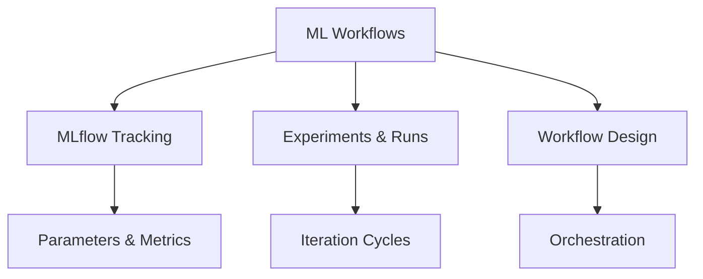

# ML Workflows (29% of Exam)

Understanding machine learning experimentation workflows, MLflow tracking, and iteration processes.

## Topics Overview

## Section Contents

| File | Topic | Priority |
| :--- | :--- | :--- |
| [01-mlflow-tracking.md](01-mlflow-tracking.md) | MLflow concepts, logging, tracking APIs | High |
| [02-experiments-runs.md](02-experiments-runs.md) | Creating experiments, managing runs, comparing results | High |
| [03-ml-experimentation-workflow.md](03-ml-experimentation-workflow.md) | Experimentation strategies, iteration, best practices | High |

## Key Concepts

- **MLflow Tracking**: Logging parameters, metrics, artifacts, and models
- **Experiments**: Organized collection of runs
- **Runs**: Individual model training execution with metadata
- **Metrics**: Quantitative performance measurements
- **Parameters**: Model hyperparameters and configurations

## Related Resources

- [MLflow Basics](../../../shared/fundamentals/mlflow-basics.md)
- [ML Workspace](../01-databricks-ml/01-databricks-ml-workspace.md)
- [Spark ML Pipelines](../03-feature-engineering/01-spark-ml-pipelines.md)

## Next Steps

Progress to [03-Feature Engineering](../03-feature-engineering/README.md) to learn about building features for ML models.

---

**[← Back to Certification](../README.md)**
