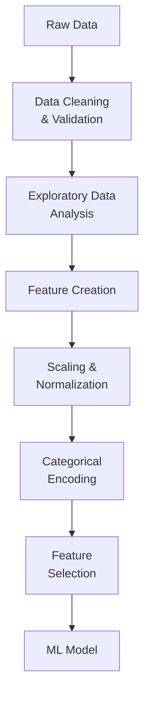

# Feature Engineering Techniques

## Overview

Feature engineering transforms raw data into meaningful features that improve model performance. It's often the most impactful component of machine learning.

## Feature Engineering Pipeline



## Handling Missing Values

### **Removal vs Imputation**

```python
from pyspark.ml.feature import Imputer
from pyspark.sql import functions as F

df = spark.read.table("data")

# Option 1: REMOVE rows with missing values
# Use if: Missing data is rare (< 5%)

df_clean = df.dropna()

# Option 2: REMOVE columns with too many missing values
# Use if: Column has > 50% missing

df_clean = df.select([c for c in df.columns if df.filter(F.col(c).isNull()).count() / df.count() < 0.5])

# Option 3: IMPUTATION - Replace missing values
# Mean imputation

imputer = Imputer(
    inputCols=["age", "income", "tenure"],
    outputCols=["age", "income", "tenure"],
    strategy="mean"  # or "median"
)
df_imputed = imputer.fit(df).transform(df)

# Forward/backward fill (for time series)

from pyspark.sql.window import Window
window = Window.orderBy("date").rowsBetween(-1, 0)
df_filled = df.withColumn("value_filled", F.coalesce(
    F.col("value"),
    F.last(F.col("value"), ignorenulls=True).over(window)
))

# Domain-specific imputation

df_imputed = df.withColumn("category",
    F.when(F.col("category").isNull(), "Unknown")
     .otherwise(F.col("category"))
)
```

## Categorical Encoding

### **String Indexer**

```python
from pyspark.ml.feature import StringIndexer

# Converts categories to indices (0, 1, 2, ...)

indexer = StringIndexer(
    inputCol="region",
    outputCol="region_idx",
    handleInvalid="keep",  # Map unknown to separate index
    stringOrderType="frequencyAsc"  # Frequent categories get lower indices
)

# Frequency-based ordering: most frequent gets index 0
# Alphabetical ordering: alphabetically first gets index 0

indexed_df = indexer.fit(df).transform(df)

# Example output:
# region = ["North", "South", "North", "East", "South"]
# region_idx = [1, 2, 1, 0, 2]  # East is most frequent (index 0)

```

### **One-Hot Encoder**

```python
from pyspark.ml.feature import OneHotEncoder

# Converts indices to binary vectors (one-hot)

encoder = OneHotEncoder(
    inputCols=["region_idx"],
    outputCols=["region_vec"],
    dropLast=True  # Drop one column to avoid multicollinearity
)

encoded_df = encoder.fit(df).transform(df)

# Example (with 3 categories and dropLast=True):
# region_idx = 0 → region_vec = [1, 0]
# region_idx = 1 → region_vec = [0, 1]
# region_idx = 2 → region_vec = [0, 0]

```

### **Target Encoding**

```python

# Replace category with target variable mean
# Use when: High cardinality categories

df_with_target = df.select("region", "label")

# Calculate mean target value for each region

target_encoding = (df_with_target
    .groupBy("region")
    .agg(F.mean("label").alias("region_target_mean"))
)

# Join back to original data

df_target_encoded = (df
    .join(target_encoding, "region")
    .drop("region")
    .withColumnRenamed("region_target_mean", "region_encoded")
)

# Problem: Risk of target leakage if not careful
# Solution: Fit encoding on training set, apply to test set

```

### **Ordinal/Label Encoding**

```python

# Use when: Categories have natural order

# Manual mapping for ordinal data

from pyspark.sql.functions import when, col

df_encoded = df.withColumn("size_encoded",
    when(col("size") == "small", 1)
    .when(col("size") == "medium", 2)
    .when(col("size") == "large", 3)
    .otherwise(0)
)

# Or use StringIndexer with custom order

indexer = StringIndexer(
    inputCol="size",
    outputCol="size_idx",
    stringOrderType="frequencyAsc"  # Control ordering
).fit(df.select("size").distinct())
```

## Numerical Feature Scaling

### **StandardScaler**

```python
from pyspark.ml.feature import VectorAssembler, StandardScaler

# Standardize: (x - mean) / std → mean=0, std=1
# Best for: Linear models, Neural Networks, KMeans

assembler = VectorAssembler(inputCols=["age", "income"], outputCol="features")
scaler = StandardScaler(
    inputCol="features",
    outputCol="scaledFeatures",
    withMean=True,     # Center to mean=0
    withStd=True       # Scale to std=1
)

pipeline = Pipeline(stages=[assembler, scaler])
df_scaled = pipeline.fit(df).transform(df)

# Benefits:
# - Prevents feature dominance
# - Speeds up convergence
# - Better for regularization (L1, L2)

```

### **MinMaxScaler**

```python
from pyspark.ml.feature import MinMaxScaler

# Scale to [min, max] range (default: [0, 1])

scaler = MinMaxScaler(
    inputCol="features",
    outputCol="scaledFeatures",
    min=0,
    max=1
)

df_scaled = scaler.fit(df).transform(df)

# Formula: (x - min(x)) / (max(x) - min(x))
# Best for: Tree models don't need scaling, but they use it for NN input
# Sensitive to outliers

```

### **RobustScaler (Manual)**

```python

# Use for data with outliers
# (x - median) / IQR

from pyspark.sql.functions import percentile_approx, col

# Calculate percentiles

percentiles = df.agg(
    percentile_approx("age", 0.25).alias("q1"),
    percentile_approx("age", 0.75).alias("q3")
)

q1 = percentiles.collect()[0]["q1"]
q3 = percentiles.collect()[0]["q3"]
iqr = q3 - q1

# Scale using IQR

df_scaled = df.withColumn("age_scaled", (col("age") - q1) / iqr)
```

## Feature Interactions

### **Creating Interaction Features**

```python
from pyspark.sql.functions import col

# Polynomial interaction

df_interactions = df.withColumn("age_income_interaction", col("age") * col("income"))
df_interactions = df_interactions.withColumn("income_squared", col("income") ** 2)

# Polynomial expansion

from pyspark.ml.feature import PolynomialExpansion

poly = PolynomialExpansion(
    inputCol="features",
    outputCol="polyFeatures",
    degree=2  # Create degree-2 polynomials
)

# For features [a, b]:
# Output: [a, b, a², ab, b²]

```

### **Feature Ratios**

```python
# Engineer domain-specific features

df_ratios = (df
    .withColumn("charge_per_tenure", col("monthly_charge") / (col("tenure") + 1))
    .withColumn("total_charge_ratio", col("total_charges") / (col("monthly_charge") + 1))
    .withColumn("service_diversity", col("num_services") / col("account_age"))
)
```

## Feature Selection

### **Filtering by Variance**

```python
from pyspark.ml.feature import VarianceThresholdSelector

# Remove low-variance features (likely not predictive)

selector = VarianceThresholdSelector(
    featuresCol="features",
    outputCol="selectedFeatures",
    varianceThreshold=0.01  # Remove if variance < 0.01
)

df_selected = selector.fit(df).transform(df)
```

### **Correlation Analysis**

```python
# Select features with high correlation to target

from pyspark.sql.functions import corr

correlations = {}
for col_name in numeric_cols:
    corr_value = df.stat.corr(col_name, "label")
    if abs(corr_value) > 0.1:  # Keep if |correlation| > 0.1
        correlations[col_name] = corr_value

print("Important features:", correlations)
```

### **Recursive Feature Elimination (Manual)**

```python
# Iteratively remove least important features

from pyspark.ml.classification import RandomForestClassifier

def rfe_step(df, target_features):
    """Remove least important feature"""
    rf = RandomForestClassifier(
        numTrees=100,
        labelCol="label",
        maxDepth=10
    )

    assembler = VectorAssembler(inputCols=target_features, outputCol="features")
    df_with_features = assembler.transform(df)

    model = rf.fit(df_with_features)

    # Get feature importance
    feature_importance = {}
    for i, feat in enumerate(target_features):
        feature_importance[feat] = model.featureImportances[i]

    # Remove least important
    least_important = min(feature_importance, key=feature_importance.get)
    return [f for f in target_features if f != least_important]

# Iteratively remove until desired number reached

features = numeric_cols.copy()
while len(features) > 10:
    features = rfe_step(df, features)
```

## Temporal Features

### **Time-Based Feature Engineering**

```python
from pyspark.sql.functions import col, dayofweek, dayofyear, month, year, hour
from pyspark.sql.types import TimestampType

df_temporal = (df
    # Basic temporal
    .withColumn("date", col("timestamp").cast(TimestampType()))
    .withColumn("year", year(col("date")))
    .withColumn("month", month(col("date")))
    .withColumn("day_of_week", dayofweek(col("date")))  # 1=Sunday, 7=Saturday
    .withColumn("day_of_year", dayofyear(col("date")))
    .withColumn("hour", hour(col("date")))

    # Derived
    .withColumn("is_weekend", (col("day_of_week").isin([1, 7])).cast("int"))
    .withColumn("is_business_hours", ((col("hour") >= 9) & (col("hour") <= 17)).cast("int"))
    .withColumn("is_month_start", (col("day_of_month") <= 3).cast("int"))
)
```

### **Lag and Lead Features**

```python
from pyspark.sql.window import Window

# Create lag features (previous values)

window = Window.partitionBy("customer_id").orderBy("date").rowsBetween(-1, -1)

df_lag = (df
    .withColumn("prev_value", F.lag("value").over(window))
    .withColumn("prev_prev_value", F.lag("value", 2).over(window))
)

# Create rolling statistics

window_rolling = Window.partitionBy("customer_id").orderBy("date").rowsBetween(-6, 0)

df_rolling = (df
    .withColumn("rolling_mean_7", F.mean("value").over(window_rolling))
    .withColumn("rolling_std_7", F.stddev("value").over(window_rolling))
)
```

## Text Feature Extraction

### **TF-IDF (Term Frequency - Inverse Document Frequency)**

```python
from pyspark.ml.feature import Tokenizer, CountVectorizer, IDF

# Tokenize text

tokenizer = Tokenizer(inputCol="text", outputCol="words")

# Count word frequencies

cv = CountVectorizer(
    inputCol="words",
    outputCol="rawFeatures",
    vocabSize=1000,  # Top 1000 words
    minDF=2  # Appear in at least 2 docs
)

# TF-IDF

idf = IDF(inputCol="rawFeatures", outputCol="features")

# Pipeline it

pipeline = Pipeline(stages=[tokenizer, cv, idf])
features = pipeline.fit(df).transform(df)
```

## Feature Engineering Checklist

```python
checklist = {
    "Data Cleaning": [
        "✓ Handle missing values",
        "✓ Detect outliers",
        "✓ Fix data type issues",
        "✓ Handle duplicates"
    ],
    "Encoding": [
        "✓ Encode categorical variables",
        "✓ Handle high-cardinality categories",
        "✓ Check for multicollinearity",
        "✓ Avoid target leakage"
    ],
    "Scaling": [
        "✓ Normalize/standardize numeric features",
        "✓ Handle different units",
        "✓ Consider outlier sensitivity",
        "✓ Fit on train, apply to test"
    ],
    "Engineering": [
        "✓ Create domain-specific features",
        "✓ Extract temporal patterns",
        "✓ Create feature interactions",
        "✓ Document feature creation"
    ],
    "Selection": [
        "✓ Remove low-variance features",
        "✓ Check feature importance",
        "✓ Handle multicollinearity",
        "✓ Domain expert validation"
    ]
}
```

## Real-World Example: Customer Feature Engineering

```python
%python
from pyspark.sql import functions as F
from pyspark.ml import Pipeline
from pyspark.ml.feature import StringIndexer, OneHotEncoder, VectorAssembler, StandardScaler

# Load raw customer data

df_raw = spark.read.table("raw.customers")

# STEP 1: Impute missing values

df_imputed = (df_raw
    .withColumn("income", F.when(F.col("income").isNull(), F.mean("income").over()).otherwise(F.col("income")))
    .withColumn("region", F.when(F.col("region").isNull(), "Unknown").otherwise(F.col("region")))
)

# STEP 2: Create features

df_featured = (df_imputed
    .withColumn("tenure_days", F.datediff(F.current_date(), F.col("signup_date")))
    .withColumn("monthly_usage_ratio", F.col("monthly_usage") / (F.col("historical_usage") + 1))
    .withColumn("is_high_value", (F.col("annual_revenue") > 50000).cast("int"))
)

# STEP 3: Categorical encoding + scaling

pipeline = Pipeline(stages=[
    StringIndexer(inputCol="region", outputCol="region_idx"),
    StringIndexer(inputCol="segment", outputCol="segment_idx"),
    OneHotEncoder(inputCols=["region_idx", "segment_idx"],
                  outputCols=["region_vec", "segment_vec"]),
    VectorAssembler(inputCols=["tenure_days", "monthly_usage_ratio",
                               "is_high_value", "region_vec", "segment_vec"],
                   outputCol="features"),
    StandardScaler(inputCol="features", outputCol="scaledFeatures")
])

df_engineered = pipeline.fit(df_featured).transform(df_featured)

# STEP 4: Save for modeling

(df_engineered.select("customer_id", "scaledFeatures", "label")
    .write.mode("overwrite")
    .saveAsTable("ml_ready.customer_features"))
```

## Use Cases

- **Customer Churn Prediction Pipeline**: Engineering features like tenure-to-charge ratio, rolling 7-day usage averages, and weekend activity flags from raw customer data, then assembling them into a Spark ML Pipeline for model training.
- **High-Cardinality Categorical Handling**: Using target encoding for a `zip_code` column with 40,000 distinct values where one-hot encoding would create too many sparse features, while carefully fitting the encoding only on training data to avoid leakage.

## Common Issues & Errors

### Feature Leakage Causing Unrealistic Metrics

**Scenario:** Model scores 99% accuracy in training but performs poorly in production.
**Fix:** Check for target leakage -- ensure no features are derived from the target variable or future data. Fit transformers (scalers, encoders, imputers) only on training data, then apply the fitted transformer to test data.

### OneHotEncoder Fails on Unseen Categories at Inference Time

**Scenario:** `StringIndexer` raises an error when production data contains a category value not seen during training (e.g., a new `region` value).
**Fix:** Set `handleInvalid="keep"` on the `StringIndexer` to map unknown categories to a separate index rather than throwing an error.

## Exam Tips

- Impute when missing data is moderate (<50%); drop columns when >50% missing; drop rows when <5% missing
- The required sequence is `StringIndexer` (string to numeric index) then `OneHotEncoder` (index to binary vector) -- OHE cannot accept raw strings
- `StandardScaler` is essential for distance-based models (logistic regression, SVM, KMeans) but unnecessary for tree-based models (Random Forest, XGBoost)
- Target encoding risks data leakage -- always fit encoding on training data only, never on the full dataset including test
- `VectorAssembler` combines multiple feature columns into a single `features` vector column required by Spark ML estimators
- `dropLast=True` on `OneHotEncoder` removes one column to prevent multicollinearity in linear models

## Key Takeaways

- Feature engineering often more impactful than algorithm choice
- Missing value handling depends on percentage missing
- Categorical encoding requires careful ordering
- Scaling essential for distance-based and linear models
- Feature interactions capture non-linear relationships
- Always fit transformations on training data, apply to test
- Domain knowledge crucial for creating meaningful features

## Related Topics

- [Spark ML Pipelines](01-spark-ml-pipelines.md)
- [Feature Store](03-feature-store.md)
- [Feature Engineering Basics](../../../shared/fundamentals/feature-engineering-basics.md)

## Official Documentation

- [Spark ML Features](https://spark.apache.org/docs/latest/ml-features.html)
- [Feature Engineering Guide](https://docs.databricks.com/machine-learning/feature-engineering/index.html)

---

**[← Previous: Spark ML Pipelines](./01-spark-ml-pipelines.md) | [↑ Back to Feature Engineering](./README.md) | [Next: Databricks Feature Store](./03-feature-store.md) →**
