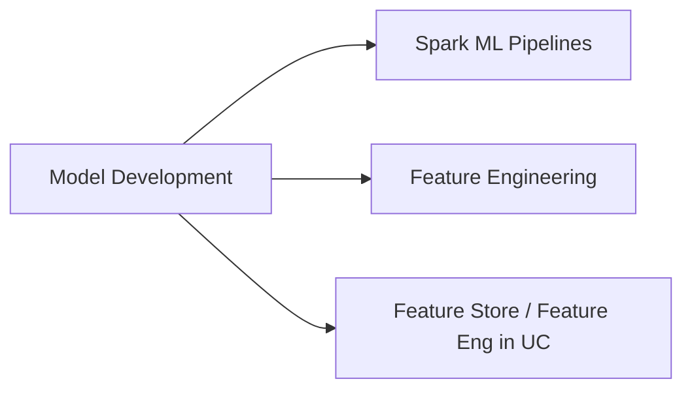

# Model Development (31 % of Exam)

Second-largest domain. Covers Spark ML pipelines, feature engineering techniques (encoders, scalers, vectorisation), and the Databricks Feature Store / Feature Engineering in Unity Catalog for managing reusable features at scale.

## Topics Overview

## Section Contents

| File | Topic | Priority |
| :--- | :--- | :--- |
| [01-spark-ml-pipelines.md](./01-spark-ml-pipelines.md) | Pipeline / Estimator / Transformer / Model classes | High |
| [02-feature-engineering-techniques.md](./02-feature-engineering-techniques.md) | Encoding, scaling, imputation, vector assembly | High |
| [03-feature-store.md](./03-feature-store.md) | Feature tables in UC, point-in-time lookups, training-serving skew | High |

## Key Concepts

| Concept | Why it matters |
| :--- | :--- |
| **`pyspark.ml.Pipeline`** | Composable Estimator + Transformer stages |
| **`StringIndexer` + `OneHotEncoder`** | Standard categorical encoding pair |
| **`VectorAssembler`** | Combines feature columns into a single vector column for ML |
| **Feature Engineering in UC** | UC-native feature tables (replaces the standalone Feature Store) |
| **Point-in-time lookup** | Ensures training data uses feature values as they existed at the event timestamp |
| **Training-serving skew** | Same feature must be computed identically online and offline — the Feature Store enforces this |

## Related Resources

- [Feature Engineering Basics (shared)](../../../shared/fundamentals/feature-engineering-basics.md)
- [PySpark API cheat sheet (shared)](../../../shared/cheat-sheets/pyspark-api-quick-ref.md)
- [Feature Engineering in Unity Catalog documentation](https://docs.databricks.com/en/machine-learning/feature-store/index.html)

---

**[← Previous: Databricks Machine Learning](../01-databricks-machine-learning/README.md) | [↑ Back to ML Associate](../README.md) | [Next: ML Workflows →](../03-ml-workflows/README.md)**
