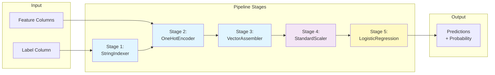

# Spark ML Pipelines

## Overview

Spark ML Pipelines provide a high-level API for building reproducible machine learning workflows. They standardize the process of feature engineering, training, and prediction.

## Pipeline Architecture



## Core Concepts

### **Transformers**

Transformers convert input DataFrames to output DataFrames. They have a `transform()` method.

```python
from pyspark.ml.feature import StandardScaler, OneHotEncoder, VectorAssembler
from pyspark.ml import Transformer

# Create a transformer

scaler = StandardScaler(
    inputCol="features",
    outputCol="scaledFeatures"
)

# Transform data

scaled_df = scaler.transform(df)

# Common Transformers:

transformers = {
    "StringIndexer": "Convert categories to indices",
    "OneHotEncoder": "One-hot encode categorical features",
    "VectorAssembler": "Combine features into single vector",
    "StandardScaler": "Scale numeric features to mean=0, std=1",
    "MinMaxScaler": "Scale features to [0, 1] range",
    "Bucketizer": "Discretize continuous columns into buckets",
    "PolynomialExpansion": "Generate polynomial features"
}
```

### **Estimators**

Estimators learn from data using `fit()` method, then produce transformers.

```python
from pyspark.ml.classification import LogisticRegression, RandomForestClassifier
from pyspark.ml.regression import LinearRegression
from pyspark.ml.feature import StringIndexer
from pyspark.ml import Estimator

# Create an estimator

lr = LogisticRegression(
    features="features",
    labelCol="label",
    maxIter=10
)

# Fit to learn parameters

model = lr.fit(df)  # Returns a Transformer

# Use the model to transform

predictions = model.transform(test_df)

# Common Estimators:

estimators = {
    "LogisticRegression": "Binary/Multi-class classification",
    "RandomForestClassifier": "Tree-based classification",
    "LinearRegression": "Regression with linear modeling",
    "GBTClassifier": "Gradient boosted trees for classification",
    "StringIndexer": "Learn category mappings",
    "CountVectorizer": "Learn word counts from text"
}
```

### **Pipelines**

Pipelines chain multiple stages (estimators and transformers) in sequence.

```python
from pyspark.ml import Pipeline

# Define stages

stages = [
    StringIndexer(inputCol="category", outputCol="category_idx"),
    OneHotEncoder(inputCols=["category_idx"], outputCols=["category_vec"]),
    VectorAssembler(inputCols=["category_vec", "numeric"], outputCol="features"),
    StandardScaler(inputCol="features", outputCol="scaledFeatures"),
    LogisticRegression(featuresCol="scaledFeatures", labelCol="label")
]

# Create pipeline

pipeline = Pipeline(stages=stages)

# Fit pipeline (learns all estimators)

fitted_pipeline = pipeline.fit(training_df)

# Transform new data

predictions = fitted_pipeline.transform(test_df)

# KEY INSIGHT: Pipeline handles all transformations automatically!

```

## Complete ML Pipeline Example

### **Binary Classification Pipeline**

```python
%python
from pyspark.ml import Pipeline
from pyspark.ml.feature import StringIndexer, OneHotEncoder, VectorAssembler, StandardScaler
from pyspark.ml.classification import LogisticRegression
from pyspark.sql import functions as F
import mlflow

# LOAD DATA

df = spark.read.table("ml_catalog.data.customer_data")

# DATA PREPARATION
# Create label: convert string to 0/1

df_processed = (df
    .withColumn("label", (F.col("churned") == "yes").cast("int"))
    .drop("churned")
)

# DEFINE PIPELINE STAGES

stages = [
    # Categorical encoding
    StringIndexer(
        inputCol="region",
        outputCol="region_idx",
        handleInvalid="keep"
    ),
    StringIndexer(
        inputCol="plan",
        outputCol="plan_idx",
        handleInvalid="keep"
    ),

    # One-hot encoding
    OneHotEncoder(
        inputCols=["region_idx", "plan_idx"],
        outputCols=["region_vec", "plan_vec"]
    ),

    # Feature assembly
    VectorAssembler(
        inputCols=[
            "region_vec", "plan_vec",
            "age", "tenure", "monthly_charge", "total_charges"
        ],
        outputCol="features"
    ),

    # Feature scaling
    StandardScaler(
        inputCol="features",
        outputCol="scaledFeatures"
    ),

    # Classifier
    LogisticRegression(
        featuresCol="scaledFeatures",
        labelCol="label",
        maxIter=10
    )
]

# CREATE PIPELINE

pipeline = Pipeline(stages=stages)

# SPLIT DATA

train_df, test_df = df_processed.randomSplit([0.8, 0.2], seed=42)

# FIT PIPELINE

fitted_pipeline = pipeline.fit(train_df)

# MAKE PREDICTIONS

predictions = fitted_pipeline.transform(test_df)

# EVALUATE

from pyspark.ml.evaluation import BinaryClassificationEvaluator, MulticlassClassificationEvaluator

evaluator = BinaryClassificationEvaluator(
    labelCol="label",
    rawPredictionCol="rawPrediction",
    metricName="areaUnderROC"
)

auc = evaluator.evaluate(predictions)
print(f"AUC: {auc:.3f}")

# LOG TO MLFLOW

with mlflow.start_run(run_name="logistic_pipeline"):
    mlflow.log_param("model_type", "LogisticRegression")
    mlflow.log_metric("auc", auc)
    mlflow.spark.log_model(fitted_pipeline, "pipeline")
```

## Pipeline Best Practices

### **Handling Missing Values**

```python
from pyspark.ml.feature import Imputer

# Imputed stages in pipeline

imputer = Imputer(
    inputCols=["age", "income", "tenure"],
    outputCols=["age", "income", "tenure"],
    strategy="median"  # or "mean"
)

stages = [imputer, ...other_stages...]
```

### **Categorical Encoding Order**

```python

# IMPORTANT: StringIndexer BEFORE OneHotEncoder

stages = [
    # Step 1: Convert strings to indices (0, 1, 2, ...)
    StringIndexer(inputCol="category", outputCol="category_idx"),

    # Step 2: One-hot encode indices
    OneHotEncoder(inputCols=["category_idx"], outputCols=["category_vec"]),

    # Step 3: Use in model
    VectorAssembler(inputCols=["category_vec", "..."], outputCol="features")
]
```

### **Feature Scaling Strategies**

```python
from pyspark.ml.feature import StandardScaler, MinMaxScaler

# StandardScaler: (x - mean) / std
# Best for: Linear models, Neural Networks, KMeans

standard_scaler = StandardScaler(inputCol="features", outputCol="scaledFeatures")

# MinMaxScaler: (x - min) / (max - min) → [0, 1]
# Best for: Tree models (not needed), Neural Networks

minmax_scaler = MinMaxScaler(inputCol="features", outputCol="scaledFeatures")

# Robust Scaler: (x - median) / IQR
# Best for: Data with outliers

```

### **Feature Selection in Pipeline**

```python
from pyspark.ml.feature import VectorSlicer
from pyspark.ml.stat import ChiSquareTest, Correlation

# Option 1: Manual feature selection

slicer = VectorSlicer(
    inputCol="features",
    outputCol="selectedFeatures",
    indices=[0, 1, 3, 5]  # Select indices 0, 1, 3, 5
)

# Option 2: Use only important features

important_features = ["age", "income", "tenure"]
assembler = VectorAssembler(inputCols=important_features, outputCol="features")
```

## Training and Prediction Workflow

```python
# TRAINING PHASE

train_df = spark.read.table("data.train_set")

pipeline = Pipeline(stages=[...])
fitted_pipeline = pipeline.fit(train_df)

# Save trained pipeline

fitted_pipeline.save("/mnt/models/trained_pipeline")

# PREDICTION PHASE

new_data = spark.read.table("data.new_customers")
predictions = fitted_pipeline.transform(new_data)

# Display only relevant columns

predictions.select("customer_id", "prediction", "probability").show()
```

## Advanced Pipeline Features

### **Pipeline Parameters**

```python
from pyspark.ml import Pipeline, Estimator
from pyspark.ml.param import Params, Param

# Some stages can be configured post-creation

lr = LogisticRegression()
lr.setMaxIter(20).setRegParam(0.1)

# Or passed at creation

lr2 = LogisticRegression(maxIter=20, regParam=0.1)

# Pipeline is just a list of stages - can be modified

stages = [stage1, stage2]
stages.append(stage3)
pipeline = Pipeline(stages=stages)
```

### **Cross-Validation with Pipelines**

```python
from pyspark.ml.tuning import CrossValidator, ParamGridBuilder
from pyspark.ml.evaluation import BinaryClassificationEvaluator

# Define parameter grid

param_grid = (ParamGridBuilder()
    .addGrid(lr.maxIter, [10, 20, 30])
    .addGrid(lr.regParam, [0.01, 0.1, 1.0])
    .build())

# Define evaluator

evaluator = BinaryClassificationEvaluator(
    labelCol="label",
    metricName="areaUnderROC"
)

# Create cross-validator

cv = CrossValidator(
    estimator=pipeline,
    estimatorParamMaps=param_grid,
    evaluator=evaluator,
    numFolds=5
)

# Fit cross-validator

cv_model = cv.fit(train_df)

# Best model automatically selected

best_predictions = cv_model.transform(test_df)
```

### **Pipeline Persistence**

```python
# Save fitted pipeline

fitted_pipeline.save("/dbfs/models/production_pipeline")

# Load and use

from pyspark.ml import PipelineModel
loaded_pipeline = PipelineModel.load("/dbfs/models/production_pipeline")
predictions = loaded_pipeline.transform(new_data)
```

## Comparison: DataFrame Operations vs Pipelines

| Aspect | DataFrame Ops | Pipelines |
|--------|---|---|
| **Reusability** | Code duplication | Reproducible, shareable |
| **Training/Inference** | Manual fit steps | Automatic via transform |
| **Parameter Tuning** | Manual loops | Built-in CrossValidator |
| **Debugging** | Easy to inspect | Less transparent |
| **Production** | Hard to deploy | Easy via MLflow |
| **Best For** | Exploration | Production ML |

## Real-World Pipeline: Customer Churn

```python
%python

# Complete production-ready pipeline

# Load data

df = spark.read.table("production.customer_360.churn_data")

# Prepare

df_ready = df.select([
    F.col("customer_id"),
    F.col("churned").cast("int").alias("label"),
    F.col("age"), F.col("tenure"),
    F.col("monthly_charge"), F.col("total_charges"),
    F.col("region"), F.col("plan_type")
])

# Split

train, test = df_ready.randomSplit([0.8, 0.2], seed=42)

# Build & fit pipeline

pipeline = Pipeline(stages=[
    StringIndexer(inputCol="region", outputCol="region_idx"),
    StringIndexer(inputCol="plan_type", outputCol="plan_idx"),
    OneHotEncoder(inputCols=["region_idx", "plan_idx"],
                  outputCols=["region_vec", "plan_vec"]),
    VectorAssembler(inputCols=["age", "tenure", "monthly_charge",
                               "total_charges", "region_vec", "plan_vec"],
                   outputCol="features"),
    StandardScaler(inputCol="features", outputCol="scaledFeatures"),
    LogisticRegression(featuresCol="scaledFeatures", labelCol="label", maxIter=10)
])

fitted_pipeline = pipeline.fit(train)

# Evaluate

predictions = fitted_pipeline.transform(test)
auc = BinaryClassificationEvaluator(labelCol="label").evaluate(predictions)
print(f"AUC: {auc:.3f}")

# Save

mlflow.spark.log_model(fitted_pipeline, "pipeline")
fitted_pipeline.save("/mnt/production/churn_pipeline")
```

## Use Cases

- **Large Scale Transformations**: Leveraging Spark SQL distributed execution semantics to transform multi-terabyte datasets efficiently.
- **Reproducible Training-to-Serving Pipeline**: Packaging all preprocessing and model steps into a single pipeline so that the same transformations are applied consistently during both training and batch inference.

## Common Issues & Errors

### OOM Errors

**Scenario:** Data skew causes an executor to run out of memory.
**Fix:** Use Adaptive Query Execution (AQE) and review joining logic.

### Pipeline `transform()` Fails on New Data

**Scenario:** A fitted pipeline throws `IllegalArgumentException` when transforming new data with different column names or types.
**Fix:** Ensure the input schema matches exactly what the pipeline was fitted on. Use `StringIndexer(handleInvalid="keep")` for unseen categories.

## Exam Tips

- ✅ Understand Transformer vs Estimator distinction
- ✅ Know pipeline stages are fit in sequence
- ✅ Recognize StringIndexer must come before OneHotEncoder
- ✅ Understand VectorAssembler combines features
- ✅ Know StandardScaler prevents feature dominance
- ✅ Remember pipelines provide reproducibility

## Key Takeaways

- Pipelines chain transformers and estimators for reproducible workflows
- Transformers have `transform()` method (no learning)
- Estimators have `fit()` method (learn parameters)
- Pipelines automatically fit all stages in sequence
- Feature scaling prevents certain features from dominating
- Pipelines enable easy production deployment and A/B testing

## Related Topics

- [Feature Engineering Techniques](02-feature-engineering-techniques.md)
- [Feature Store](03-feature-store.md)
- [MLflow Tracking](../02-ml-workflows/01-mlflow-tracking.md)

## Official Documentation

- [Spark ML Pipelines](https://spark.apache.org/docs/latest/ml-pipeline.html)
- [Databricks ML Guide](https://docs.databricks.com/machine-learning/index.html)

---

**[↑ Back to Feature Engineering](./README.md) | [Next: Feature Engineering Techniques](./02-feature-engineering-techniques.md) →**
