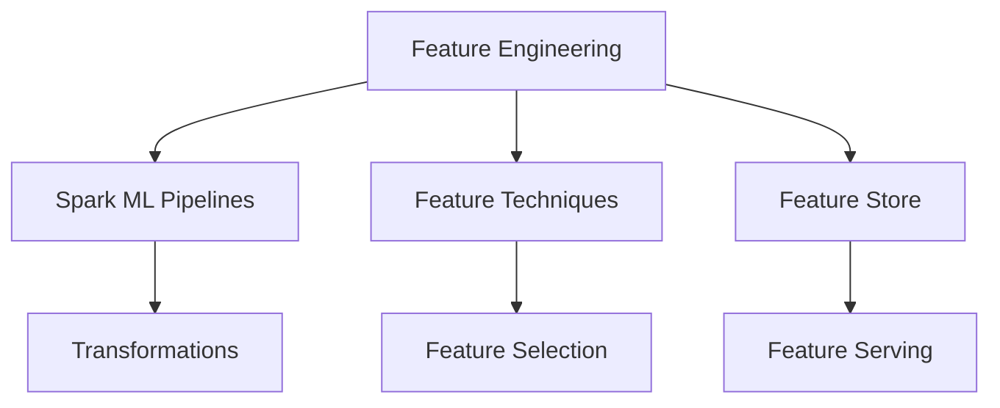

# Feature Engineering (33% of Exam)

Understanding Spark ML pipelines, feature engineering techniques, and feature store architecture.

## Topics Overview

## Section Contents

| File | Topic | Priority |
| :--- | :--- | :--- |
| [01-spark-ml-pipelines.md](01-spark-ml-pipelines.md) | Pipeline architecture, stages, fitting/transforming | High |
| [02-feature-engineering-techniques.md](02-feature-engineering-techniques.md) | Transformations, encoding, scaling, interactions | High |
| [03-feature-store.md](03-feature-store.md) | Databricks Feature Store, feature discovery, serving | High |

## Key Concepts

- **Spark ML Pipelines**: DAG-based workflow for ML transformations
- **Transformers**: Stages that convert DataFrames (e.g., scaling, encoding)
- **Estimators**: Stages that learn from data (e.g., vectorizer)
- **Feature Store**: Centralized repository for reproducible features
- **Feature Discovery**: Finding and reusing features across projects

## Related Resources

- [Feature Engineering Basics](../../../shared/fundamentals/feature-engineering-basics.md)
- [Spark ML Quick Reference](../../../shared/cheat-sheets/pyspark-api-quick-ref.md)
- [Databricks ML](../01-databricks-ml/README.md)

## Next Steps

Progress to [04-MLflow Deployment](../04-mlflow-deployment/README.md) to learn about model deployment and serving.

---

**[← Back to Certification](../README.md)**
