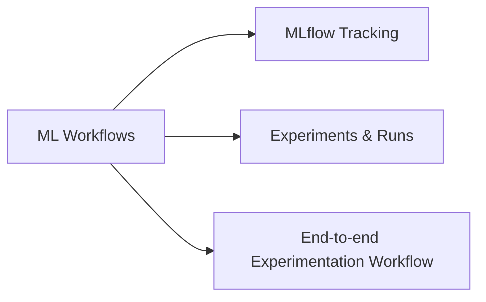

# ML Workflows (19 % of Exam)

Tracking and reproducibility — MLflow experiments and runs, the `autolog` magic, and the broader experimentation workflow from EDA → train → evaluate → register.

## Topics Overview

## Section Contents

| File | Topic | Priority |
| :--- | :--- | :--- |
| [01-mlflow-tracking.md](./01-mlflow-tracking.md) | `mlflow.start_run`, `log_param` / `log_metric` / `log_model`, autologging | High |
| [02-experiments-runs.md](./02-experiments-runs.md) | Experiment UI, comparing runs, searching by metric | High |
| [03-ml-experimentation-workflow.md](./03-ml-experimentation-workflow.md) | EDA → train → evaluate → register loop | High |

## Key Concepts

| Concept | Why it matters |
| :--- | :--- |
| **`mlflow.autolog()`** | One call enables param + metric + model logging for scikit-learn, PyTorch, Spark ML, XGBoost, etc. |
| **Experiment vs Run** | An experiment is a folder; a run is a single trial inside it |
| **`mlflow.start_run(run_name=...)`** | Nest runs for hyperparameter sweeps |
| **Registry alias** | `Production`, `Champion`, `Challenger` aliases on UC-registered model versions (replace the legacy stage system) |

## Related Resources

- [MLflow Basics (shared)](../../../shared/fundamentals/mlflow-basics.md)
- [MLflow cheat sheet (shared)](../../../shared/cheat-sheets/mlflow-quick-ref.md)
- [Hands-on Lab 04 — MLflow tracking and Model Registry in UC](../../../labs/04-mlflow-tracking.md)

---

**[← Previous: Model Development](../02-model-development/README.md) | [↑ Back to ML Associate](../README.md) | [Next: Model Deployment →](../04-model-deployment/README.md)**
