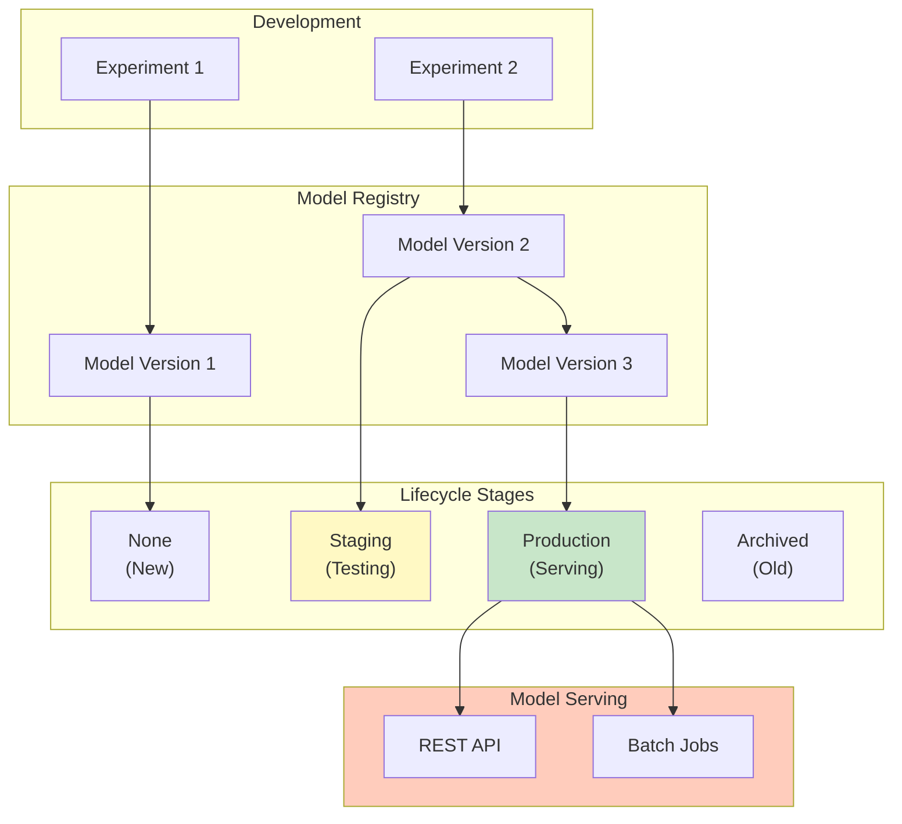
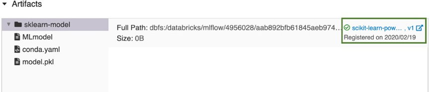

# Model Registry

## Overview

MLflow Model Registry is a centralized repository for machine learning models. It enables versioning, stage transitions, and governance of models across their lifecycle from development to production.

## Model Registry Architecture



## Core Concepts

### **Registering Models**

```python
import mlflow
from mlflow.tracking import MlflowClient

# After training, register model from run

client = MlflowClient()
run_id = "abc123"
model_uri = f"runs:/{run_id}/model"

# Register model

registered_model = client.create_registered_model("customer_churn_model")

# Create version from run

model_version = client.create_model_version(
    name="customer_churn_model",
    source=model_uri,
    run_id=run_id,
    tags={"algorithm": "LogisticRegression"}
)

print(f"Registered model version: {model_version.version}")
```

### **Model Versions**



Each version tracks a specific model artifact and its metadata.

```python
from mlflow.tracking import MlflowClient

client = MlflowClient()

# Get all versions of a model

versions = client.search_model_versions("customer_churn_model")

for v in versions:
    print(f"Version {v.version}:")
    print(f"  Stage: {v.current_stage}")
    print(f"  Created: {v.creation_timestamp}")
    print(f"  Status: {v.status}")
    print(f"  Source: {v.source}")
    print()

# Version metadata

mv = client.get_model_version("customer_churn_model", "3")
print(f"Version 3 tags: {mv.tags}")
print(f"Version 3 metrics: {mv.metrics}")
```

### **Model Stages**

Stages represent where a model is in its lifecycle.

```python
from mlflow.tracking import MlflowClient

client = MlflowClient()

# Stage values

STAGES = {
    "None": "New model, not yet in workflow",
    "Staging": "In testing/validation phase",
    "Production": "Currently serving in production",
    "Archived": "Retired model, kept for history"
}

# Transition model to next stage

client.transition_model_version_stage(
    name="customer_churn_model",
    version="3",
    stage="Staging"
)

# Later, after testing passes

client.transition_model_version_stage(
    name="customer_churn_model",
    version="3",
    stage="Production"
)

# Archive old version

client.transition_model_version_stage(
    name="customer_churn_model",
    version="1",
    stage="Archived"
)
```

## Model Registry Workflow

### **Typical Model Lifecycle**

```python
%python
from mlflow.tracking import MlflowClient
import mlflow

client = MlflowClient()
model_name = "customer_churn_model"

# ========== STEP 1: DEVELOPMENT ==========
# Train model and log to MLflow

print("Step 1: Development")

with mlflow.start_run(run_name="rf_model_v3"):
    # ... training code ...
    mlflow.log_param("n_estimators", 200)
    mlflow.log_metric("val_auc", 0.92)
    mlflow.sklearn.log_model(model, "model")

    run_id = mlflow.active_run().info.run_id

# ========== STEP 2: REGISTER ==========
# Register model to registry

print("\nStep 2: Register Model")

model_uri = f"runs:/{run_id}/model"
registered_model = client.create_registered_model(model_name)

mv = client.create_model_version(
    name=model_name,
    source=model_uri,
    run_id=run_id,
    description="Random Forest with 200 trees and historical features"
)

print(f"Registered {model_name} version {mv.version}")

# ========== STEP 3: STAGE TO STAGING ==========
# Move to staging for testing

print("\nStep 3: Stage for Testing")

client.transition_model_version_stage(
    name=model_name,
    version=mv.version,
    stage="Staging",
    archive_existing_versions=False
)

print(f"Version {mv.version} moved to Staging")

# ========== STEP 4: RUN TESTS ==========
# Automated tests in staging

print("\nStep 4: Validate in Staging")

import subprocess
test_results = subprocess.run(
    ["pytest", "tests/model_validation.py", f"--model-version={mv.version}"],
    capture_output=True
)

if test_results.returncode == 0:
    print("✓ All tests passed!")
    promote_to_production = True
else:
    print("✗ Tests failed")
    promote_to_production = False

# ========== STEP 5: PROMOTE TO PRODUCTION ==========

if promote_to_production:
    print("\nStep 5: Promote to Production")

    # Archive previous production version if exists
    try:
        current_prod = client.get_latest_versions(
            model_name, stages=["Production"]
        )[0]
        if current_prod.version != mv.version:
            client.transition_model_version_stage(
                name=model_name,
                version=current_prod.version,
                stage="Archived"
            )
    except:
        pass

    # Promote to production
    client.transition_model_version_stage(
        name=model_name,
        version=mv.version,
        stage="Production"
    )

    print(f"✓ Version {mv.version} is now in Production!")

# ========== STEP 6: LOAD AND SERVE ==========

print("\nStep 6: Load Production Model")

prod_model_uri = f"models:/{model_name}/Production"
model = mlflow.sklearn.load_model(prod_model_uri)

print(f"Loaded production model: {prod_model_uri}")
```

## Managing Model Versions

### **Setting and Clearing Stages**

```python
from mlflow.tracking import MlflowClient

client = MlflowClient()

# Get model with specific stage

prod_versions = client.get_latest_versions(
    "customer_churn_model",
    stages=["Production"]
)

# Check if version exists in stage

if prod_versions:
    prod_mv = prod_versions[0]
    print(f"Production model: v{prod_mv.version}")
else:
    print("No production model!")

# Clear stage (move to None)

client.transition_model_version_stage(
    name="customer_churn_model",
    version="2",
    stage="Archived"
)
```

### **Adding Metadata**

```python
from mlflow.tracking import MlflowClient

client = MlflowClient()

# Add tags to version

client.set_model_version_tag(
    name="customer_churn_model",
    version="3",
    key="algorithm",
    value="RandomForest"
)

client.set_model_version_tag(
    name="customer_churn_model",
    version="3",
    key="training_date",
    value="2025-02-20"
)

client.set_model_version_tag(
    name="customer_churn_model",
    version="3",
    key="performance_tier",
    value="high"
)

# Add descriptions

client.update_model_version(
    name="customer_churn_model",
    version="3",
    description="High-performance RF model with 92% AUC, trained on 6M+ records"
)
```

## Loading Models from Registry

### **Using Model URI**

```python
import mlflow

# Load latest production model

model = mlflow.sklearn.load_model(
    "models:/customer_churn_model/Production"
)

# Load specific version

model_v2 = mlflow.sklearn.load_model(
    "models:/customer_churn_model/2"
)

# Make predictions

predictions = model.predict(X_test)
```

### **Programmatic Lookup**

```python
from mlflow.tracking import MlflowClient
import mlflow

client = MlflowClient()

# Get latest production version

prod_versions = client.get_latest_versions("customer_churn_model", stages=["Production"])
if prod_versions:
    version = prod_versions[0].version
    model_uri = f"models:/customer_churn_model/{version}"
    model = mlflow.sklearn.load_model(model_uri)
    print(f"Loaded version {version}")
```

## Model Registry with Unity Catalog

### **UC-Based Model Registry**

```python
import mlflow

# Register model in Unity Catalog

mlflow.set_registry_uri("databricks-uc")

# Log model (automatically goes to UC)

with mlflow.start_run():
    mlflow.sklearn.log_model(
        model,
        artifact_path="model",
        registered_model_name="ml_models.models.churn_predictor"
    )

# Load from UC

model = mlflow.sklearn.load_model(
    "models:/ml_models.models.churn_predictor/Production"
)
```

## Advanced Registry Features

### **Aliases for Semantic Versioning**

```python
from mlflow.tracking import MlflowClient

client = MlflowClient()

# Set aliases instead of stages
# Enables more flexible naming

client.set_registered_model_alias(
    name="customer_churn_model",
    alias="champion",  # Current production model
    version="3"
)

client.set_registered_model_alias(
    name="customer_churn_model",
    alias="challenger",  # Competing model in testing
    version="4"
)

# Load by alias

champion = mlflow.sklearn.load_model("models:/customer_churn_model@champion")
```

### **Automatic Stage Transitions**

```python

# Setup policies for automatic transitions
# (Example from MLflow documentation)

# When to auto-promote:
# - Model passes validation tests
# - Baseline performance threshold met
# - A/B test shows improvement

promotion_criteria = {
    "staging_to_prod": {
        "auc_threshold": 0.85,
        "f1_threshold": 0.80,
        "test_duration_days": 7
    }
}
```

## Best Practices for Model Registry

### **Naming Conventions**

```python
# Clear, semantic names

good_names = [
    "customer_churn_classifier",
    "revenue_forecaster",
    "product_recommendation_model",
    "fraud_detection_xgboost"
]

# Avoid generic names

bad_names = [
    "model1",
    "test_model",
    "v2",
    "final_model_2"
]

# Model name = consistent across versions
# Versions = different runs/iterations

```

### **Versioning Strategy**

```python
# Track what changed between versions

version_notes = {
    "1": "Baseline logistic regression",
    "2": "Added feature interactions",
    "3": "Hyperparameter tuning, 92% AUC",
    "4": "Ensemble with RF, 94% AUC",
    "5": "XGBoost with GPU acceleration, 95% AUC"
}

# Add to description

client.update_model_version(
    name="customer_churn_model",
    version="5",
    description="XGBoost with GPU acceleration, AUC: 95%. Improvement: reduced inference time by 60%"
)
```

### **Stage Transition Approval**

```python

# Implement approval workflow

def request_production_promotion(model_name, version):
    """Send promotion request"""
    client.set_model_version_tag(
        name=model_name,
        version=version,
        key="promotion_requested",
        value="true"
    )

    # Notify approvers (via email, Slack, etc.)
    notify_approvers(model_name, version)

def approve_promotion(model_name, version):
    """Approve and promote to production"""
    # Check if approved by required reviewers
    if has_required_approvals(model_name, version):
        client.transition_model_version_stage(
            name=model_name,
            version=version,
            stage="Production"
        )
        print(f"✓ {model_name} v{version} promoted to Production")
    else:
        print("✗ Not enough approvals")
```

## Comparison: Model Registry vs Manual Model Management

| Aspect | Registry | Manual |
|--------|----------|--------|
| **Versioning** | Automatic | Manual tracking |
| **Stage Tracking** | Built-in stages | Custom tracking |
| **Discoverability** | Searchable registry | Scattered files |
| **Reproducibility** | Model URI guarantees | Fragile |
| **Collaboration** | Teams can share | Limited sharing |
| **Audit Trail** | Complete history | No tracking |
| **Deployment** | Smooth transitions | Error-prone |

## Real-World Example

```python
%python
from mlflow.tracking import MlflowClient
import mlflow

client = MlflowClient()

# Company ML-Ops workflow

# Data scientist trains and registers model

print("=== Data Scientist ===")
with mlflow.start_run(run_name="monthly_retraining"):
    # ... training code ...
    mlflow.sklearn.log_model(model, "model")
    run_id = mlflow.active_run().info.run_id

mv = client.create_model_version(
    "production_churn_model",
    f"runs:/{run_id}/model",
    run_id=run_id
)
print(f"Registered v{mv.version}")

# ML-Ops promotes to staging

print("\n=== ML-Ops Engineer ===")
client.transition_model_version_stage(
    "production_churn_model", mv.version, "Staging"
)
print(f"v{mv.version} moved to Staging for testing")

# Automated tests run

print("\n=== CI/CD Pipeline ===")
# Run integration tests, performance benchmarks, etc.

tests_pass = run_validation_tests(mv.version)

if tests_pass:
    # 4. Approve for production
    client.transition_model_version_stage(
        "production_churn_model", mv.version, "Production"
    )
    print(f"✓ v{mv.version} promoted to Production")
else:
    print(f"✗ v{mv.version} failed tests, staying in Staging")
```

## Use Cases

- **End-to-End MLOps Pipeline**: Tying model training, evaluation, and registry together to establish a reproducible lifecycle.
- **Governed Model Promotion Workflow**: Using stage transitions (None to Staging to Production to Archived) with approval gates to ensure only validated models reach production serving.

## Common Issues & Errors

### Artifact Access Denied

**Scenario:** Models fail to load from MLflow registry during serving.
**Fix:** Check Unity Catalog permissions or traditional workspace access controls on the underlying storage.

### Model Registration Fails in Unity Catalog

**Scenario:** `mlflow.register_model()` fails with `RESOURCE_DOES_NOT_EXIST`.
**Fix:** Set `mlflow.set_registry_uri("databricks-uc")` before registration. Ensure the target catalog and schema exist and you have `CREATE MODEL` permission.

## Exam Tips

- ✅ Understand Model Registry purpose: centralized model management
- ✅ Know version tracking enables easy rollbacks
- ✅ Recognize stages: None → Staging → Production → Archived
- ✅ Understand model URIs for reproducible loading
- ✅ Know transition_model_version_stage for stage changes
- ✅ Remember aliases for semantic naming

## Key Takeaways

- Model Registry centralizes model lifecycle management
- Versions track model iterations with full metadata
- Stages represent where model is in lifecycle
- Aliases enable semantic versioning and A/B testing
- Stage transitions enable approval workflows
- Model URIs (models:/name/stage) enable reproducible production serving
- Registry integration with MLflow Tracking enables full lineage

## Related Topics

- [MLflow Tracking](../02-ml-workflows/01-mlflow-tracking.md)
- [Model Deployment & Serving](02-model-deployment-serving.md)
- [Experiments & Runs](../02-ml-workflows/02-experiments-runs.md)

## Official Documentation

- [MLflow Model Registry](https://mlflow.org/docs/latest/model-registry.html)
- [Model Management](https://docs.databricks.com/mlflow/model-registry/index.html)

---

**[↑ Back to MLflow Deployment](./README.md) | [Next: Model Deployment & Serving](./02-model-deployment-serving.md) →**
