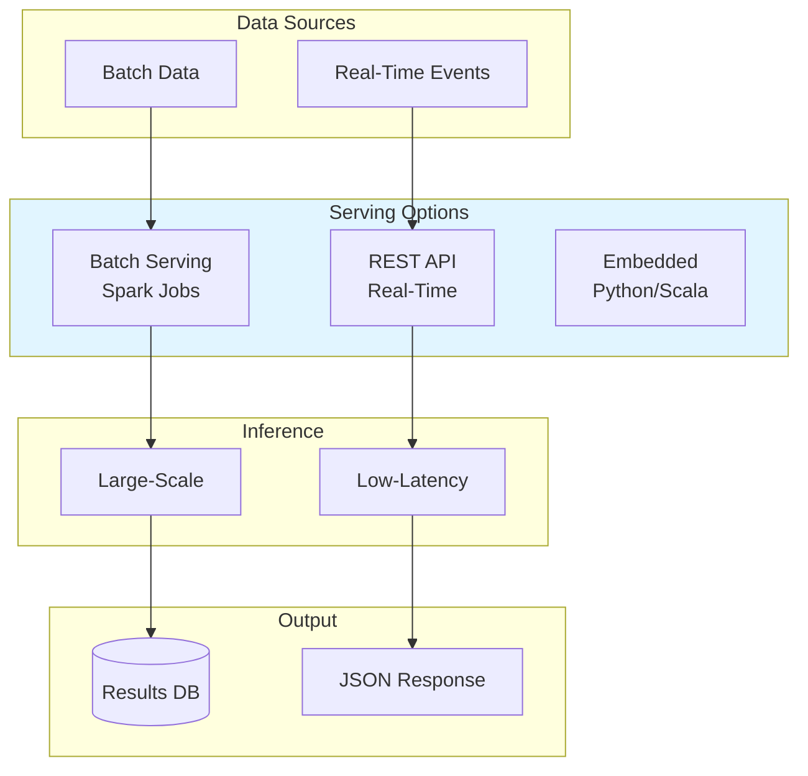
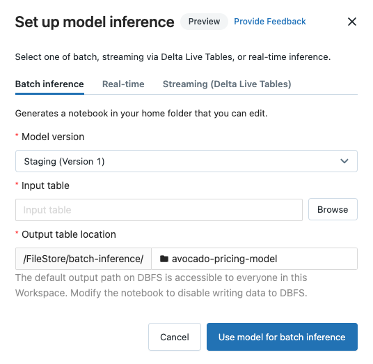
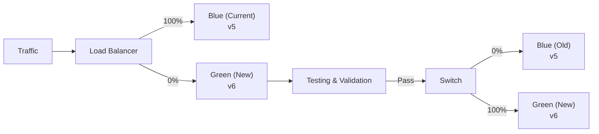

# Model Deployment & Serving

## Overview

Model deployment transitions trained models from development to production. Databricks provides multiple serving options from batch processing to real-time REST APIs.

## Serving Architecture



## Batch Serving

### **Batch Inference Workflow**

```python
%python
import mlflow
from pyspark.sql import functions as F

# Load production model from registry

model_uri = "models:/customer_churn_model/Production"
model = mlflow.sklearn.load_model(model_uri)

# Load new data for scoring

new_customers = spark.read.table("raw.new_customers")

# Convert to Pandas for inference

new_customers_pdf = new_customers.toPandas()

# Make predictions

predictions = model.predict(new_customers_pdf[feature_columns])
probabilities = model.predict_proba(new_customers_pdf[feature_columns])[:, 1]

# Create results DataFrame

results_df = spark.createDataFrame(
    [(cust_id, pred, prob)
     for cust_id, pred, prob in zip(
         new_customers_pdf["customer_id"],
         predictions,
         probabilities)],
    ["customer_id", "churn_prediction", "churn_probability"]
)

# Save results

results_df.write.mode("overwrite").saveAsTable("predictions.daily_churn_scores")

print(f"Scored {results_df.count()} customers")
```

### **Batch Job Scheduling**

```python
from databricks.sdk import WorkspaceClient
from databricks.sdk.service.jobs import Task, Source, SparkPythonTask

client = WorkspaceClient()

# Create job for batch inference

job_config = {
    "name": "daily_churn_scoring",
    "tasks": [
        Task(
            task_key="score_customers",
            spark_python_task=SparkPythonTask(
                python_file="dbfs:/jobs/batch_scoring.py",
                parameters=["--model_version=Production", "--date=__DATE__"]
            ),
            new_cluster={
                "spark_version": "14.3.x-scala2.12",
                "node_type_id": "i3.xlarge",
                "num_workers": 4,
                "aws_attributes": {"availability": "SPOT"}
            },
            timeout_seconds=3600
        )
    ],
    "schedule": {
        "quartz_cron_expression": "0 2 * * *",  # 2 AM daily
        "timezone_id": "America/Los_Angeles"
    }
}

job = client.jobs.create(**job_config)
print(f"Created job: {job.job_id}")
```

### **Distributed Inference with Pandas UDF**

```python
from pyspark.sql.functions import pandas_udf
import pandas as pd
import mlflow

# Use pandas_udf for distributed inference

@pandas_udf("double")
def predict_churn_udf(batch_df: pd.DataFrame) -> pd.Series:
    # Load model once per partition
    model = mlflow.sklearn.load_model("models:/customer_churn_model/Production")

    # Make predictions
    predictions = model.predict_proba(batch_df[feature_columns])[:, 1]

    return pd.Series(predictions)

# Apply across distributed data

scoring_df = (spark.read.table("raw.customers")
    .repartition(100)  # Parallelize
    .withColumn("churn_score", predict_churn_udf(F.struct([F.col(c) for c in feature_columns])))
)

# Write results

scoring_df.write.mode("overwrite").saveAsTable("predictions.churn_scores")
```

## Real-Time Serving



*Databricks Model Serving endpoint showing environment, compute size, and traffic routing.*

### **Model Serving Endpoints**

```python
from databricks.sdk import WorkspaceClient
from databricks.sdk.service.serving import EndpointCoreConfigInput, ServedModelInput

client = WorkspaceClient()

# Create serving endpoint

endpoint_config = EndpointCoreConfigInput(
    name="churn-model-endpoint",
    served_models=[
        ServedModelInput(
            model_name="customer_churn_model",
            model_version="5",
            workload_size="Small",
            scale_to_zero_enabled=True
        )
    ]
)

endpoint = client.serving_endpoints.create(endpoint_config)
print(f"Endpoint created: {endpoint.name}")
```

### **Making Real-Time Predictions**

```python
import requests
import json

# Get endpoint URL

endpoint_url = "https://databricks-instance.cloud.databricks.com/serving/endpoints/churn-model-endpoint"

# Prepare input

input_data = {
    "dataframe_split": {
        "columns": ["age", "tenure", "monthly_charge", "total_charges"],
        "data": [
            [35, 12, 65.50, 786.00],
            [42, 24, 85.25, 2046.00],
            [28, 3, 45.00, 135.00]
        ]
    }
}

# Get API token

import os
api_token = os.environ.get("DATABRICKS_TOKEN")

# Make prediction request

headers = {
    "Authorization": f"Bearer {api_token}",
    "Content-Type": "application/json"
}

response = requests.post(
    f"{endpoint_url}/invocations",
    json=input_data,
    headers=headers
)

# Parse response

predictions = response.json()
print(f"Predictions: {predictions}")
```

### **Scaling Endpoints**

```python
from databricks.sdk import WorkspaceClient

client = WorkspaceClient()

# Update endpoint configuration for different workloads

# For low traffic (development)

config_small = {
    "served_models": [{
        "model_name": "customer_churn_model",
        "model_version": "5",
        "workload_size": "Small",  # 1 CPU, 2GB memory
        "scale_to_zero_enabled": True  # Auto-pause when idle
    }]
}

# For high traffic (production)

config_large = {
    "served_models": [{
        "model_name": "customer_churn_model",
        "model_version": "5",
        "workload_size": "Large",  # 4 CPU, 16GB memory
        "scale_to_zero_enabled": False
    }]
}

# Update endpoint

client.serving_endpoints.update("churn-model-endpoint", config_large)
```

## Deployment Strategies

### **Blue-Green Deployment**



**Implementation:**

```python
# Gradually shift traffic to new version

versions_traffic = {
    "5": 100,  # Current production
    "6": 0     # New version
}

# Update models served

served_models = [
    {
        "model_name": "customer_churn_model",
        "model_version": "5",
        "workload_size": "Large",
        "traffic_config": {"routes": [{"traffic_percentage": 100}]}
    }
]

# After validation passes, shift traffic

served_models = [
    {
        "model_name": "customer_churn_model",
        "model_version": "6",
        "workload_size": "Large",
        "traffic_config": {"routes": [{"traffic_percentage": 100}]}
    }
]
```

### **Canary Deployment**

```python

# Route small % of traffic to new version for testing

canary_config = {
    "served_models": [
        {
            "model_name": "customer_churn_model",
            "model_version": "5",  # Stable version
            "workload_size": "Large",
            "traffic_percentage": 95  # 95% traffic
        },
        {
            "model_name": "customer_churn_model",
            "model_version": "6",  # New version
            "workload_size": "Small",
            "traffic_percentage": 5   # 5% for canary test
        }
    ]
}

# Monitor metrics on canary
# If pass (similar accuracy, no errors):
#   - Increase v6 to 50%
#   - Then 100%
#   - Retire v5

```

### **Shadow Deployment**

```python

# Run new model alongside current without affecting users

shadow_config = {
    "served_models": [
        {
            "model_name": "customer_churn_model",
            "model_version": "5",
            "workload_size": "Large",
            "traffic_percentage": 100  # All traffic
        }
    ],
    "shadow_models": [
        {
            "model_name": "customer_churn_model",
            "model_version": "6",
            "workload_size": "Medium"
            # Gets same input as v5 but not used for predictions
        }
    ]
}

# Compare predictions offline:
# Does v6 prediction match v5 closely?
# Compare latency, error rates, etc.

```

## Production Deployment Checklist

```python
deployment_checklist = {
    "Model Validation": [
        "✓ Pass all unit tests",
        "✓ Performance meets baseline",
        "✓ Validated on holdout test set",
        "✓ Cross-validation passes",
        "✓ No data drift detected"
    ],
    "Code & Infrastructure": [
        "✓ Code reviewed and approved",
        "✓ Dependencies documented",
        "✓ Containerized for reproducibility",
        "✓ Scaling tested with load",
        "✓ Error handling implemented"
    ],
    "Monitoring & Observability": [
        "✓ Prediction logging enabled",
        "✓ Drift detection configured",
        "✓ Performance monitoring set up",
        "✓ Alert thresholds defined",
        "✓ Rollback plan documented"
    ],
    "Documentation": [
        "✓ Model card created",
        "✓ Feature documentation complete",
        "✓ Deployment runbook written",
        "✓ Known limitations documented",
        "✓ Owner/contact info specified"
    ]
}
```

## Complete Deployment Example

```python
%python
from databricks.sdk import WorkspaceClient
from databricks.sdk.service.serving import EndpointCoreConfigInput, ServedModelInput
import mlflow
from mlflow.tracking import MlflowClient

client = WorkspaceClient()
mlflow_client = MlflowClient()

# ========== STEP 1: VALIDATE MODEL ==========

print("Step 1: Validating model...")

# Get candidate model from staging

staging_models = mlflow_client.get_latest_versions(
    "customer_churn_model",
    stages=["Staging"]
)

if staging_models:
    candidate = staging_models[0]
    version = candidate.version

    # Run validation tests
    validation_passed = run_validation_tests(version)

    if not validation_passed:
        print(f"✗ Validation failed for v{version}")
        exit(1)
else:
    print("✗ No model in Staging!")
    exit(1)

print(f"✓ Model v{version} validated")

# ========== STEP 2: CREATE SERVING ENDPOINT ==========

print(f"\nStep 2: Creating serving endpoint for v{version}...")

endpoint_name = "customer-churn-production"

# Check if endpoint exists

try:
    existing = client.serving_endpoints.get(endpoint_name)
    print(f"Endpoint exists: {endpoint_name}")
except:
    # Create new endpoint
    config = EndpointCoreConfigInput(
        name=endpoint_name,
        served_models=[
            ServedModelInput(
                model_name="customer_churn_model",
                model_version=version,
                workload_size="Large",
                scale_to_zero_enabled=False
            )
        ]
    )

    endpoint = client.serving_endpoints.create(config)
    print(f"✓ Endpoint created: {endpoint_name}")

# ========== STEP 3: PROMOTE TO PRODUCTION ==========

print(f"\nStep 3: Promoting v{version} to Production...")

mlflow_client.transition_model_version_stage(
    name="customer_churn_model",
    version=version,
    stage="Production"
)

print(f"✓ v{version} is now in Production")

# ========== STEP 4: TEST ENDPOINT ==========

print(f"\nStep 4: Testing endpoint...")

# Sample request

test_input = {
    "dataframe_split": {
        "columns": ["age", "tenure", "monthly_charge", "total_charges"],
        "data": [[35, 12, 65.50, 786.00]]
    }
}

import requests
import os

token = os.environ.get("DATABRICKS_TOKEN")
instance = os.environ.get("DATABRICKS_HOST")

response = requests.post(
    f"{instance}/serving/endpoints/{endpoint_name}/invocations",
    json=test_input,
    headers={"Authorization": f"Bearer {token}"}
)

if response.status_code == 200:
    predictions = response.json()
    print(f"✓ Endpoint test passed: {predictions}")
else:
    print(f"✗ Endpoint test failed: {response.text}")

# ========== STEP 5: ENABLE MONITORING ==========

print(f"\nStep 5: Enabling monitoring...")

# Configure drift detection
# Monitor predictions over time
# Alert if accuracy drops > 5%

print("✓ Monitoring enabled")
print(f"\n✓✓✓ MODEL v{version} SUCCESSFULLY DEPLOYED ✓✓✓")
```

## Monitoring Deployments

### **Prediction Logging**

```python

# Log all predictions for monitoring

def log_prediction(customer_id, input_features, prediction, probability):
    """Log prediction for monitoring"""
    spark.createDataFrame([
        (customer_id, input_features, prediction, probability, F.current_timestamp())
    ], schema).write.mode("append").saveAsTable("monitoring.predictions")

# Monitor metrics over time

from pyspark.sql.window import Window

logs = spark.read.table("monitoring.predictions")

# Check prediction distribution drift

logs.groupBy("date", "prediction").count().show()

# Check prediction latency

logs.selectExpr("(timestamp - request_time) as latency")
```

### **Performance Monitoring**

```python

# Compare predictions with actual labels

predictions = spark.read.table("monitoring.predictions")
actuals = spark.read.table("gold.actual_churn")

# Join and compute metrics

comparison = (predictions
    .join(actuals, "customer_id")
    .withColumn("correct", F.col("prediction") == F.col("actual_churn"))
)

# Rolling accuracy

accuracy = (comparison.filter(F.datediff(F.current_date(), F.col("date")) <= 30)
    .agg(F.mean("correct").alias("accuracy")))

print(f"30-day accuracy: {accuracy.collect()[0]['accuracy']}")
```

## Comparison: Serving Options

| Option | Latency | Scale | Cost | Use Case |
|--------|---------|-------|------|----------|
| **Batch (Spark Jobs)** | Hours | Very high | Low | Daily/hourly scoring |
| **REST API (Serverless)** | <1 second | Medium | Medium | Web apps, real-time |
| **Embedded** | <100ms | Low | Low | Application code |
| **Stream Processing** | Seconds | High | Medium | Real-time events |

## Use Cases

- **End-to-End MLOps Pipeline**: Tying model training, evaluation, and registry together to establish a reproducible lifecycle.
- **Real-Time Fraud Detection API**: Deploying a trained fraud detection model as a REST endpoint to score transactions in real time with sub-second latency.

## Common Issues & Errors

### Artifact Access Denied

**Scenario:** Models fail to load from MLflow registry during serving.
**Fix:** Check Unity Catalog permissions or traditional workspace access controls on the underlying storage.

### Model Serving Endpoint Returns 500 Error

**Scenario:** The serving endpoint is "Ready" but requests return `InternalServerError`.
**Fix:** Check the endpoint logs for dependency errors. Common causes: missing Python packages in the model's conda environment, or incompatible model signature vs request payload.

## Exam Tips

- ✅ Understand batch vs real-time serving trade-offs
- ✅ Know deployment strategies (blue-green, canary, shadow)
- ✅ Recognize model serving endpoints for REST API
- ✅ Understand distributed inference with pandas_udf
- ✅ Know monitoring and drift detection essentials
- ✅ Remember model registry enables reproducible deployment

## Key Takeaways

- Batch serving for large-scale, latency-tolerant predictions
- REST API endpoints for real-time, low-latency serving
- Deployment strategies (canary, blue-green) reduce risk
- Monitoring predictions enables early drift detection
- Auto-scaling handles variable traffic efficiently
- Model registry enables reproducible, auditable deployments

## Related Topics

- [Model Registry](01-model-registry.md)
- [MLflow Tracking](../02-ml-workflows/01-mlflow-tracking.md)
- [Feature Store](../03-feature-engineering/03-feature-store.md)

## Official Documentation

- [Model Serving](https://docs.databricks.com/machine-learning/model-serving/index.html)
- [Deployment Best Practices](https://docs.databricks.com/machine-learning/model-serving/score-sql-reference.html)

---

**[← Previous: Model Registry](./01-model-registry.md) | [↑ Back to MLflow Deployment](./README.md)**
