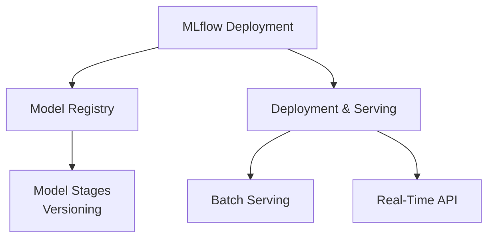

# MLflow Deployment (9% of Exam)

Understanding MLflow Model Registry, model versioning, deployment, and serving strategies.

## Topics Overview

## Section Contents

| File | Topic | Priority |
| :--- | :--- | :--- |
| [01-model-registry.md](01-model-registry.md) | Model Registry, versioning, stages, transitions | High |
| [02-model-deployment-serving.md](02-model-deployment-serving.md) | Deployment strategies, batch/real-time serving | High |

## Key Concepts

- **Model Registry**: Centralized repository for registered models
- **Model Versions**: Track multiple versions of same model
- **Stages**: Development, staging, production model lifecycle
- **Batch Serving**: Large-scale predictions on pre-defined data
- **Real-Time Serving**: REST API endpoints for instant predictions

## Related Resources

- [MLflow Basics](../../../shared/fundamentals/mlflow-basics.md)
- [MLflow Tracking](../02-ml-workflows/01-mlflow-tracking.md)
- [Experiments & Runs](../02-ml-workflows/02-experiments-runs.md)

---

**[← Back to Certification](../README.md)**
