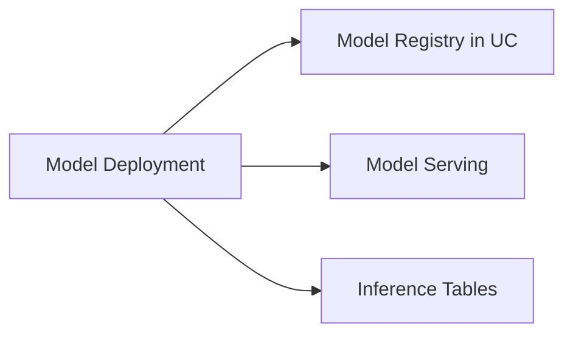

# Model Deployment (12 % of Exam)

How to register a model version, set aliases (`Production`, `Challenger`), and deploy behind a Mosaic AI Model Serving endpoint with Inference Tables capture.

## Topics Overview

## Section Contents

| File | Topic | Priority |
| :--- | :--- | :--- |
| [01-model-registry.md](./01-model-registry.md) | Registering models in UC, aliases, version promotion | High |
| [02-model-deployment-serving.md](./02-model-deployment-serving.md) | Mosaic AI Model Serving, endpoint config, Inference Tables | High |

## Key Concepts

| Concept | Why it matters |
| :--- | :--- |
| **`mlflow.set_registry_uri("databricks-uc")`** | Switch from workspace registry to UC registry |
| **Model alias** | `Production` / `Champion` / `Challenger` — assign per version, load with `models:/<name>@<alias>` |
| **Mosaic AI Model Serving** | Auto-scaling serverless endpoint hosting the registered model |
| **Inference Tables** | Auto-capture request/response to a UC Delta table for monitoring + audit |
| **`scale_to_zero_enabled`** | Saves cost at the price of cold-start latency |

## Related Resources

- [MLflow cheat sheet (shared)](../../../shared/cheat-sheets/mlflow-quick-ref.md)
- [Mosaic AI Model Serving documentation](https://docs.databricks.com/en/machine-learning/model-serving/index.html)
- [Hands-on Lab 04 — MLflow tracking and Model Registry in UC](../../../labs/04-mlflow-tracking.md)

---

**[← Previous: ML Workflows](../03-ml-workflows/README.md) | [↑ Back to ML Associate](../README.md)**
