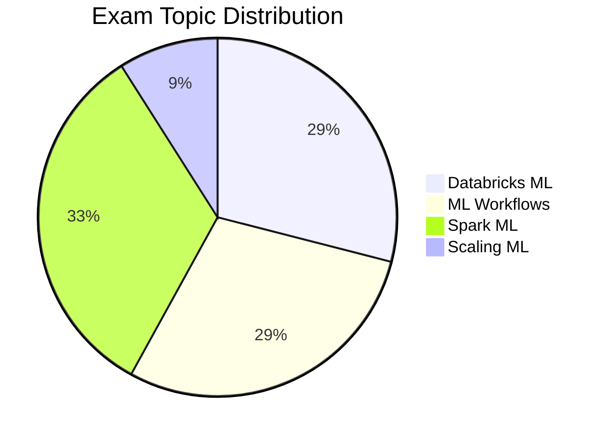

---
tags:
  - databricks
  - certification
  - machine-learning
type: certification
aliases:
  - ML Associate
---

# Databricks Machine Learning Associate

## Exam Overview

| Detail             | Information                                     |
| ------------------ | ----------------------------------------------- |
| **Certification**  | Databricks Certified Machine Learning Associate |
| **Questions**      | ~45 multiple-choice                             |
| **Duration**       | 90 minutes                                      |
| **Passing Score**  | 70%                                             |
| **Languages**      | Python                                          |
| **Experience**     | 6+ months with Databricks ML                    |
| **Recertification**| Every 2 years                                   |
| **Cost**           | $200 USD                                        |

## Exam Domain Weights

## Study Topics

| Section               | Weight | Topics                                 |
| --------------------- | ------ | -------------------------------------- |
| 01-Databricks ML      | 29%    | Clusters, notebooks, repos, AutoML     |
| 02-ML Workflows       | 29%    | Experimentation, MLflow tracking       |
| 03-Feature Engineering| 33%    | Spark ML, feature pipelines            |
| 04-MLflow             | 9%     | Model registry, deployment basics      |

## Prerequisites

Review these shared fundamentals:

- [Spark Fundamentals](../../shared/fundamentals/spark-fundamentals.md)
- [Databricks Workspace](../../shared/fundamentals/databricks-workspace.md)

## Study Progress Tracker

- [ ] Understand Databricks ML workspace
- [ ] Learn MLflow tracking and experiments
- [ ] Practice Spark ML pipelines
- [ ] Explore AutoML capabilities
- [ ] Review model registry basics

## Official Resources

- [Databricks Certification Page](https://www.databricks.com/learn/certification/machine-learning-associate)
- [Databricks ML Documentation](https://docs.databricks.com/machine-learning/)

## Recommended Path

Complete this certification before attempting [ML Professional](../ml-professional/README.md).
