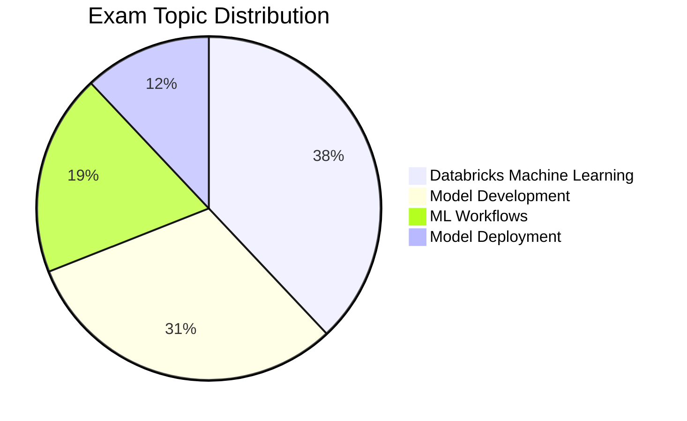

# Databricks Machine Learning Associate

> [!important]
> **What changed in the March 1, 2025 exam guide**
>
> - **Databricks Machine Learning** is the largest domain at 38 % — covers AutoML, Unity Catalog for ML, select MLflow features
> - **Model Development** weighted at 31 % — feature engineering, training, evaluation, regression vs classification, scaling
> - **ML Workflows** (19 %) and **Model Deployment** (12 %) round out the blueprint
> - All ML code is **Python**; non-ML supporting tasks may include SQL
> - Pass / fail — **Databricks no longer publishes a numeric passing score**
>
> The official source of truth: [Databricks Certified Machine Learning Associate](https://www.databricks.com/learn/certification/machine-learning-associate). Topic folders in this guide cover the same scope but with different labels.

## Exam Overview

| Detail              | Information                                     |
| ------------------- | ----------------------------------------------- |
| **Certification**   | Databricks Certified Machine Learning Associate |
| **Exam guide**      | March 1, 2025                                   |
| **Scored questions**| 48 multiple-choice                              |
| **Duration**        | 90 minutes                                      |
| **Result**          | Pass / fail (no published threshold)            |
| **Languages**       | English, Japanese, Portuguese (BR), Korean      |
| **Code in stems**   | Python (ML); SQL for non-ML supporting tasks    |
| **Experience**      | 6+ months hands-on ML on Databricks (recommended) |
| **Recertification** | Every 2 years                                   |
| **Cost**            | $200 USD                                        |
| **Delivery**        | Online proctored or test center                 |

## Exam Domain Weights (official — March 1, 2025)

| Domain | Weight |
| :--- | :---: |
| Databricks Machine Learning | 38 % |
| Model Development | 31 % |
| ML Workflows | 19 % |
| Model Deployment | 12 % |

## Study Topics

### Topic folders in this guide

| Section                                                     | Covers (official domains) |
| ----------------------------------------------------------- | ------------------------- |
| [01-Databricks ML](01-databricks-ml/README.md)              | Databricks Machine Learning (AutoML, UC for ML, MLflow basics) |
| [02-ML Workflows](02-ml-workflows/README.md)                | ML Workflows (experiments, tracking, MLflow lifecycle) |
| [03-Feature Engineering](03-feature-engineering/README.md)  | Model Development (Spark ML, pipelines, Feature Store) |
| [04-MLflow Deployment](04-mlflow-deployment/README.md)      | Model Deployment (Model Registry, Model Serving) |

### Practice & Resources

| Resource                                                        | Description                              |
| --------------------------------------------------------------- | ---------------------------------------- |
| [Practice Questions](resources/practice-questions/README.md)    | Topic-specific practice questions        |
| [Mock Exam 1](resources/mock-exam/README.md)                    | Full-length practice exam                |
| [Mock Exam 2](resources/mock-exam-2/README.md)                  | Alternative practice exam                |
| [Exam Tips](resources/exam-tips.md)                             | Exam strategies and tips                 |
| [Official Links](resources/official-links.md)                   | Documentation and resources              |

## Interview Preparation

After completing this certification, explore:

- [Interview Prep Resource](../../shared/interview-prep/README.md) - System design, feature engineering, and model architecture questions

## Prerequisites

Review these shared fundamentals:

- [Spark Fundamentals](../../shared/fundamentals/spark-fundamentals.md)
- [MLflow Basics](../../shared/fundamentals/mlflow-basics.md)
- [Feature Engineering Basics](../../shared/fundamentals/feature-engineering-basics.md)

## Study Progress Tracker

- [ ] Understand Databricks ML workspace and AutoML
- [ ] Learn MLflow tracking and experiments
- [ ] Practice Spark ML pipelines and feature engineering
- [ ] Explore Unity Catalog for ML assets
- [ ] Review Model Registry and basic Model Serving

## Official Resources

- [Databricks Certification Page](https://www.databricks.com/learn/certification/machine-learning-associate)
- [Databricks ML Documentation](https://docs.databricks.com/machine-learning/)

## Recommended Path

Complete this certification before attempting [ML Professional](../ml-professional/README.md).
