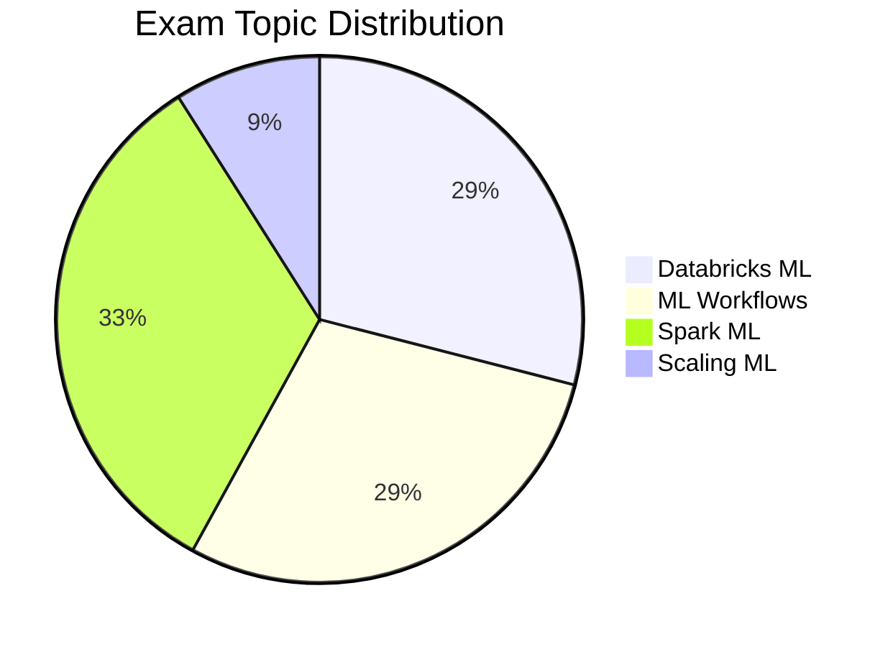

# Databricks Machine Learning Associate

## Exam Overview

| Detail             | Information                                     |
| ------------------ | ----------------------------------------------- |
| **Certification**  | Databricks Certified Machine Learning Associate |
| **Questions**      | ~45 multiple-choice                             |
| **Duration**       | 90 minutes                                      |
| **Passing Score**  | 70%                                             |
| **Languages**      | Python                                          |
| **Experience**     | 6+ months with Databricks ML                    |
| **Recertification**| Every 2 years                                   |
| **Cost**           | $200 USD                                        |

## Exam Domain Weights

## Study Topics

### Core Topics (By Exam Weight)

| Section                                                     | Weight | Topics                                     |
| ----------------------------------------------------------- | ------ | ------------------------------------------ |
| [01-Databricks ML](01-databricks-ml/README.md)             | 29%    | Platform, clusters, notebooks, AutoML      |
| [02-ML Workflows](02-ml-workflows/README.md)               | 29%    | Experimentation, tracking, MLflow          |
| [03-Feature Engineering](03-feature-engineering/README.md) | 33%    | Spark ML, pipelines, feature store         |
| [04-MLflow Deployment](04-mlflow-deployment/README.md)     | 9%     | Model registry, deployment, serving        |

### Practice & Resources

| Resource                                                | Description                              |
| ------------------------------------------------------- | ---------------------------------------- |
| [Practice Questions](resources/practice-questions/README.md)    | Topic-specific practice questions        |
| [Mock Exam 1](resources/mock-exam/README.md)                    | Full-length practice exam                |
| [Mock Exam 2](resources/mock-exam-2/README.md)                  | Alternative practice exam                |
| [Exam Tips](resources/exam-tips.md)                    | Exam strategies and tips                 |
| [Official Links](resources/official-links.md)          | Documentation and resources              |

## Interview Preparation

After completing this certification, explore:

- [Interview Prep Resource](../../shared/interview-prep/README.md) - System design, feature engineering, and model architecture questions

## Prerequisites

Review these shared fundamentals:

- [Spark Fundamentals](../../shared/fundamentals/spark-fundamentals.md)
- [MLflow Basics](../../shared/fundamentals/mlflow-basics.md)
- [Feature Engineering Basics](../../shared/fundamentals/feature-engineering-basics.md)

## Study Progress Tracker

- [ ] Understand Databricks ML workspace
- [ ] Learn MLflow tracking and experiments
- [ ] Practice Spark ML pipelines
- [ ] Explore AutoML capabilities
- [ ] Review model registry basics

## Official Resources

- [Databricks Certification Page](https://www.databricks.com/learn/certification/machine-learning-associate)
- [Databricks ML Documentation](https://docs.databricks.com/machine-learning/)

## Recommended Path

Complete this certification before attempting [ML Professional](../ml-professional/README.md).
