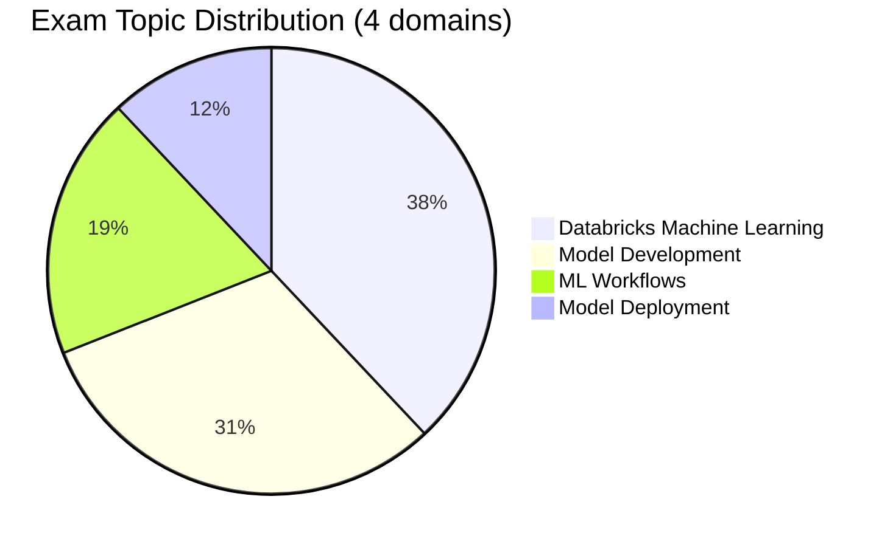

# Databricks Machine Learning Associate

> [!important]
> **What changed in the March 1, 2025 exam guide**
>
> - **4 domains** with explicit weights: Databricks ML 38 %, Model Development 31 %, ML Workflows 19 %, Model Deployment 12 %
> - Stronger emphasis on **Unity Catalog for ML** (model registry, feature tables, inference tables)
> - **AutoML** as a first-class skill within Databricks ML
> - Pass / fail — **the March 1, 2025 exam guide does not publish a numeric passing score**
>
> The official source of truth: [Databricks Certified Machine Learning Associate](https://www.databricks.com/learn/certification/machine-learning-associate). The folder structure in this guide now matches the official 4-domain blueprint 1 : 1.

## Exam Overview

| Detail              | Information                                     |
| ------------------- | ----------------------------------------------- |
| **Certification**   | Databricks Certified Machine Learning Associate |
| **Exam guide**      | March 1, 2025                                   |
| **Scored questions**| 48 multiple-choice                              |
| **Duration**        | 90 minutes                                      |
| **Result**          | Pass / fail (no numeric threshold in the March 1, 2025 exam guide) |
| **Languages**       | English, Japanese, Portuguese (BR), Korean      |
| **Code in stems**   | Python (ML); SQL for non-ML supporting tasks    |
| **Experience**      | 6+ months hands-on ML on Databricks (recommended) |
| **Recertification** | Every 2 years                                   |
| **Cost**            | $200 USD                                        |
| **Delivery**        | Online proctored or test center                 |

## Exam Domain Weights (official — March 1, 2025)

## Study Topics

| Section | Weight | Focus |
| :--- | :---: | :--- |
| [01 — Databricks Machine Learning](./01-databricks-machine-learning/README.md) | 38 % | ML workspace, compute, AutoML, UC for ML |
| [02 — Model Development](./02-model-development/README.md) | 31 % | Spark ML pipelines, feature engineering, Feature Store |
| [03 — ML Workflows](./03-ml-workflows/README.md) | 19 % | MLflow tracking, experiments, end-to-end loop |
| [04 — Model Deployment](./04-model-deployment/README.md) | 12 % | Model Registry in UC, Model Serving, Inference Tables |

### Practice & Resources

| Resource                                                        | Description                              |
| --------------------------------------------------------------- | ---------------------------------------- |
| [Practice Questions](./resources/practice-questions/README.md)  | Topic-specific practice questions        |
| [Mock Exam 1](./resources/mock-exam/README.md)                  | Full-length practice exam                |
| [Mock Exam 2](./resources/mock-exam-2/README.md)                | Alternative practice exam                |
| [Exam Tips](./resources/exam-tips.md)                           | Exam strategies and tips                 |
| [Official Links](./resources/official-links.md)                 | Documentation and resources              |

## Interview Preparation

After completing this certification, explore:

- [Interview Prep Resource](../../shared/interview-prep/README.md) - System design, feature engineering, and model architecture questions

## Prerequisites

Review these shared fundamentals:

- [Spark Fundamentals](../../shared/fundamentals/spark-fundamentals.md)
- [MLflow Basics](../../shared/fundamentals/mlflow-basics.md)
- [Feature Engineering Basics](../../shared/fundamentals/feature-engineering-basics.md)

## Study Progress Tracker

- [ ] Domain 01 — Databricks Machine Learning (AutoML, UC for ML)
- [ ] Domain 02 — Model Development (Spark ML, feature engineering, Feature Store)
- [ ] Domain 03 — ML Workflows (MLflow tracking, experiments)
- [ ] Domain 04 — Model Deployment (Model Registry, Model Serving)
- [ ] Run Hands-on Lab 04 (MLflow + Model Registry in UC)

## Official Resources

- [Databricks Certification Page](https://www.databricks.com/learn/certification/machine-learning-associate)
- [Databricks ML Documentation](https://docs.databricks.com/machine-learning/)

## Recommended Path

Complete this certification before attempting [ML Professional](../ml-professional/README.md).
