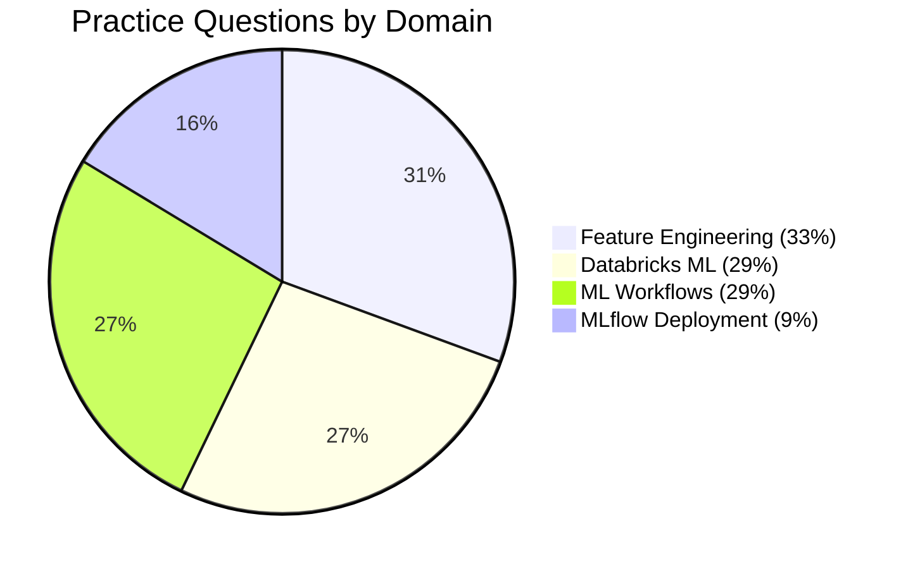

# Practice Questions — ML Associate

Topic-focused practice questions aligned to the four exam domains. Work through each file in order, then attempt the mock exams.

## Question Files

| File | Topic | Questions | Domain Weight |
|---|---|---|---|
| [01 — Databricks ML](./01-databricks-ml.md) | ML Runtime, AutoML, Cluster types, Repos | 13 | 29% |
| [02 — ML Workflows](./02-ml-workflows.md) | MLflow tracking, autolog, search_runs, run management | 13 | 29% |
| [03 — Feature Engineering](./03-feature-engineering.md) | Spark ML Pipeline, Feature Store, CrossValidator | 15 | 33% |
| [04 — MLflow Deployment](./04-mlflow-deployment.md) | Model Registry, spark_udf, serving endpoints | 8 | 9% |

**Total: 49 practice questions across all topics**

## How to Use

1. Attempt each question independently before revealing the answer
2. Use the foldable `Answer` callout to check your reasoning
3. Keep a tally of correct/incorrect answers per topic
4. Focus extra study time on any topic where you score below 70%
5. Once comfortable with all topics, attempt [Mock Exam 1](../mock-exam/README.md) and [Mock Exam 2](../mock-exam-2/README.md)

## Topic Coverage

---

[← Back to Resources](../README.md)
