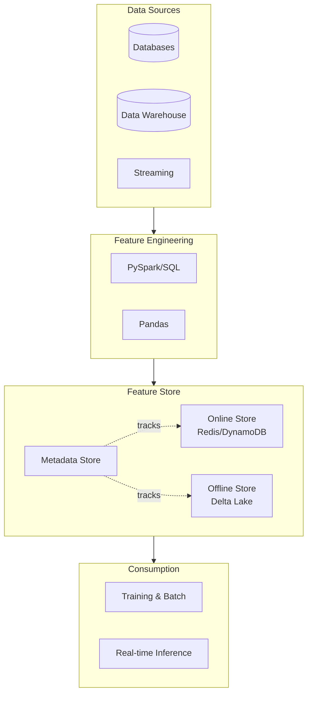

# Feature Store Fundamentals

## Overview

A Feature Store is a centralized repository that enables ML teams to store, manage, discover, and share features consistently across the organization. It bridges the gap between data engineering and ML engineering by providing a single source of truth for features.

## Feature Store Architecture



## Core Concepts

### **Online vs. Offline Features**

**Offline Features** (Training & Batch Scoring):

- Stored in batch stores (Delta Lake, S3, Parquet)
- Used for model training and historical batch scoring
- Can be stale (minutes to hours old)
- Access pattern: Bulk reads for batch operations
- Examples: Historical user aggregations, seasonal features

**Online Features** (Real-time Serving):

- Stored in low-latency systems (Redis, DynamoDB, Firestore)
- Used for real-time model inference
- Must be fresh (milliseconds to seconds)
- Access pattern: Single row or small batch retrieval by entity key
- Examples: User account balance, current visitor behavior, recent events

```python
# Online vs. Offline Feature Serving Pattern

from datetime import datetime, timedelta

class FeatureStore:
    """Enterprise feature store with online/offline support"""
    
    def __init__(self, spark, redis_client):
        self.spark = spark
        self.redis = redis_client
        self.delta_path = "/delta/features"
    
    def get_online_features(self, entity_ids: list, feature_names: list) -> dict:
        """Retrieve features from online store (real-time, low latency)"""
        features = {}
        for entity_id in entity_ids:
            for feature_name in feature_names:
                key = f"{feature_name}:{entity_id}"
                value = self.redis.get(key)
                if not features.get(entity_id):
                    features[entity_id] = {}
                features[entity_id][feature_name] = value
        return features
    
    def get_offline_features(self, entity_ids: list, feature_names: list) -> pd.DataFrame:
        """Retrieve features from offline store (batch, historical)"""
        df = self.spark.read.format("delta").load(self.delta_path)
        
        return df.filter(
            (df.entity_id.isin(entity_ids)) &
            (df.feature_name.isin(feature_names))
        ).toPandas()
    
    def publish_online_features(self, features_df: pd.DataFrame, ttl_hours: int = 24):
        """Sync features to online store with TTL"""
        for _, row in features_df.iterrows():
            key = f"{row['feature_name']}:{row['entity_id']}"
            self.redis.setex(
                key, 
                timedelta(hours=ttl_hours).total_seconds(), 
                row['value']
            )
```

### **Feature Store Components**

| Component | Purpose | Technology Example |
| :--- | :--- | :--- |
| **Metadata Store** | Tracks feature definitions, owners, lineage | MLflow, Hive Metastore |
| **Offline Store** | Batch feature storage for training | Delta Lake, Parquet, BigQuery |
| **Online Store** | Low-latency feature serving | Redis, DynamoDB, Firestore |
| **Feature Registry** | Discovery and documentation | UI, API, catalog |
| **Orchestration** | Scheduled feature computation | Airflow, Databricks Jobs, dbt |
| **Monitoring** | Feature quality and drift tracking | Monitoring service, logs |

### **Feature Definition & Lineage**

```python
# Feature Definition with Lineage Tracking

from dataclasses import dataclass
from typing import List
from enum import Enum

class FeatureType(Enum):
    NUMERIC = "numeric"
    CATEGORICAL = "categorical"
    TIMESTAMP = "timestamp"

@dataclass
class FeatureDefinition:
    """Schema for feature metadata"""
    name: str
    description: str
    entity_key: str  # Primary identifier (user_id, product_id, etc.)
    feature_type: FeatureType
    created_timestamp: str
    owner_email: str
    source_table: str  # Source data location
    sql_definition: str  # SQL to compute feature
    freshness_requirement: int  # Hours
    tags: List[str]

# Lineage tracking

feature_lineage = {
    "user_spending_7d": {
        "source": "transactions",
        "depends_on": ["user_id", "transaction_amount", "transaction_date"],
        "computation": "SUM(amount) FILTER (date > now() - 7 days)",
        "refresh_frequency": "daily"
    },
    "product_popularity": {
        "source": "events",
        "depends_on": ["product_id", "event_type", "timestamp"],
        "computation": "COUNT(*) GROUP BY product_id",
        "refresh_frequency": "hourly"
    }
}
```

## Common Patterns

### Pattern 1: Entity-Based Features

```python
# Entity-based feature computation

def compute_user_features(spark, transaction_df, lookback_days=30):
    """Register user aggregation features"""
    from pyspark.sql.functions import col, sum, avg, count, max, min, datediff, current_date
    
    cutoff_date = col(current_date()) - lookback_days
    
    features = (
        transaction_df
        .filter(col("timestamp") >= cutoff_date)
        .groupBy("user_id")
        .agg(
            sum("amount").alias("total_spending"),
            avg("amount").alias("avg_transaction_value"),
            count("*").alias("transaction_count"),
            max("amount").alias("max_transaction"),
            min("amount").alias("min_transaction")
        )
        .withColumn("avg_days_between_transactions", 
                   col("transaction_count") / lookback_days)
    )
    
    return features
```

### Pattern 2: Time-Windowed Features

```python
# Sliding window features for time-series data

def compute_time_windowed_features(spark, events_df):
    """Compute features across multiple time windows"""
    from pyspark.sql.functions import col, window, sum, avg, count
    
    # 1-hour, 24-hour, 7-day features
    windowed = events_df.groupBy(
        window(col("timestamp"), "1 hour", "1 hour"),
        col("user_id")
    ).agg(
        count("*").alias("event_count_1h"),
        sum("value").alias("total_value_1h")
    )
    
    # 24-hour features
    windowed_24h = events_df.groupBy(
        window(col("timestamp"), "24 hour", "1 hour"),
        col("user_id")
    ).agg(
        count("*").alias("event_count_24h"),
        avg("value").alias("avg_value_24h")
    )
    
    return windowed, windowed_24h
```

## Real-World Enterprise Scenarios

### Scenario 1: E-Commerce Recommendation System

**Requirements:**

- Online features available in <100ms for product scoring
- Offline features for model retraining every 24 hours
- Lineage tracking for compliance
- Feature versioning for A/B testing

**Solution:**

```python
# User interaction features (online)

user_behaviors = {
    "recent_views": {"store": "redis", "ttl": "24h", "latency": "<50ms"},
    "cart_items": {"store": "redis", "ttl": "1h", "latency": "<20ms"},
    "favorite_categories": {"store": "redis", "ttl": "7d", "latency": "<50ms"}
}

# Historical features (offline)

user_history = {
    "lifetime_value": {"store": "delta", "updated": "daily", "lookback": "all"},
    "purchase_frequency": {"store": "delta", "updated": "daily", "lookback": "90d"},
    "avg_order_value": {"store": "delta", "updated": "daily", "lookback": "90d"}
}

# Product features (online)

product_popularity = {
    "view_count_24h": {"store": "redis", "updated": "hourly"},
    "purchase_rate_24h": {"store": "redis", "updated": "hourly"},
    "rating_trend": {"store": "redis", "updated": "4h"}
}
```

### Scenario 2: Financial Risk Assessment

**Requirements:**

- Real-time fraud detection with <50ms latency
- Historical features for model training
- Regulatory compliance and audit trails
- Feature stability metrics

**Solution:**

```python
# Real-time risk features

transaction_features = {
    "amount_vs_avg": "current_amount / avg_transaction_30d",
    "merchant_risk_score": "lookup from merchant_risk_table",
    "velocity_check": "transactions_in_last_hour > threshold",
    "device_risk": "lookup from device_fingerprint_store"
}

# Historical risk indicators

account_features = {
    "avg_transaction_value_30d": "computed daily",
    "transaction_std_dev_30d": "computed daily",
    "fraud_indicator_90d": "computed daily"
}
```

## Best Practices

### **Feature Naming Conventions**

```text
{entity}_{aggregation_function}_{time_window}
Examples:
- user_total_spent_7d
- product_avg_rating_30d
- merchant_fraud_count_24h
```

### **Feature Documentation**

```python
# Comprehensive feature metadata

feature_metadata = {
    "name": "user_spending_7d",
    "entity_type": "user",
    "description": "Total spending in last 7 days in USD",
    "owner": "ml-team@company.com",
    "created_date": "2024-01-15",
    "last_modified": "2025-08-20",
    "data_type": "double",
    "source_tables": ["transactions"],
    "sla": {
        "freshness": "< 1 hour",
        "availability": "99.9%"
    },
    "tags": ["user", "spending", "time-sensitive"],
    "dependencies": ["user_id", "transaction_amount", "transaction_date"]
}
```

### **Feature Monitoring**

```python
# Monitor feature quality

def validate_features(features_df, expectations):
    """Validate feature quality metrics"""
    validations = {
        "null_rate": features_df.filter(col("value").isNull()).count() / features_df.count(),
        "value_range": (features_df.select("value").describe().collect()),
        "duplicates": features_df.select("entity_id").dropDuplicates().count()
    }
    
    for metric, threshold in expectations.items():
        if validations[metric] > threshold:
            raise ValueError(f"Feature validation failed: {metric}")
    
    return True
```

## Common Pitfalls

### ❌ **Pitfall 1: Data Leakage**

Problem: Using future information in features

```python
# Wrong: includes future test data

def compute_feature_wrong(df, training_date):
    return df.groupBy("user_id").agg(sum("amount"))  # All data!

# Correct: only data available at training time

def compute_feature_correct(df, training_date):
    return df.filter(col("date") <= training_date).groupby("user_id").agg(sum("amount"))
```

### ❌ **Pitfall 2: Train-Serving Skew**

Problem: Different feature computation in train vs. serving

```python
# Solution: Single source of truth

feature_definition = """
SELECT 
    user_id,
    SUM(amount) as total_spending_7d,
    COUNT(*) as transaction_count
FROM transactions
WHERE date >= current_date() - 7
GROUP BY user_id
"""
# Use same SQL for training batch and serving

```

## Key Takeaways

- Feature Store provides centralized management of features
- Online stores (Redis) for real-time serving, offline stores (Delta) for batch
- Feature lineage tracks dependencies and ensures compliance
- Entity-based features organized around primary identifiers
- The 4-key principles: Consistency, Discoverability, Reusability, Low-latency access

## Practice Questions

> [!success]- Question 1: Online vs Offline Features
> An ML engineer needs to serve a recommendation model in <100ms. Should they use online or offline features?
>
> **Answer: Online features**
>
> - Online stores (Redis, DynamoDB) provide <50ms latency
>
> - Offline stores (Delta Lake) suitable for batch scoring with seconds-minutes latency
>
> - This is a real-time serving scenario
>
> [!success]- Question 2: Feature Freshness
> A user engagement model requires features refreshed every 15 minutes. What's the best approach?
>
> **Answer: Scheduled batch computation + push to online store**
>
> - Compute aggregations every 15 minutes in Spark
>
> - Push to Redis with appropriate TTL
>
> - This balances freshness, cost, and latency

## Use Cases

- **Shared Feature Repository for Multiple Models**: Creating a single `customer_features` table consumed by fraud detection, churn prediction, and recommendation models -- eliminating duplicated feature pipelines and ensuring consistency across teams.
- **Real-Time Fraud Detection Features**: Building feature tables with pre-computed transaction velocity, merchant risk scores, and behavioral profiles that are served to online models with sub-100ms latency.

## Common Issues & Errors

### Artifact Access Denied

**Scenario:** Models fail to load from MLflow registry during serving.
**Fix:** Check Unity Catalog permissions or traditional workspace access controls on the underlying storage.

### Feature Table Schema Mismatch

**Scenario:** A `write_feature_table()` call fails after a team member adds a new column to the feature engineering pipeline, but existing consumers still expect the old schema.
**Fix:** Use `write_feature_table()` with `mode="merge"` to allow additive schema evolution. Coordinate breaking changes (column renames or type changes) by versioning the feature table name (e.g., `user_features_v2`) and updating all downstream `FeatureLookup` references.

## Related Topics

- [Databricks Feature Store](02-databricks-feature-store.md)
- [Advanced Feature Techniques](03-advanced-feature-techniques.md)
- [Feature Store Production](04-feature-store-production.md)

---

**[↑ Back to Advanced Feature Engineering](./README.md) | [Next: Databricks Feature Store](./02-databricks-feature-store.md) →**
