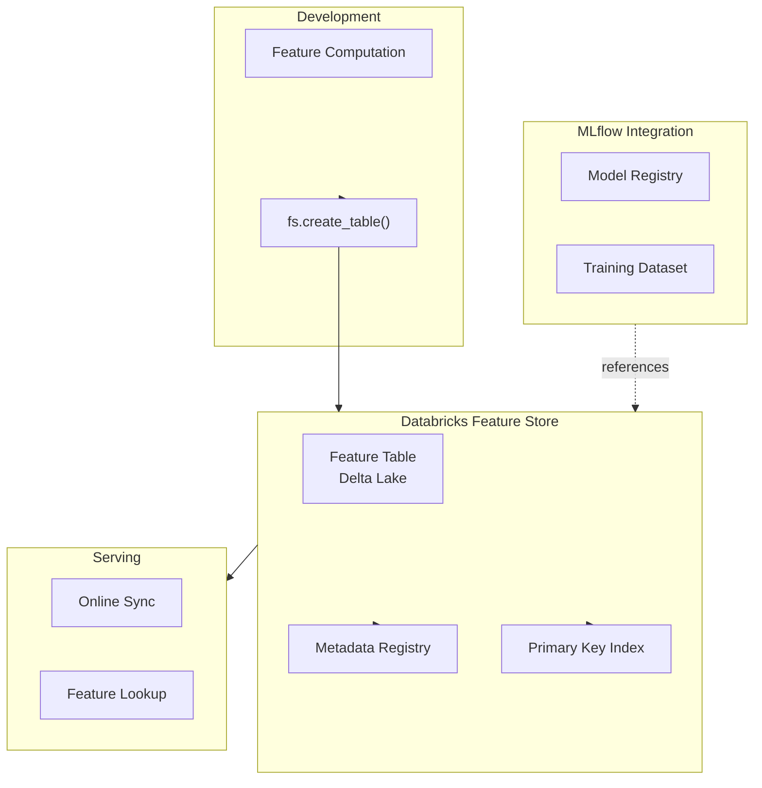

# Databricks Feature Store

## Overview

Databricks Feature Store is an integrated feature management system built on Delta Lake. It provides APIs to define, discover, manage, and serve features with unified online/offline access patterns.

## Databricks Feature Store Architecture



## Core APIs

### **Feature Table Creation and Management**

```python
from databricks.feature_store import FeatureStoreClient

# Initialize client

fs = FeatureStoreClient()

# Create feature table

fs.create_table(
    name="ml_team.user_features.user_spending",
    primary_keys=["user_id"],
    timestamp_keys=["timestamp"],
    schema=None,  # Inferred from df
    description="User spending features computed from transactions",
    tags={"team": "ml", "domain": "user"},
    path="/Volumes/ml_team/features/user_spending"  # Explicit location
)

# Write features to table

from pyspark.sql.functions import col, sum, avg, count, datediff, current_date

transaction_df = spark.read.table("bronze.transactions")
lookback_days = 30

features_df = (
    transaction_df
    .filter(col("transaction_date") >= current_date() - lookback_days)
    .groupBy("user_id")
    .agg(
        sum("transaction_amount").alias("total_spending_30d"),
        avg("transaction_amount").alias("avg_transaction_value"),
        count("*").alias("transaction_count_30d")
    )
    .withColumn("timestamp", current_date())
)

# Write to feature store table

fs.write_table(
    name="ml_team.user_features.user_spending",
    df=features_df,
    mode="merge"  # MERGE for updates
)
```

### **Feature Discovery and Lookup**

```python
# Read feature table for training

training_features = fs.read_table(
    name="ml_team.user_features.user_spending"
)

# Filter to specific time period

training_df = training_features.filter(
    col("timestamp") <= "2025-01-01"
)

# Lookup specific features

user_ids = spark.createDataFrame([("user_123",), ("user_456",)], ["user_id"])
user_feature_values = fs.read_table(
    name="ml_team.user_features.user_spending",
    as_of_delta_timestamp="2025-01-01"
).join(user_ids, "user_id")

# Online feature lookup (low latency)
# Available through MLflow Model Serving

```

### **Feature Versioning and Time Travel**

```python
# Read feature table at specific timestamp (Delta Lake time travel)

feature_table_v1 = spark.read.option(
    "versionAsOf", 0
).table("ml_team.user_features.user_spending")

feature_table_v2 = spark.read.option(
    "timestampAsOf", "2025-01-15 10:00:00"
).table("ml_team.user_features.user_spending")

# Get feature table history

history = spark.sql("""
    DESCRIBE HISTORY ml_team.user_features.user_spending
""")

# Restore to previous version

spark.sql("""
    RESTORE TABLE ml_team.user_features.user_spending
    TO VERSION AS OF 5
""")
```

### **Training Dataset Creation**

```python
# Create training dataset with labeled data

labels_df = spark.read.table("gold.user_churn_labels")

# Join features with labels

training_dataset_df = (
    fs.read_table("ml_team.user_features.user_spending")
    .join(labels_df, "user_id")
    .join(
        fs.read_table("ml_team.user_features.user_engagement"),
        "user_id"
    )
)

# Log training dataset to MLflow for reproducibility

import mlflow

mlflow.start_run()
mlflow.log_param("feature_table_version", 2)
mlflow.log_param("label_version", "v1.2")
mlflow.set_tag("training_dataset", "churn_model_v3")

# Train model on this dataset
# ...

mlflow.end_run()
```

## Databricks Feature Store Workflows

### Pattern 1: Batch Feature Computation and Sync

```python
# Daily scheduled job to compute and sync features

def daily_feature_sync():
    """Scheduled batch feature computation"""
    
    # Read source data
    transactions = spark.read.table("bronze.transactions")
    events = spark.read.table("bronze.events")
    
    # Compute user features
    user_features = (
        transactions
        .groupBy("user_id")
        .agg(
            sum("amount").alias("lifetime_value"),
            count("*").alias("total_transactions")
        )
        .withColumn("computed_at", current_timestamp())
    )
    
    # Merge into feature store
    fs.write_table(
        name="ml_team.user_features.computed",
        df=user_features,
        mode="merge"
    )
    
    # Event-based features
    event_features = (
        events
        .groupBy("user_id")
        .agg(count("*").alias("event_count_30d"))
    )
    
    fs.write_table(
        name="ml_team.user_features.event_engagement",
        df=event_features,
        mode="merge"
    )

# Schedule this job in Databricks Workflows

```

### Pattern 2: Real-time Feature Serving via REST Endpoint

```python
# Deploy model with feature store lookups

import mlflow.pyfunc

class UserChurnModel(mlflow.pyfunc.PythonModel):
    def __init__(self, feature_store_client):
        self.fs = feature_store_client
    
    def predict(self, context, model_input):
        """Predict on incoming requests"""
        user_ids = model_input["user_id"]
        
        # Look up features from online store
        features_df = self.fs.read_table(
            name="ml_team.user_features.user_spending"
        ).filter(col("user_id").isin(user_ids))
        
        # Get only latest features
        latest_features = (
            features_df
            .groupBy("user_id")
            .agg({"timestamp": "max"})
        )
        
        # Call model
        predictions = self.model.predict(latest_features)
        
        return predictions

# Register to MLflow Model Registry

mlflow.pyfunc.log_model(
    artifact_path="model",
    python_model=UserChurnModel(fs),
    pip_requirements=["pandas", "scikit-learn"]
)
```

## Integration with MLflow

```python
# Feature Store integration with MLflow Tracking

import mlflow

mlflow.start_run(run_name="model_with_features")

# Log feature table versions

mlflow.log_param("user_features_version", 1)
mlflow.log_param("product_features_version", 3)

# Create training dataset

training_df = (
    fs.read_table("ml_team.user_features.user_spending")
    .join(fs.read_table("ml_team.product_features.popular"), "product_id")
)

# Train and evaluate model

from sklearn.ensemble import RandomForestClassifier
from sklearn.metrics import accuracy_score

X = training_df.drop("churn").toPandas()
y = training_df.select("churn").toPandas()

model = RandomForestClassifier()
model.fit(X, y)
score = accuracy_score(y, model.predict(X))

mlflow.log_metric("accuracy", score)
mlflow.sklearn.log_model(model, "random_forest")

# Tag with feature versions

mlflow.set_tag("features_locked", "true")

mlflow.end_run()
```

## Advanced Operations

### **Feature Table Schema Evolution**

```python
# Add new feature column

from pyspark.sql.types import StructField, DoubleType

new_feature_schema = (
    fs.read_table("ml_team.user_features.user_spending")
    .schema
    .add(StructField("new_feature", DoubleType(), True))
)

# Update table with new column

new_features_df = (
    features_df
    .withColumn("new_feature", lit(0.0))
)

fs.write_table(
    name="ml_team.user_features.user_spending",
    df=new_features_df,
    mode="merge"
)
```

### **Multi-table Feature Joins**

```python
# Create composite features from multiple tables

user_features = fs.read_table("ml_team.user_features.user_spending")
product_features = fs.read_table("ml_team.product_features.popular")
transaction_data = spark.read.table("bronze.transactions")

# Complex join for training

training_df = (
    transaction_data
    .join(user_features, "user_id")
    .join(product_features, "product_id")
    .select(
        "user_id",
        "product_id",
        col("total_spending_30d"),
        col("product_popularity"),
        "is_purchased"
    )
)
```

### **Monitoring Feature Freshness**

```python
# Track when features were last computed

def check_feature_freshness():
    """Verify features are within SLA"""
    
    table_info = spark.sql("""
        DESCRIBE DETAIL ml_team.user_features.user_spending
    """)
    
    last_modified = table_info.select("modifiedTime").collect()[0][0]
    age_hours = (datetime.now() - last_modified).seconds / 3600
    
    sla_hours = 2
    
    if age_hours > sla_hours:
        print(f"WARNING: Features are {age_hours}h old, SLA is {sla_hours}h")
        # Trigger recomputation
    
    return age_hours <= sla_hours
```

## Common Pitfalls

### ❌ **Pitfall 1: Missing Primary Keys**

```python
# Wrong: no primary key indexing

fs.create_table(name="features", df=features_df)

# Correct: specify primary key for lookups

fs.create_table(
    name="features",
    primary_keys=["user_id"],
    df=features_df
)
```

### ❌ **Pitfall 2: Stale Feature Serving**

```python
# Wrong: no update strategy

fs.write_table(name="features", df=new_features, mode="overwrite")

# Correct: merge for incremental updates

fs.write_table(
    name="features",
    df=new_features,
    mode="merge"  # Only updates changed rows
)
```

## Key Takeaways

- Databricks Feature Store built on Delta Lake with online/offline support
- Primary keys enable efficient lookups and updates
- MERGE mode for incremental feature updates
- Integration with MLflow for model registry and training datasets
- Time travel via Delta Lake for reproducible model training
- Automatic online store syncing for serving models

## Practice Questions

> [!success]- Question 1: Feature Table Mode
> When updating existing features in the Feature Store, what mode should be used?
>
> **Answer: MERGE mode**
>
> - MERGE is efficient for incremental updates
>
> - OVERWRITE replaces entire table (less efficient)
>
> - MERGE only updates changed rows based on primary key
>
> [!success]- Question 2: Multi-table Training Dataset
> How do you create a training dataset that joins multiple feature tables?
>
> **Answer: Read multiple feature tables and join on common keys**
>
> - Use fs.read_table() for each feature table
>
> - Join on entity keys (user_id, product_id)
>
> - Log training dataset version to MLflow for reproducibility

## Use Cases

- **Point-in-Time Correct Training Datasets**: Using `create_training_set()` with `timestamp_lookup_key` to build historically accurate training data that prevents future data leakage, critical for time-sensitive models like demand forecasting.
- **Centralized Feature Sharing Across Teams**: Multiple ML teams (fraud, recommendations, churn) share a single `customer_features` table via Unity Catalog, eliminating redundant feature pipelines and ensuring consistency across models.

## Common Issues & Errors

### Artifact Access Denied

**Scenario:** Models fail to load from MLflow registry during serving.
**Fix:** Check Unity Catalog permissions or traditional workspace access controls on the underlying storage.

### Point-in-Time Lookup Returns Future Data

**Scenario:** A training dataset created with `create_training_set()` leaks future feature values into historical rows, inflating offline metrics but degrading production performance.
**Fix:** Always set the `timestamp_lookup_key` parameter in each `FeatureLookup` so the Feature Store performs a point-in-time join. Verify correctness by comparing the feature values for a known historical row against a manual query filtered by that timestamp.

## Related Topics

- [Feature Store Fundamentals](01-feature-store-fundamentals.md)
- [Advanced Feature Techniques](03-advanced-feature-techniques.md)
- [Feature Store Production](04-feature-store-production.md)

---

**[← Previous: Feature Store Fundamentals](./01-feature-store-fundamentals.md) | [↑ Back to Advanced Feature Engineering](./README.md) | [Next: Advanced Feature Techniques](./03-advanced-feature-techniques.md) →**
