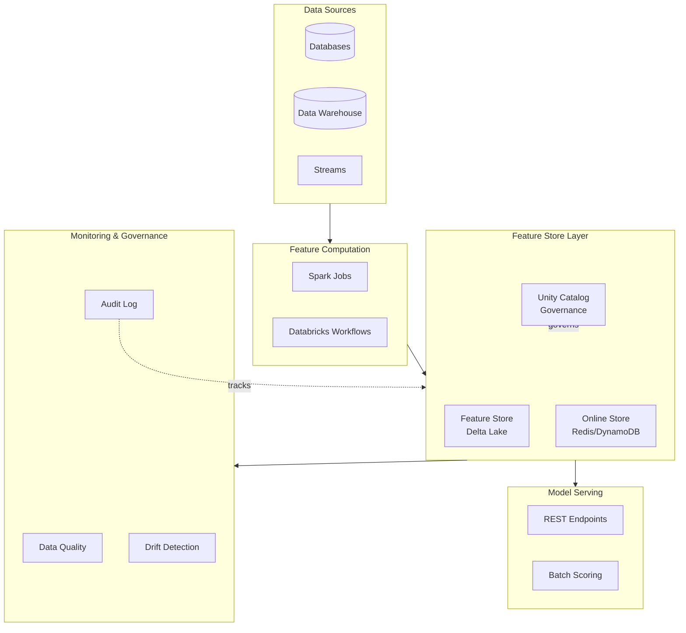

# Feature Store Production Patterns

## Overview

Production deployment patterns for feature stores including governance, monitoring, data quality, lineage tracking, and enterprise compliance.

## Feature Store Architecture for Production



## Governance Framework

### **Unity Catalog Integration**

```python
from databricks.sdk import WorkspaceClient
from databricks.sdk.service.catalog import CatalogInfo, SchemaInfo

# Initialize workspace client

ws = WorkspaceClient()

# Create managed catalog for features

catalog = ws.catalogs.create(
    name="ml_features",
    comment="Centralized feature store managed by ML team"
)

# Create schemas by team/domain

schemas = {
    "user_features": "User demographic and behavioral features",
    "product_features": "Product catalog and engagement features",
    "transaction_features": "Transaction and commerce features"
}

for schema_name, description in schemas.items():
    ws.schemas.create(
        catalog_name="ml_features",
        name=schema_name,
        comment=description
    )

# Feature table with proper catalog structure

feature_table = "ml_features.user_features.user_spending"

# Create with documented schema

feature_df_with_metadata = df.withMetadata(
    "user_id",
    {"description": "Unique user identifier", "tag": "PII"}
).withMetadata(
    "total_spending",
    {"description": "Total spending in USD", "unit": "USD", "freshness": "daily"}
)
```

### **Feature Ownership and Access Control**

```python
# RBAC for feature tables

from databricks.sdk.service.sql import StatementManagementRequest, ExecuteStatementRequest

ws = WorkspaceClient()

# Grant permissions

sql_statements = [
    # Feature table owner
    """GRANT ALL PRIVILEGES ON TABLE ml_features.user_features.user_spending 
       TO `ml-team@company.com`""",
    
    # Data scientists read access
    """GRANT SELECT ON SCHEMA ml_features.user_features 
       TO `data-science-group@company.com`""",
    
    # Analysts read-only access
    """GRANT SELECT ON TABLE ml_features.product_features.popular 
       TO `analytics-group@company.com`""",
    
    # Feature engineering team write access
    """GRANT CREATE, MODIFY ON SCHEMA ml_features.user_features 
       TO `feature-engineering-team@company.com`"""
]

for statement in sql_statements:
    ws.statement_execution.execute_statement(
        statement=ExecuteStatementRequest(
            warehouse_id="warehouse_id",
            statement=statement,
            wait_timeout="10s"
        )
    )
```

### **Data Lineage Tracking**

```python
# Track feature lineage with OpenMetadata

import json
from datetime import datetime

lineage_metadata = {
    "feature_table": "ml_features.user_features.user_spending",
    "owner": "ml-team@company.com",
    "created_date": datetime.now().isoformat(),
    "source_tables": [
        "bronze.raw_transactions",
        "bronze.raw_user_profiles"
    ],
    "transformations": [
        {
            "step": 1,
            "description": "Filter transactions from last 30 days",
            "tool": "Spark SQL"
        },
        {
            "step": 2,
            "description": "Aggregate by user and sum amounts",
            "tool": "Spark DataFrame API"
        },
        {
            "step": 3,
            "description": "Join with user profiles for enrichment",
            "tool": "Spark SQL"
        }
    ],
    "consumers": [
        {"model": "user_churn_model", "used_for": "training"},
        {"model": "ltv_model", "used_for": "batch_scoring"},
        {"service": "recommendation_api", "used_for": "real_time_serving"}
    ],
    "sla": {
        "freshness_hours": 2,
        "availability_pct": 99.9,
        "retention_days": 365
    }
}

# Store lineage in external system (e.g., Apache Atlas, OpenMetadata)
# For now, write to Delta table for tracking

lineage_df = spark.createDataFrame([lineage_metadata])
lineage_df.write.mode("append").delta("/metadata/feature_lineage")
```

## Data Quality Framework

### **Feature Quality Validation**

```python
from databricks import sql
import re

class FeatureQualityFramework:
    """Production feature quality validation"""
    
    def __init__(self, spark, workspace_client):
        self.spark = spark
        self.ws = workspace_client
        
    def validate_completeness(self, df, column, threshold=0.95):
        """Validate feature completeness (non-null rate)"""
        total = df.count()
        non_null = df.filter(col(column).isNotNull()).count()
        completeness = non_null / total
        
        if completeness < threshold:
            raise ValueError(
                f"Feature {column} completeness {completeness:.2%} below {threshold:.2%}"
            )
        
        return completeness
    
    def validate_accuracy(self, df, column, expected_format):
        """Validate data format and accuracy"""
        if expected_format == "email":
            pattern = r"^[a-zA-Z0-9._%+-]+@[a-zA-Z0-9.-]+\.[a-zA-Z]{2,}$"
            invalid = df.filter(~col(column).rlike(pattern)).count()
            
            if invalid > 0:
                raise ValueError(f"{invalid} invalid email formats in {column}")
        
        elif expected_format == "numeric_range":
            # Check range validation in separate method
            pass
    
    def validate_consistency(self, df1, df2, join_key, target_column):
        """Validate feature consistency across datasets"""
        join_result = (
            df1.select(join_key, f"{target_column}_old")
            .join(
                df2.select(join_key, f"{target_column}_new"),
                on=join_key
            )
        )
        
        mismatches = join_result.filter(
            col(f"{target_column}_old") != col(f"{target_column}_new")
        ).count()
        
        if mismatches > 0:
            print(f"WARNING: {mismatches} consistency mismatches in {target_column}")
        
        return mismatches
    
    def validate_freshness(self, table_name, max_age_hours=2):
        """Validate feature freshness against SLA"""
        table_info = self.spark.sql(
            f"DESCRIBE DETAIL {table_name}"
        ).collect()[0]
        
        last_modified = table_info["modifiedTime"]
        age_hours = (datetime.now() - last_modified).seconds / 3600
        
        if age_hours > max_age_hours:
            raise ValueError(
                f"Table {table_name} is {age_hours:.1f}h old, SLA is {max_age_hours}h"
            )
        
        return age_hours

# Usage

validator = FeatureQualityFramework(spark, ws)

features_df = spark.read.table("ml_features.user_features.user_spending")

validator.validate_completeness(features_df, "total_spending", threshold=0.98)
validator.validate_accuracy(features_df, "email", expected_format="email")
validator.validate_freshness("ml_features.user_features.user_spending", max_age_hours=2)
```

### **Monitoring Dashboard**

```python
# Feature quality monitoring dashboard SQL

feature_quality_sql = """
SELECT 
    table_name,
    feature_name,
    CAST(COUNT(*) AS DOUBLE) as total_records,
    CAST(SUM(CASE WHEN {col} IS NULL THEN 1 ELSE 0 END) AS DOUBLE) / COUNT(*) as null_rate,
    MIN({col}) as min_value,
    MAX({col}) as max_value,
    AVG({col}) as mean_value,
    STDDEV({col}) as std_value,
    CURRENT_TIMESTAMP as computed_at
FROM ml_features.{schema}.{table}
WHERE date >= current_date() - 30
GROUP BY table_name, feature_name
"""

# Drift detection SQL

drift_detection_sql = """
SELECT 
    feature_name,
    
    -- Statistical drift (Kolmogorov-Smirnov test)
    ABS(
        PERCENTILE_CONT(0.5) OVER (PARTITION BY feature_name ORDER BY value)
        - PERCENTILE_CONT(0.5) OVER (PARTITION BY is_recent ORDER BY value)
    ) as median_drift,
    
    -- Distribution shift
    STDDEV(value) OVER (PARTITION BY is_recent) as recent_stddev,
    
    -- Threshold for alert
    CASE 
        WHEN ABS(median_drift) > 0.2 THEN 'HIGH_DRIFT'
        WHEN ABS(median_drift) > 0.1 THEN 'MEDIUM_DRIFT'
        ELSE 'NORMAL'
    END as drift_status
FROM feature_statistics
WHERE date >= current_date() - 30
"""
```

## Deployment Patterns

### Pattern 1: Scheduled Batch Feature Computation

```python
# Databricks Workflow for feature computation

workflow_yaml = """
name: daily_feature_computation
tasks:
  - task_key: compute_user_features
    notebook_task:
      notebook_path: /Workspace/ml/feature_engineering/compute_user_features
      base_parameters:
        lookback_days: "30"
        output_path: "/data/features/user"
    cluster_config:
      spark_version: "13.3.x-scala2.12"
      node_type_id: "i3.xlarge"
      num_workers: 10
    timeout_seconds: 3600
    max_retries: 2
  
  - task_key: compute_product_features
    depends_on:
      - task_key: compute_user_features
    notebook_task:
      notebook_path: /Workspace/ml/feature_engineering/compute_product_features
    cluster_config:
      spark_version: "13.3.x-scala2.12"
      node_type_id: "i3.xlarge"
      num_workers: 5
    timeout_seconds: 1800
  
  - task_key: validate_features
    depends_on:
      - task_key: compute_user_features
      - task_key: compute_product_features
    notebook_task:
      notebook_path: /Workspace/ml/feature_engineering/validate_features
    cluster_config:
      spark_version: "13.3.x-scala2.12"
      node_type_id: "i3.large"
      num_workers: 2

schedule:
  quartz_cron_expression: "0 0 * * * ?"  # Daily at midnight UTC
  timezone_id: "UTC"
"""

# Deploy using Databricks SDK

from databricks.sdk import WorkspaceClient
from databricks.sdk.service.jobs import Job, Task

ws = WorkspaceClient()

job_config = Job(
    name="daily_feature_computation",
    tasks=[
        # Task 1: Compute features
        Task(
            task_key="compute_features",
            notebook_task=NotebookTask(...),
            new_cluster=ClusterSpec(...)
        )
    ],
    schedule=CronSchedule(quartz_cron_expression="0 0 * * * ?")
)

job = ws.jobs.create(job_config)
```

### Pattern 2: Real-time Feature Serving Pipeline

```python
# Streaming feature computation and serving

spark_stream = (
    spark.readStream
    .format("kafka")
    .option("kafka.bootstrap.servers", "localhost:9092")
    .option("subscribe", "user_events")
    .load()
)

# Parse and compute features

parsed_events = spark_stream.select(
    from_json(col("value").cast("string"), event_schema).alias("event")
).select("event.*")

# Compute 5-minute window features

windowed = (
    parsed_events
    .withWatermark("timestamp", "10 minutes")
    .groupBy(
        window(col("timestamp"), "5 minutes", "1 minute"),
        col("user_id")
    )
    .agg(
        count("*").alias("event_count_5m"),
        avg(col("item_price")).alias("avg_item_price_5m"),
        count(when(col("event_type") == "purchase", 1)).alias("purchase_count_5m")
    )
)

# Write to Delta for batch and Redis for online serving

def write_to_stores(df, batch_id):
    # Delta (batch)
    (
        df
        .select(
            col("window.start").alias("window_start"),
            col("user_id"),
            col("event_count_5m"),
            col("avg_item_price_5m"),
            col("purchase_count_5m")
        )
        .write
        .format("delta")
        .mode("append")
        .option("path", "/data/features/streaming_features")
        .save()
    )
    
    # Redis (online)
    import redis
    r = redis.Redis(host='localhost', port=6379)
    
    for row in df.collect():
        key = f"user_features:{row['user_id']}"
        value = {
            "event_count_5m": row["event_count_5m"],
            "avg_item_price_5m": row["avg_item_price_5m"],
            "purchase_count_5m": row["purchase_count_5m"]
        }
        r.setex(key, 600, json.dumps(value))  # 10 minute TTL

query = (
    windowed
    .writeStream
    .foreachBatch(write_to_stores)
    .option("checkpointLocation", "/tmp/checkpoint")
    .trigger(processingTime="1 minute")
    .start()
)
```

## Advanced Monitoring

### **Feature Drift Detection**

```python
from pyspark.sql.functions import col, approx_percentile, stddev
import numpy as np

class DriftDetector:
    """Detect data and prediction drift"""
    
    @staticmethod
    def detect_feature_drift(historical_df, recent_df, feature_name, threshold=0.1):
        """Detect statistical drift in features"""
        
        # KL Divergence approximation
        historical_stats = historical_df.select(
            approx_percentile(col(feature_name), 0.25).alias("p25"),
            approx_percentile(col(feature_name), 0.5).alias("p50"),
            approx_percentile(col(feature_name), 0.75).alias("p75"),
            stddev(col(feature_name)).alias("std")
        ).collect()[0]
        
        recent_stats = recent_df.select(
            approx_percentile(col(feature_name), 0.25).alias("p25"),
            approx_percentile(col(feature_name), 0.5).alias("p50"),
            approx_percentile(col(feature_name), 0.75).alias("p75"),
            stddev(col(feature_name)).alias("std")
        ).collect()[0]
        
        # Compute drift metric
        drift_score = (
            abs(recent_stats["p50"] - historical_stats["p50"]) / 
            (historical_stats["std"] + 1e-6)
        )
        
        has_drift = drift_score > threshold
        
        return {
            "feature": feature_name,
            "drift_score": drift_score,
            "has_drift": has_drift,
            "p50_historical": historical_stats["p50"],
            "p50_recent": recent_stats["p50"]
        }
    
    @staticmethod
    def detect_prediction_drift(predictions_historical, predictions_recent):
        """Detect drift in model predictions"""
        
        # Compare prediction distributions
        hist_mean = predictions_historical.select(avg(col("prediction"))).collect()[0][0]
        recent_mean = predictions_recent.select(avg(col("prediction"))).collect()[0][0]
        
        drift = abs(recent_mean - hist_mean)
        
        return {
            "prediction_drift": drift,
            "historical_mean": hist_mean,
            "recent_mean": recent_mean
        }
```

### **Performance Monitoring**

```python
# Log feature computation performance

import time

def log_feature_computation_metrics(table_name, computation_time_seconds, record_count):
    """Log feature computation performance"""
    
    metrics = {
        "table": table_name,
        "computation_time_seconds": computation_time_seconds,
        "record_count": record_count,
        "throughput_records_per_sec": record_count / computation_time_seconds,
        "timestamp": datetime.now().isoformat()
    }
    
    metrics_df = spark.createDataFrame([metrics])
    metrics_df.write.mode("append").delta("/logs/feature_computation_metrics")

# Start timer

start_time = time.time()

# Compute features

features = compute_features(...)

# Log metrics

elapsed = time.time() - start_time
log_feature_computation_metrics(
    "ml_features.user_features.user_spending",
    elapsed,
    features.count()
)
```

## Key Takeaways

- Unity Catalog provides governance and access control for feature stores
- Data lineage tracking maintains compliance and reproducibility
- Feature quality validation framework ensures production reliability
- Drift detection identifies when models need retraining
- Scheduled workflows automate feature computation at scale
- Online/offline separation optimizes latency vs. batch requirements

## Practice Questions

> [!success]- Question 1: Feature Table Governance
> How should feature table access be controlled in a multi-team organization?
>
> **Answer: Unity Catalog with RBAC**
>
> - Use catalogs for logical grouping
>
> - Grant schema-level access to teams
>
> - Grant table-level access for sensitive features
>
> - Track all modifications in audit logs
>
> [!success]- Question 2: Feature Freshness SLA
> A real-time model requires features refreshed every 15 minutes. What's the optimal approach?
>
> **Answer: Hybrid - batch computation every 15 min + push to online store**
>
> - Compute aggregations efficiently in batch
>
> - Push to Redis/DynamoDB with TTL
>
> - Balances freshness (15 min) with serving latency (<50ms)

## Use Cases

- **Batch-to-Online Feature Pipeline**: Running a nightly Spark job that computes aggregated user features, writes them to a Unity Catalog feature table, and publishes to an online store (Cosmos DB / DynamoDB) for sub-50ms serving at inference time.
- **Low-Latency Recommendation Serving**: Pre-computing user-item affinity features in batch, publishing to an online store (Cosmos DB / DynamoDB), and serving them at <50ms p99 to a real-time recommendation endpoint.

## Common Issues & Errors

### Artifact Access Denied

**Scenario:** Models fail to load from MLflow registry during serving.
**Fix:** Check Unity Catalog permissions or traditional workspace access controls on the underlying storage.

### Online Store Serving Latency Too High

**Scenario:** A model serving endpoint that performs online feature lookups exceeds the 100ms SLA because each request triggers individual key lookups against a remote online store.
**Fix:** Batch feature lookups into a single multi-key request using `score_batch()` where possible, or pre-join frequently co-requested features into a single composite feature table with a shared primary key. Monitor p99 latency via the Model Serving metrics dashboard.

## Related Topics

- [Feature Store Fundamentals](01-feature-store-fundamentals.md)
- [Databricks Feature Store](02-databricks-feature-store.md)
- [Advanced Feature Techniques](03-advanced-feature-techniques.md)

---

**[← Previous: Advanced Feature Techniques](./03-advanced-feature-techniques.md) | [↑ Back to Advanced Feature Engineering](./README.md)**
