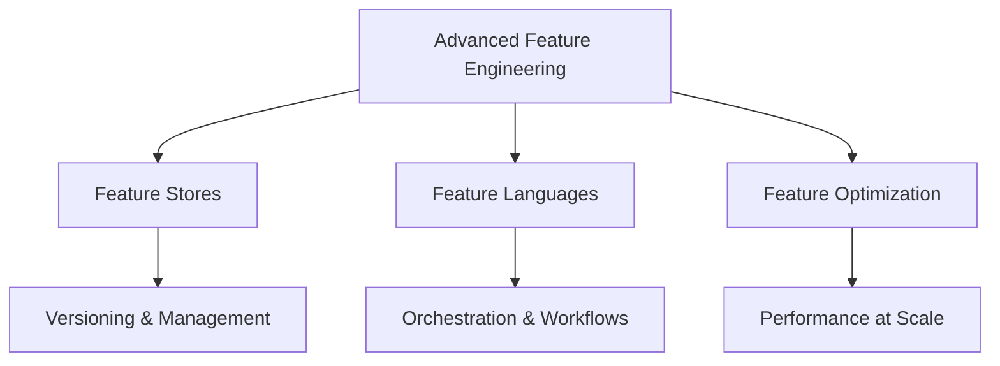

# Advanced Feature Engineering (20% of Exam)

Master production-grade feature engineering, feature stores, and distributed feature computation for enterprise ML systems.

## Topics Overview

## Section Contents

| File | Topic | Priority |
| :--- | :--- | :--- |
| [01-feature-store-fundamentals.md](01-feature-store-fundamentals.md) | Feature stores, Delta Lake, online/offline | High |
| [02-databricks-feature-store.md](02-databricks-feature-store.md) | Databricks Feature Store API and operations | High |
| [03-advanced-feature-techniques.md](03-advanced-feature-techniques.md) | Feature engineering patterns and optimization | High |
| [04-feature-store-production.md](04-feature-store-production.md) | Production patterns, governance, monitoring | High |

## Key Concepts

- **Feature Store**: Centralized repository for feature definitions, metadata, and versions
- **Online Features**: Low-latency feature serving for real-time inference
- **Offline Features**: Batch features for model training and batch scoring
- **Feature Versioning**: Tracking feature definitions and lineage over time
- **Feature Lineage**: Understanding dependencies between features and source data

## Related Resources

- [MLflow Basics](../../../shared/fundamentals/mlflow-basics.md)
- [Delta Lake Basics](../../../shared/fundamentals/delta-lake-basics.md)
- [Feature Engineering Basics](../../../shared/fundamentals/feature-engineering-basics.md)

## Next Steps

Progress to [02-Hyperparameter Optimization](../02-hyperparameter-optimization/README.md) to learn about advanced tuning strategies.

---

**[← Back to Certification](../README.md)**
