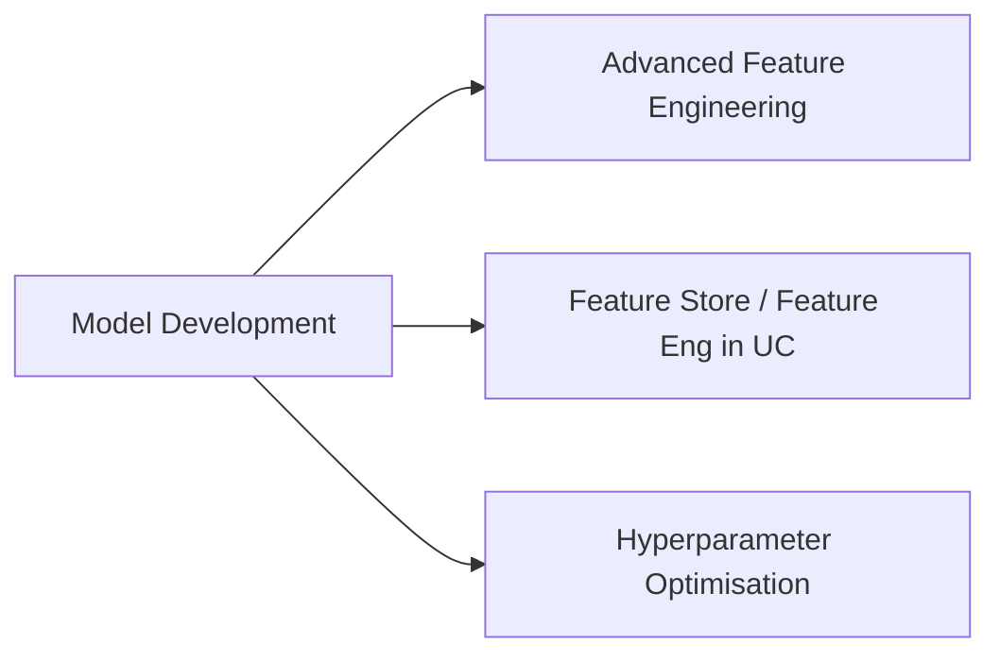

# Model Development (44 % of Exam)

Largest domain in the September 2025 blueprint (tied with ML Ops). Combines advanced feature engineering with the Feature Store / Feature Engineering in Unity Catalog and the full hyperparameter-optimization tool-belt — Hyperopt with `SparkTrials`, Bayesian methods, distributed tuning.

## Topics Overview

## Section Contents

| File | Topic | Priority |
| :--- | :--- | :--- |
| [01-feature-store-fundamentals.md](./01-feature-store-fundamentals.md) | Feature tables, lookups, point-in-time correctness | High |
| [02-databricks-feature-store.md](./02-databricks-feature-store.md) | Feature Engineering in UC, online stores | High |
| [03-advanced-feature-techniques.md](./03-advanced-feature-techniques.md) | Time-series features, embedding lookups, categorical encoders | High |
| [04-feature-store-production.md](./04-feature-store-production.md) | Productionisation patterns, training-serving skew avoidance | High |
| [05-tuning-fundamentals.md](./05-tuning-fundamentals.md) | Grid / random / Bayesian search; SparkTrials | High |
| [06-bayesian-optimization.md](./06-bayesian-optimization.md) | Hyperopt with TPE, search-space design | High |
| [07-distributed-tuning.md](./07-distributed-tuning.md) | `SparkTrials` parallelism, Hyperopt + MLflow autolog | High |

## Key Concepts

| Concept | Why it matters |
| :--- | :--- |
| **Feature Engineering in UC** | UC-native feature tables — replaces the standalone Workspace Feature Store |
| **Point-in-time lookup** | Training data uses feature values as of the event time, not "now" |
| **Online store** | Low-latency store for serving features at inference time (DynamoDB, Cosmos DB, etc.) |
| **Hyperopt `fmin` + `tpe.suggest`** | Tree-structured Parzen Estimator for Bayesian-style search |
| **`SparkTrials`** | Parallelises trials across workers; pairs with MLflow autolog |
| **Hyperopt search space** | `hp.choice`, `hp.uniform`, `hp.loguniform`, `hp.quniform` |

## Related Resources

- [Feature Engineering Basics (shared)](../../../shared/fundamentals/feature-engineering-basics.md)
- [Feature Engineering in Unity Catalog documentation](https://docs.databricks.com/en/machine-learning/feature-store/index.html)
- [Hyperopt with MLflow](https://docs.databricks.com/en/machine-learning/automl-hyperparam-tuning/index.html)

---

**[↑ Back to ML Professional](../README.md) | [Next: ML Ops →](../02-ml-ops/README.md)** *(first domain — no previous)*
