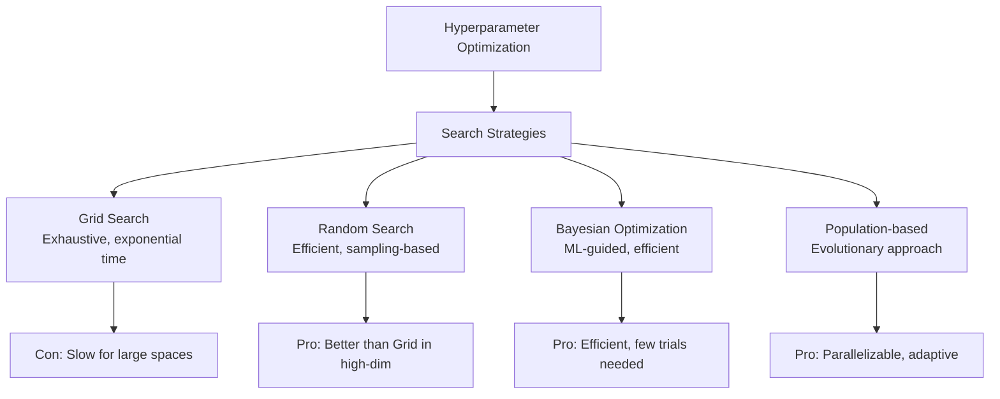

# Hyperparameter Tuning Fundamentals

## Overview

Hyperparameter tuning is the process of finding optimal configuration parameters for machine learning models. Unlike model parameters learned during training, hyperparameters are set before training begins and significantly impact model performance.

## Search Strategies Comparison



## Grid Search

```python
from pyspark.ml.tuning import ParamGridBuilder, CrossValidator
from pyspark.ml.classification import LogisticRegression
from pyspark.ml.evaluation import BinaryClassificationEvaluator
from pyspark.ml.feature import VectorAssembler

# Define parameter grid

param_grid = (
    ParamGridBuilder()
    .addGrid(lr.regParam, [0.01, 0.1, 1.0])
    .addGrid(lr.elasticNetParam, [0.0, 0.5, 1.0])
    .addGrid(lr.maxIter, [10, 50, 100])
    .build()
)

# Grid search with cross-validation

lr = LogisticRegression()
evaluator = BinaryClassificationEvaluator(metricName="areaUnderROC")

cv = CrossValidator(
    estimator=lr,
    estimatorParamMaps=param_grid,
    evaluator=evaluator,
    numFolds=5,
    seed=42,
    parallelism=4
)

cv_model = cv.fit(training_data)

# Get best parameters

best_params = cv_model.getEstimatorParamMaps()[
    np.argmax(cv_model.avgMetrics)
]
print(f"Best RegParam: {best_params[lr.regParam]}")
```

### Grid Search Characteristics

- **Pros**: Simple, guarantees evaluation of specific combinations, parallelizable
- **Cons**: Exponential time (3 params × 3 values = 27 combinations), inefficient for continuous ranges
- **Use when**: Small parameter space (< 1000 combinations)

### Example: Inefficiency in High Dimensions

```python
# How many combinations?

params_per_dim = [5, 5, 5, 5, 5]  # 5-dimensional space
total_combinations = 1
for p in params_per_dim:
    total_combinations *= p

print(f"Total combinations: {total_combinations}")  # 3,125 combinations!
# At 5 minutes per evaluation = 260 hours

```

## Random Search

```python
import random
from pyspark.ml.tuning import TrainValidationSplit

# Define parameter ranges (not grid)

param_grid_random = (
    ParamGridBuilder()
    .addGrid(lr.regParam, np.logspace(-4, 1, 50))  # 50 random values
    .addGrid(lr.elasticNetParam, np.linspace(0, 1, 20))
    .addGrid(lr.maxIter, [10, 20, 50, 100, 200])
    .build()
)

# Randomly sample from grid

random.seed(42)
sampled_grid = random.sample(param_grid_random, min(50, len(param_grid_random)))

# Evaluation with random search

cv = CrossValidator(
    estimator=lr,
    estimatorParamMaps=sampled_grid,
    evaluator=evaluator,
    numFolds=5,
    parallelism=8
)

model = cv.fit(training_data)
```

### Random Search Benefits

```python

# Empirically, random search finds better hyperparameters than grid
# in high-dimensional spaces (> 10 dimensions)

def compare_search_strategies(param_space_size, num_trials):
    """Compare grid vs random search efficiency"""
    
    grid_trials = min(num_trials, param_space_size)
    random_trials = num_trials  # Can explore same space multiple times
    
    print(f"Grid Search: {grid_trials} combinations")
    print(f"Random Search: {random_trials} samples from continuous ranges")
    
    # Random search advantage: explores more of parameter space
    return grid_trials, random_trials
```

## Objective Functions and Metrics

```python
from pyspark.ml.evaluation import (
    BinaryClassificationEvaluator, MulticlassClassificationEvaluator,
    RegressionEvaluator
)

# Binary Classification

bc_evaluator = BinaryClassificationEvaluator(
    labelCol="label",
    rawPredictionCol="rawPrediction",
    metricName="areaUnderROC"  # aucPR, areaUnderPR
)

# Multiclass Classification

mc_evaluator = MulticlassClassificationEvaluator(
    labelCol="label",
    predictionCol="prediction",
    metricName="f1"  # accuracy, precision, recall, f1, weightedRecall
)

# Regression

reg_evaluator = RegressionEvaluator(
    labelCol="label",
    predictionCol="prediction",
    metricName="rmse"  # mse, mae, r2
)

# Custom objective function

def custom_objective(predictions_df):
    """Business-specific objective function"""
    
    # Precision-recall trade-off for fraud detection
    tp = predictions_df.filter(
        (col("prediction") == 1) & (col("label") == 1)
    ).count()
    fp = predictions_df.filter(
        (col("prediction") == 1) & (col("label") == 0)
    ).count()
    fn = predictions_df.filter(
        (col("prediction") == 0) & (col("label") == 1)
    ).count()
    
    precision = tp / (tp + fp + 1e-6)
    recall = tp / (tp + fn + 1e-6)
    
    # Weight precision more heavily for fraud (minimize false positives)
    business_metric = 0.8 * precision + 0.2 * recall
    
    return business_metric
```

## Understanding Common Hyperparameters

### Classification Models

```python
# Random Forest hyperparameters

rf_params = {
    "numTrees": {
        "description": "Number of decision trees",
        "range": [10, 50, 100, 200],
        "impact": "Higher = less overfitting but slower"
    },
    "maxDepth": {
        "description": "Maximum tree depth",
        "range": [5, 10, 15, 20],
        "impact": "Lower = simpler model, less overfitting"
    },
    "minInstancesPerNode": {
        "description": "Minimum samples per leaf",
        "range": [1, 5, 10, 20],
        "impact": "Higher = smoother predictions"
    },
    "subsamplingRate": {
        "description": "Fraction of samples per tree",
        "range": [0.3, 0.5, 0.7, 1.0],
        "impact": "Lower = less correlation between trees"
    }
}

# Gradient Boosting parameters

gb_params = {
    "learningRate": {
        "description": "Step size for gradient descent",
        "range": [0.001, 0.01, 0.1, 0.5],
        "impact": "Lower = slower learning but better generalization"
    },
    "numIterations": {
        "description": "Number of boosting rounds",
        "range": [10, 50, 100, 500],
        "impact": "Higher = more iterations, risk of overfitting"
    },
    "maxDepth": {
        "description": "Tree depth per iteration",
        "range": [3, 5, 7, 10],
        "impact": "Lower = simpler base learners"
    },
    "subsamplingRate": {
        "description": "Row sampling for robustness",
        "range": [0.5, 0.7, 0.9, 1.0],
        "impact": "Lower = more stochasticity"
    }
}

# Learning rate impact visualization

lr_values = [0.001, 0.01, 0.1, 0.5]

# Learning rate too small: slow convergence
# Learning rate too large: overshooting, divergence

```

## Cross-Validation Strategies

```python
from pyspark.ml.tuning import CrossValidator, TrainValidationSplit

# k-Fold Cross-Validation (k=5 recommended)

cv = CrossValidator(
    estimator=pipeline,
    estimatorParamMaps=param_grid,
    evaluator=evaluator,
    numFolds=5,
    parallelism=4,
    seed=42
)

# Train-Validation Split (faster, less thorough)

tvs = TrainValidationSplit(
    estimator=pipeline,
    estimatorParamMaps=param_grid,
    evaluator=evaluator,
    trainRatio=0.75,
    parallelism=4,
    seed=42
)

# K-Fold with stratification for imbalanced data

from pyspark.sql.functions import col
from pyspark.ml.feature import Bucketizer

def stratified_split(df, label_col, num_folds=5):
    """Stratified k-fold for imbalanced classification"""
    
    # Add fold index with stratification
    window_spec = Window.partitionBy(label_col).orderBy(rand())
    
    stratified_df = (
        df
        .withColumn("row_num", row_number().over(window_spec))
        .withColumn("fold", (col("row_num") - 1) % num_folds)
        .drop("row_num")
    )
    
    return stratified_df
```

## Practical Hyperparameter Tuning Workflow

```python
import time

def hyperparameter_tuning_workflow(train_df, test_df, pipeline, param_configs):
    """Production hyperparameter tuning workflow"""
    
    results = []
    
    for config_name, param_grid in param_configs.items():
        print(f"Testing {config_name}...")
        
        start_time = time.time()
        
        # Cross-validation
        cv = CrossValidator(
            estimator=pipeline,
            estimatorParamMaps=param_grid,
            evaluator=evaluator,
            numFolds=5,
            parallelism=8
        )
        
        cv_model = cv.fit(train_df)
        cv_time = time.time() - start_time
        
        # Evaluate on test set
        predictions = cv_model.transform(test_df)
        test_metric = evaluator.evaluate(predictions)
        
        results.append({
            "config": config_name,
            "cv_score": max(cv_model.avgMetrics),
            "test_score": test_metric,
            "training_time_seconds": cv_time,
            "best_params": cv_model.getEstimatorParamMaps()[
                np.argmax(cv_model.avgMetrics)
            ]
        })
    
    # Select best configuration
    best_result = max(results, key=lambda x: x["test_score"])
    
    return results, best_result
```

## Trade-offs between Tuning Approaches

| Aspect | Grid Search | Random Search | Bayesian |
| :--- | :--- | :--- | :--- |
| **Exploration** | Systematic | Sampling-based | ML-guided |
| **High Dimensions** | Inefficient | Efficient | Very efficient |
| **Parallelization** | Easy | Easy | Difficult |
| **Implementation** | Simple | Simple | Complex |
| **Best for** | Small spaces | Large spaces | Production |

## Common Pitfalls

### ❌ **Pitfall 1: Overfitting to Validation Set**

```python
# Wrong: using test set for tuning

cv.fit(train_df)
final_model.fit(train_df + validation_df)  # Leaking info
final_model.evaluate(test_df)

# Correct: hold-out test set

cv.fit(train_df)  # Tuning uses train + cross-validation
final_model.fit(train_df + validation_df)  # Train on all except test
final_model.evaluate(test_df)  # Evaluate only once
```

### ❌ **Pitfall 2: Ignoring Data Preprocessing**

```python
# Wrong: different preprocessing in tuning vs. final model

scaler = StandardScaler()
scaler.fit(train_df)  # Fit on train only

# Scale differently during tuning

train_scaled = scaler.transform(train_df)

# Correct: include preprocessing in pipeline

pipeline = Pipeline(stages=[
    VectorAssembler(...),
    StandardScaler(...),
    LogisticRegression(...)
])

# Tuning and final model both use pipeline

```

## Key Takeaways

- Grid Search exhaustive but slow for high dimensions
- Random Search more efficient in high-dimensional spaces
- Cross-validation prevents overfitting to validation set
- Business metrics sometimes more important than accuracy
- Hyperparameter interactions often ignored but important
- Proper train/validation/test split essential for fair evaluation

## Practice Questions

> [!success]- Question 1: Grid vs Random Search
> For a 10-dimensional hyperparameter space with 5 values per dimension, which is better?
>
> **Answer: Random Search**
>
> - Grid: 5^10 = 9.7 million combinations
>
> - Random: Can sample 100-1000 combinations efficiently
>
> - Random explores more diverse regions in practice
>
> [!success]- Question 2: Overfitting Risk
> What causes overfitting during hyperparameter tuning?
>
> **Answer: Using test set for tuning decisions**
>
> - Must hold out test set
>
> - Use cross-validation on train set
>
> - Report final score only once on test set

## Use Cases

- **Quick Model Selection with Grid Search**: Running `CrossValidator` with a small parameter grid (3 regularisation values x 3 elastic net ratios) and `parallelism=4` to quickly identify the best logistic regression configuration for a binary classification task.
- **Automated Nightly Model Retraining**: A Databricks Job runs grid search over a small parameter space each night, selects the best model, and registers it to Unity Catalog -- keeping a fraud-detection model current as transaction patterns shift.

## Common Issues & Errors

### Overfitting to Validation Set During Tuning

**Scenario:** A model achieves 0.95 AUC during cross-validation but only 0.82 AUC on the held-out test set, indicating the hyperparameters were overfit to the validation folds.
**Fix:** Use k-fold cross-validation (k=5) instead of a single train/validation split. Report final performance only once on the held-out test set. If the gap persists, reduce the number of hyperparameter combinations being evaluated or use a coarser search grid.

### Hyperparameter Search Exhausts Cluster Resources

**Scenario:** A `CrossValidator` with `parallelism=8` and a large `ParamGridBuilder` causes worker OOM errors because each parallel trial loads the full dataset into memory.
**Fix:** Reduce `parallelism` to match available worker memory, or switch to `TrainValidationSplit` (single train/validation split instead of k-fold) to lower per-trial memory usage. For very large grids, replace grid search with random search to evaluate fewer combinations.

## Related Topics

- [Bayesian Optimization](02-bayesian-optimization.md)
- [Distributed Tuning](03-distributed-tuning.md)

---

**[↑ Back to Hyperparameter Optimization](./README.md) | [Next: Bayesian Optimization](./02-bayesian-optimization.md) →**
