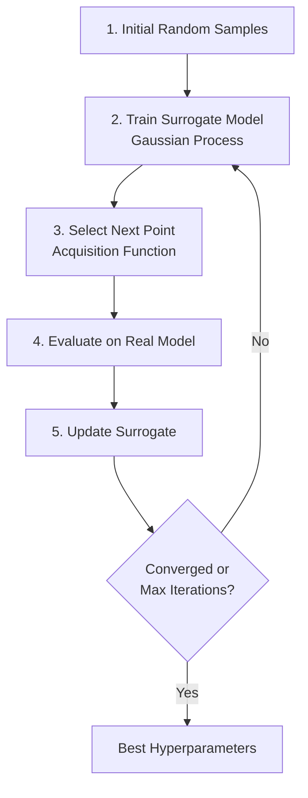

# Bayesian Optimization

## Overview

Bayesian Optimization is a sample-efficient hyperparameter optimization technique that uses a probabilistic model (surrogate) to guide the search in high-dimensional spaces.

## Bayesian Optimization Workflow



## Gaussian Process Surrogate

```python
# Databricks-integrated Bayesian optimization

from hyperopt import hp, fmin, tpe, STATUS_OK, Trials, space_eval
from sklearn.ensemble import RandomForestClassifier
from sklearn.metrics import accuracy_score
import mlflow

# Define search space

space = {
    'max_depth': hp.choice('max_depth', range(3, 20)),
    'min_samples_split': hp.choice('min_samples_split', range(2, 20)),
    'min_samples_leaf': hp.choice('min_samples_leaf', range(1, 10)),
    'n_estimators': hp.choice('n_estimators', range(50, 500, 50)),
    'learning_rate': hp.loguniform('learning_rate', -5, 0)  # log scale
}

# Objective function (minimize negative accuracy)

def objective(params):
    """Objective function for Bayesian optimization"""
    
    with mlflow.start_run(nested=True):
        # log hyperparameters
        mlflow.log_params(params)
        
        # Train model
        rf = RandomForestClassifier(
            max_depth=int(params['max_depth']),
            min_samples_split=int(params['min_samples_split']),
            min_samples_leaf=int(params['min_samples_leaf']),
            n_estimators=int(params['n_estimators']),
            random_state=42
        )
        
        rf.fit(X_train, y_train)
        predictions = rf.predict(X_val)
        accuracy = accuracy_score(y_val, predictions)
        
        # Log metrics
        mlflow.log_metric("accuracy", accuracy)
        
        # Hyperopt minimizes, so return negative accuracy
        return {'loss': -accuracy, 'status': STATUS_OK}

# Run Bayesian optimization with Tree-structured Parzen Estimator

trials = Trials()
best_hyperparams = fmin(
    fn=objective,
    space=space,
    algo=tpe.suggest,  # Algorithm: Tree-structured Parzen Estimator
    max_evals=100,  # Number of trials
    trials=trials,
    rstate=42,
    verbose=1
)

# Get best parameters

print(f"Best hyperparameters: {best_hyperparams}")
best_params = space_eval(space, best_hyperparams)
```

### Gaussian Process Details

```python
import numpy as np
from sklearn.gaussian_process import GaussianProcessRegressor
from sklearn.gaussian_process.kernels import RBF, Matern, ConstantKernel

# Surrogate model: Gaussian Process

kernel = ConstantKernel(1.0) * Matern(length_scale=1.0, nu=2.5)

gp = GaussianProcessRegressor(
    kernel=kernel,
    alpha=1e-6,
    normalize_y=True,
    n_restarts_optimizer=5,
    random_state=42
)

# Train on observed hyperparameter-performance pairs
# X: hyperparameters, y: validation scores

X_observed = np.array([...])  # Historical observations
y_observed = np.array([...])  # Performance values

gp.fit(X_observed, y_observed)

# Predict mean and uncertainty at new points

X_new = np.array([...])  # Candidate hyperparameters
y_pred, sigma = gp.predict(X_new, return_std=True)

print(f"Predicted performance: {y_pred}")
print(f"Uncertainty: {sigma}")  # Higher = more uncertain
```

## Acquisition Functions

```python
import numpy as np

class AcquisitionFunctions:
    """Common acquisition functions for Bayesian optimization"""
    
    @staticmethod
    def expected_improvement(y_pred, sigma, y_best, xi=0.01):
        """Expected Improvement"""
        # x with highest expected improvement favors exploitation
        
        with np.errstate(divide='warn'):
            imp = y_pred - y_best - xi
            Z = imp / sigma
            ei = imp * norm.cdf(Z) + sigma * norm.pdf(Z)
        
        return ei
    
    @staticmethod
    def upper_confidence_bound(y_pred, sigma, kappa=2.576):
        """Upper Confidence Bound"""
        # Balances exploitation (high mean) and exploration (high uncertainty)
        
        ucb = y_pred + kappa * sigma
        return ucb
    
    @staticmethod
    def probability_of_improvement(y_pred, sigma, y_best, xi=0.01):
        """Probability of Improvement"""
        
        with np.errstate(divide='warn'):
            imp = y_pred - y_best - xi
            poi = norm.cdf(imp / sigma)
        
        return poi
    
    @staticmethod
    def entropy_search(y_pred, sigma):
        """Entropy Search"""
        # Minimizes entropy of maximum
        
        entropy = 0.5 * np.log(2 * np.pi * np.e * sigma**2)
        return entropy

# Comparison

print("Expected Improvement: Balances local improvement with reduction of uncertainty")
print("Upper Confidence Bound: Principled trade-off between exploitation and exploration")
print("Probability of Improvement: Greedy, focuses on likely improvement")
```

## Tree-structured Parzen Estimator (TPE)

```python

# TPE is the default in Hyperopt
# How it works:

"""
TPE vs Gaussian Process:
- GP: Uses single surrogate model (smooth approximation)
- TPE: Fits separate models for good vs bad parameters
  
TPE Advantages:
1. More efficient in high dimensions
2. Handles categorical variables naturally
3. No kernel selection needed
4. Scales to 1000+ dimensions
"""

# TPE implementation

from hyperopt import hp, fmin, tpe, Trials, space_eval

# TPE-specific tuning

best = fmin(
    fn=objective,
    space=space,
    algo=tpe.suggest,
    max_evals=100,
    trials=trials,
    
    # TPE hyperparameters
    # startup_jobs: number of initial random samples
    # n_startup_jobs is set internally based on dimensionality
    
    verbose=1
)

def early_stop_with_tpe(trials, best_loss_threshold):
    """Stop if no improvement for N iterations"""
    
    trials_list = [t['result']['loss'] for t in trials.trials]
    
    if len(trials_list) > 20:
        recent = trials_list[-10:]
        best_recent = min(recent)
        best_overall = min(trials_list[:10])
        
        # Stop if no improvement in last 10 trials
        if best_recent > best_overall * 0.99:
            return True  # Stop
    
    return False
```

## Distributed Bayesian Optimization

```python
from databricks.labs.mlflow.client import DatabricksMLflowClient
from hyperopt import hp, fmin, tpe, Trials, SparkTrials
import mlflow

# Use SparkTrials for distributed evaluation

spark_trials = SparkTrials(parallelism=16)  # 16 parallel workers

space = {
    'max_depth': hp.choice('max_depth', range(3, 20)),
    'learning_rate': hp.loguniform('learning_rate', -5, 0),
    'lambda': hp.uniform('lambda', 0, 1)
}

def objective_distributed(params):
    """Objective that logs to MLflow"""
    with mlflow.start_run(nested=True):
        mlflow.log_params(params)
        
        # Train and evaluate
        model = train_model(X_train, y_train, params)
        score = evaluate_model(model, X_val, y_val)
        
        mlflow.log_metric("score", score)
        
        return {'loss': -score, 'status': STATUS_OK}

# Distributed Bayesian optimization

best = fmin(
    fn=objective_distributed,
    space=space,
    algo=tpe.suggest,
    max_evals=200,
    trials=spark_trials,
    verbose=1
)

print(f"Best hyperparameters: {space_eval(space, best)}")
```

## Practical Multi-Algorithm Tuning

```python
# Combine multiple algorithms for robust optimization

from hyperopt import atpe, rand

def advanced_bayesian_tuning(train_data, val_data, param_space, max_evals=100):
    """Production-grade Bayesian optimization"""
    
    trials = Trials()
    
    # Hybrid approach: TPE with initial random exploration
    best = fmin(
        fn=objective,
        space=param_space,
        algo=tpe.suggest,  # Mostly TPE
        max_evals=max_evals,
        trials=trials,
        rstate=42
    )
    
    # Extract results
    results_df = pd.DataFrame([
        {
            "trial_id": trial["tid"],
            "loss": trial["result"]["loss"],
            "hyperparams": trial["misc"]["vals"]
        }
        for trial in trials.trials
    ])
    
    # Analysis
    convergence = results_df['loss'].rolling(10).min()
    
    return best, results_df, convergence

# Stopping Criteria

def should_stop_optimization(trials_df, patience=10):
    """Check if optimization should stop"""
    
    if len(trials_df) < patience:
        return False
    
    recent_losses = trials_df['loss'].tail(patience).values
    best_in_recent = min(recent_losses)
    best_overall = min(trials_df['loss'].values)
    
    # Stop if no improvement in last 10 iterations
    improvement = (best_overall - best_in_recent) / best_overall
    
    return improvement < 0.001  # Less than 0.1% improvement
```

## Real-World Example: XGBoost Tuning

```python
from hyperopt import hp, fmin, tpe, Trials, space_eval
from xgboost import XGBClassifier
from sklearn.metrics import roc_auc_score
import mlflow

# Define XGBoost hyperparameter space

xgb_space = {
    'n_estimators': hp.choice('n_estimators', range(50, 500, 50)),
    'max_depth': hp.choice('max_depth', range(3, 15)),
    'learning_rate': hp.loguniform('learning_rate', -4, 0),  # 0.01-1
    'subsample': hp.uniform('subsample', 0.5, 1.0),
    'colsample_bytree': hp.uniform('colsample_bytree', 0.5, 1.0),
    'reg_lambda': hp.loguniform('reg_lambda', -2, 1),
    'reg_alpha': hp.loguniform('reg_alpha', -2, 1)
}

def xgb_objective(params):
    """XGBoost objective for Bayesian optimization"""
    
    with mlflow.start_run(nested=True):
        mlflow.log_params(params)
        
        xgb = XGBClassifier(
            **{k: int(v) if k != 'learning_rate' else v 
               for k, v in params.items()},
            random_state=42,
            eval_metric='auc'
        )
        
        xgb.fit(
            X_train, y_train,
            eval_set=[(X_val, y_val)],
            early_stopping_rounds=10,
            verbose=0
        )
        
        y_pred_proba = xgb.predict_proba(X_val)[:, 1]
        auc_score = roc_auc_score(y_val, y_pred_proba)
        
        mlflow.log_metric("auc", auc_score)
        
        return {'loss': -auc_score, 'status': 'ok'}

# Run optimization

trials = Trials()
best_params = fmin(
    fn=xgb_objective,
    space=xgb_space,
    algo=tpe.suggest,
    max_evals=100,
    trials=trials,
    verbose=1
)

# Get best configuration

best_config = space_eval(xgb_space, best_params)
print(f"Best XGBoost config: {best_config}")
```

## Key Takeaways

- Bayesian Optimization uses probabilistic surrogate model
- Tree-structured Parzen Estimator (TPE) efficient for high dimensions
- Acquisition functions balance exploration vs exploitation
- Gaussian Process captures uncertainty
- Distributed trials enable parallel evaluation
- Early stopping and convergence criteria reduce tuning time

## Practice Questions

> [!success]- Question 1: When to Use Bayesian Optimization?
> When should you use Bayesian Optimization vs Grid Search?
>
> **Answer: Bayesian Optimization for high-dimensional, expensive evaluations**
>
> - Grid: Good for <100 total combinations
>
> - Bayesian: Better for >10 dimensions, expensive evaluations
>
> - Bayesian usually needs only 10-20% of budget of Grid
>
> [!success]- Question 2: Acquisition Functions
> What trade-off do acquisition functions balance?
>
> **Answer: Exploration vs Exploitation**
>
> - Exploitation: Sample where model predicts high values
>
> - Exploration: Sample where model is uncertain
>
> - Upper Confidence Bound balances both explicitly

## Use Cases

- **High-Dimensional XGBoost Tuning**: Using Hyperopt with TPE to efficiently search a 7-dimensional XGBoost parameter space (max_depth, learning_rate, subsample, colsample_bytree, reg_alpha, reg_lambda, n_estimators) in 100 trials, finding near-optimal configurations that grid search would take 50x longer to discover.
- **Efficient Tuning of Expensive Deep Learning Models**: Using TPE-based Bayesian optimization to find optimal learning rate, dropout, and layer-size combinations in 50 trials instead of the 500+ a grid search would require, saving hours of GPU compute.

## Common Issues & Errors

### Search Space Defined Incorrectly

**Scenario:** `hp.choice('learning_rate', [0.01, 0.05, 0.1])` returns an index (0, 1, 2) instead of the actual float value, causing the model to train with integer learning rates and produce poor results.
**Fix:** Use `space_eval(space, best)` to convert indices back to actual values after `fmin()` completes. For continuous parameters, prefer `hp.loguniform` or `hp.uniform` which return the actual float value directly, avoiding the index-mapping issue entirely.

### Hyperopt Trials All Return Same Result

**Scenario:** Every trial logged by `fmin()` reports nearly identical loss values, suggesting the surrogate model is not exploring the space.
**Fix:** Check that `hp.choice` index values are being converted back to actual parameter values before training (use `space_eval(space, best)` for the final result). Also verify the objective function returns `{'loss': ..., 'status': STATUS_OK}` -- missing the `status` key silently breaks TPE updates.

## Related Topics

- [Tuning Fundamentals](01-tuning-fundamentals.md)
- [Distributed Tuning](03-distributed-tuning.md)

---

**[← Previous: Hyperparameter Tuning Fundamentals](./01-tuning-fundamentals.md) | [↑ Back to Hyperparameter Optimization](./README.md) | [Next: Distributed Hyperparameter Tuning](./03-distributed-tuning.md) →**
