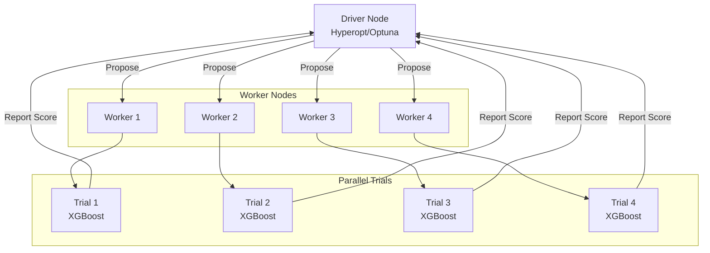

# Distributed Hyperparameter Tuning

## Overview

Scaling hyperparameter optimization to large distributed systems using Spark, XGBoost, and specialized frameworks for enterprise ML.

## Distributed Tuning Architecture



## 1. Distributed XGBoost Tuning

```python
from pyspark.ml.tuning import CrossValidator, ParamGridBuilder
from sparkxgb import XGBoostClassifier
from pyspark.ml.evaluation import BinaryClassificationEvaluator
import mlflow

# XGBoost on Spark (distributed training)
xgb_classifier = XGBoostClassifier(
    featuresCol="features",
    labelCol="label",
    predictionCol="prediction",
    # XGBoost specific parameters
    num_workers=8,
    use_gpu=True,  # GPU acceleration
    gpu_id=0
)

# Define distributed parameter grid
param_grid = (
    ParamGridBuilder()
    .addGrid(xgb_classifier.max_depth, [3, 5, 7, 9])
    .addGrid(xgb_classifier.learning_rate, [0.01, 0.05, 0.1, 0.2])
    .addGrid(xgb_classifier.reg_lambda, [0, 0.5, 1.0])
    .addGrid(xgb_classifier.subsample, [0.6, 0.8, 1.0])
    .addGrid(xgb_classifier.num_round, [50, 100, 200])
    .build()
)

print(f"Total parameter combinations: {len(param_grid)}")

# Cross-validation with parallelism
evaluator = BinaryClassificationEvaluator(metricName="areaUnderROC")

cv = CrossValidator(
    estimator=xgb_classifier,
    estimatorParamMaps=param_grid,
    evaluator=evaluator,
    numFolds=5,
    parallelism=8,  # Run 8 models in parallel
    seed=42
)

# Start MLflow tracking
mlflow.start_run(run_name="xgboost_distributed_tuning")

# Fit with distributed computing
cv_model = cv.fit(train_df)

# Log results
mlflow.log_param("total_combinations", len(param_grid))
mlflow.log_metric("best_cv_score", max(cv_model.avgMetrics))
mlflow.log_param("num_folds", 5)
mlflow.log_param("parallelism", 8)

mlflow.end_run()

# Get best model
best_model = cv_model.bestModel
print(f"Best ROC-AUC: {max(cv_model.avgMetrics):.4f}")
```

## 2. Spark Trials with Hyperopt

```python
from hyperopt import hp, fmin, tpe, SparkTrials, space_eval, Trials
from pyspark.ml import PipelineModel
import mlflow

# Define search space for distributed optimization
space = {
    'max_depth': hp.choice('max_depth', range(3, 15)),
    'learning_rate': hp.loguniform('learning_rate', -5, 0),
    'min_child_weight': hp.choice('min_child_weight', range(1, 7)),
    'subsample': hp.uniform('subsample', 0.5, 1.0),
    'colsample_bytree': hp.uniform('colsample_bytree', 0.5, 1.0),
    'reg_alpha': hp.loguniform('reg_alpha', -2, 1),
    'reg_lambda': hp.loguniform('reg_lambda', -2, 1)
}

def objective_spark(params):
    """Objective function for Spark distributed optimization"""
    
    with mlflow.start_run(nested=True):
        mlflow.log_params(params)
        
        from xgboost import XGBClassifier
        from sklearn.metrics import roc_auc_score
        
        # Train model
        model = XGBClassifier(
            max_depth=int(params['max_depth']),
            learning_rate=params['learning_rate'],
            min_child_weight=int(params['min_child_weight']),
            subsample=params['subsample'],
            colsample_bytree=params['colsample_bytree'],
            reg_alpha=params['reg_alpha'],
            reg_lambda=params['reg_lambda'],
            n_estimators=100,
            random_state=42
        )
        
        # Convert Spark DataFrame to Pandas for sklearn model
        X_train_pd = train_df.select("features").toPandas()
        y_train_pd = train_df.select("label").toPandas()
        
        model.fit(X_train_pd, y_train_pd)
        
        # Evaluate
        X_val_pd = val_df.select("features").toPandas()
        y_val_pd = val_df.select("label").toPandas()
        
        y_pred_proba = model.predict_proba(X_val_pd)[:, 1]
        auc = roc_auc_score(y_val_pd, y_pred_proba)
        
        mlflow.log_metric("auc", auc)
        
        return {'loss': -auc, 'status': 'ok'}

# Distributed trials
spark_trials = SparkTrials(
    parallelism=16,  # Number of parallel workers
    timeout=3600  # Timeout per trial in seconds
)

# Run distributed optimization
best = fmin(
    fn=objective_spark,
    space=space,
    algo=tpe.suggest,
    max_evals=100,  # Total evaluations
    trials=spark_trials,
    verbose=1
)

best_params = space_eval(space, best)
print(f"Best parameters: {best_params}")
```

## 3. Population-Based Training (PBT)

```python
# PBT: Evolutionary approach with migration
from datetime import datetime
import random

class PopulationBasedTraining:
    """Simple PBT implementation"""
    
    def __init__(self, population_size=16, generations=20):
        self.population_size = population_size
        self.generations = generations
        self.population = []
    
    def initialize_population(self, param_space):
        """Initialize random population"""
        for i in range(self.population_size):
            individual = {
                "id": i,
                "params": self._random_params(param_space),
                "score": 0,
                "ready_to_evaluate": True
            }
            self.population.append(individual)
    
    def _random_params(self, param_space):
        """Generate random parameters"""
        return {
            k: random.uniform(v["min"], v["max"]) 
            for k, v in param_space.items()
        }
    
    def evaluate_population(self, train_func):
        """Evaluate all ready individuals"""
        for individual in self.population:
            if individual["ready_to_evaluate"]:
                score = train_func(individual["params"])
                individual["score"] = score
                individual["ready_to_evaluate"] = False
    
    def exploit_and_explore(self, param_space):
        """PBT exploration-exploitation step"""
        # Sort by score
        self.population.sort(key=lambda x: x["score"], reverse=True)
        
        # Bottom half replaced by variants of top performers
        mid_point = len(self.population) // 2
        
        for i in range(mid_point, len(self.population)):
            # Select top performer
            top_performer = random.choice(self.population[:mid_point])
            
            # Copy and mutate
            self.population[i]["params"] = self._mutate_params(
                top_performer["params"],
                param_space
            )
            self.population[i]["ready_to_evaluate"] = True
    
    def _mutate_params(self, params, param_space, mutation_rate=0.25):
        """Mutate parameters"""
        mutated = params.copy()
        
        for key in mutated:
            if random.random() < mutation_rate:
                # Random reset or scale
                if random.random() < 0.5:
                    # Random reset
                    mutated[key] = random.uniform(
                        param_space[key]["min"],
                        param_space[key]["max"]
                    )
                else:
                    # Scale by 0.8-1.2
                    mutated[key] *= random.uniform(0.8, 1.2)
        
        return mutated
    
    def run(self, param_space, train_func):
        """Run PBT optimization"""
        self.initialize_population(param_space)
        
        for generation in range(self.generations):
            print(f"Generation {generation + 1}/{self.generations}")
            
            # Evaluate
            self.evaluate_population(train_func)
            
            # Exploit and explore
            self.exploit_and_explore(param_space)
            
            # Report best
            best = max(self.population, key=lambda x: x["score"])
            print(f"  Best score: {best['score']:.4f}")
        
        return max(self.population, key=lambda x: x["score"])
```

## 4. Ray Tune for Distributed Hyperparameter Optimization

```python
from ray import tune
from ray.tune import CLIReporter
from ray.tune.schedulers import PopulationBasedTraining
import time

def training_function(config):
    """Objective function for Ray Tune"""
    
    # Train model with config
    model = train_model(config)
    
    # Evaluate multiple times for tracking
    for epoch in range(config.get("epochs", 10)):
        score = evaluate_model(model)
        
        # Report intermediate result
        tune.report(score=score, epoch=epoch)

# Define search space
config = {
    "learning_rate": tune.loguniform(1e-4, 1e-1),
    "batch_size": tune.choice([32, 64, 128, 256]),
    "epochs": 10
}

# Ray Tune with PBT scheduler
pbt_scheduler = PopulationBasedTraining(
    time_attr="epoch",
    perturbation_interval=2,
    hyperparam_mutations={
        "learning_rate": [1e-4, 1e-3, 1e-2, 1e-1],
        "batch_size": [32, 64, 128, 256]
    }
)

tuner = tune.Tuner(
    tune.with_distributed(training_function),
    param_space=config,
    tune_config=tune.TuneConfig(
        num_samples=16,  # 16 parallel trials
        scheduler=pbt_scheduler,
        max_concurrent_trials=16
    )
)

results = tuner.fit()
best_result = results.get_best_result(metric="score", mode="max")
print(f"Best config: {best_result.config}")
```

## 5. Optuna for Distributed Tuning

```python
import optuna
from optuna.integration import PyTorchLightningPruningCallback
import mlflow

def create_optuna_study():
    """Create Optuna study for distributed optimization"""
    
    def objective(trial):
        # Suggest hyperparameters
        learning_rate = trial.suggest_float("learning_rate", 1e-5, 1e-1, log=True)
        max_depth = trial.suggest_int("max_depth", 3, 15)
        l2_regularization = trial.suggest_float("l2_reg", 0, 1)
        
        with mlflow.start_run(nested=True) as run:
            mlflow.log_params({
                "learning_rate": learning_rate,
                "max_depth": max_depth,
                "l2_regularization": l2_regularization
            })
            
            # Train model
            model = train_model(
                learning_rate=learning_rate,
                max_depth=max_depth,
                l2_regularization=l2_regularization
            )
            
            # Evaluate with pruning
            score = evaluate_model(model)
            
            mlflow.log_metric("auc", score)
            
            return score
    
    # Create study with pruning
    sampler = optuna.samplers.TPESampler(seed=42)
    pruner = optuna.pruners.MedianPruner()
    
    study = optuna.create_study(
        direction="maximize",
        sampler=sampler,
        pruner=pruner
    )
    
    return study, objective

# Run distributed optimization
study, objective = create_optuna_study()

study.optimize(
    objective,
    n_trials=100,
    n_jobs=16,  # Parallel jobs
    show_progress_bar=True
)

print(f"Best trial: {study.best_value}")
print(f"Best params: {study.best_params}")
```

## Scaling Considerations

```python
# Memory and computation estimation
def estimate_tuning_resources(param_space, max_evals, model_training_time_sec):
    """Estimate resources needed for tuning"""
    
    # Number of combinations
    combinations = 1
    for param in param_space.values():
        combinations *= param["num_values"]
    
    # Estimate total time
    if combinations < max_evals:
        # Grid search - all combinations
        total_time = combinations * model_training_time_sec
    else:
        # Sampling - max_evals
        total_time = max_evals * model_training_time_sec
    
    # Parallelism speedup
    parallel_workers = 16
    actual_time = total_time / parallel_workers
    
    print(f"Single-threaded time: {total_time/3600:.1f} hours")
    print(f"With {parallel_workers} workers: {actual_time/3600:.1f} hours")
    
    return actual_time

# Communication overhead
def estimate_communication_overhead(num_trials, num_workers, data_size_gb):
    """Communication cost in distributed tuning"""
    
    # Cost per trial: data broadcast + results
    bytes_per_trial = data_size_gb * 1e9
    total_bytes = bytes_per_trial * num_trials
    
    # Network bandwidth (10 Gbps)
    bandwidth_bps = 10e9
    time_overhead = total_bytes / bandwidth_bps
    
    print(f"Communication time: {time_overhead:.1f} seconds")
    
    return time_overhead
```

## Key Exam Concepts

- Distributed tuning via Spark parallelism and SparkTrials
- XGBoost native distributed training with GPU support
- Population-based training with evolutionary algorithms
- Ray Tune for multi-framework distributed optimization
- Communication overhead critical in large-scale tuning
- Trade-off between parallelism and synchronization

## Practice Questions

> [!success]- Question 1: Parallelism in Tuning
> What limits the parallelism in distributed hyperparameter tuning?
>
> **Answer: Synchronization between trials and data communication**
>
> - Each trial needs data (network transfer)
>
> - Driver must coordinate all trials
>
> - 16-32 workers typically optimal per cluster
>
> [!success]- Question 2: PBT vs Bayesian Optimization
> When is Population-Based Training better than Bayesian Optimization?
>
> **Answer: PBT for long-running training with multiple epochs**
>
> - Bayesian: Better for quick evaluation
>
> - PBT: Can adjust hyperparams mid-training based on progress
>
> - PBT naturally parallelizable

## Use Cases

- **Distributed Hyperparameter Tuning Implementation**: Incorporating Distributed Hyperparameter Tuning principles to build scalable and maintainable solutions in Databricks environments.
- **Optimized Distributed Hyperparameter Tuning Workflows**: Using the advanced capabilities of Distributed Hyperparameter Tuning to automate processes and reduce manual operational overhead.

## Common Issues & Errors

### 1. Configuration Oversights
**Scenario:** The default settings for Distributed Hyperparameter Tuning do not scale well with sudden spikes in data volume.
**Fix:** Explicitly define and tune the configuration parameters for Distributed Hyperparameter Tuning to handle production-scale workloads.

### 2. Integration Bottlenecks
**Scenario:** Connecting Distributed Hyperparameter Tuning to other downstream components results in unexpected failures.
**Fix:** Ensure that permissions and network access rules are correctly provisioned for Distributed Hyperparameter Tuning prior to deployment.

## Related Topics

- [Tuning Fundamentals](01-tuning-fundamentals.md)
- [Bayesian Optimization](02-bayesian-optimization.md)
- [AutoML Strategies](04-automl-strategies.md)

---

**[← Back to Hyperparameter Optimization](./README.md)**
