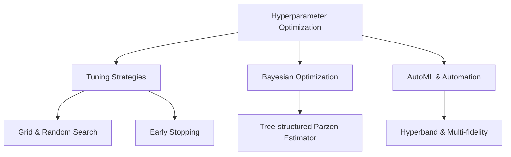

# Hyperparameter Optimization (20% of Exam)

Master advanced hyperparameter tuning strategies, Bayesian optimization, and AutoML for production ML systems.

## Topics Overview

## Section Contents

| File | Topic | Priority |
| :--- | :--- | :--- |
| [01-tuning-fundamentals.md](01-tuning-fundamentals.md) | Search strategies, trade-offs, objectives | High |
| [02-bayesian-optimization.md](02-bayesian-optimization.md) | Bayesian methods, acquisition functions, TPE | High |
| [03-distributed-tuning.md](03-distributed-tuning.md) | Distributed hyperparameter search and XGBoost | High |

## Key Concepts

- **Hyperparameter**: Configuration parameters set before training (learning rate, tree depth, regularization)
- **Bayesian Optimization**: Uses probabilistic model to guide parameter search
- **Early Stopping**: Terminates unpromising trials to save resources
- **Multi-fidelity Optimization**: Coarse approximations to filter candidates before expensive evaluation
- **Objective Function**: Metric to optimize (accuracy, AUC, F1, business metric)

## Related Resources

- [MLflow Basics](../../../shared/fundamentals/mlflow-basics.md)
- [Performance Optimization](../../../shared/cheat-sheets/performance-optimization.md)

## Next Steps

Progress to [03-Model Production Lifecycle](../03-model-production-lifecycle/README.md) to learn about deployment patterns.

---

**[← Back to Certification](../README.md)**
