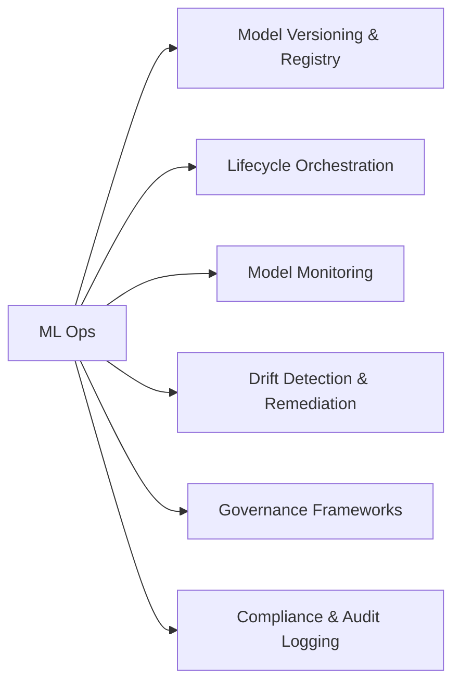

# ML Ops (44 % of Exam)

Equal-largest domain. Covers the full production lifecycle of models on Databricks — registry / versioning, lifecycle orchestration, observability, drift detection, governance, and compliance.

## Topics Overview

## Section Contents

| File | Topic | Priority |
| :--- | :--- | :--- |
| [01-model-versioning-registry.md](./01-model-versioning-registry.md) | UC Model Registry, aliases, version promotion | High |
| [02-model-lifecycle-orchestration.md](./02-model-lifecycle-orchestration.md) | Asset Bundles + Lakeflow Jobs for retrain / deploy | High |
| [03-model-monitoring-observability.md](./03-model-monitoring-observability.md) | Inference Tables, system tables, custom monitors | High |
| [04-drift-detection-remediation.md](./04-drift-detection-remediation.md) | Statistical drift tests, KS / chi-square, automated retraining | High |
| [05-governance-frameworks.md](./05-governance-frameworks.md) | Unity Catalog for AI assets, lineage, model audit | High |
| [06-compliance-audit-logging.md](./06-compliance-audit-logging.md) | system.access.audit, retention, regulated-workloads patterns | High |

## Key Concepts

| Concept | Why it matters |
| :--- | :--- |
| **Model alias promotion** | `set_registered_model_alias(name, alias, version)` — atomic flip from Challenger to Production |
| **Inference Tables** | Auto-captured request/response Delta tables — the audit-of-record |
| **Lakehouse Monitoring** | Built-in monitoring profiles (snapshot / time-series / inference) with drift metrics |
| **KS / chi-square drift tests** | Standard statistical tests; thresholds tuned per use case |
| **Retraining trigger** | Drift detected → Lakeflow Job kicks off the retrain pipeline → new version registered → A/B traffic-split via Model Serving |
| **`system.access.audit`** | UC access events for compliance reporting |

## Related Resources

- [MLflow cheat sheet (shared)](../../../shared/cheat-sheets/mlflow-quick-ref.md)
- [Lakehouse Monitoring documentation](https://docs.databricks.com/en/lakehouse-monitoring/index.html)
- [Hands-on Lab 04 — MLflow tracking and Model Registry in UC](../../../labs/04-mlflow-tracking.md)

---

**[← Previous: Model Development](../01-model-development/README.md) | [↑ Back to ML Professional](../README.md) | [Next: Model Deployment →](../03-model-deployment/README.md)**
