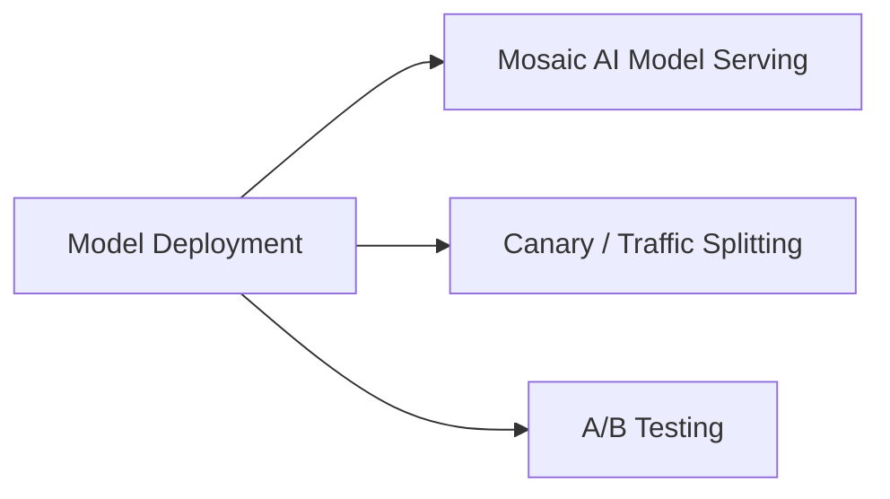

# Model Deployment (12 % of Exam)

How models actually serve in production — Mosaic AI Model Serving endpoints, A/B testing with traffic splitting, canary rollouts.

## Topics Overview

## Section Contents

| File | Topic | Priority |
| :--- | :--- | :--- |
| [01-model-serving-deployment.md](./01-model-serving-deployment.md) | Endpoint config, served entities, scale-to-zero | High |
| [02-ab-testing-canary.md](./02-ab-testing-canary.md) | Traffic config, weighted routes, canary → ramp pattern | High |

## Key Concepts

| Concept | Why it matters |
| :--- | :--- |
| **`served_entities`** | List of UC-registered model versions hosted on one endpoint |
| **`traffic_config`** | Weighted routes summing to 100 % across `served_model_name`s — the canonical A/B mechanism |
| **Scale to zero** | Saves cost; introduces cold-start latency on the first request after idle |
| **Canary deploy** | 5-10 % to a new version, measure quality in Inference Tables, ramp up |
| **Provisioned throughput** | Reserved tokens/sec — predictable latency for production traffic |

## Related Resources

- [Mosaic AI Model Serving documentation](https://docs.databricks.com/en/machine-learning/model-serving/index.html)
- [Hands-on Lab 04 — MLflow tracking and Model Registry in UC](../../../labs/04-mlflow-tracking.md)

---

**[← Previous: ML Ops](../02-ml-ops/README.md) | [↑ Back to ML Professional](../README.md)**
