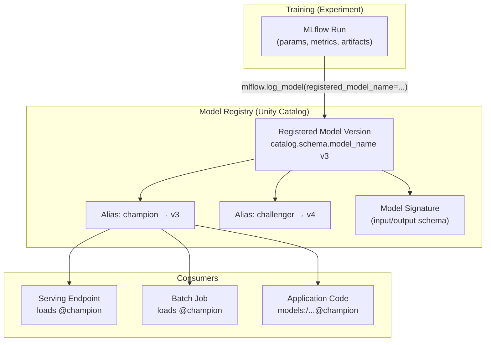

# Model Versioning and Registry

## Overview

In production ML systems, multiple teams train models, experiments diverge, and stakeholders need
confidence that the code running in production is the version that was validated. The **MLflow
Model Registry** solves this by providing a single source of truth for every model your organization
has ever trained and promoted.

Key capabilities the Registry provides:

- **Centralized versioning** — auto-incremented version numbers with full lineage back to the
  training run.
- **Governance** — aliases, tags, and descriptions give operations teams clear signals about which
  version is safe to serve.
- **Reproducibility** — every version links to the exact `run_id`, parameters, and artifacts used
  to produce it.
- **Rollback** — re-pointing the `champion` alias to a previous version restores the old model
  without any code deployment.
- **Multi-team coordination** — Unity Catalog GRANT/REVOKE controls who can register, load, or
  serve each model.

## Registry Architecture



The three-level UC namespace `catalog.schema.model_name` ties models into the same permission,
lineage, and discovery system that governs tables and volumes.

## Unity Catalog vs Workspace Registry

Understanding which registry you are talking to — and why it matters — is a recurring theme in
the ML Professional exam.

| Feature | Unity Catalog Registry | Workspace Registry (Legacy) |
| :--- | :--- | :--- |
| Namespace | `catalog.schema.model_name` | `model_name` (flat) |
| Lineage | Automatic via UC lineage graph | None |
| Access control | `GRANT`/`REVOKE` on model objects | Workspace ACLs only |
| Cross-workspace access | Yes (via UC) | No |
| Lifecycle mechanism | **Aliases** (no stages) | Stages: None/Staging/Production/Archived |
| Default since | Databricks Runtime 13.x | Pre-13.x clusters |

Switch the registry URI before any registration or loading call:

```python
import mlflow

# Point MLflow client to Unity Catalog registry

mlflow.set_registry_uri("databricks-uc")

# Register directly during training — model lands in UC namespace

with mlflow.start_run() as run:
    mlflow.sklearn.log_model(
        sk_model=model,
        artifact_path="model",
        registered_model_name="ml_catalog.fraud_models.fraud_classifier"
    )
```

**When you MUST use UC:**

- Multiple teams need access to the same model across workspaces.
- Audit/lineage requirements (who trained it, what data, what downstream tables depend on it).
- You need fine-grained `GRANT EXECUTE` / `GRANT MODIFY` per team or service principal.

If `mlflow.set_registry_uri("databricks-uc")` is omitted, models go to the workspace registry
(flat namespace, no lineage) — a common misconfiguration that trips teams up in practice and
appears frequently in exam scenarios.

## Model Versions and Metadata

Each call to `log_model()` with `registered_model_name` creates a new **model version** with an
auto-incrementing integer (1, 2, 3, ...). The version record stores:

- **`run_id`** — traces back to the exact training run, its parameters and metrics.
- **`description`** — free-text human-readable notes for operators and reviewers.
- **Tags** — structured key-value metadata that can be filtered programmatically.
- **`creation_timestamp`** — immutable audit record.
- **Model signature** — the input/output schema validated at serving time.

Use `MlflowClient` to inspect and annotate versions:

```python
from mlflow import MlflowClient

client = MlflowClient(registry_uri="databricks-uc")

# List all registered versions for a model

versions = client.search_model_versions(
    "name='ml_catalog.fraud_models.fraud_classifier'"
)
for v in versions:
    print(f"Version {v.version}: run_id={v.run_id}, tags={v.tags}")

# Add a human-readable description to a specific version

client.update_model_version(
    name="ml_catalog.fraud_models.fraud_classifier",
    version="3",
    description="XGBoost v2 trained on Q4 2025 data, AUC=0.94"
)

# Attach structured metadata that code and dashboards can filter on

client.set_model_version_tag(
    name="ml_catalog.fraud_models.fraud_classifier",
    version="3",
    key="training_date",
    value="2025-12-15"
)
```

Tags are especially useful for tracking which data snapshot or feature store snapshot was used,
making it straightforward to answer "which model version was trained before the data breach?" in
a post-incident review.

## Model Aliases (Modern Approach)

**Aliases** are named, mutable pointers to specific model versions. They are the Unity Catalog
replacement for lifecycle stages and the recommended mechanism for all new workloads.

Standard alias vocabulary (team convention, not enforced by MLflow):

| Alias | Meaning |
| :--- | :--- |
| `champion` | The version currently serving production traffic |
| `challenger` | A candidate version undergoing A/B or shadow testing |
| `baseline` | A frozen reference version for regression benchmarking |

```python
# Promote version 3 to champion — single API call, no code deployment needed

client.set_registered_model_alias(
    name="ml_catalog.fraud_models.fraud_classifier",
    alias="champion",
    version="3"
)

# Application code references the alias — version number never appears in app code

model = mlflow.pyfunc.load_model(
    "models:/ml_catalog.fraud_models.fraud_classifier@champion"
)

# Point challenger at the new experimental version

client.set_registered_model_alias(
    name="ml_catalog.fraud_models.fraud_classifier",
    alias="challenger",
    version="4"
)

# Remove alias when A/B test concludes and challenger is either promoted or discarded

client.delete_registered_model_alias(
    name="ml_catalog.fraud_models.fraud_classifier",
    alias="challenger"
)
```

The key advantage of aliases over hardcoded version numbers: **promoting a new champion is an
API call, not a code deployment**. Every downstream job and endpoint that loads `@champion`
automatically picks up the new version the next time it initializes.

## Legacy Lifecycle Stages (Know for the Exam)

The workspace (non-UC) registry uses four string stages: `None`, `Staging`, `Production`,
`Archived`. Exam questions on the legacy registry appear alongside newer UC content, so you need
to know both.

```python
# Transition a version to Production stage (workspace registry only)

client.transition_model_version_stage(
    name="fraud_classifier",
    version="3",
    stage="Production",
    archive_existing_versions=True  # automatically archives the previous Production version
)

# Load by stage name — note the capital P

model = mlflow.pyfunc.load_model("models:/fraud_classifier/Production")
```

Key exam facts about stages:

- `archive_existing_versions=True` is a safety flag that prevents two versions from being
  `Production` simultaneously.
- Stages are **not supported** in the Unity Catalog registry — attempting to use them raises an
  error.
- The equivalent of "move to Production" in UC is `set_registered_model_alias(..., alias="champion")`.

## Model Signatures

A **model signature** declares the expected input column names, types, and output schema. MLflow
enforces the signature at serving time and raises a `MlflowException` if the payload does not
conform.

```python
from mlflow.models.signature import infer_signature

# Infer input schema from training features and output schema from predictions

signature = infer_signature(X_train, model.predict(X_train))

# Log model with signature and an input example for debugging

mlflow.sklearn.log_model(
    sk_model=model,
    artifact_path="model",
    signature=signature,
    input_example=X_train[:5],  # stored as JSON in the artifact; shown in the UI
    registered_model_name="ml_catalog.fraud_models.fraud_classifier"
)
```

Why signatures matter in production:

- **Schema enforcement** — rejects malformed requests before they reach model code.
- **Serving documentation** — the UI displays expected column types automatically.
- **Debugging** — `input_example` shows ops teams a valid sample payload during incident response.

Common pitfall: inferring the signature from a `StandardScaler`-transformed array loses the
original column names. Always pass the **raw** feature DataFrame (before scaling) as the
`model_input` argument to `infer_signature`, and ensure your pipeline wraps the scaler so the
final artifact accepts raw inputs.

## Searching and Comparing Models

```python
# Filter versions by tag — useful for audits and automated promotion pipelines

results = client.search_model_versions(
    filter_string=(
        "name='ml_catalog.fraud_models.fraud_classifier' "
        "AND tags.training_date='2025-12-15'"
    )
)

# Retrieve the champion version and pull its training metrics for comparison

alias_mv = client.get_model_version_by_alias(
    name="ml_catalog.fraud_models.fraud_classifier",
    alias="champion"
)
run = mlflow.get_run(alias_mv.run_id)
champion_auc = run.data.metrics["auc"]
print(f"Champion AUC: {champion_auc:.4f}")

# Compare to challenger before deciding to promote

challenger_mv = client.get_model_version_by_alias(
    name="ml_catalog.fraud_models.fraud_classifier",
    alias="challenger"
)
challenger_run = mlflow.get_run(challenger_mv.run_id)
challenger_auc = challenger_run.data.metrics["auc"]
print(f"Challenger AUC: {challenger_auc:.4f}")
```

Automated promotion pipelines typically run this comparison in a Databricks Job triggered after
each successful training run, promoting the challenger only if `challenger_auc > champion_auc`
by a statistically significant margin.

## UC Permissions for Models

Unity Catalog uses standard SQL `GRANT`/`REVOKE` syntax on model objects. Three privilege levels
cover most production scenarios:

| Privilege | What it allows |
| :--- | :--- |
| `USE SCHEMA` | Navigate the schema; prerequisite for all model access |
| `EXECUTE` | Load and serve the model (inference); granted to endpoints and serving SPs |
| `MODIFY` | Register new versions, set/delete aliases, update descriptions |
| `ALL PRIVILEGES` | Full ownership-equivalent control |

```sql
-- Data science team can register new versions and set aliases
GRANT MODIFY ON MODEL ml_catalog.fraud_models.fraud_classifier TO `ds-team`;

-- Serving service principal can load and serve the model
GRANT EXECUTE ON MODEL ml_catalog.fraud_models.fraud_classifier TO `serving-sp`;

-- Read-only analysts can discover the model and its metadata
GRANT USE SCHEMA ON SCHEMA ml_catalog.fraud_models TO `analyst-group`;
```

Least-privilege approach: production serving service principals receive only `EXECUTE`. The
`MODIFY` privilege (which allows alias changes) is restricted to the ML engineering team and CI/CD
service principals.

## Common Pitfalls

| Pitfall | Consequence | Fix |
| :--- | :--- | :--- |
| Omitting `mlflow.set_registry_uri("databricks-uc")` | Model lands in flat workspace registry, no lineage | Always set at top of training script |
| Hardcoded version numbers in app code | Code deployment required to change model | Use `@champion` alias URI |
| Inferring signature from scaled/transformed data | Column name mismatch causes serving 4xx | Infer from raw pre-processing input |
| Mixing aliases and stages in the same workflow | Confusing state; stages unsupported in UC | Standardize on aliases for all new models |
| No `input_example` logged | Harder to debug serving payload issues | Always include 3-5 row sample |
| Granting `MODIFY` to serving SP | SP could overwrite champion alias accidentally | Use `EXECUTE` only for serving principals |

## Practice Questions

> [!success]- Question 1: UC Registry vs Workspace Registry
>
> Your organization requires cross-workspace model access and automatic data lineage tracking.
> A colleague suggests using the MLflow workspace registry. What is the primary reason to use
> the Unity Catalog registry instead?
>
> A) The UC registry supports more model flavors than the workspace registry
> B) The UC registry provides a three-level namespace, automatic lineage, and fine-grained GRANT/REVOKE access control
> C) The UC registry version numbers start at 0 instead of 1
> D) The workspace registry does not support model signatures
>
> **Correct Answer: B**
>
> The Unity Catalog registry integrates with UC's lineage graph (tracking which tables were used
> to train each version), supports cross-workspace access, and uses standard SQL `GRANT`/`REVOKE`
> for model objects. The workspace registry offers none of these capabilities. Options A, C, and D
> describe behaviors that do not differ between the two registries.

---

> [!success]- Question 2: Loading a Model by Alias
>
> A serving endpoint needs to always load whichever model version the ML team has designated as
> production-ready, without requiring an endpoint redeployment when the team promotes a new
> version. Which model URI format achieves this?
>
> A) `models:/ml_catalog.fraud_models.fraud_classifier/3`
> B) `runs:/<run_id>/model`
> C) `models:/ml_catalog.fraud_models.fraud_classifier@champion`
> D) `dbfs:/mnt/models/fraud_classifier/v3`
>
> **Correct Answer: C**
>
> The `@alias` URI format (`models:/...@champion`) is a mutable pointer. When the ML team calls
> `set_registered_model_alias(..., alias="champion", version="5")`, any code that loads
> `@champion` picks up version 5 automatically — no URI or code change required. Option A
> hardcodes version 3. Option B is a run artifact path, not a registry path. Option D is a
> raw DBFS path with no registry governance.

---

> [!success]- Question 3: Missing set_registry_uri
>
> A data scientist runs the following code on a cluster with Databricks Runtime 13.3:
>
> ```python
> import mlflow
> with mlflow.start_run():
>     mlflow.sklearn.log_model(
>         sk_model=model,
>         artifact_path="model",
>         registered_model_name="ml_catalog.fraud_models.fraud_classifier"
>     )
> ```
>
> The scientist expected to find the model at `ml_catalog.fraud_models.fraud_classifier` in
> Unity Catalog, but it does not appear there. What is the most likely cause?
>
> A) The model flavor `sklearn` is not supported in Unity Catalog
> B) `mlflow.set_registry_uri("databricks-uc")` was not called, so MLflow used the workspace registry
> C) The model name contains dots, which are not allowed in registered model names
> D) Unity Catalog model registration requires Databricks Runtime 14.0 or higher
>
> **Correct Answer: B**
>
> Without `mlflow.set_registry_uri("databricks-uc")`, the MLflow client defaults to the workspace
> registry. The model was registered successfully — just to the wrong registry under a flat name.
> Dots in the name format `catalog.schema.model` are only interpreted correctly when the UC
> registry URI is active. Options A, C, and D are all incorrect.

## Use Cases

- **Multi-Environment Model Promotion**: Registering model versions in a `dev` catalog, promoting to `staging` via alias, running automated evaluation gates, then setting the `champion` alias in the `prod` catalog -- all through CI/CD without manual registry interaction.
- **Automated Champion Promotion in CI/CD**: A GitHub Actions pipeline trains a new model, registers it to Unity Catalog, compares metrics against `@champion`, and calls `set_registered_model_alias("champion", new_version)` only if the challenger wins -- zero manual intervention.

## Common Issues & Errors

### Artifact Access Denied

**Scenario:** Models fail to load from MLflow registry during serving.
**Fix:** Check Unity Catalog permissions or traditional workspace access controls on the underlying storage.

### Model Version Conflicts in CI/CD

**Scenario:** Two concurrent CI/CD pipelines register versions of the same model at the same time; one pipeline's `set_registered_model_alias("champion", ...)` overwrites the other's promotion silently.
**Fix:** Add a validation step that loads `@champion` and confirms its version matches the one you just promoted. Use `client.get_model_version_by_alias()` immediately after setting the alias to detect race conditions. For critical models, gate promotions behind a manual approval step in the CI/CD workflow.

## Key Takeaways

- **UC vs Workspace registry**: UC registry has a three-level namespace (`catalog.schema.model`), automatic lineage, and SQL GRANT/REVOKE; workspace registry is flat with no lineage
- **`set_registry_uri`**: Must call `mlflow.set_registry_uri("databricks-uc")` before any registration or loading call to target UC; omitting it sends the model to the workspace registry
- **Aliases replace stages**: UC uses `champion`, `challenger`, `baseline` aliases — lifecycle stages (`Staging/Production/Archived`) are not supported in UC
- **Load by alias URI**: `models:/catalog.schema.model@champion` — app code never references a hardcoded version number
- **Promoting a champion is an API call**: `client.set_registered_model_alias(alias="champion", version="5")` updates all downstream consumers automatically
- **Model signature**: Infer from raw (pre-scaler) input DataFrame; enforced at serving time — column name mismatch causes 4xx errors
- **Least-privilege grants**: Serving SPs get `EXECUTE`; ML engineering team gets `MODIFY`; analysts get `USE SCHEMA`

## Related Topics

- [Model Serving & Deployment](02-model-serving-deployment.md)
- [A/B Testing & Canary Deployments](03-ab-testing-canary.md)
- [MLflow Basics](../../../shared/fundamentals/mlflow-basics.md)

---

**[↑ Back to Model Production Lifecycle](./README.md) | [Next: Model Serving and Deployment](./02-model-serving-deployment.md) →**
