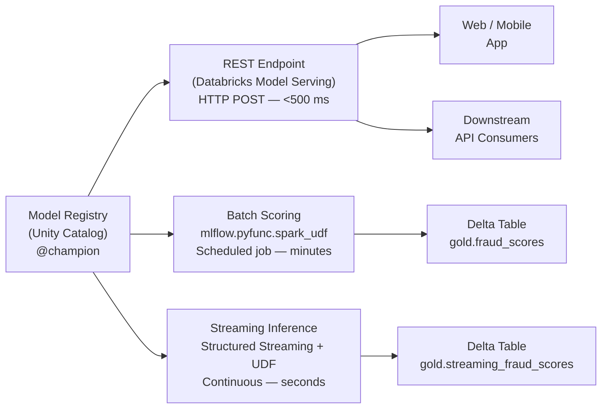

# Model Serving and Deployment

## Overview

Once a model is registered in the MLflow Model Registry, you need to decide **how** it reaches
the systems that depend on it. Databricks supports three fundamentally different deployment
patterns, each with different trade-offs in latency, throughput, and operational complexity:

- **Real-time REST endpoint** — a managed HTTP API that returns predictions in milliseconds,
  suitable for user-facing features and fraud decisioning.
- **Batch scoring via `spark_udf`** — model applied as a distributed Spark transformation across
  millions of rows, writing results to Delta tables on a schedule.
- **Streaming inference** — the `spark_udf` pattern applied inside a Structured Streaming query,
  giving near-real-time scoring with seconds of latency and natural backpressure handling.

Choosing the wrong deployment mode is a common exam trap. The decision turns on two questions:
does the consumer need a result **right now** (real-time), or is a **periodic batch result**
acceptable? And, is the data volume so large that a distributed Spark job is cheaper than
per-record HTTP calls?

## Deployment Architecture



## Databricks Model Serving (REST Endpoints)

Databricks Model Serving manages the compute, autoscaling, and health-check infrastructure so
you focus on the model. Under the hood, each endpoint runs the model inside a containerized
environment derived from the model's `MLmodel` metadata and `pip_requirements`.

Create an endpoint with the Python SDK (the UI also works but is not scriptable):

```python
from databricks.sdk import WorkspaceClient
from databricks.sdk.service.serving import (
    EndpointCoreConfigInput,
    ServedModelInput,
    ServedModelInputWorkloadSize,
)

client = WorkspaceClient()

endpoint = client.serving_endpoints.create(
    name="fraud-classifier-endpoint",
    config=EndpointCoreConfigInput(
        served_models=[
            ServedModelInput(
                model_name="ml_catalog.fraud_models.fraud_classifier",
                model_version="3",
                workload_size=ServedModelInputWorkloadSize.SMALL,
                scale_to_zero_enabled=True,
                environment_vars={"ENABLE_MLFLOW_TRACING": "true"},
            )
        ]
    ),
)
```

**Workload sizes** map to underlying compute:

| Size | vCPUs | Memory | Suitable for |
| :--- | :--- | :--- | :--- |
| `SMALL` | 4 | 16 GB | Lightweight sklearn / XGBoost models |
| `MEDIUM` | 8 | 32 GB | Mid-sized neural networks, feature-heavy models |
| `LARGE` | 16 | 64 GB | Large PyTorch / TF models, embedding generation |

**`scale_to_zero_enabled=True`** shuts down compute after a configurable idle period. This
reduces cost for low-traffic endpoints but introduces a **cold-start latency of 60-120 seconds**
on the first request after the endpoint has scaled to zero — a common exam question.

**Endpoint states** you need to recognize:

- `READY` — serving requests normally.
- `UPDATING` — a config change is being applied; existing traffic is still served by the old config.
- `FAILED` — deployment failed (model load error, missing dependencies, bad signature).
- `NOT_READY` — being provisioned for the first time.

## Querying a REST Endpoint

The endpoint exposes a single `/invocations` path that accepts JSON with one of two payload
schemas. The `dataframe_records` format is the most common and is what the MLflow pyfunc flavor
expects by default.

```python
import json
import requests

# Retrieve credentials from the Databricks notebook context

token = (
    dbutils.notebook.entry_point
    .getDbutils().notebook().getContext()
    .apiToken().get()
)
host = spark.conf.get("spark.databricks.workspaceUrl")

url = f"https://{host}/serving-endpoints/fraud-classifier-endpoint/invocations"
headers = {
    "Authorization": f"Bearer {token}",
    "Content-Type": "application/json",
}

# dataframe_records: a list of dicts — one dict per row

payload_records = {
    "dataframe_records": [
        {"amount": 250.0, "merchant_category": "online", "hour_of_day": 2},
        {"amount": 15.0, "merchant_category": "grocery", "hour_of_day": 14},
    ]
}

response = requests.post(url, headers=headers, data=json.dumps(payload_records))
predictions = response.json()["predictions"]
print(predictions)  # [0.87, 0.03]
```

The alternative `dataframe_split` format uses column names and row arrays, which is more compact
for wide schemas:

```python
# dataframe_split: column names once, then rows as arrays

payload_split = {
    "dataframe_split": {
        "columns": ["amount", "merchant_category", "hour_of_day"],
        "data": [
            [250.0, "online", 2],
            [15.0, "grocery", 14],
        ],
    }
}

response = requests.post(url, headers=headers, data=json.dumps(payload_split))
```

Use `dataframe_records` when building payloads dynamically from dicts. Use `dataframe_split`
when minimizing payload size for wide feature vectors matters — the column names are sent once
rather than repeated for every row.

## Batch Scoring with spark_udf

For offline batch scoring, `mlflow.pyfunc.spark_udf()` wraps the model as a Spark UDF. The
model is serialized and broadcast to each executor, so prediction runs **in parallel across
the cluster** — not on the driver. This is the correct approach for scoring millions of rows.

```python
import mlflow.pyfunc

# Load the champion version as a Spark UDF
# result_type must match the model's output dtype

fraud_udf = mlflow.pyfunc.spark_udf(
    spark,
    model_uri="models:/ml_catalog.fraud_models.fraud_classifier@champion",
    result_type="double",
)

# Apply UDF to any Spark DataFrame — runs on executors, fully distributed

transactions_df = spark.table("silver.transactions")

scored_df = transactions_df.withColumn(
    "fraud_score",
    fraud_udf("amount", "merchant_category", "hour_of_day"),
)

# Write results back to Delta — partitioning by date for downstream efficiency

(scored_df
    .write
    .format("delta")
    .mode("overwrite")
    .partitionBy("transaction_date")
    .saveAsTable("gold.fraud_scores"))
```

**Critical distinction**: `mlflow.pyfunc.load_model().predict(df)` runs on the **Spark driver**
only. For DataFrames with millions of rows this causes OOM errors and is effectively single-node
throughput. Always use `spark_udf()` for large-scale batch jobs.

The `result_type` parameter must match the model output. For classifiers returning class labels
use `"string"`, for probabilities use `"double"`, for multi-output models use an `ArrayType`.

## Streaming Inference

Streaming inference extends the `spark_udf` pattern to Structured Streaming. The UDF is
registered once and applied inside the streaming query, scoring each micro-batch as it arrives.
This is appropriate when you need results within seconds of data arrival but cannot justify
the infrastructure cost of a dedicated REST endpoint.

```python
import mlflow.pyfunc

# Same UDF creation — works identically in streaming and batch contexts

fraud_udf = mlflow.pyfunc.spark_udf(
    spark,
    model_uri="models:/ml_catalog.fraud_models.fraud_classifier@champion",
    result_type="double",
)

# Read from a Delta streaming source

streaming_scores = (
    spark.readStream
    .format("delta")
    .table("bronze.transactions_stream")
    .withColumn(
        "fraud_score",
        fraud_udf("amount", "merchant_category", "hour_of_day"),
    )
)

# Write scored micro-batches to a Delta table

query = (
    streaming_scores
    .writeStream
    .format("delta")
    .outputMode("append")
    .trigger(processingTime="30 seconds")
    .option("checkpointLocation", "/checkpoints/fraud_streaming_scores")
    .table("gold.streaming_fraud_scores")
)
```

The `trigger(processingTime="30 seconds")` setting means results are available within roughly
30 seconds of a transaction landing in the bronze table. For tighter SLAs, reduce the trigger
interval or switch to a REST endpoint.

## Custom pyfunc Models

The built-in MLflow flavors (`mlflow.sklearn`, `mlflow.xgboost`, etc.) cover most cases. Use
a **custom `pyfunc`** when:

- You need to bundle preprocessing (scalers, encoders) and the model into a single artifact.
- The model framework has no native MLflow flavor.
- The output format requires post-processing (e.g., returning a dict instead of a float).

```python
import mlflow.pyfunc
import pandas as pd


class FraudClassifierWithPreprocessing(mlflow.pyfunc.PythonModel):

    def load_context(self, context):
        """Called once when the model is loaded — good place for expensive initialization."""
        import joblib
        self.model = joblib.load(context.artifacts["model_path"])
        self.scaler = joblib.load(context.artifacts["scaler_path"])

    def predict(self, context, model_input):
        """model_input is a pandas DataFrame; must return a pandas DataFrame or Series."""
        scaled = self.scaler.transform(model_input)
        proba = self.model.predict_proba(scaled)[:, 1]
        return pd.DataFrame({
            "fraud_score": proba,
            "is_fraud": (proba > 0.5).astype(int),
        })


# Paths to pre-saved artifacts that will be bundled with the model

artifacts = {
    "model_path": "/local/model.pkl",
    "scaler_path": "/local/scaler.pkl",
}

with mlflow.start_run():
    mlflow.pyfunc.log_model(
        artifact_path="fraud_model",
        python_model=FraudClassifierWithPreprocessing(),
        artifacts=artifacts,
        pip_requirements=["scikit-learn==1.3.0", "joblib==1.3.0"],
        registered_model_name="ml_catalog.fraud_models.fraud_pyfunc",
    )
```

`load_context()` is called once at model load time — put expensive initialization there, not in
`predict()`. The `artifacts` dict maps logical names to local file paths; MLflow copies these
files into the model artifact directory so they are available at serving time via
`context.artifacts["model_path"]`.

## Traffic Splitting for Canary Deployments

A serving endpoint can host multiple **served models** simultaneously, with a traffic routing
config that distributes requests by percentage. This is covered in depth in file 03, but the
endpoint update pattern is introduced here because it uses the same SDK objects as endpoint
creation.

```python
from databricks.sdk.service.serving import (
    EndpointCoreConfigInput,
    ServedModelInput,
    ServedModelInputWorkloadSize,
    TrafficConfig,
    Route,
)

# Update an existing endpoint to split traffic 90/10

client.serving_endpoints.update_config(
    name="fraud-classifier-endpoint",
    config=EndpointCoreConfigInput(
        served_models=[
            ServedModelInput(
                name="champion",
                model_name="ml_catalog.fraud_models.fraud_classifier",
                model_version="3",
                workload_size=ServedModelInputWorkloadSize.SMALL,
                scale_to_zero_enabled=False,
            ),
            ServedModelInput(
                name="challenger",
                model_name="ml_catalog.fraud_models.fraud_classifier",
                model_version="4",
                workload_size=ServedModelInputWorkloadSize.SMALL,
                scale_to_zero_enabled=False,
            ),
        ],
        traffic_config=TrafficConfig(
            routes=[
                Route(served_model_name="champion", traffic_percentage=90),
                Route(served_model_name="challenger", traffic_percentage=10),
            ]
        ),
    ),
)
```

Note: `scale_to_zero_enabled=False` is recommended during A/B tests. If the challenger scales
to zero between requests, its first request after idle incurs cold-start latency that would
unfairly skew latency comparisons.

## Deployment Mode Comparison Table

| Mode | Typical Use Case | Latency | Throughput | Scaling | Primary API |
| :--- | :--- | :--- | :--- | :--- | :--- |
| REST Endpoint | Real-time, interactive, user-facing | <500 ms | Low-medium RPS | Autoscale (managed) | HTTP POST `/invocations` |
| Batch `spark_udf` | Score millions of rows on a schedule | Minutes | Very high | Spark cluster | `.withColumn(udf(...))` |
| Streaming UDF | Continuous scoring of arriving records | Seconds | Medium-high | Spark Streaming | `readStream` + UDF |

## Common Pitfalls

| Pitfall | Consequence | Fix |
| :--- | :--- | :--- |
| `scale_to_zero_enabled=True` for latency-sensitive endpoints | 60-120 s cold start on first request | Disable scale-to-zero or pre-warm endpoint |
| Using `load_model().predict()` on a Spark DataFrame | Runs on driver only — OOM for large DataFrames | Use `spark_udf()` for distributed scoring |
| Missing `pip_requirements` in custom pyfunc | Serving container missing dependencies; `FAILED` state | Declare all non-standard packages explicitly |
| Wrong `result_type` in `spark_udf()` | Type mismatch error in Spark executor | Match `result_type` to model output dtype |
| Signature column mismatch | Serving returns 4xx with schema error | Ensure payload column names exactly match signature |
| Not setting `checkpointLocation` in streaming write | Query cannot recover after restart | Always set a stable checkpoint path on cloud storage |
| Hardcoding `model_version` in endpoint config | Manual update required for each promotion | Pair with alias-based automation or CI/CD pipeline |

## Practice Questions

> [!success]- Question 1: Batch vs REST for Large-Scale Scoring
>
> Your team needs to score 50 million transaction records every night and write the results to
> a Delta table for downstream reporting. Which approach is most appropriate?
>
> A) Create a Databricks REST serving endpoint and send each record as a separate HTTP request
> B) Load the model with `mlflow.pyfunc.load_model()` on the driver and call `.predict()` on the full DataFrame
> C) Use `mlflow.pyfunc.spark_udf()` and apply the UDF in a Spark batch job writing to Delta
> D) Use Structured Streaming with a 1-second trigger interval
>
> **Correct Answer: C**
>
> `spark_udf()` distributes prediction across all Spark executors, giving high throughput with
> no per-record HTTP overhead. Option A would require 50 million HTTP round-trips — extremely
> slow and expensive. Option B runs on the driver, causing OOM with 50 million rows. Option D
> is streaming infrastructure for continuously arriving data, not appropriate for a nightly
> batch over a static dataset.

---

> [!success]- Question 2: Scale-to-Zero Cold Start
>
> A fraud detection endpoint has `scale_to_zero_enabled=True`. A product manager reports that
> occasionally the first transaction of the morning takes over a minute to get a score. What
> is the most likely explanation?
>
> A) The model version was deleted from the registry overnight
> B) The endpoint scaled to zero during the overnight idle period and requires 60-120 seconds to restart
> C) MLflow tracing is enabled, which adds latency to every first request
> D) The workload size `SMALL` is too small for the model and needs to be upgraded to `MEDIUM`
>
> **Correct Answer: B**
>
> With `scale_to_zero_enabled=True`, Databricks Model Serving terminates endpoint compute after
> a configurable idle period. The next request triggers a cold start, which typically takes
> 60-120 seconds as the container is provisioned and the model is loaded. The fix is to disable
> scale-to-zero (`scale_to_zero_enabled=False`) for latency-sensitive endpoints, accepting
> higher idle cost in exchange for consistent response times.

---

> [!success]- Question 3: REST Endpoint Payload Format
>
> A developer queries a Databricks serving endpoint and receives a 400 error with the message
> "Invalid request format." The payload sent was:
>
> ```json
> {"inputs": [250.0, "online", 2]}
> ```
>
> Which payload format would be accepted by a standard pyfunc MLflow serving endpoint?
>
> A) `{"inputs": [250.0, "online", 2]}`
> B) `{"dataframe_records": [{"amount": 250.0, "merchant_category": "online", "hour_of_day": 2}]}`
> C) `{"records": [{"amount": 250.0, "merchant_category": "online", "hour_of_day": 2}]}`
> D) `{"data": [[250.0, "online", 2]]}`
>
> **Correct Answer: B**
>
> Databricks Model Serving pyfunc endpoints accept `dataframe_records` (list of row dicts) or
> `dataframe_split` (column names + row arrays) as the top-level JSON key. The key `"inputs"`
> is used by TensorFlow Serving and some custom flavors but is not the standard pyfunc format.
> Options C and D use keys (`"records"`, `"data"`) that are not recognized by the pyfunc serving
> handler and will return a 400 error.

## Use Cases

- **Real-Time Fraud Scoring API**: Deploying a fraud detection model as a REST endpoint with `scale_to_zero_enabled=False` for consistent sub-500ms latency, with a canary deployment strategy that routes 10% of traffic to the challenger model version.
- **Nightly Batch Scoring at Scale**: Using `mlflow.pyfunc.spark_udf()` to score 50 million transaction records distributed across a Spark cluster, writing results to a partitioned Delta table for downstream reporting dashboards.

## Common Issues & Errors

### Endpoint Stuck in FAILED State After Deployment

**Scenario:** A custom pyfunc model deploys but the endpoint immediately enters `FAILED` state. The model loads fine locally.
**Fix:** Check the model's `pip_requirements` -- the serving container only installs packages explicitly listed. Missing dependencies (e.g., `scikit-learn`, `joblib`) cause import errors at container startup. Also verify the model signature matches the expected input schema.

### Model Serving Cold Start Latency

**Scenario:** An endpoint with `scale_to_zero_enabled=True` takes 60-120 seconds to respond after an idle period, causing timeouts in the calling application.
**Fix:** Disable scale-to-zero for latency-sensitive endpoints (`scale_to_zero_enabled=False`). If cost is a concern, set the minimum provisioned concurrency to 1 so at least one instance stays warm. For batch workloads that can tolerate startup delays, scale-to-zero is fine.

## Key Takeaways

- **Three deployment modes**: REST endpoint (<500 ms, real-time), batch `spark_udf` (distributed, minutes, high throughput), streaming UDF (seconds, continuous)
- **Scale-to-zero cold start**: `scale_to_zero_enabled=True` saves idle cost but introduces 60–120 s latency on first post-idle request — disable for latency-sensitive endpoints
- **`spark_udf` vs `load_model().predict()`**: `spark_udf()` runs on executors (distributed); `.predict()` runs on the driver — use `.predict()` only on small DataFrames
- **Payload formats**: `dataframe_records` (list of row dicts) or `dataframe_split` (column names + rows array) — not `"inputs"` or `"records"`
- **Custom pyfunc**: `load_context()` called once at load time for initialization; `predict()` receives and returns a pandas DataFrame or Series
- **Workload sizes**: SMALL (4 vCPUs / 16 GB), MEDIUM (8/32), LARGE (16/64)
- **Endpoint states to recognize**: READY, UPDATING (old config still serves), FAILED (model load error), NOT_READY (first provision)

## Related Topics

- [Model Versioning & Registry](01-model-versioning-registry.md)
- [A/B Testing & Canary Deployments](03-ab-testing-canary.md)
- [Model Lifecycle Orchestration](04-model-lifecycle-orchestration.md)

---

**[← Previous: Model Versioning and Registry](./01-model-versioning-registry.md) | [↑ Back to Model Production Lifecycle](./README.md) | [Next: A/B Testing and Canary Deployments](./03-ab-testing-canary.md) →**
