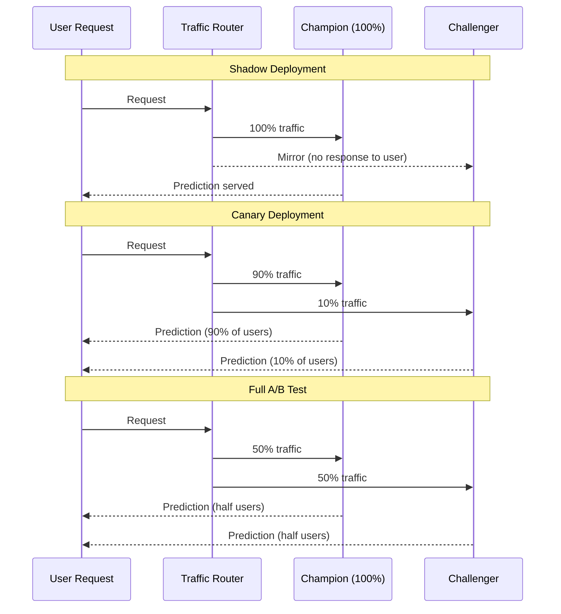

# A/B Testing and Canary Deployments

## Overview

A/B testing and canary deployments are the standard methods for safely comparing model versions in
production without committing to a full rollout. The goal is to expose a new challenger model to a
subset of real traffic and measure whether it outperforms the existing champion model on business
and technical metrics.

The **champion-challenger framework** names the current production model the "champion" and any
candidate replacement the "challenger." The challenger must earn its promotion by demonstrating
measurable improvement during a controlled experiment. Three deployment strategies exist along a
risk spectrum:

- **Shadow deployment**: zero user impact, challenger runs in parallel with no predictions served
- **Canary deployment**: small percentage of traffic routed to challenger, real users affected
- **Full A/B test**: 50/50 traffic split after initial canary validation, statistical comparison

## Deployment Strategy Comparison



| Strategy | Traffic to Challenger | User Impact | Risk | Purpose |
| :--- | :--- | :--- | :--- | :--- |
| Shadow | 0% | None | Lowest | Pre-production validation |
| Canary | 5–25% | Minimal | Low | Gradual rollout |
| A/B Test | 50% | Half users | Medium | Statistical comparison |

## Shadow Deployment

In shadow mode the challenger model receives identical input features as the champion but its
predictions are never returned to users. Instead, challenger outputs are silently logged to a Delta
table for offline analysis. This is the safest way to verify that a new model produces reasonable
predictions before any user is exposed to it.

Shadow deployment is ideal when a model change is architecturally significant (e.g., switching from
a gradient boosted tree to a neural network) and you want to confirm output distributions look sane
before any canary traffic.

```python
import mlflow
import pandas as pd

champion = mlflow.pyfunc.load_model("models:/ml_catalog.models.classifier@champion")
challenger = mlflow.pyfunc.load_model("models:/ml_catalog.models.classifier@challenger")


def predict_with_shadow(features_df, spark):
    champion_preds = champion.predict(features_df)

    # Log challenger predictions silently to Delta for comparison
    shadow_df = features_df.copy()
    shadow_df["challenger_prediction"] = challenger.predict(features_df)
    shadow_df["champion_prediction"] = champion_preds
    shadow_df["timestamp"] = pd.Timestamp.now()

    (spark.createDataFrame(shadow_df)
         .write
         .format("delta")
         .mode("append")
         .saveAsTable("ml.shadow_comparison"))

    # Only the champion prediction is returned to the caller
    return champion_preds
```

The shadow table accumulates challenger predictions over time. You can then run offline metrics
(AUC, RMSE, precision/recall) against the logged outputs before ever touching user-facing traffic.

## Canary Deployment Configuration

Once shadow validation passes, configure traffic splitting directly at the Databricks Model Serving
endpoint. The endpoint routes a small initial fraction of production traffic to the challenger while
the champion continues serving the majority.

```python
from databricks.sdk import WorkspaceClient
from databricks.sdk.service.serving import (
    EndpointCoreConfigInput,
    ServedModelInput,
    ServedModelInputWorkloadSize,
    TrafficConfig,
    Route,
)

client = WorkspaceClient()

# Phase 1: start with 10% canary traffic

client.serving_endpoints.update_config(
    name="fraud-classifier-endpoint",
    config=EndpointCoreConfigInput(
        served_models=[
            ServedModelInput(
                name="champion",
                model_name="ml_catalog.fraud_models.fraud_classifier",
                model_version="3",
                workload_size=ServedModelInputWorkloadSize.SMALL,
                scale_to_zero_enabled=False,  # Keep warm for fair latency comparison
            ),
            ServedModelInput(
                name="challenger",
                model_name="ml_catalog.fraud_models.fraud_classifier",
                model_version="4",
                workload_size=ServedModelInputWorkloadSize.SMALL,
                scale_to_zero_enabled=False,
            ),
        ],
        traffic_config=TrafficConfig(routes=[
            Route(served_model_name="champion", traffic_percentage=90),
            Route(served_model_name="challenger", traffic_percentage=10),
        ]),
    ),
)
```

As confidence grows, increase challenger traffic progressively: 10% → 25% → 50% → 100%.
Each increment should wait until the previous stage has accumulated sufficient samples (typically
thousands of requests per variant) and metrics remain stable.

```python
# Phase 2: increase to 25% after initial validation

client.serving_endpoints.update_config(
    name="fraud-classifier-endpoint",
    config=EndpointCoreConfigInput(
        served_models=[...],  # same served_models list as above
        traffic_config=TrafficConfig(routes=[
            Route(served_model_name="champion", traffic_percentage=75),
            Route(served_model_name="challenger", traffic_percentage=25),
        ]),
    ),
)
```

## Inference Tables for Prediction Logging

Inference tables automatically capture every request and response to a Delta table — essential for
offline A/B analysis. You must enable this **before** the test starts; you cannot backfill
historical data.

```python
from databricks.sdk.service.serving import AutoCaptureConfigInput

client.serving_endpoints.update_config(
    name="fraud-classifier-endpoint",
    config=EndpointCoreConfigInput(
        served_models=[...],
        auto_capture_config=AutoCaptureConfigInput(
            catalog_name="ml_catalog",
            schema_name="inference_logs",
            table_name_prefix="fraud_classifier",
            enabled=True,
        ),
    ),
)
```

The inference table schema includes these columns:

| Column | Description |
| :--- | :--- |
| `databricks_request_id` | Unique request identifier |
| `timestamp_ms` | Epoch milliseconds |
| `request` | Full JSON request body |
| `response` | Full JSON response body |
| `status_code` | HTTP status (200, 4xx, 5xx) |
| `execution_time_ms` | Model inference latency |
| `sampling_fraction` | Fraction of requests captured |
| `client_request_id` | Optional caller-provided ID |

Use the inference table to compare champion vs. challenger performance directly in SQL:

```sql
SELECT
    JSON_EXTRACT_SCALAR(request, '$.served_model_name') AS model_name,
    COUNT(*)                                             AS request_count,
    AVG(execution_time_ms)                               AS avg_latency_ms,
    SUM(CASE WHEN status_code != 200 THEN 1 ELSE 0 END) AS error_count
FROM ml_catalog.inference_logs.fraud_classifier_payload
WHERE date(from_unixtime(timestamp_ms / 1000)) >= current_date() - 7
GROUP BY JSON_EXTRACT_SCALAR(request, '$.served_model_name')
```

## Statistical Significance

Never declare a winner based on gut feeling or a small sample. Two-sample statistical tests
quantify whether observed metric differences are likely real or due to chance.

```python
from scipy import stats
import numpy as np


def test_significance(champion_outcomes, challenger_outcomes, alpha=0.05):
    """Two-sample t-test for continuous metrics (e.g., revenue per session)."""
    t_stat, p_value = stats.ttest_ind(champion_outcomes, challenger_outcomes)

    print(f"Champion mean:  {np.mean(champion_outcomes):.4f}")
    print(f"Challenger mean: {np.mean(challenger_outcomes):.4f}")
    print(f"p-value: {p_value:.4f}")
    print(f"Significant at alpha={alpha}: {p_value < alpha}")

    return p_value < alpha


def minimum_sample_size(effect_size, alpha=0.05, power=0.8):
    """Estimate required samples per variant before running the test."""
    from statsmodels.stats.power import TTestIndPower

    analysis = TTestIndPower()
    n = analysis.solve_power(effect_size=effect_size, alpha=alpha, power=power)
    return int(n)
```

Key warning: **statistical significance does not equal business significance.** A 0.001 AUC
improvement with p < 0.05 may not justify the operational overhead of a model rollout. Always
pair statistical tests with a minimum effect size threshold agreed upon with stakeholders before
the experiment begins (not after seeing the results).

## Champion Replacement Decision Framework

Use explicit, pre-agreed criteria to decide the outcome of every experiment:

| Decision | Criteria |
| :--- | :--- |
| Promote challenger | Metric improvement > threshold AND latency within SLA AND error rate unchanged AND statistical significance confirmed |
| Keep champion | Improvement below threshold OR sample size insufficient |
| Roll back challenger | Challenger error rate spikes OR latency SLA breached |

```python
from mlflow import MlflowClient


def promote_challenger_to_champion(
    model_name: str,
    challenger_version: str,
    champion_version: str,
    challenger_auc: float,
    champion_auc: float,
    min_improvement: float = 0.01,
) -> bool:
    client = MlflowClient(registry_uri="databricks-uc")

    if challenger_auc > champion_auc + min_improvement:
        # Preserve a rollback alias before promoting
        client.set_registered_model_alias(
            name=model_name,
            alias="previous_champion",
            version=champion_version,
        )
        # Move the champion alias to the winning challenger
        client.set_registered_model_alias(
            name=model_name,
            alias="champion",
            version=challenger_version,
        )
        print(f"Promoted version {challenger_version} to champion")
        return True

    print(f"Challenger did not meet threshold. Keeping champion v{champion_version}")
    return False
```

After promotion, update the serving endpoint traffic config to route 100% of traffic to the new
champion version and remove the old served model from the endpoint configuration.

## Common Pitfalls

- **Enabling inference tables after the test starts** — you lose historical requests and cannot
  reconstruct the comparison dataset
- **Allowing scale-to-zero on canary endpoints** — cold-start latency inflates challenger latency
  measurements and biases the comparison
- **Declaring a winner from 100 samples** — need hundreds to thousands of samples per variant
  before statistical tests are meaningful
- **Ignoring seasonality** — weekend traffic patterns differ from weekday; run tests across
  representative time windows
- **Not archiving the old champion alias** — without the `previous_champion` alias you have no
  clean rollback path if issues emerge post-promotion

## Practice Questions

> [!success]- Question 1: Shadow vs Canary
>
> **When should you choose shadow deployment over canary deployment?**
>
> A) When you want the fastest path to production
> B) When you need zero user impact during validation and can accept offline-only comparison
> C) When statistical significance must be calculated from live traffic
> D) When the challenger model has already passed staging integration tests
>
> **Correct Answer: B**
>
> Shadow deployment routes 0% of traffic to the challenger for user-visible predictions. It is the
> right choice when you want to verify that a new model produces sensible output distributions and
> runs without errors before any real user is exposed to it. The trade-off is that you can only
> compare predictions offline — you cannot measure business outcomes like click-through or revenue
> impact because users never see the challenger's predictions.

---

> [!success]- Question 2: Valid A/B Comparison
>
> **What two conditions must be met before you can validly declare an A/B test winner?**
>
> A) Both models must use the same hyperparameters
> B) Sufficient sample size per variant AND statistical significance test confirms the difference is not due to chance
> C) The test must run for exactly 14 days
> D) The champion and challenger must be the same model architecture
>
> **Correct Answer: B**
>
> A minimum sample size (calculated from expected effect size, alpha, and statistical power before
> the test) ensures the experiment is adequately powered. Once that sample size is reached, a
> statistical significance test (e.g., two-sample t-test, chi-squared) quantifies whether the
> observed metric difference is likely real. Neither condition alone is sufficient: large samples
> without a significance test may yield obviously noisy conclusions, and a p-value from 50 samples
> is unreliable.

---

> [!success]- Question 3: Model Registry After Promotion
>
> **After the Databricks serving endpoint is updated to send 100% traffic to the new champion
> model version, what additional step must be taken in the Unity Catalog Model Registry?**
>
> A) Delete the old model version to save storage
> B) Move the `champion` alias from the old version to the new version
> C) Create a new registered model with the challenger's name
> D) Change the model's tags from `challenger` to `champion`
>
> **Correct Answer: B**
>
> The `champion` alias in Unity Catalog is the authoritative pointer that downstream jobs, batch
> scoring pipelines, and monitoring tools use to load the production model. Moving traffic at the
> serving endpoint level alone does not update the registry alias. You must call
> `client.set_registered_model_alias(name=model_name, alias="champion", version=new_version)` to
> keep the registry and the endpoint in sync. It is also good practice to set a
> `previous_champion` alias on the old version as a rollback handle before overwriting `champion`.

## Use Cases

- **Safe Model Rollout for Credit Scoring**: Using canary deployment to route 5% of traffic to a retrained credit-scoring model, monitoring approval-rate and default-rate metrics for 48 hours before scaling to 100%.
- **Multi-Variant Recommendation Testing**: Running a three-way A/B test (collaborative filtering vs content-based vs hybrid) on a recommendation endpoint, using inference tables and a two-sample t-test to select the variant that maximises click-through rate.

## Common Issues & Errors

### Inference Table Not Capturing Requests

**Scenario:** After enabling an A/B test, the inference table is empty or missing requests, making it impossible to compare variants.
**Fix:** Enable the inference table on the endpoint BEFORE starting the test -- historical requests cannot be backfilled retroactively. Verify the table exists in the expected catalog/schema with `spark.table("catalog.schema.endpoint_name_payload")`.

### A/B Test Shows No Statistical Significance

**Scenario:** After running a 50/50 A/B test for several days, the p-value remains above 0.05 despite a visible difference in mean metrics.
**Fix:** Verify sample size is sufficient (hundreds to thousands per variant). Short tests or low-traffic endpoints need longer run times. If the true effect size is small (e.g., 0.002 AUC improvement), you may need tens of thousands of samples. Consider whether the improvement justifies the operational cost of the rollout even if statistically significant.

## Key Takeaways

- **Three strategies**: Shadow (0% traffic, offline comparison only), Canary (5–25%, gradual live rollout), A/B test (50/50 split, statistical comparison)
- **Inference tables**: Must enable BEFORE the test starts — historical requests cannot be backfilled after the fact
- **`scale_to_zero=False` during tests**: Cold-start latency unfairly inflates challenger latency measurements and biases comparisons
- **Statistical significance**: Two-sample t-test; need hundreds-to-thousands of samples per variant — never declare a winner from fewer than ~100 samples
- **Promoting the winner**: Update the `champion` alias in the Model Registry AND update the endpoint traffic config to 100%
- **Rollback safety**: Set `previous_champion` alias on the old version BEFORE overwriting `champion`
- **Statistical vs business significance**: A p < 0.05 result with a 0.001 AUC improvement may not justify the rollout cost

## Related Topics

- [Model Serving & Deployment](02-model-serving-deployment.md)
- [Model Lifecycle Orchestration](04-model-lifecycle-orchestration.md)
- [Model Monitoring & Observability](../04-model-governance-mlops/01-model-monitoring-observability.md)

---

**[← Previous: Model Serving and Deployment](./02-model-serving-deployment.md) | [↑ Back to Model Production Lifecycle](./README.md) | [Next: Model Lifecycle Orchestration](./04-model-lifecycle-orchestration.md) →**
