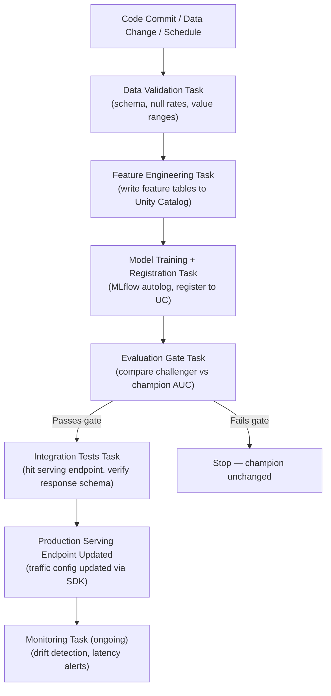

# Model Lifecycle Orchestration

## Overview

Ad-hoc notebook retraining is insufficient for production machine learning. When a data scientist
manually reruns a training notebook, there is no audit trail, no gate preventing a worse model from
being promoted, no automatic rollback if predictions degrade, and no way to reproduce the exact
environment that produced a specific model version.

Production ML requires CI/CD applied to three distinct change types:

- **Code changes** — a new feature transformation, a different algorithm, hyperparameter tuning
- **Data changes** — upstream schema drift, new labeled data available, training window shift
- **Model changes** — champion replacement, alias updates, serving config updates

Each change type has different triggers and validation gates. The unifying pattern is a
**multi-task orchestrated pipeline** that enforces quality checks at every stage before any change
reaches production.

## ML Pipeline Architecture



## Databricks Jobs for ML Orchestration

Databricks Jobs is the primary orchestration layer for ML pipelines. A multi-task job models the
pipeline as a directed acyclic graph (DAG) where tasks declare explicit dependencies. This
guarantees that model training never starts if data validation fails.

```python
from databricks.sdk import WorkspaceClient
from databricks.sdk.service.jobs import (
    Task,
    NotebookTask,
    PythonWheelTask,
    JobCluster,
    ClusterSpec,
    TaskDependency,
)

client = WorkspaceClient()

ml_pipeline_job = client.jobs.create(
    name="fraud-model-retraining-pipeline",
    job_clusters=[
        JobCluster(
            job_cluster_key="ml-cluster",
            new_cluster=ClusterSpec(
                spark_version="15.4.x-ml-scala2.12",
                node_type_id="i3.xlarge",
                num_workers=4,
            ),
        )
    ],
    tasks=[
        Task(
            task_key="data_validation",
            notebook_task=NotebookTask(
                notebook_path=(
                    "/Repos/ml-team/fraud-model/notebooks/01_data_validation"
                ),
                base_parameters={"env": "prod", "lookback_days": "30"},
            ),
            job_cluster_key="ml-cluster",
        ),
        Task(
            task_key="feature_engineering",
            depends_on=[TaskDependency(task_key="data_validation")],
            notebook_task=NotebookTask(
                notebook_path=(
                    "/Repos/ml-team/fraud-model/notebooks/02_feature_engineering"
                ),
            ),
            job_cluster_key="ml-cluster",
        ),
        Task(
            task_key="model_training",
            depends_on=[TaskDependency(task_key="feature_engineering")],
            python_wheel_task=PythonWheelTask(
                package_name="fraud_model",
                entry_point="train",
                parameters=["--register-model", "--catalog=ml_catalog"],
            ),
            job_cluster_key="ml-cluster",
        ),
        Task(
            task_key="evaluation_gate",
            depends_on=[TaskDependency(task_key="model_training")],
            notebook_task=NotebookTask(
                notebook_path=(
                    "/Repos/ml-team/fraud-model/notebooks/03_evaluate_and_promote"
                ),
            ),
            job_cluster_key="ml-cluster",
        ),
        Task(
            task_key="integration_tests",
            depends_on=[TaskDependency(task_key="evaluation_gate")],
            # run_if defaults to ALL_SUCCESS, so this task only runs
            # when evaluation_gate exits with code 0
            notebook_task=NotebookTask(
                notebook_path=(
                    "/Repos/ml-team/fraud-model/notebooks/04_integration_tests"
                ),
            ),
            job_cluster_key="ml-cluster",
        ),
    ],
)
```

The default `run_if` behavior for a task with `depends_on` is `ALL_SUCCESS` — the task runs only
if every upstream dependency succeeded. This means the integration test task automatically skips
if the evaluation gate notebook exits with an exception or a non-zero exit code.

## Model Promotion Gates

The evaluation gate is the critical quality checkpoint. It loads both the champion (by alias) and
the freshly registered challenger (by version number), runs both on a held-out dataset, and only
promotes the challenger if it clears the minimum improvement threshold.

```python
import mlflow
from mlflow import MlflowClient
from sklearn.metrics import roc_auc_score


def run_evaluation_gate(
    model_name: str,
    challenger_version: str,
    holdout_table: str,
    spark,
    min_improvement: float = 0.005,
) -> bool:
    client = MlflowClient(registry_uri="databricks-uc")

    champion_uri = f"models:/{model_name}@champion"
    challenger_uri = f"models:/{model_name}/{challenger_version}"

    champion = mlflow.pyfunc.load_model(champion_uri)
    challenger = mlflow.pyfunc.load_model(challenger_uri)

    holdout_df = spark.table(holdout_table).toPandas()
    X = holdout_df.drop("label", axis=1)
    y = holdout_df["label"]

    champion_auc = roc_auc_score(y, champion.predict(X))
    challenger_auc = roc_auc_score(y, challenger.predict(X))

    print(f"Champion AUC:   {champion_auc:.4f}")
    print(f"Challenger AUC: {challenger_auc:.4f}")
    print(f"Improvement:    {challenger_auc - champion_auc:.4f}")

    # Log results for traceability
    with mlflow.start_run(run_name="evaluation_gate"):
        mlflow.log_metrics({
            "champion_auc": champion_auc,
            "challenger_auc": challenger_auc,
            "improvement": challenger_auc - champion_auc,
        })

    if challenger_auc >= champion_auc + min_improvement:
        # Archive current champion before overwriting alias
        client.set_registered_model_alias(
            model_name, "previous_champion", str(client
                .get_registered_model_alias(model_name, "champion")
                .version)
        )
        client.set_registered_model_alias(
            model_name, "champion", challenger_version
        )
        print(f"Promoted version {challenger_version} to champion")
        return True

    print("Challenger did not meet threshold. Champion unchanged.")
    return False
```

Raising an exception at the end of the gate notebook when it returns `False` causes the Databricks
Job task to fail, which blocks all downstream tasks from running via the `ALL_SUCCESS` default.

## Retraining Triggers

Three trigger patterns cover the majority of production ML use cases:

### Scheduled Retraining

A cron schedule fires regardless of data drift. This is the simplest approach and is appropriate
for domains where the data distribution changes slowly and predictably (e.g., monthly demand
forecasting).

Configure via the Databricks Jobs UI or SDK by setting a `CronSchedule` on the job. The downside
is that retraining may fire unnecessarily when data has not changed, wasting compute.

### Drift-Triggered Retraining

A monitoring job detects feature or prediction drift, fires an alert, and the alert webhook calls
the Databricks Jobs REST API to trigger an immediate retraining run.

```python
import requests


def trigger_retraining_job(
    job_id: int,
    params: dict,
    token: str,
    host: str,
) -> str:
    """Trigger a Databricks Job run via REST API (e.g., from a webhook handler)."""
    url = f"https://{host}/api/2.1/jobs/run-now"
    headers = {"Authorization": f"Bearer {token}"}
    payload = {"job_id": job_id, "notebook_params": params}

    response = requests.post(url, headers=headers, json=payload)
    response.raise_for_status()

    run_id = response.json()["run_id"]
    print(f"Triggered retraining job. Run ID: {run_id}")
    return run_id
```

The `token` here must be a **service principal** token, not a personal access token, so the job
runs under a non-human identity with only the permissions it needs.

### Data-Volume Triggered Retraining

When new labeled data accumulates past a threshold (e.g., 50,000 new labeled rows), a Delta Live
Tables pipeline or a lightweight monitoring job counts new records and triggers training. This is
useful for models where additional labeled data produces meaningful accuracy gains, such as fraud
detection where new fraud labels arrive continuously.

## CI/CD Integration

### Environment Promotion Pattern

Production ML pipelines should use separate workspaces for each environment:

```text
dev workspace → staging workspace → prod workspace
```

Model registry scopes are separate per workspace. A model trained in dev is tested in staging, then
the production pipeline is triggered to train the final version in prod from the same code commit.

### GitHub Actions Integration

```yaml
# .github/workflows/ml-deploy.yml (simplified)

name: ML Pipeline Deploy

on:
  push:
    branches: [main]
  create:
    tags: ["v*"]

jobs:
  staging-deploy:
    if: github.ref == 'refs/heads/main'
    runs-on: ubuntu-latest
    steps:
      - uses: actions/checkout@v4
      - name: Trigger staging retraining job
        run: |
          curl -X POST \
            "https://${{ secrets.STAGING_HOST }}/api/2.1/jobs/run-now" \
            -H "Authorization: Bearer ${{ secrets.STAGING_SP_TOKEN }}" \
            -d '{"job_id": ${{ secrets.STAGING_JOB_ID }},
                 "notebook_params": {"git_sha": "${{ github.sha }}"}}'

  prod-deploy:
    if: startsWith(github.ref, 'refs/tags/v')
    runs-on: ubuntu-latest
    steps:
      - uses: actions/checkout@v4
      - name: Trigger production retraining job
        run: |
          curl -X POST \
            "https://${{ secrets.PROD_HOST }}/api/2.1/jobs/run-now" \
            -H "Authorization: Bearer ${{ secrets.PROD_SP_TOKEN }}" \
            -d '{"job_id": ${{ secrets.PROD_JOB_ID }},
                 "notebook_params": {"git_sha": "${{ github.sha }}"}}'
```

Key practices:

- Git SHA is passed as a job parameter and logged as an MLflow tag for traceability
- Secrets are stored in GitHub Actions secrets, never hardcoded
- Service principal tokens are used for all automation — never personal tokens
- Production deploy is gated on a version tag, not every push to main

## Testing in ML Pipelines

A mature ML pipeline has multiple testing layers, each catching a different class of failures:

| Test Type | What It Tests | When It Runs |
| :--- | :--- | :--- |
| Unit tests | Transform functions, feature SQL, custom metrics | Every commit (fast, <5 min) |
| Data validation | Schema, null rates, value ranges, referential integrity | Before training |
| Model validation | AUC on holdout, latency SLA, bias metrics | After training |
| Integration tests | Serving endpoint returns valid schema, p99 latency | After deployment |
| Regression tests | New model performs at least as well as previous | Before promotion |

Unit tests and data validation failures should abort the pipeline immediately and cheaply, before
expensive GPU training runs. Model validation failures should block promotion without rolling back
the serving endpoint. Integration test failures should trigger an automatic rollback.

## Workflow Best Practices

- **Idempotent jobs**: re-running the same job with the same parameters produces the same result.
  Write feature tables with `overwrite` mode, not `append`. Overwrite model versions with the
  same experiment name and run tags so reruns are traceable.

- **Job clusters over all-purpose clusters**: job clusters spin up fresh per run, have no library
  conflicts from previous sessions, and are cost-efficient. All-purpose clusters accumulate state
  between runs, making results harder to reproduce.

- **Checkpoint intermediate results** to Delta between tasks. If the training task fails midway,
  you can re-run from the feature engineering output without recomputing upstream stages.

- **Tag runs with git SHA**: every MLflow training run should include the exact commit that
  produced it.

  ```python
  import os
  import mlflow

  mlflow.set_tag("git_sha", os.environ.get("GIT_SHA", "unknown"))
  mlflow.set_tag("job_run_id", os.environ.get("DATABRICKS_JOB_RUN_ID", "local"))
  ```

- **Pass catalog and schema as job parameters**, not as hardcoded strings. This lets the same
  job definition run in dev, staging, and prod by passing different parameter values — no code
  duplication across environments.

## Common Pitfalls

- **No evaluation gate before promotion** — without a gate, the pipeline automatically promotes
  every new training run as champion, even if data quality degraded and the model is worse

- **Personal tokens in CI/CD secrets** — personal tokens are tied to a human employee; if that
  employee leaves, all automated deployments break. Use service principals.

- **Hardcoded catalog and schema names** — a job that writes to `prod_catalog.fraud_models` in
  every environment cannot be safely tested in staging without code changes

- **All-purpose clusters for training jobs** — expensive (often running 24/7), prone to library
  conflicts, and non-reproducible because the environment accumulates state between runs

- **No `previous_champion` alias** — without archiving the old champion before overwriting the
  alias, there is no clean programmatic rollback path if the new champion underperforms in production

## Practice Questions

> [!success]- Question 1: Drift-Triggered Retraining
>
> **Which retraining trigger strategy is most appropriate when a monitoring job detects that
> prediction distribution has shifted beyond an acceptable threshold?**
>
> A) Scheduled retraining on a daily cron
> B) Drift-triggered retraining via a webhook calling the Jobs REST API
> C) Manual retraining initiated by a data scientist
> D) Data-volume triggered retraining when 10,000 new rows arrive
>
> **Correct Answer: B**
>
> Drift-triggered retraining responds directly to the event that indicates the model needs
> updating. A monitoring job detects the drift, fires an alert, and the alert's webhook (or an
> alerting integration like PagerDuty → Lambda → Jobs API) calls the Databricks Jobs REST API
> `run-now` endpoint to kick off the retraining pipeline immediately. Scheduled retraining fires
> on a timer regardless of whether drift has occurred, wasting compute when models are still
> healthy. Manual retraining is not scalable and introduces human delay.

---

> [!success]- Question 2: Conditional Task Execution
>
> **In a multi-task Databricks Job, how do you ensure the integration test task only runs if the
> evaluation gate task succeeds?**
>
> A) Set the integration test task's `max_retries` to 0
> B) Declare `depends_on: [evaluation_gate]` — the default `run_if: ALL_SUCCESS` blocks the task if the gate fails
> C) Use a separate job for integration tests triggered by a webhook
> D) Add an `if` condition inside the integration test notebook
>
> **Correct Answer: B**
>
> When you declare `depends_on: [{task_key: "evaluation_gate"}]`, the task inherits the default
> `run_if: ALL_SUCCESS` behavior. If the evaluation gate notebook raises an exception or exits
> with a non-zero status, the integration test task is skipped automatically. No extra
> configuration is needed — this is the default behavior of task dependencies in Databricks Jobs.
> The evaluation gate notebook should raise an exception explicitly when the challenger does not
> meet the promotion threshold.

---

> [!success]- Question 3: Git SHA Tagging
>
> **What is the primary benefit of tagging every MLflow training run with the git SHA of the
> commit that triggered it?**
>
> A) It reduces model training time by caching previous results
> B) It allows any model version to be reproduced by checking out the exact commit that trained it
> C) It automatically registers the model in Unity Catalog
> D) It prevents two runs from using the same dataset
>
> **Correct Answer: B**
>
> Tagging runs with `git_sha` creates a bidirectional link between a model artifact and the exact
> code that produced it. If a champion model starts underperforming, you can look up its git SHA
> in MLflow, check out that commit, inspect the training code, and reproduce the training
> environment. This is critical for debugging, regulatory audit trails, and root-cause analysis of
> production incidents. Without it, you cannot determine which version of the training code
> produced any given model version.

## Use Cases

- **Multi-Task DAG for Weekly Model Refresh**: A Databricks Job with four tasks (data validation, feature engineering, model training, evaluation gate) connected by `depends_on`, ensuring the pipeline halts automatically if any upstream step fails before the champion alias is updated.
- **Drift-Triggered Retraining Pipeline**: A Databricks Job that fires when the monitoring service detects data drift, automatically retrains the model on fresh data, runs an evaluation gate against the current champion, and promotes the winner -- all without human intervention.

## Common Issues & Errors

### Artifact Access Denied

**Scenario:** Models fail to load from MLflow registry during serving.
**Fix:** Check Unity Catalog permissions or traditional workspace access controls on the underlying storage.

### Automated Retraining Pipeline Produces Degraded Model

**Scenario:** A scheduled retraining job trains on stale or corrupted upstream data and registers a model version that performs worse than the current champion, but the pipeline promotes it anyway.
**Fix:** Always include an evaluation gate task that loads the current `@champion` and compares it against the challenger on a held-out test set. Raise an exception (halting the DAG) if the challenger does not exceed the champion by a configurable improvement threshold (e.g., 0.5% AUC). Log comparison metrics to MLflow for audit.

## Key Takeaways

- **Multi-task Job = DAG**: Tasks declare `depends_on`; default `run_if: ALL_SUCCESS` means the pipeline halts automatically when any gate fails
- **Evaluation gate**: Loads champion (`@champion`) and challenger (by version) on a held-out dataset; raises an exception if challenger does not meet the improvement threshold — blocks all downstream tasks
- **Three retraining triggers**: Scheduled (cron, simplest), drift-triggered (monitoring webhook → Jobs REST API `run-now`), data-volume triggered (label accumulation threshold)
- **Service principal tokens**: Use SPs for all CI/CD automation — personal tokens break if the employee leaves
- **Job clusters over all-purpose**: Fresh environment per run, no library conflicts, cost-efficient; all-purpose clusters accumulate state
- **Tag runs with git SHA**: `mlflow.set_tag("git_sha", ...)` links every model version to the exact code commit that trained it
- **Parameterize catalog/schema**: Pass as job parameters, not hardcoded, so the same job definition works in dev/staging/prod

## Related Topics

- [Model Versioning & Registry](01-model-versioning-registry.md)
- [A/B Testing & Canary Deployments](03-ab-testing-canary.md)
- [Model Monitoring & Observability](../04-model-governance-mlops/01-model-monitoring-observability.md)
- [Hyperparameter Optimization](../02-hyperparameter-optimization/README.md)

---

**[← Previous: A/B Testing and Canary Deployments](./03-ab-testing-canary.md) | [↑ Back to Model Production Lifecycle](./README.md)**
