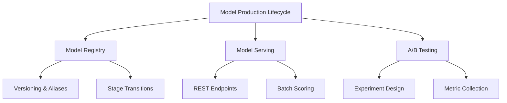

# Model Production Lifecycle (30% of Exam)

Master model versioning, registry management, A/B testing, and production deployment patterns.

## Topics Overview

## Section Contents

| File | Topic | Priority |
| :--- | :--- | :--- |
| [01-model-versioning-registry.md](01-model-versioning-registry.md) | MLflow Model Registry, versioning, aliases | High |
| [02-model-serving-deployment.md](02-model-serving-deployment.md) | REST endpoints, batch scoring, model serving | High |
| [03-ab-testing-canary.md](03-ab-testing-canary.md) | A/B testing, canary deployments, traffic splitting | High |
| [04-model-lifecycle-orchestration.md](04-model-lifecycle-orchestration.md) | CI/CD for ML, orchestration, production patterns | High |

## Key Concepts

- **Model Registry**: Centralized repository for model versions and metadata
- **Model Stage**: Development, Staging, Production lifecycle states
- **Model Alias**: Named reference to specific model version (latest-champion, champion)
- **REST Endpoint**: HTTP API for model inference
- **A/B Testing**: Comparing multiple model versions in production
- **Canary Deployment**: Gradual rollout of new model to small user segment

## Related Resources

- [MLflow Basics](../../../shared/fundamentals/mlflow-basics.md)
- [Delta Lake Basics](../../../shared/fundamentals/delta-lake-basics.md)

## Next Steps

Progress to [04-Model Governance & MLOps](../04-model-governance-mlops/README.md) to learn about monitoring and compliance.

---

**[← Back to Certification](../README.md)**
