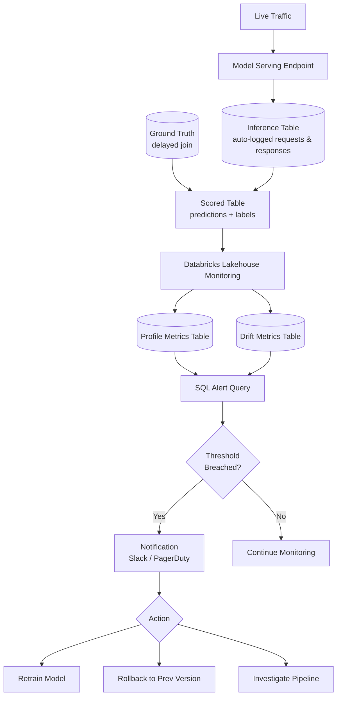

# Model Monitoring and Observability

## Overview

A model that performs well during offline evaluation can degrade silently once deployed to production. Real-world data distributions shift over time, upstream pipelines change without notice, and the relationship between inputs and outputs evolves as business conditions change. Without continuous monitoring, you have no signal that anything is wrong until a downstream business metric collapses — by which point the damage is already done.

Effective production monitoring covers three distinct layers:

- **Data quality (inputs)**: Are the features arriving in the expected distribution and format? Missing values, unexpected nulls, out-of-range values, and upstream schema changes all corrupt inputs before predictions are made.
- **Model performance (outputs vs. ground truth)**: Is the model still making accurate predictions? This requires joining predictions with delayed ground truth labels.
- **System / operational health**: Is the endpoint up, fast, and handling load? Latency spikes and elevated error rates hurt user experience even when the model itself is correct.

## Monitoring Architecture



## Inference Tables

Databricks Model Serving can automatically log every request and response to a Delta table — this is called an **inference table**. This logging must be configured before production traffic starts; it cannot be applied retroactively to requests that have already been served.

Enabling inference table logging when creating or updating an endpoint:

```python
from databricks.sdk import WorkspaceClient
from databricks.sdk.service.serving import (
    AutoCaptureConfigInput,
    EndpointCoreConfigInput,
    ServedModelInput,
    ServedModelInputWorkloadSize
)

client = WorkspaceClient()

# Enable inference table logging on endpoint creation or update

client.serving_endpoints.update_config(
    name="fraud-classifier-endpoint",
    config=EndpointCoreConfigInput(
        served_models=[
            ServedModelInput(
                model_name="ml_catalog.models.fraud_classifier",
                model_version="12",
                workload_size=ServedModelInputWorkloadSize.SMALL,
                scale_to_zero_enabled=True
            )
        ],
        auto_capture_config=AutoCaptureConfigInput(
            catalog_name="ml_catalog",
            schema_name="inference_logs",
            table_name_prefix="fraud_classifier",
            enabled=True
        )
    )
)
```

### Inference Table Schema

| Column | Type | Description |
| :--- | :--- | :--- |
| `databricks_request_id` | STRING | Unique request identifier for joining with ground truth |
| `timestamp_ms` | LONG | Unix timestamp in milliseconds |
| `request` | STRING | JSON request payload containing model inputs |
| `response` | STRING | JSON response payload containing model predictions |
| `status_code` | INT | HTTP response code — 200 for success, 4xx/5xx for errors |
| `execution_time_ms` | LONG | End-to-end inference latency in milliseconds |
| `sampling_fraction` | DOUBLE | Fraction logged when sampling is enabled (default: 1.0) |
| `served_model_name` | STRING | Name of the served model version that handled the request |

### Joining Predictions with Delayed Ground Truth

Ground truth labels are rarely available immediately. In fraud detection, for example, you may not know whether a transaction was truly fraudulent for 7–14 days. The `databricks_request_id` column is the join key between inference logs and your ground truth system:

```sql
-- Join predictions with ground truth labels (available 7 days later)
SELECT
    p.databricks_request_id,
    CAST(
        JSON_EXTRACT_SCALAR(p.request, '$.dataframe_records[0].amount')
        AS DOUBLE
    ) AS transaction_amount,
    CAST(
        JSON_EXTRACT_SCALAR(p.response, '$.predictions[0]')
        AS DOUBLE
    ) AS predicted_fraud_score,
    g.actual_fraud_label,
    DATE(FROM_UNIXTIME(p.timestamp_ms / 1000)) AS prediction_date,
    p.execution_time_ms
FROM ml_catalog.inference_logs.fraud_classifier_payload AS p
INNER JOIN gold.fraud_ground_truth AS g
    ON p.databricks_request_id = g.request_id
WHERE
    DATEDIFF(
        current_date(),
        DATE(FROM_UNIXTIME(p.timestamp_ms / 1000))
    ) BETWEEN 7 AND 14
```

Write the result of this join to a scored table (e.g., `ml_catalog.inference_logs.fraud_classifier_scored`) that becomes the input table for Lakehouse Monitoring.

## Databricks Lakehouse Monitoring

Lakehouse Monitoring (LHM) is a native Databricks feature that continuously profiles a Delta table and computes statistical metrics, detecting drift relative to a baseline table. It generates two output Delta tables automatically.

### Monitor Types

- **TimeSeries**: For tables that have a timestamp column. Metrics are computed per time window (e.g., daily, weekly). Best for most inference log scenarios.
- **Snapshot**: For tables without a meaningful timestamp. Computes a point-in-time profile of the table's current state. Useful for batch scoring outputs.
- **InferenceLog**: A specialized variant that understands the ML context — it expects `prediction_col` and `label_col` and computes model performance metrics (accuracy, AUC, RMSE) in addition to data quality statistics.

### Creating an InferenceLog Monitor

```python
from databricks.sdk import WorkspaceClient
from databricks.sdk.service.catalog import (
    MonitorInferenceLog,
    MonitorInferenceLogProblemType
)

client = WorkspaceClient()

# Create an InferenceLog monitor on the scored table

monitor = client.quality_monitors.create(
    table_name="ml_catalog.inference_logs.fraud_classifier_scored",
    assets_dir="/Shared/ml-monitoring/fraud-classifier",
    output_schema_name="ml_catalog.monitoring_outputs",
    inference_log=MonitorInferenceLog(
        problem_type=MonitorInferenceLogProblemType.PROBLEM_TYPE_CLASSIFICATION,
        prediction_col="predicted_fraud_score",
        label_col="actual_fraud_label",
        timestamp_col="timestamp_ms",
        model_id_col="served_model_name",
        granularities=["1 day", "1 week"]
    ),
    baseline_table_name="ml_catalog.ml_baselines.fraud_classifier_baseline"
)

print(f"Monitor created: {monitor.monitor_version}")
```

### LHM Output Tables

| Table | Contents |
| :--- | :--- |
| `<prefix>_profile_metrics` | Statistical profiles per column per time window (mean, stddev, null %, quantiles, model performance metrics) |
| `<prefix>_drift_metrics` | Drift statistics vs. the baseline table (KS statistic, PSI, chi-square p-value per column per window) |

## Performance Metrics by Model Type

### Classification Models

LHM computes these per granularity window when `problem_type = CLASSIFICATION`:

- **Accuracy** — fraction of correct predictions over the window
- **Precision / Recall / F1** — especially important when class imbalance exists
- **AUC-ROC** — requires prediction probabilities, not just hard labels
- **Log Loss** — measures calibration quality

You can also query raw confusion matrix components from the profile metrics table and reconstruct these manually for custom threshold analysis:

```sql
-- Compute daily AUC from the profile metrics table
SELECT
    window_start_time,
    AVG(CASE WHEN metric_name = 'auc' THEN metric_value END) AS avg_auc,
    AVG(CASE WHEN metric_name = 'precision' THEN metric_value END) AS avg_precision,
    AVG(CASE WHEN metric_name = 'recall' THEN metric_value END) AS avg_recall,
    AVG(CASE WHEN metric_name = 'f1_score' THEN metric_value END) AS avg_f1
FROM ml_catalog.monitoring_outputs.fraud_classifier_scored_profile_metrics
WHERE window_start_time >= current_date() - 30
GROUP BY window_start_time
ORDER BY window_start_time DESC
```

### Regression Models

LHM computes for `problem_type = REGRESSION`:

- **RMSE** and **MAE** — absolute error magnitudes tracked over time
- **R²** — proportion of variance explained; should remain stable
- **Mean residual** — should stay close to zero; systematic bias appears as a non-zero drift in residuals

## Operational Metrics

Operational metrics are available immediately from the inference table — no ground truth required. They are the first line of defense for detecting endpoint problems.

```sql
-- Operational metrics dashboard query (last 30 days)
SELECT
    DATE(FROM_UNIXTIME(timestamp_ms / 1000))  AS date,
    COUNT(*)                                   AS total_requests,
    PERCENTILE(execution_time_ms, 0.50)        AS p50_latency_ms,
    PERCENTILE(execution_time_ms, 0.95)        AS p95_latency_ms,
    PERCENTILE(execution_time_ms, 0.99)        AS p99_latency_ms,
    ROUND(
        SUM(CASE WHEN status_code != 200 THEN 1 ELSE 0 END)
        / COUNT(*) * 100, 2
    )                                          AS error_rate_pct
FROM ml_catalog.inference_logs.fraud_classifier_payload
WHERE timestamp_ms >= UNIX_TIMESTAMP(current_date() - 30) * 1000
GROUP BY DATE(FROM_UNIXTIME(timestamp_ms / 1000))
ORDER BY date DESC
```

Key thresholds to alert on:

- `p95_latency_ms > 500` for synchronous real-time APIs
- `error_rate_pct > 1.0` for any production endpoint
- `total_requests` drops to near zero (endpoint unhealthy or traffic routing failure)

## Setting Up Alerts

Databricks SQL Alerts let you query any Delta table on a schedule and fire a notification when results cross a threshold. Pair them with the LHM output tables for automated monitoring.

### Sample Alert Query: AUC Degradation

```sql
-- Alert query: AUC dropped more than 5% from baseline
SELECT
    window_start_time,
    metric_value                             AS current_auc,
    baseline_metric_value                    AS baseline_auc,
    ROUND(baseline_metric_value - metric_value, 4) AS auc_drop
FROM ml_catalog.monitoring_outputs.fraud_classifier_scored_profile_metrics
WHERE
    window_start_time = current_date() - INTERVAL 1 DAY
    AND metric_name = 'auc'
    AND (baseline_metric_value - metric_value) > 0.05
```

Alert configuration steps:

1. Create a SQL Alert in Databricks SQL pointing to the query above.
2. Set **trigger condition** to "Query returns any rows."
3. Set **schedule** to daily at 09:00 (runs after LHM refresh).
4. Set **notification destination** to a Slack webhook or PagerDuty integration.
5. Set **rearm** period to 24 hours to avoid repeated paging on the same incident.

## Common Pitfalls

- **Not enabling inference tables from day one**: Retroactive logging is not possible. If inference tables are not configured before the endpoint receives traffic, that historical data is lost. Always enable `auto_capture_config` at endpoint creation.
- **Label delay creates a monitoring blind spot**: Ground truth may arrive 7–30 days late. You cannot compute AUC or accuracy in real time. Use prediction drift monitoring (output distribution) as a leading indicator while waiting for labels.
- **Monitoring only aggregate metrics**: A model that is accurate on average may be systematically wrong for a specific demographic or business segment. Add per-segment monitoring (e.g., group by merchant category or geographic region) to catch fairness issues.
- **Alert fatigue from overly sensitive thresholds**: Start with conservative thresholds (e.g., AUC drop > 10%), observe baseline variance over 2–4 weeks, then tighten to a meaningful threshold (e.g., > 5%). Firing too often causes teams to ignore alerts.
- **Not setting a baseline table**: LHM drift metrics require a baseline for comparison. Without it, drift metrics cannot be computed. Set the baseline to your training data distribution or a known-good production window.
- **Forgetting to refresh the monitor**: LHM runs on a schedule. If the schedule is misconfigured or the refresh fails silently, the monitoring output tables become stale without any visible error.

## Practice Questions

> [!success]- Question 1: Retroactive Inference Logging
>
> A model was deployed to production six months ago without inference table logging enabled.
> The team now wants to evaluate model performance over the past month.
> What is their only viable option?
>
> A) Enable inference table logging now — it will backfill historical requests automatically
> B) Reconstruct predictions from application logs if the calling service preserved request/response payloads, then evaluate going forward with inference tables enabled
> C) Query the MLflow tracking server for historical predictions
> D) Use Databricks Lakehouse Monitoring to retroactively compute predictions
>
> **Correct Answer: B**
>
> Inference table logging cannot be applied retroactively. Once a request has been served without logging enabled, that data is gone from the platform's perspective. The only recovery path is to check whether the upstream application service preserved request/response data in its own logs. Going forward, enable `auto_capture_config` immediately.
<!-- -->
> [!success]- Question 2: Lakehouse Monitoring Monitor Type
>
> Your team runs a fraud classification model. Predictions are logged to an inference table, and
> ground truth labels arrive after a 7-day delay. You want Databricks Lakehouse Monitoring to
> compute AUC, precision, and recall automatically. Which monitor type should you configure?
>
> A) TimeSeries
> B) Snapshot
> C) InferenceLog
> D) ClassificationMonitor
>
> **Correct Answer: C**
>
> The `InferenceLog` monitor type is specifically designed for ML serving scenarios. It accepts `prediction_col`, `label_col`, and `problem_type` parameters and computes model performance metrics (AUC, precision, recall, F1 for classification; RMSE, MAE, R² for regression) per time window in addition to data quality statistics. `TimeSeries` and `Snapshot` compute data quality metrics but do not understand the ML prediction/label context.
<!-- -->
> [!success]- Question 3: Monitoring Without Ground Truth Labels
>
> Your model's ground truth labels are available only after a 14-day business process delay.
> What monitoring approach can you use in the meantime to detect potential model degradation?
>
> A) Disable monitoring until labels are available — results would be meaningless
> B) Monitor prediction distribution drift (output distribution) as a leading indicator of concept drift
> C) Compute AUC using training labels as a proxy for production ground truth
> D) Use RMSE on the raw prediction scores without a reference value
>
> **Correct Answer: B**
>
> When ground truth is delayed, monitoring the distribution of model predictions (output distribution drift) serves as a leading indicator. If the model begins producing a very different distribution of scores — for example, flagging 40% of transactions as fraudulent when the historical average is 2% — something has changed upstream. This does not prove concept drift but is a strong signal to investigate before labels arrive. Option C is invalid because training labels describe training data, not production data.

## Use Cases

- **Three-Layer Production Model Monitoring**: Setting up data quality checks on input features, prediction distribution monitoring via Lakehouse Monitoring, and operational health dashboards (latency, error rate, QPS) to detect issues across the entire serving stack.
- **Proactive Fraud Model Health Checks**: Scheduling daily monitoring jobs that compare prediction score distributions against a baseline, triggering Slack alerts when PSI exceeds 0.2 so the team can investigate before ground-truth labels confirm degradation.

## Common Issues & Errors

### Artifact Access Denied

**Scenario:** Models fail to load from MLflow registry during serving.
**Fix:** Check Unity Catalog permissions or traditional workspace access controls on the underlying storage.

### Monitoring Dashboard Missing Recent Predictions

**Scenario:** The Lakehouse Monitoring dashboard shows stale data because the inference table has not been refreshed or the monitoring profile has not been re-computed.
**Fix:** Ensure the inference table is enabled on the serving endpoint BEFORE production traffic begins (it cannot backfill). Schedule the monitoring `refresh()` job to run at least as frequently as the reporting cadence. Verify the inference table Delta path has not been moved or compacted in a way that breaks the monitor's table reference.

## Key Takeaways

- **Three monitoring layers**: Data quality (inputs), model performance (predictions vs ground truth), system/operational health (latency, error rate)
- **Inference tables**: Enable BEFORE production traffic starts — requests already served cannot be backfilled retroactively
- **Lakehouse Monitoring**: Automatically generates a profile metrics table and a drift metrics table from a scored Delta table
- **Ground truth join**: Required for accuracy metrics; often delayed hours-to-days — join inference logs with late-arriving labels in a background job
- **Prediction drift as leading indicator**: Detectable immediately without labels; use to trigger investigation while waiting for ground truth labels to confirm concept drift
- **SQL alerts on drift metrics**: Set thresholds on the drift metrics table to send Slack/PagerDuty notifications automatically when drift exceeds acceptable bounds
- **Remediation actions**: Retrain on recent data, roll back to `previous_champion` alias, investigate upstream pipeline schema changes

## Related Topics

- [Drift Detection & Remediation](02-drift-detection-remediation.md)
- [Model Versioning & Registry](../03-model-production-lifecycle/01-model-versioning-registry.md)
- [MLflow Basics](../../../shared/fundamentals/mlflow-basics.md)

---

**[↑ Back to Model Governance & MLOps](./README.md) | [Next: Drift Detection and Remediation](./02-drift-detection-remediation.md) →**
