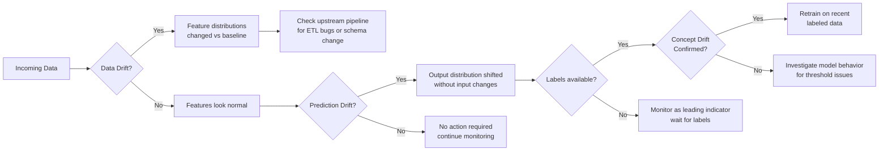

# Drift Detection and Remediation

## Overview

Deploying a model is not the end of the ML lifecycle — it is the beginning of a continuous maintenance cycle. Models are trained on historical data and assume that the world at inference time resembles the world at training time. When that assumption breaks, the model degrades silently.

The four types of drift you need to distinguish for the exam:

- **Data drift**: The distribution of input features changes. The model receives inputs that look different from what it was trained on. The relationship between inputs and outputs may or may not still hold.
- **Concept drift**: The relationship between inputs and outputs changes. Even if the features look identical to training data, the correct prediction has shifted (e.g., fraud patterns evolve as fraudsters adapt).
- **Prediction drift**: The distribution of model outputs changes. This is observable without ground truth and often serves as an early proxy for concept drift.
- **Label drift**: The distribution of the target variable changes in the ground truth labels (e.g., fraud rate increases from 2% to 8% due to a new attack pattern).

The key practical distinction: **data drift and prediction drift are detectable immediately** (no labels required). **Concept drift requires ground truth labels**, which often arrive with a delay. In production systems, you use prediction drift as a leading indicator and wait for labels to confirm or rule out concept drift.

## Drift Taxonomy



## Statistical Tests for Data Drift

No single test works for all feature types. Choosing the wrong test is a common exam pitfall.

### Kolmogorov-Smirnov Test (Continuous Features)

The KS test measures the maximum distance between two empirical cumulative distribution functions. It makes no assumptions about the underlying distribution, making it robust for any continuous variable.

```python
from scipy import stats
import numpy as np


def detect_drift_ks(
    reference_data: np.ndarray,
    current_data: np.ndarray,
    alpha: float = 0.05
) -> dict:
    """KS test for continuous feature drift detection."""
    ks_stat, p_value = stats.ks_2samp(reference_data, current_data)

    return {
        "test": "kolmogorov-smirnov",
        "statistic": round(ks_stat, 4),
        "p_value": round(p_value, 6),
        "drift_detected": p_value < alpha,
        "interpretation": (
            "Significant drift detected"
            if p_value < alpha
            else "No significant drift"
        )
    }


# Example: compare transaction amount distribution (training vs production)

result = detect_drift_ks(
    reference_data=training_df["transaction_amount"].values,
    current_data=production_df["transaction_amount"].values,
    alpha=0.05
)
print(result)

# {'test': 'kolmogorov-smirnov', 'statistic': 0.0821, 'p_value': 0.000312,
#  'drift_detected': True, 'interpretation': 'Significant drift detected'}

```

The KS test is valid **only for continuous features**. Applying it to categorical data (e.g., merchant category codes) produces meaningless results.

### Chi-Square Test (Categorical Features)

For categorical features, compare observed frequency distributions using the chi-square goodness-of-fit test.

```python
from scipy import stats
import numpy as np


def detect_drift_chi2(
    reference_counts: dict,
    current_counts: dict,
    alpha: float = 0.05
) -> dict:
    """Chi-square test for categorical feature drift detection."""
    categories = sorted(
        set(reference_counts.keys()) | set(current_counts.keys())
    )

    ref_freq = np.array([reference_counts.get(c, 0) for c in categories])
    curr_freq = np.array([current_counts.get(c, 0) for c in categories])

    # Scale reference to same total as current to compute expected frequencies
    scale_factor = curr_freq.sum() / ref_freq.sum()
    expected_freq = ref_freq * scale_factor

    # Replace zero expected values to avoid division errors
    expected_freq = np.where(expected_freq == 0, 0.0001, expected_freq)

    chi2_stat, p_value = stats.chisquare(f_obs=curr_freq, f_exp=expected_freq)

    return {
        "test": "chi-square",
        "statistic": round(chi2_stat, 4),
        "p_value": round(p_value, 6),
        "drift_detected": p_value < alpha,
        "categories_tested": len(categories)
    }


# Example: compare merchant_category distribution

ref_counts = training_df["merchant_category"].value_counts().to_dict()
curr_counts = production_df["merchant_category"].value_counts().to_dict()

result = detect_drift_chi2(ref_counts, curr_counts)
print(result)
```

### Population Stability Index (PSI)

PSI is the industry-standard metric in financial services for measuring feature and prediction stability over time. Unlike the KS test, PSI produces a single interpretable number that does not depend on sample size for its threshold interpretation.

```python
import numpy as np


def calculate_psi(
    reference: np.ndarray,
    current: np.ndarray,
    n_bins: int = 10
) -> float:
    """
    Calculate Population Stability Index between reference and current
    distributions. Uses percentile-based binning from reference data.
    """
    # Build bin edges from reference distribution percentiles
    percentile_points = np.linspace(0, 100, n_bins + 1)
    breakpoints = np.unique(np.percentile(reference, percentile_points))

    def get_bin_fractions(data: np.ndarray, edges: np.ndarray) -> np.ndarray:
        counts, _ = np.histogram(data, bins=edges)
        fractions = counts / len(data)
        # Replace zeros to avoid log(0) — use small epsilon
        return np.where(fractions == 0, 1e-4, fractions)

    ref_fractions = get_bin_fractions(reference, breakpoints)
    curr_fractions = get_bin_fractions(current, breakpoints)

    # PSI = sum over bins of (curr - ref) * ln(curr / ref)
    psi_value = float(
        np.sum((curr_fractions - ref_fractions) * np.log(curr_fractions / ref_fractions))
    )
    return round(psi_value, 4)


# Example usage

psi = calculate_psi(
    reference=training_df["predicted_fraud_score"].values,
    current=production_df["predicted_fraud_score"].values
)
print(f"PSI: {psi}")
```

### PSI Interpretation

| PSI Value | Interpretation | Recommended Action |
| :--- | :--- | :--- |
| < 0.10 | No significant change | Continue monitoring normally |
| 0.10 – 0.20 | Slight shift detected | Investigate the feature; increase monitoring frequency |
| > 0.20 | Significant population shift | Retraining likely required; escalate to team |

PSI above 0.2 is a strong signal but not automatic justification for retraining. Validate by checking whether model performance metrics (if labels are available) have actually degraded.

## Databricks Lakehouse Monitoring Drift Metrics

When you configure a Lakehouse Monitor with a `baseline_table_name`, LHM automatically computes drift statistics between the baseline and each monitoring window. You do not need to implement the statistical tests manually — LHM computes KS statistics, PSI, and chi-square statistics per column.

```python
import pyspark.sql.functions as F

# Query drift metrics table generated by LHM

drift_df = (
    spark.table(
        "ml_catalog.monitoring_outputs.fraud_classifier_scored_drift_metrics"
    )
    .filter(F.col("window_start_time") >= F.current_date() - 7)
    .filter(
        F.col("metric_name").isin(
            ["ks_statistic", "psi", "chi_square_statistic", "wasserstein_distance"]
        )
    )
    .select(
        "window_start_time",
        "column_name",
        "metric_name",
        "metric_value",
        "baseline_metric_value"
    )
    .orderBy(F.col("metric_value").desc())
)

display(drift_df)
```

You can also query using SQL directly in a Databricks notebook or SQL Warehouse, which is the typical approach for building monitoring dashboards:

```sql
SELECT
    window_start_time,
    column_name,
    metric_name,
    ROUND(metric_value, 4)          AS current_value,
    ROUND(baseline_metric_value, 4) AS baseline_value
FROM ml_catalog.monitoring_outputs.fraud_classifier_scored_drift_metrics
WHERE
    window_start_time >= current_date() - 7
    AND metric_name IN ('ks_statistic', 'psi', 'chi_square_statistic')
ORDER BY metric_value DESC
LIMIT 20
```

## Feature Importance Drift

Aggregate drift metrics can miss subtle but critical shifts. A feature's overall distribution may look stable while its predictive relationship to the target has changed. Comparing SHAP feature importances between training and production data surfaces these hidden shifts.

```python
import shap
import numpy as np
import pandas as pd


def compute_shap_drift(
    model,
    reference_data: np.ndarray,
    current_data: np.ndarray,
    feature_names: list
) -> pd.DataFrame:
    """
    Compare mean absolute SHAP values between reference and current data.
    Large percentage changes indicate features whose predictive role has shifted.
    """
    explainer = shap.TreeExplainer(model)

    ref_shap_values = explainer.shap_values(reference_data)
    curr_shap_values = explainer.shap_values(current_data)

    # For binary classifiers, shap_values returns a list — take class-1 values
    if isinstance(ref_shap_values, list):
        ref_shap_values = ref_shap_values[1]
        curr_shap_values = curr_shap_values[1]

    ref_importance = pd.Series(
        np.abs(ref_shap_values).mean(axis=0),
        index=feature_names
    )
    curr_importance = pd.Series(
        np.abs(curr_shap_values).mean(axis=0),
        index=feature_names
    )

    comparison = pd.DataFrame({
        "reference_importance": ref_importance,
        "current_importance": curr_importance,
        "pct_change": (
            (curr_importance - ref_importance) / ref_importance * 100
        ).round(1)
    }).sort_values("pct_change", ascending=False)

    return comparison


# Features with |pct_change| > 50% warrant investigation

shap_drift = compute_shap_drift(
    model=loaded_model,
    reference_data=X_train.values,
    current_data=X_production.values,
    feature_names=feature_names
)
print(shap_drift.head(10))
```

A feature that was previously the top SHAP contributor suddenly dropping to near-zero importance is a strong concept drift signal — something has changed about how that feature relates to the outcome.

## Remediation Strategies

Once drift is detected, the remediation path depends on the type and severity of drift.

### Remediation Decision Framework

```python
def determine_remediation_action(
    data_drift_psi: float,
    prediction_drift_psi: float,
    auc_drop: float,
    labels_available: bool
) -> str:
    """
    Simple rule-based remediation decision logic.
    In practice, combine with domain knowledge and business impact assessment.
    """
    if auc_drop > 0.10 and labels_available:
        return (
            "RETRAIN_URGENT: confirmed concept drift with >10% AUC drop. "
            "Retrain on recent labeled data and validate before promotion."
        )

    if auc_drop > 0.05 and labels_available:
        return (
            "RETRAIN_RECOMMENDED: AUC dropped >5% from baseline. "
            "Schedule retraining; shadow-deploy new model before switching."
        )

    if data_drift_psi > 0.20 and not labels_available:
        return (
            "INVESTIGATE_PIPELINE: significant data drift (PSI > 0.2) detected. "
            "Check upstream ETL jobs for schema changes or data quality issues."
        )

    if prediction_drift_psi > 0.20 and not labels_available:
        return (
            "MONITOR_AND_EXPEDITE_LABELS: prediction drift is high but labels unavailable. "
            "Escalate to accelerate ground truth collection. Consider retraining as precaution."
        )

    if data_drift_psi > 0.10 or prediction_drift_psi > 0.10:
        return (
            "MONITOR_CLOSELY: moderate drift detected. "
            "Increase monitoring frequency; do not retrain yet."
        )

    return "NO_ACTION: all metrics within acceptable bounds."
```

### Retraining Workflow

When retraining is warranted, the process must include validation gates before promotion:

1. **Collect recent labeled data**: Use the ground truth join from inference tables to build a recent labeled dataset.
2. **Retrain** with the full ML pipeline (feature engineering, hyperparameter tuning).
3. **Validate offline**: Compare challenger model metrics against champion model on a held-out validation set. Require improvement (e.g., AUC >= champion AUC - 0.01).
4. **Shadow deploy**: Run the challenger in parallel with the champion, logging predictions from both but serving only champion predictions to users.
5. **A/B test or canary rollout**: Gradually shift traffic to the challenger (5% → 25% → 100%).
6. **Promote** via MLflow Model Registry: transition challenger to `Production` alias, archive previous champion.
7. **Update the monitoring baseline** to reflect the new model's expected distribution.

### Upstream Pipeline Issues

Not all drift is the model's fault. Before retraining, rule out infrastructure causes:

- ETL pipeline schema change (new nullable column, type change)
- Data source switch (new data provider with different value ranges)
- Seasonality (PSI spikes every December due to holiday shopping patterns)
- Logging bug (a feature is being incorrectly computed in the serving pipeline)

## Common Pitfalls

- **Statistical vs. practical significance**: A PSI of 0.21 is statistically "significant" but may not require retraining if business KPIs are stable. Always tie drift findings to downstream business impact before escalating to a retrain.
- **No baseline table configured**: LHM drift metrics cannot be computed without a baseline. Set the baseline to your training data distribution or a known-good production window and update it after each retraining cycle.
- **Label delay creates a monitoring blind spot**: Concept drift can only be confirmed with ground truth labels. Build the expected label delay into your monitoring SLA and communicate it to stakeholders. Never promise real-time AUC reporting when labels arrive after 14 days.
- **Applying KS test to categorical features**: The KS test is defined for continuous distributions. Applying it to merchant category IDs or boolean flags yields meaningless statistics. Use chi-square for categoricals.
- **Overreacting to noise**: Production models naturally show metric variance due to small sample sizes within a time window. Set alert thresholds with a buffer relative to your observed baseline variance. Tune thresholds over the first 4–8 weeks in production.
- **Not updating the baseline after retraining**: After deploying a new model version, the old model's distribution is no longer the correct baseline. Update `baseline_table_name` in the LHM monitor configuration to reflect the new model's expected behavior.

## Practice Questions

> [!success]- Question 1: PSI Threshold Interpretation
>
> You compute the PSI for the `transaction_amount` feature and get a value of 0.15.
> What does this indicate and what action should you take?
>
> A) PSI of 0.15 means no drift — no action needed
> B) PSI of 0.15 indicates slight-to-moderate shift; investigate the feature and monitor closely, but retraining is not yet mandatory
> C) PSI of 0.15 is above the critical threshold of 0.10; immediate retraining is required
> D) PSI is only valid for categorical features; use the KS test instead for `transaction_amount`
>
> **Correct Answer: B**
>
> The PSI thresholds are:
>
> - < 0.10: no significant change
> - 0.10 – 0.20: slight shift — investigate and monitor closely
> - \> 0.20: significant change — retraining likely required
>
> A PSI of 0.15 falls in the "slight shift" band. The correct action is to investigate the upstream source of the change, check whether model performance metrics have degraded, and increase monitoring frequency. Automatic retraining is premature at this threshold. PSI is valid for continuous features like `transaction_amount`.
<!-- -->
> [!success]- Question 2: Choosing the Correct Statistical Test
>
> Your fraud model uses a `merchant_category` feature with 50 distinct categorical values.
> You want to detect whether the distribution of merchant categories has shifted between
> training and the past 30 days of production traffic. Which statistical test should you use?
>
> A) Kolmogorov-Smirnov (KS) test
> B) Chi-square goodness-of-fit test
> C) Population Stability Index (PSI) with continuous binning
> D) Wasserstein distance
>
> **Correct Answer: B**
>
> The KS test and Wasserstein distance are defined for continuous distributions and are inappropriate for categorical data. PSI as typically implemented relies on binning, which does not apply naturally to nominal categorical variables. The chi-square goodness-of-fit test is the correct choice for categorical features — it compares observed category frequencies in production against expected frequencies from training, producing a p-value that indicates whether the distribution has shifted significantly.
<!-- -->
> [!success]- Question 3: Detecting Concept Drift Without Labels
>
> Your model's ground truth labels are available only after a 14-day business process delay.
> During the wait, how can you detect potential model degradation?
>
> A) Disable monitoring until labels are available — without labels, no meaningful inference can be drawn
> B) Use training labels as ground truth for production predictions to compute accuracy immediately
> C) Monitor the distribution of model prediction scores (output distribution drift) as a leading indicator of concept drift
> D) Compute RMSE on raw prediction probabilities without a reference label
>
> **Correct Answer: C**
>
> When ground truth labels are delayed, prediction drift — changes in the distribution of model output scores — serves as a leading indicator. If the model suddenly predicts fraud for 40% of transactions when the historical rate is 2%, something has changed. This does not confirm concept drift (it could be legitimate data drift), but it triggers investigation before labels confirm the root cause. Option B is incorrect because training labels describe training-time data, not production outcomes, and mixing them would produce a meaningless accuracy estimate.

## Use Cases

- **Early Warning System for Seasonal Shifts**: Detecting data drift in e-commerce transaction features (average order value, category mix) during holiday periods, allowing the team to switch to a seasonally-tuned model before accuracy degrades.
- **Automated Retraining on Concept Drift**: Configuring a SQL alert on the drift metrics table that triggers a Databricks Job to retrain the model on the most recent 90 days of labelled data when KS-test p-values drop below 0.05 on key features.

## Common Issues & Errors

### False Positive Drift Alerts

**Scenario:** The monitoring system fires drift alerts every Monday morning because weekend traffic has a legitimately different feature distribution (e.g., fewer business transactions), causing alert fatigue.
**Fix:** Use day-of-week-stratified baseline windows so the reference distribution reflects the same weekday. Alternatively, set separate drift thresholds for weekday vs weekend traffic. Tune the PSI threshold upward (e.g., from 0.1 to 0.2) if the model is robust to these known seasonal shifts.

### Drift Detected but Model Accuracy Unchanged

**Scenario:** PSI and KS tests flag significant data drift on several features, but the model's actual accuracy (measured when ground truth arrives) has not degraded.
**Fix:** Not all data drift causes concept drift. Before retraining, join the drift window's predictions with ground truth to confirm whether accuracy has actually degraded. If not, log the drift as informational and adjust alert thresholds to reduce noise.

## Key Takeaways

- **Four drift types**: Data drift (feature distribution), concept drift (input-output relationship), prediction drift (output distribution), label drift (target variable distribution)
- **Detectable without labels**: Data drift and prediction drift — observable immediately from features and model outputs
- **Requires labels**: Concept drift — needs ground truth, which often arrives with a delay of hours to days
- **Prediction drift as proxy**: Use prediction distribution shift as an early warning signal while waiting for labels to confirm concept drift
- **PSI thresholds**: Population Stability Index >0.2 = significant drift requiring action; >0.1 = moderate drift worth monitoring
- **KS test**: Kolmogorov-Smirnov test for continuous feature distribution shifts — p-value < 0.05 indicates significant drift
- **Remediation options**: Retrain on recent data, adjust training window, roll back to previous champion, or investigate upstream pipeline for root cause

## Related Topics

- [Model Monitoring & Observability](01-model-monitoring-observability.md)
- [Governance Frameworks](03-governance-frameworks.md)
- [Model Lifecycle Orchestration](../03-model-production-lifecycle/04-model-lifecycle-orchestration.md)

---

**[← Previous: Model Monitoring and Observability](./01-model-monitoring-observability.md) | [↑ Back to Model Governance & MLOps](./README.md) | [Next: Governance Frameworks](./03-governance-frameworks.md) →**
