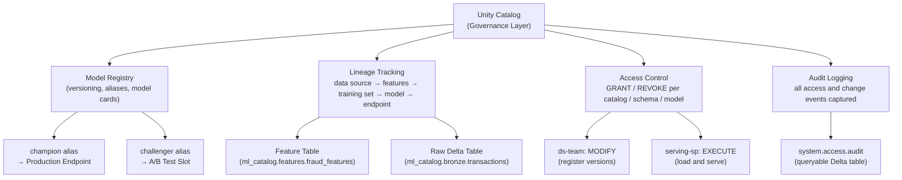

# Governance Frameworks

## Overview

Model governance is the set of processes, policies, and tools that ensure ML systems are reliable,
accountable, and compliant with organizational and regulatory requirements. Without it, teams lose
track of which model is running in production, who approved it, what data trained it, and whether
it meets fairness standards.

The four pillars of ML governance are: **access control** (who can do what), **lineage tracking**
(where did this model come from), **model documentation** (what does this model do and for whom),
and **lifecycle management** (controlled promotion from dev to production).

Unity Catalog is Databricks' unified governance layer and is the correct answer to nearly every
exam question about how to enforce these pillars at scale.

## Governance Architecture



## Unity Catalog for ML Governance

Unity Catalog provides the governance layer for all ML artifacts through a three-level namespace:
`catalog.schema.object_name`. This same namespace and permission system that governs Delta tables,
views, and volumes also governs feature tables, model versions, and serving endpoints.

The critical configuration step that exam questions frequently test is setting the registry URI
before any registration or loading call. If this line is omitted, MLflow silently uses the flat
workspace registry, which has no lineage, no SQL GRANT support, and no cross-workspace access.

```python
import mlflow

# Required: point MLflow to Unity Catalog registry
mlflow.set_registry_uri("databricks-uc")

# Register model — three-part name lands in UC namespace
with mlflow.start_run() as run:
    mlflow.sklearn.log_model(
        sk_model=model,
        artifact_path="model",
        registered_model_name="ml_catalog.fraud_models.fraud_classifier"
        # Format: catalog.schema.model_name
    )
```

Once a model is registered in UC, you control access with standard SQL privilege syntax. The three
model-level privileges you need to know for the exam are `EXECUTE` (load and serve), `MODIFY`
(register versions and manage aliases), and `ALL PRIVILEGES` (ownership-equivalent):

```sql
-- Data scientists can register new versions and update descriptions
GRANT MODIFY ON MODEL ml_catalog.fraud_models.fraud_classifier TO `ds-team`;

-- ML engineers can promote versions by setting or moving aliases
GRANT MODIFY ON MODEL ml_catalog.fraud_models.fraud_classifier TO `ml-engineers`;

-- Serving service principal can load and score — not write
GRANT EXECUTE ON MODEL ml_catalog.fraud_models.fraud_classifier TO `fraud-serving-sp`;

-- Platform team retains ownership
GRANT ALL PRIVILEGES ON MODEL ml_catalog.fraud_models.fraud_classifier TO `platform-team`;
```

Note that both `ds-team` and `ml-engineers` require `MODIFY` — there is no finer-grained split
between "register a version" and "set an alias" at the SQL privilege level. Separation of duties
between those two actions is enforced through process controls (pull requests, approval workflows)
rather than different permission levels.

## Data Lineage for ML

Unity Catalog automatically captures lineage for models registered through the UC registry. The
lineage graph records the full chain from raw data through to the serving endpoint:

```text
raw_transactions (Delta table)
  → feature_engineering (Databricks Job)
    → fraud_features (Feature Table)
      → training_set (FeatureEngineeringClient)
        → fraud_classifier v3 (Model Version)
          → fraud-classifier-endpoint (Serving Endpoint)
```

This graph is visible in the UC Explorer UI under each object's Lineage tab, and is queryable
through system tables. However, automatic lineage only tracks the graph structure — it does not
capture the specific Delta table snapshot (version) used for training. To record the exact data
version, explicitly log the dataset as an MLflow input:

```python
import mlflow

# Attach the training dataset as an explicit MLflow lineage input
dataset = mlflow.data.from_spark(
    df=training_df,
    table_name="ml_catalog.features.fraud_features",
    version=5  # Delta table version number used for training
)

with mlflow.start_run() as run:
    mlflow.log_input(dataset, context="training")

    mlflow.sklearn.log_model(
        sk_model=model,
        artifact_path="model",
        registered_model_name="ml_catalog.fraud_models.fraud_classifier"
    )
```

The `version=5` argument pins the exact Delta snapshot, making it possible to reproduce the
training set after the table has been updated further. Auditors can answer "exactly which rows
trained this model?" by reading that version of the Delta log.

## Feature Store Lineage

When you use the Databricks Feature Engineering client to create a training set, the linkage
between feature tables and the model version is captured automatically. This is more powerful
than manual lineage logging because it also tells the serving endpoint which feature tables to
query at inference time.

```python
from databricks.feature_engineering import FeatureEngineeringClient, FeatureLookup
import mlflow

fe = FeatureEngineeringClient()

# Build training set with lookups — automatically links feature table to model
training_set = fe.create_training_set(
    df=label_df,                    # DataFrame with label column and join keys
    feature_lookups=[
        FeatureLookup(
            table_name="ml_catalog.features.user_features",
            feature_names=["total_spending_7d", "transaction_count_30d"],
            lookup_key="user_id"
        ),
        FeatureLookup(
            table_name="ml_catalog.features.merchant_features",
            feature_names=["merchant_risk_score"],
            lookup_key="merchant_id"
        )
    ],
    label="fraud_label"
)

training_df = training_set.load_df()
model = train_model(training_df)

# Log model through FeatureEngineeringClient — captures feature table linkage
fe.log_model(
    model=model,
    artifact_path="model",
    flavor=mlflow.sklearn,
    training_set=training_set,
    registered_model_name="ml_catalog.fraud_models.fraud_classifier"
)
```

When this registered model is deployed to a Model Serving endpoint, the endpoint automatically
retrieves feature values from the configured online store using the lookup keys sent in the
inference request. The serving contract is fully defined by the training set — no manual feature
retrieval code in the application layer.

## Model Documentation Standards

Model cards provide structured documentation that tells stakeholders what a model does, what data
trained it, and what its known limitations are. In Databricks, model cards are implemented through
the registered model description (model-level intent) and version tags (version-specific metadata).

```python
from mlflow import MlflowClient

client = MlflowClient(registry_uri="databricks-uc")

# Set the model-level description — applies to all versions, visible in UC Explorer
client.update_registered_model(
    name="ml_catalog.fraud_models.fraud_classifier",
    description="""
## Fraud Classifier

**Intended Use**: Real-time fraud detection for credit card transactions at point of sale.

**Out-of-Scope Uses**: Account takeover detection, merchant risk scoring, credit decisioning.

**Training Data**: Transactions from January 2024 through November 2025.
Positive (fraud) rate in training data: 0.8%.

**Known Limitations**: Lower recall for transactions above $10,000 due to underrepresentation
in training data. Performance degrades for new merchants with fewer than 30 historical transactions.

**Bias Considerations**: Disparate impact tested across geographic regions. No significant
variance detected (see version tags for per-version test results).
"""
)

# Set version-level tags — structured metadata for programmatic filtering and audits
client.set_model_version_tag(
    name="ml_catalog.fraud_models.fraud_classifier",
    version="3",
    key="validation_auc",
    value="0.943"
)
client.set_model_version_tag(
    name="ml_catalog.fraud_models.fraud_classifier",
    version="3",
    key="training_data_end_date",
    value="2025-11-30"
)
client.set_model_version_tag(
    name="ml_catalog.fraud_models.fraud_classifier",
    version="3",
    key="bias_tested",
    value="true"
)
client.set_model_version_tag(
    name="ml_catalog.fraud_models.fraud_classifier",
    version="3",
    key="approved_by",
    value="ml-review-board"
)
```

Tags are the right tool for version-specific facts that pipelines need to filter on (e.g., "find
the most recent version where `bias_tested=true`"). The description field is the right place for
human-readable context that auditors and business stakeholders read.

## Access Control Patterns

A least-privilege RBAC model maps job functions to specific permissions on specific objects:

| Role | Objects | Permissions | Rationale |
| :--- | :--- | :--- | :--- |
| Data Scientist | Feature tables, model versions | SELECT, MODIFY (register) | Need to read features and register candidates |
| ML Engineer | Model aliases, serving endpoints | MODIFY (promote), EXECUTE | Responsible for production promotion |
| Data Engineer | Feature tables, Delta sources | MODIFY (write) | Writes new feature data |
| Auditor | All UC objects | USE CATALOG, USE SCHEMA (read-only) | Read-only discovery and audit |
| Platform Team | Catalogs, schemas | ALL PRIVILEGES | Manages namespaces and permissions |

Service principal pattern for automated pipelines keeps human credentials out of automated jobs:

```sql
-- Training pipeline SP: can register versions and read feature tables
GRANT MODIFY ON SCHEMA ml_catalog.fraud_models TO `fraud-training-sp`;
GRANT SELECT ON TABLE ml_catalog.features.user_features TO `fraud-training-sp`;
GRANT SELECT ON TABLE ml_catalog.features.merchant_features TO `fraud-training-sp`;

-- Serving SP: can load model and look up features — not write anything
GRANT EXECUTE ON MODEL ml_catalog.fraud_models.fraud_classifier TO `fraud-serving-sp`;
GRANT SELECT ON TABLE ml_catalog.features.user_features TO `fraud-serving-sp`;
GRANT SELECT ON TABLE ml_catalog.features.merchant_features TO `fraud-serving-sp`;

-- CI/CD promotion SP: can set aliases (promote) but not register new versions
GRANT MODIFY ON MODEL ml_catalog.fraud_models.fraud_classifier TO `fraud-cicd-sp`;
```

## Change Management and Controlled Promotion

Production ML models require controlled promotion for three reasons. First, a bad model silently
produces wrong predictions — unlike a code bug, there is no stack trace. Second, regulatory
frameworks require traceability: which model made which prediction and who approved it. Third,
rapid rollback capability is essential when issues are discovered.

A typical promotion workflow:

1. **Train in dev**: Data scientist trains and registers a candidate to `dev_catalog.fraud_models`.
2. **Code review**: Training notebook or script is reviewed via pull request before merge.
3. **Automated evaluation**: A CI job compares challenger AUC against champion on a held-out
   validation set. Promotion is gated on exceeding the champion by a defined threshold (e.g., 0.5%).
4. **Staging promotion**: If the gate passes, the CI job promotes the model to
   `staging_catalog.fraud_models` and runs integration tests against a staging endpoint.
5. **Human approval**: ML review board signs off (or an automated gate runs bias and fairness
   checks).
6. **Production promotion**: The model is registered to `prod_catalog.fraud_models` and the CI
   job calls `set_registered_model_alias(..., alias="champion", version=N)`. No code deployment
   required — all consumers loading `@champion` pick up the new version on next initialization.

## Common Pitfalls

- **Using workspace registry instead of UC**: No lineage, no SQL GRANT, no cross-workspace access.
  Always set `mlflow.set_registry_uri("databricks-uc")` at the top of training scripts.
- **Overly permissive grants**: `GRANT ALL PRIVILEGES` to an entire team instead of scoped
  least-privilege grants creates unnecessary blast radius if any team member's credentials are
  compromised.
- **No model card or description**: Auditors cannot determine model intent. Regulators may treat
  undocumented models as non-compliant.
- **Missing known limitations documentation**: Leads to misuse in unsupported scenarios, which
  can create downstream liability.
- **No explicit `mlflow.log_input()` call**: UC lineage tracks the structural graph (which tables
  are connected to which models) but not the specific Delta version. Without `log_input(version=N)`,
  you cannot reconstruct the exact training set.
- **Skipping bias testing before promotion**: Fairness violations discovered in production are
  far more costly than those caught in staging.

## Practice Questions

> [!success]- Question 1: UC Permission for a Serving Endpoint
>
> A Model Serving endpoint needs to load a registered model from the Unity Catalog registry at
> startup. A platform engineer asks which UC privilege to grant to the endpoint's service principal.
>
> A) `SELECT ON MODEL`
> B) `MODIFY ON MODEL`
> C) `EXECUTE ON MODEL`
> D) `USE SCHEMA ON MODEL`
>
> **Correct Answer: C**
>
> `EXECUTE ON MODEL` is the privilege that allows a principal to load and invoke (serve) a
> registered model. `MODIFY` would additionally allow the SP to register new versions and change
> aliases — a far broader permission than a serving SP needs, violating least privilege. `SELECT`
> is not a valid privilege on model objects. `USE SCHEMA` is a prerequisite for navigating the
> schema but does not grant model access on its own.

---

> [!success]- Question 2: Tracing Training Data for an Audit
>
> An auditor asks: "Which exact rows of data were used to train fraud_classifier version 3?"
> The model was trained six months ago and the feature table has been updated many times since.
> What is the correct technical approach to answer this question?
>
> A) Query `system.access.audit` for `readTable` events on the day the model was trained
> B) Call `client.get_model_version("fraud_classifier", "3")` and read its `creation_timestamp`
> C) Log the training dataset with `mlflow.log_input(dataset, context="training")` including the Delta table version number during training, then retrieve it from the run's inputs
> D) Check the MLflow experiment for the training run's artifact list
>
> **Correct Answer: C**
>
> `mlflow.log_input()` with `version=N` records the exact Delta table snapshot used for training
> as part of the MLflow run's lineage metadata. This is the only approach that pins the specific
> version of the Delta table, making the training set reproducible via `spark.read.format("delta")
> .option("versionAsOf", N).load(...)`. Option A shows read events but does not isolate the
> exact rows or Delta version. Options B and D do not contain data version information.

---

> [!success]- Question 3: Separating Register vs Promote Permissions
>
> A team wants data scientists to be able to register new model versions but only ML engineers to
> be able to set the `champion` alias. How should Unity Catalog permissions be structured?
>
> A) Grant `MODIFY` to data scientists and `ALL PRIVILEGES` to ML engineers
> B) Grant `EXECUTE` to data scientists and `MODIFY` to ML engineers
> C) Grant `MODIFY` to both groups; use process controls (approval workflows, CI gates) to enforce who may set aliases in practice
> D) Create two separate schemas — one for version registration, one for alias management
>
> **Correct Answer: C**
>
> Unity Catalog does not distinguish between "register a version" and "set an alias" at the
> privilege level — both actions require `MODIFY ON MODEL`. The separation of duties between
> registration and promotion is therefore enforced through process controls: branch protection,
> CI pipeline approvals, or automated gates, not through different UC privilege levels. Option B
> is wrong because `EXECUTE` only allows loading, not registering. Option D would require
> duplicating model objects and breaks the single-model-name contract that aliases provide.

## Use Cases

- **Governance Frameworks Implementation**: Incorporating Governance Frameworks principles to build scalable and maintainable solutions in Databricks environments.
- **Optimized Governance Frameworks Workflows**: Using the advanced capabilities of Governance Frameworks to automate processes and reduce manual operational overhead.

## Common Issues & Errors

### 1. Configuration Oversights
**Scenario:** The default settings for Governance Frameworks do not scale well with sudden spikes in data volume.
**Fix:** Explicitly define and tune the configuration parameters for Governance Frameworks to handle production-scale workloads.

### 2. Integration Bottlenecks
**Scenario:** Connecting Governance Frameworks to other downstream components results in unexpected failures.
**Fix:** Ensure that permissions and network access rules are correctly provisioned for Governance Frameworks prior to deployment.

## Related Topics

- [Compliance & Audit Logging](04-compliance-audit-logging.md)
- [Model Monitoring & Observability](01-model-monitoring-observability.md)
- [Model Versioning and Registry](../03-model-production-lifecycle/01-model-versioning-registry.md)
- [Unity Catalog Basics](../../../shared/fundamentals/unity-catalog-basics.md)
- [Unity Catalog Quick Ref](../../../shared/cheat-sheets/unity-catalog-quick-ref.md)

---

**[← Back to Model Governance & MLOps](./README.md)**
