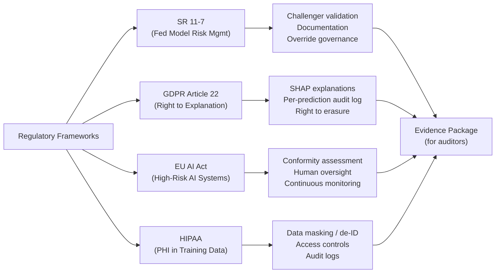

# Compliance and Audit Logging

## Overview

ML systems in regulated industries — financial services, healthcare, human resources — face
compliance requirements that go well beyond those for standard software. A web application that
has a bug produces an error message. A biased fraud model silently denies transactions to a
protected class for months before anyone notices.

The technical controls required to satisfy regulators cover four areas: **audit trails** (who did
what and when), **explainability** (why did the model produce this prediction), **fairness testing**
(does the model treat protected groups equitably), and **data governance** (where did training
data come from and how long is it retained). This file maps regulatory requirements to specific
Databricks features and code patterns.

## Regulatory Framework Overview



**SR 11-7** (Federal Reserve, 2011): The foundational model risk management guidance for US banks.
Requires independent model validation, challenger testing, comprehensive documentation, and clear
ownership with defined override governance. Most ML-at-scale frameworks in financial services trace
their governance requirements back to SR 11-7.

**GDPR Article 22**: Individuals have the right not to be subject to automated decisions with
significant effects, and the right to obtain a meaningful explanation of the logic involved. SHAP
values are the standard technical control used to satisfy this requirement in practice.

**EU AI Act**: High-risk AI systems (credit scoring, employment, critical infrastructure) require
conformity assessments before deployment, mechanisms for human oversight, logging of system
operation, and ongoing monitoring post-deployment.

**HIPAA**: Protected Health Information (PHI) used in training data must be de-identified or
subject to strict access controls and audit logging. Models trained on PHI datasets must retain
evidence of those controls.

## Audit Logging in Databricks

Unity Catalog captures all access and modification events for data and model objects in the
`system.access.audit` Delta table. This table is automatically populated in all UC-enabled
workspaces and is queryable with standard Spark SQL. It is the single correct answer to any exam
question about where Databricks UC audit logs are stored.

The event types most relevant to ML governance:

| Action Name | What It Records |
| :--- | :--- |
| `unityCatalog.readTable` | A principal read rows from a feature table |
| `unityCatalog.registerModel` | A new model version was registered |
| `unityCatalog.updateModelVersionAlias` | An alias was set or moved (promotion event) |
| `unityCatalog.grantPermission` | A GRANT or REVOKE was executed on any object |
| `unityCatalog.deleteModelVersion` | A model version was deleted |

```python
# Query audit logs for model promotion events over the last 30 days

audit_query = """
SELECT
    timestamp,
    userIdentity.email AS user,
    actionName,
    requestParams.model_name                        AS model_name,
    requestParams.alias                             AS alias,
    requestParams.version                           AS version,
    response.statusCode                             AS status
FROM system.access.audit
WHERE actionName IN (
    'unityCatalog.registerModel',
    'unityCatalog.updateModelVersionAlias',
    'unityCatalog.grantPermission'
)
  AND timestamp >= current_timestamp() - INTERVAL 30 DAYS
ORDER BY timestamp DESC
"""

audit_df = spark.sql(audit_query)
display(audit_df)
```

For long-term retention (beyond the default system table retention period), export audit logs to
your organization's ADLS or S3 storage as Delta or Parquet. Many regulated organizations retain
audit logs for 7 years to satisfy examination requirements.

## Model Explainability for Compliance

SHAP (SHapley Additive exPlanations) is the standard explainability framework used in Databricks
ML Professional exam context. SHAP assigns each feature a contribution value for a specific
prediction: positive values push the prediction higher, negative values push it lower, and the
magnitudes sum to the model's output (minus the base rate).

For compliance, you need both **global explanations** (which features the model relies on overall —
useful for model validation documentation) and **local explanations** (why did the model produce
this specific prediction for this specific individual — required for GDPR Article 22 responses).

```python
import shap
import mlflow
import pandas as pd

with mlflow.start_run() as run:
    # Train model (abbreviated)
    model = train_xgboost(X_train, y_train)

    # Build SHAP explainer — TreeExplainer is fast for tree-based models
    explainer = shap.TreeExplainer(model)
    shap_values = explainer.shap_values(X_train)

    # Global explanation: log summary plot as MLflow artifact for auditors
    import matplotlib.pyplot as plt
    shap.summary_plot(shap_values, X_train, show=False)
    mlflow.log_figure(plt.gcf(), "explainability/shap_summary_plot.png")
    plt.close()

    # Save raw SHAP values as artifact — auditors can inspect per-feature contributions
    shap_df = pd.DataFrame(shap_values, columns=X_train.columns)
    shap_df.to_parquet("/tmp/shap_values.parquet", index=False)
    mlflow.log_artifact("/tmp/shap_values.parquet", "explainability")

    mlflow.xgboost.log_model(
        model,
        artifact_path="model",
        registered_model_name="ml_catalog.credit.loan_approval_model"
    )
```

For individual prediction explanations required under GDPR Article 22:

```python
def explain_prediction(model, input_features: pd.DataFrame, top_n: int = 5):
    """
    Generate a human-readable explanation for a single prediction.
    Returns the top N features driving the decision, with directions.
    """
    explainer = shap.TreeExplainer(model)
    shap_vals = explainer.shap_values(input_features)

    feature_contributions = list(zip(
        input_features.columns,
        shap_vals[0]
    ))

    # Sort by absolute magnitude — largest contributors first
    sorted_contributions = sorted(
        feature_contributions,
        key=lambda x: abs(x[1]),
        reverse=True
    )

    explanation = []
    for feature, contribution in sorted_contributions[:top_n]:
        direction = "increased" if contribution > 0 else "decreased"
        explanation.append(
            f"{feature}: {direction} risk score by {abs(contribution):.3f}"
        )

    return explanation
```

## Bias and Fairness Detection

Fairness testing is a required pre-production gate for models making consequential decisions
about individuals. Two metrics appear most frequently in exam scenarios.

**Disparate Impact** measures whether the positive outcome rate for a protected group is
sufficiently close to the rate for the most-favored group. The four-fifths rule (also called the
80% rule) is the US legal standard: a disparate impact ratio below 0.8 signals potential
discrimination and requires investigation.

```python
import pandas as pd

def compute_disparate_impact(
    predictions: pd.DataFrame,
    outcome_col: str,
    protected_col: str,
    favorable_label: int = 1
) -> float:
    """
    Compute disparate impact ratio between the least and most favored groups.
    Returns the ratio. Values below 0.8 fail the four-fifths rule.
    """
    group_rates = (
        predictions
        .groupby(protected_col)[outcome_col]
        .apply(lambda s: (s == favorable_label).mean())
    )

    minority_rate = group_rates.min()
    majority_rate = group_rates.max()

    di_ratio = minority_rate / majority_rate

    print("Approval rates by group:")
    print(group_rates.to_string())
    print(f"\nDisparate Impact ratio: {di_ratio:.3f}")
    threshold = 0.8
    result = "PASS" if di_ratio >= threshold else "FAIL — investigate for potential discrimination"
    print(f"Four-fifths rule ({threshold}): {result}")

    return di_ratio
```

**Equalized Odds** is a stricter fairness criterion requiring that both the True Positive Rate
(TPR, also called recall) and the False Positive Rate (FPR) are similar across groups. Equalized
odds is appropriate when the cost of false positives and false negatives differs across groups —
for example, falsely flagging a legitimate transaction as fraud (FPR) can affect access to
financial services for the flagged group.

```python
from sklearn.metrics import confusion_matrix

def check_equalized_odds(
    y_true: pd.Series,
    y_pred: pd.Series,
    protected_attribute: pd.Series,
    tpr_tolerance: float = 0.05,
    fpr_tolerance: float = 0.05
) -> pd.DataFrame:
    """
    Compute per-group TPR and FPR. Flag groups whose rates differ from
    the overall rate by more than the specified tolerance.
    """
    results = {}
    for group in protected_attribute.unique():
        mask = (protected_attribute == group)
        tn, fp, fn, tp = confusion_matrix(y_true[mask], y_pred[mask]).ravel()

        tpr = tp / (tp + fn) if (tp + fn) > 0 else 0.0
        fpr = fp / (fp + tn) if (fp + tn) > 0 else 0.0

        results[group] = {"TPR": round(tpr, 4), "FPR": round(fpr, 4), "n": int(mask.sum())}

    results_df = pd.DataFrame(results).T

    tpr_range = results_df["TPR"].max() - results_df["TPR"].min()
    fpr_range = results_df["FPR"].max() - results_df["FPR"].min()

    print(results_df.to_string())
    print(f"\nTPR spread across groups: {tpr_range:.4f} (tolerance: {tpr_tolerance})")
    print(f"FPR spread across groups: {fpr_range:.4f} (tolerance: {fpr_tolerance})")

    return results_df
```

Log fairness test results as MLflow artifacts so the evidence is attached to the model version
and available to auditors without requiring re-execution:

```python
with mlflow.start_run(run_id=training_run_id):
    di = compute_disparate_impact(test_predictions, "prediction", "region")
    equalized_df = check_equalized_odds(y_test, y_pred, protected_attribute=test_df["region"])

    mlflow.log_metric("disparate_impact_ratio", di)
    equalized_df.to_csv("/tmp/equalized_odds.csv")
    mlflow.log_artifact("/tmp/equalized_odds.csv", "fairness")
    mlflow.set_tag("bias_tested", "true")
    mlflow.set_tag("disparate_impact_pass", str(di >= 0.8))
```

## Data Retention and GDPR Compliance

Training data containing Personally Identifiable Information (PII) requires masking at the storage
layer before it can be used in feature tables or exported to downstream systems.

Unity Catalog column masking applies a transformation function whenever a masked column is read,
ensuring that principals without the `UNMASK` privilege see only the masked value:

```sql
-- Create a masking policy that shows only the last four characters
CREATE MASKING POLICY pii_email_mask AS (email STRING)
RETURNS STRING ->
  CASE
    WHEN is_account_group_member('pii-authorized')
      THEN email
    ELSE CONCAT('****@', SPLIT(email, '@')[1])
  END;

-- Apply masking to sensitive columns in the feature table
ALTER TABLE ml_catalog.features.user_profiles
  ALTER COLUMN email_address
  SET MASKING POLICY pii_email_mask;

-- Row-level security restricts which rows each region's team can see
CREATE ROW ACCESS POLICY region_filter AS (user_region STRING)
RETURNS BOOLEAN ->
  is_account_group_member(CONCAT('region-', user_region));

ALTER TABLE ml_catalog.features.user_profiles
  SET ROW FILTER region_filter ON (user_region);
```

**Right to erasure under GDPR**: When a user requests deletion of their data, the standard
approach for ML systems is to delete the individual's records from the source Delta tables using
`DELETE FROM` (which writes a deletion vector in Delta). Trained model artifacts are retained
separately — the model weights encode aggregate statistical patterns, not individual records.
Document this approach explicitly in the model card so auditors understand the compliance posture.

## Compliance Evidence Package

Assembling the evidence package before a regulatory audit is far easier when each item was logged
systematically during development. The following table maps each required evidence item to its
source and the command used to retrieve it:

| Evidence Item | Source | Retrieval Method |
| :--- | :--- | :--- |
| Training data lineage | UC lineage graph + MLflow run inputs | `client.get_run(run_id).inputs.dataset_inputs` |
| Exact data snapshot used | Delta table version in `mlflow.log_input()` | Run input metadata: `dataset.source.version` |
| Validation metrics on holdout | MLflow run metrics | `client.get_run(run_id).data.metrics` |
| Bias / fairness test results | MLflow artifact | `client.download_artifacts(run_id, "fairness/")` |
| SHAP global explanation | MLflow artifact | `client.download_artifacts(run_id, "explainability/")` |
| Promotion change log | `system.access.audit` | Query `actionName = 'updateModelVersionAlias'` |
| Access control snapshot | UC SHOW GRANTS | `SHOW GRANTS ON MODEL ml_catalog.fraud_models.fraud_classifier` |
| Model card | Registered model description | `client.get_registered_model(name).description` |
| Per-version metadata | Model version tags | `client.get_model_version(name, version).tags` |

## Inference Logging for Post-Hoc Audits

Regulated systems often must prove what prediction the model made for a specific individual at a
specific time. Databricks Model Serving's **inference tables** capture every request and response
automatically when enabled.

Enable inference logging when creating or updating a serving endpoint:

```python
import requests

endpoint_config = {
    "name": "fraud-classifier-endpoint",
    "config": {
        "served_models": [{
            "model_name": "ml_catalog.fraud_models.fraud_classifier",
            "model_version": "3",
            "workload_size": "Small",
            "scale_to_zero_enabled": True
        }],
        "auto_capture_config": {
            "catalog_name": "ml_catalog",
            "schema_name": "inference_logs",
            "table_name_prefix": "fraud_classifier",
            "enabled": True
        }
    }
}
```

The inference table includes `served_model_name`, the full request payload, the full response,
and a timestamp. After enabling, use this table to answer: "What prediction did the model make
for customer X on date Y?" — the complete audit trail required for individual rights requests
under GDPR Article 22.

## Use Cases

- **GDPR Right-to-Explanation Compliance**: Using inference tables to retrieve the exact prediction, input features, and SHAP explanation for a specific customer on a specific date, satisfying GDPR Article 22 individual rights requests.
- **Regulatory Audit Trail for Credit Decisions**: Querying `system.access.audit` to demonstrate which model version was serving on any given day, who promoted it, and what evaluation metrics it passed -- meeting SR 11-7 documentation requirements.

## Common Issues & Errors

### Audit Logs Missing Model Access Events

**Scenario:** The `system.access.audit` table does not contain expected `getRegisteredModel` or `createModelVersion` events, making it impossible to prove who accessed or modified a model.
**Fix:** Ensure the Unity Catalog audit log is enabled at the account level (it is on by default but can be disabled by an account admin). Verify you are querying the correct system table (`system.access.audit`, not the legacy workspace audit log). Filter on `service_name = 'unityCatalog'` and relevant `action_name` values.

### Inference Table Grows Too Large

**Scenario:** A high-traffic serving endpoint generates millions of rows per day in the inference table, causing storage costs to spike and downstream monitoring queries to slow down.
**Fix:** Set a retention policy on the inference table using Delta `VACUUM` with an appropriate retention period (e.g., 90 days for regulatory compliance). For long-term archival, create a scheduled job that moves aged records to a cold-storage table partitioned by month. Use `OPTIMIZE` and `ZORDER BY timestamp` to keep monitoring queries fast.

## Exam Tips

This is the terminal content file for the Model Governance & MLOps section. Key facts to
consolidate before the exam:

- **`system.access.audit`** is the Unity Catalog audit log table — know its location and the
  key `actionName` values for model operations.
- **SHAP** is the standard explainability tool in the Databricks ML Professional exam. Know the
  difference between `TreeExplainer` (fast, tree models) and `KernelExplainer` (model-agnostic,
  slower). Global explanations use `summary_plot`; local explanations use individual `shap_values`.
- **Disparate impact ratio**: computed as `min_group_rate / max_group_rate`. Threshold is **0.8**
  (four-fifths rule). Below 0.8 triggers investigation.
- **GDPR Article 22** is the right to explanation for automated decisions — satisfied with SHAP
  local explanations per prediction.
- **SR 11-7** is the Fed model risk management framework — requires challenger validation,
  documentation, and independent review. Not GDPR; not EU AI Act.
- **Inference tables** are the correct control for proving what a serving endpoint predicted for
  a specific individual at a specific time.
- **Column masking and row filters** are the UC controls for PII protection in feature tables —
  not application-level filtering.

Review the complete pre-exam checklist in the certification resources folder before your exam date.

## Key Takeaways

- **SR 11-7**: US Federal Reserve framework for model risk management — requires challenger validation, independent review, and documentation (not GDPR or EU AI Act)
- **GDPR Article 22**: Right to explanation for automated decisions — satisfied with SHAP local (per-prediction) explanations stored alongside predictions
- **Disparate impact ratio**: `min_group_rate / max_group_rate`; threshold is **0.8** (four-fifths rule) — below triggers mandatory fairness investigation
- **SHAP explainers**: `TreeExplainer` for tree-based models (fast); `KernelExplainer` for model-agnostic use (slow); `summary_plot` = global, `shap_values[i]` = local
- **Inference tables**: the correct audit control proving what a model predicted for a specific individual at a specific timestamp
- **Column masking / row filters**: UC controls for PII protection in feature tables — applied at query time, cannot be bypassed by end users
- **`system.access.audit`**: UC audit log table capturing all `actionName` events (model registration, alias assignment, permission changes)
- **GDPR right to erasure**: requires deleting training data rows plus VACUUM to remove old Parquet files from Delta storage

## Related Topics

- [Governance Frameworks](03-governance-frameworks.md)
- [Model Monitoring & Observability](01-model-monitoring-observability.md)
- [Drift Detection & Remediation](02-drift-detection-remediation.md)
- [Unity Catalog Basics](../../../shared/fundamentals/unity-catalog-basics.md)
- [MLflow Basics](../../../shared/fundamentals/mlflow-basics.md)

---

**[← Previous: Governance Frameworks](./03-governance-frameworks.md) | [↑ Back to Model Governance & MLOps](./README.md)**
